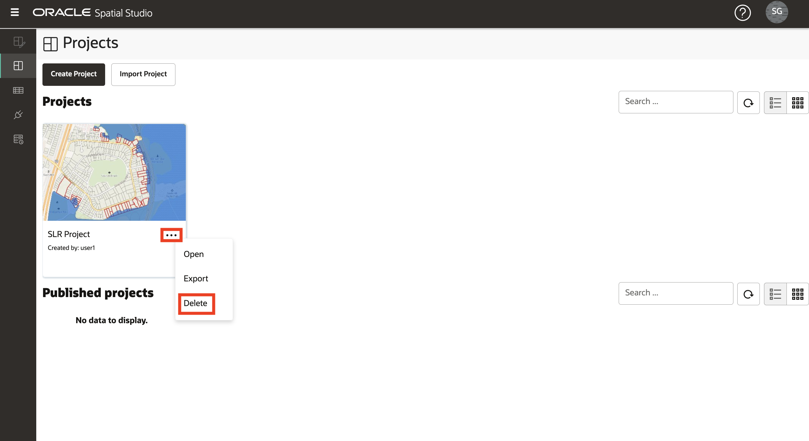

# 将 Spatial Studio 和 ADB 重置为研讨会前状态

## 简介

此实验室将删除之前实验室中创建的所有内容，以便根据需要重新开始。

估计的实验室时间：5 分钟

观看下面的视频，快速浏览实验室。

[将 Spatial Studio 和 ADB 重置为研讨会前状态](videohub:1_z4mhzd51)

### 目标

在此实验室中，您将：

*   删除在前面的练习中创建的 Spatial Studio 和 ADB 构件。

### 先备条件

*   从 Oracle Cloud Marketplace 部署 Spatial Studio

## 任务 1：删除项目

1.  定位至**项目**页。从已发布项目的操作菜单中，选择**删除**选项。
    
    
    
2.  从项目的操作菜单中，选择**删除**选项。
    
    
    

## 任务 2：删除数据集

1.  导航到 **Datasets（数据集）**页面。从 **SCHOOLS IN FLOOD2060** 分析数据集的操作菜单中，选择**删除**选项。
    
    
    
2.  对于其他分析数据集，按以下顺序重复上一步：1) 构建产品联系人，2) 设施邻近 FLOOD2060 距离，3) 设施邻近 FLOOD2060
    
3.  从 FACILITIES 数据集的操作菜单中，选择**删除**选项。
    
    
    
4.  在确认弹出窗口中，选择删除关联数据库表的选项。
    
    
    
5.  对所有剩余数据集重复此操作。
    

Spatial Studio 和 ADB 现在已重置为其研讨会前状态。

## 了解详细信息

*   [Oracle Spatial 产品页面](https://www.oracle.com/database/spatial)
*   [Spatial Studio 入门](https://www.oracle.com/database/technologies/spatial-studio/get-started.html)
*   [Spatial Studio 文档](https://docs.oracle.com/en/database/oracle/spatial-studio)

## 确认

*   **作者** - David Lapp，Oracle 数据库产品管理
*   **贡献者** - Denise Myrick
*   **上次更新者/日期** - David Lapp，2023 年 8 月