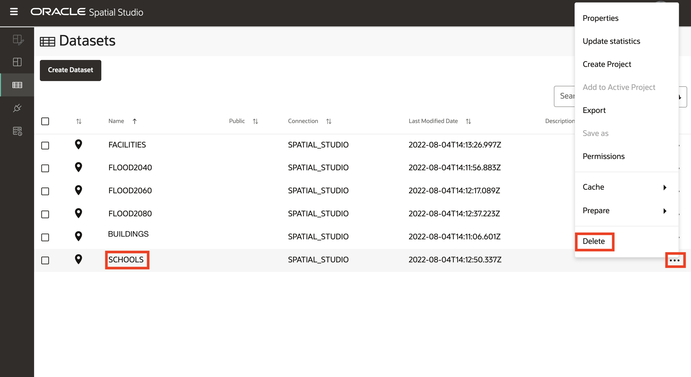

# 將 Spatial Studio 和 ADB 重設為研習前狀態

## 簡介

此實驗室會移除在先前實驗室中建立的所有內容，以便您可以視需要重新開始。

預估實驗室時間：5 分鐘

請觀看下方影片，快速瞭解實驗室的逐步解說。

[將 Spatial Studio 和 ADB 重設為研習前狀態](videohub:1_z4mhzd51)

### 目標

在此實驗室中，您將：

*   移除先前實驗室中建立的 Spatial Studio 和 ADB 使用者自建物件。

### 先決條件

*   從 Oracle Cloud Marketplace 部署的 Spatial Studio

## 作業 1：刪除專案

1.  瀏覽至**專案**頁面。從「已發布專案」的動作功能表中，選取**刪除**選項。
    
    
    
2.  從專案的動作功能表中，選取**刪除**選項。
    
    
    

## 作業 2：刪除資料集

1.  瀏覽至**資料集**頁面。從 **SCHOOLS IN FLOOD2060** 分析資料集的動作功能表，選取**刪除**選項。
    
    
    
2.  依下列順序為其他分析資料集重複上一個步驟：1) 建立 FLOOD CONTACT，2) FACILITIES NEAR FLOOD2060 DISTANCE，3) FACILITIES NEAR FLOOD2060
    
3.  從 FACILITIES 資料集的動作功能表，選取**刪除**選項。
    
    
    
4.  在確認即現式視窗中，選取刪除相關資料庫表格的選項。
    
    
    
5.  對所有剩餘的資料集重複上述步驟。
    

Spatial Studio 和 ADB 現在會重設為其研習前狀態。

## 進一步瞭解

*   [Oracle Spatial 產品頁面](https://www.oracle.com/database/spatial)
*   [開始使用 Spatial Studio](https://www.oracle.com/database/technologies/spatial-studio/get-started.html)
*   [Spatial Studio 文件](https://docs.oracle.com/en/database/oracle/spatial-studio)

## 確認

*   **作者** - Oracle 資料庫產品管理 David Lapp
*   **貢獻者** - Denise Myrick
*   **上次更新者 / 日期** - David Lapp，2023 年 8 月