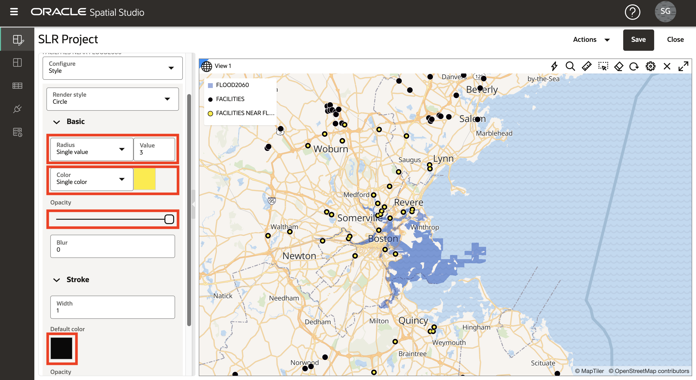
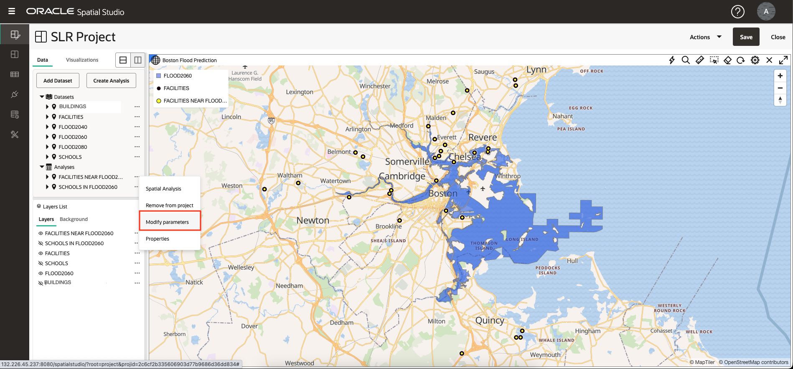
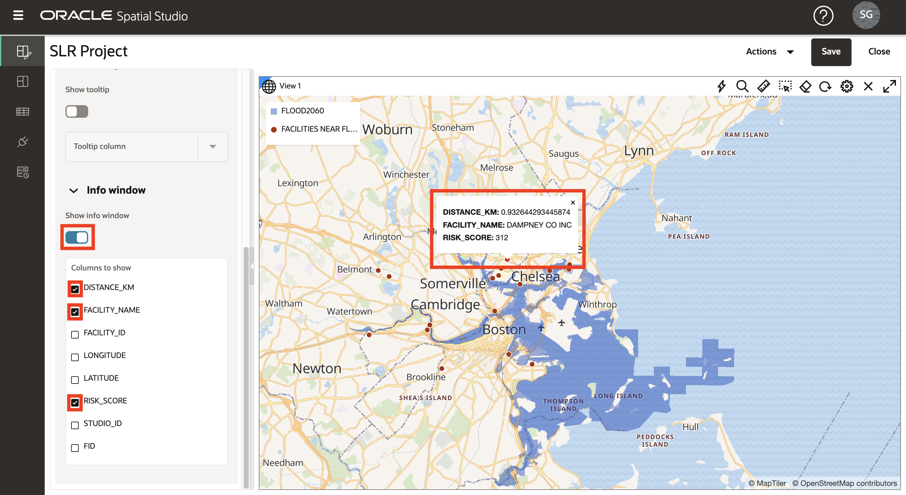

# Räumliche Beziehungen analysieren

## Einführung

In dieser Übung führen Sie eine Reihe von räumlichen Analysen durch, um die Beziehungen zwischen einer projizierten Hochwasserregion und kulturellen Merkmalen zu identifizieren. Sie erstellen die Analysen ohne Codierung und visualisieren dann Ergebnisse in Karten und tabellarischer Form.

Geschätzte Zeit: 30 Minuten

Sehen Sie sich das Video unten an, um einen schnellen Durchgang des Labors zu erhalten.

[Räumliche Beziehungen analysieren](videohub:1_u0a3coe3)

### Ziele

*   Erfahren Sie, wie Sie räumliche Selfserviceanalysen durchführen, ohne Code schreiben zu müssen.
*   Erfahren Sie, wie Sie bei Bedarf auf den zugrunde liegenden Code für räumliche Abfragen zugreifen.

### Voraussetzungen

*   Abschluss von Übung 3: Räumliche Daten visualisieren

## Aufgabe 1: Ermittlung von Schulen im projizierten Hochwassergebiet

Zunächst führen Sie eine Analyse durch, um Schulen basierend auf Eindämmung in einer prognostizierten Hochwasserregion zu filtern.

1.  Um sich auf Schulen und den prognostizierten Hochwasserbereich zu konzentrieren, deaktivieren Sie die Sichtbarkeit für EINRICHTUNGEN und GEBÄUDE. Wählen Sie dann im Aktionsmenü für FLOOD2060 die Option **Zoom auf Layer** aus.
    
    
    
2.  Wählen Sie im Aktionsmenü für SCHOOLS die Option **Räumliche Analyse**. Dadurch wird das Dialogfeld geöffnet, in dem Sie auf die räumlichen Analysefeatures von Oracle Database zugreifen können.
    
    
    
3.  Sie werden einen räumlichen Filter auf Schulen anwenden, die auf Eindämmung im projizierten Hochwasserbereich basieren. Wählen Sie also die Registerkarte für **Filter** aus, und klicken Sie auf die Kachel für **Ausprägungen zurückgeben, die sich in einer anderen befinden**.
    
    
    
4.  Geben Sie als Analysename **SCHOOLS IN FLOOD2060** ein. Wählen Sie zum Filtern des Layers **SCHOOLS LON&LAT** aus, und wählen Sie **FLOOD2060, damit der Layer als Filter verwendet werden kann. GEOM**. Klicken Sie dann auf **Run**.
    
    
    
5.  Beobachten Sie Ihre Analyse unter Analysen. Klicken und halten Sie die Analyse gedrückt, und ziehen Sie sie per Drag-and-Drop auf die Karte. Ändern Sie wie zuvor den Stil des Layers: Öffnen Sie das Aktionsmenü für **SCHOOLS IN FLOOD2060**, wählen Sie **Einstellungen** aus, und ändern Sie die Farbe in Rot mit weißem Strich (Gliederung).
    
    
    
    **Hinweis:** Sie können den Mauszeiger über einen abgeschnittenen Layer-, Datenset- oder Analysennamen bewegen, um den vollständigen Namen in einer QuickInfo anzuzeigen.
    
6.  Um die Ergebnisse der räumlichen Analyse in tabellarischer Form anzuzeigen, klicken Sie auf die Registerkarte **Visualisierungen**, und ziehen Sie eine Tabelle per Drag-and-Drop neben der Karte. Sie können die Tabelle an einem beliebigen Rand der Karte ablegen.
    
    
    
7.  Klicken Sie auf die Registerkarte **Daten**, und halten Sie die Analyse gedrückt, und ziehen Sie sie per Drag-and-Drop in die Tabellenansicht.
    
    
    
8.  Technische Details hinter Analysen sind verfügbar. Wählen Sie im Aktionsmenü für die Analyse die Option "Eigenschaften".
    
    
    
9.  Beobachten Sie im Dialogfeld "Eigenschaften" den Abschnitt mit der SQL-Analyse. Beachten Sie insbesondere den Operator SDO\_INSIDE, der den räumlichen Filter ausführt. Das SQL ist etwas komplizierter als das allgemeinste Beispiel, da es einen funktionsbasierten Spatial Index für Schulen anstelle einer Geometriespalte enthält. Außerdem wird die Hauptabfrage mit einem äußeren SELECT umgebrochen, um Schulen zu deduplizieren, falls sich eine Schule in mehreren Regionen befindet.
    
    Beachten Sie auch den automatisch generierten Endpunkt, der die Analyseergebnisse im Format GeoJSON streamt, damit sie von einem standardbasierten Mappingclient verwendet werden können.
    
    Klicken Sie anschließend auf **Abbrechen** und dann auf das **X**, um die Tabellenansicht zu schließen.
    
    
    
10.  In Spatial Studio sind Analysen selbst Datensets. Klicken Sie im Hauptnavigationsbereich auf die Schaltfläche für die Seite **Datensets**. Beachten Sie, dass die Analyse aufgelistet ist, damit sie in anderen Projekten verwendet, exportiert oder als Tabelle oder Ansicht gespeichert werden kann.
    

## Aufgabe 2: Ermittlung von Anlagen in der Nähe des prognostizierten Hochwassergebiets

Als Nächstes identifizieren Sie Einrichtungen in der Nähe des prognostizierten Hochwasserbereichs. Hierbei handelt es sich um einen räumlichen Filtervorgang, bei dem die Einrichtungen basierend auf der Nähe zum projizierten Hochwasserbereich gefiltert werden. Dies wird als "innerhalb der Entfernung" bezeichnet.

1.  Klicken Sie im Hauptnavigationsbereich auf die Schaltfläche, um zum **aktiven Projekt** zurückzukehren. Passen Sie die Layer-Sichtbarkeit so an, dass der projizierte Hochwasserbereich und die Einrichtungen sichtbar sind. Wählen Sie im Aktionsmenü für FACILITIES die Option **Räumliche Analyse** aus.
    
    
    
2.  Klicken Sie auf die Registerkarte für **Filteranalysen**, und klicken Sie dann auf die Kachel für **Ausprägungen innerhalb einer angegebenen Entfernung von einer anderen zurückgeben**.
    
    
    
3.  Geben Sie im Analysedialogfeld für den Analysennamen **Einrichtungen in der Nähe von FLOOD2060** ein. Wählen Sie für den zu filternden Layer **Einrichtungen LONGITUDE & LATITUDE** aus, und geben Sie **FLOOD2060 ein, damit der Layer als Filter verwendet werden kann. GEOM**.  
    Geben Sie für die Entfernung **10** ein, und wählen Sie **Kilometer** als Einheit aus. Klicken Sie dann auf **Run**.
    
    
    
4.  Ändern Sie vor dem Hinzufügen der Analyseergebnisse zur Karte den Stil der ursprünglichen ungefilterten Schicht "Anlagen", sodass die Analyseergebnisse deutlich sichtbar sind. Wie zuvor, wählen Sie im Aktionsmenü für Einrichtungen die Option **Einstellungen**. Ändern Sie dann den Radius in 6, die Farbe in Schwarz und die Deckkraft in maximal.
    
    
    
5.  Verschieben Sie Ihre Analyse **Einrichtungen in der Nähe von FLOOD2060** per Drag-and-Drop auf die Karte.
    
    Wählen Sie dann im Aktionsmenü Einstellungen aus, und aktualisieren Sie die Größe auf 3, Farbe auf Gelb, Deckkraft auf Maximum und Strich (Gliederung) auf Schwarz. Die Ergebnisse sind deutlich sichtbar über der ungefilterten Schicht FACILITIES,
    
    
    
6.  Mit Spatial Studio können Sie die Parameter einer Analyse ändern. Wählen Sie im Aktionsmenü für **Einrichtungen in der Nähe von FLOOD2060** die Option **Parameter ändern** aus.
    
    
    
7.  Aktualisieren Sie den Abstand auf 3, und klicken Sie auf **Ausführen**.
    
    
    
8.  Beachten Sie die Kartenaktualisierung mit den aktualisierten Analyseergebnissen.
    
    
    
9.  Als Nächstes bestimmen Sie die Entfernung jeder Anlage in Ihrem Analyseergebnis zum prognostizierten Überschwemmungsgebiet. Wählen Sie im Aktionsmenü für **Einrichtungen in der Nähe von FLOOD2060** die Option **Räumliche Analyse** aus.
    
    
    
10.  Wählen Sie die Registerkarte für **Messanalysen** aus. Klicken Sie dann auf die Kachel, um **Mindestabstand zwischen Ausprägungen berechnen** anzuzeigen.
    

11.  Geben Sie als Analysename **Einrichtungen in der Nähe von FLOOD2060 Abstand** ein. Geben Sie als Spaltennamen für das Ergebnis **DISTANCE\_KM** ein, und wählen Sie für Geometrie 1 **Einrichtungen in der Nähe von FLOOD2060 aus. LATITUDE\_LONGITUDE\_GEOMETRY**, und wählen Sie für Geometrie 2 die Option **FLOOD2060 aus. GEOM**, ändern Sie die Einheiten in **Kilometer**. Klicken Sie dann auf **Run**.

12.  Bewegen Sie den Mauszeiger für Elemente mit einem abgeschnittenen Namen, um eine QuickInfo mit dem vollständigen Namen anzuzeigen.

Um sich auf Ihre Analyseergebnisse zu konzentrieren, deaktivieren Sie die Sichtbarkeit für alle Layer außer FLOOD2060.

13.  Verschieben Sie die Analyse **Einrichtungen in der Nähe von FLOOD2060 Abstand** per Drag-and-Drop auf die Karte, und gehen Sie dann zu den Einstellungen. Legen Sie einen Stil Ihrer Wahl fest. Wählen Sie im Dropdown-Menü "Konfiguration" die Option **Interaktion** aus. Scrollen Sie nach unten zum Abschnitt "Infofenster". Aktivieren Sie das Informationsfenster, und wählen Sie die anzuzeigenden Spalten, einschließlich der Analyseergebnisspalte mit dem Namen DISTANCE\_KM. Klicken Sie dann auf der Karte auf eine Einrichtung, um die Artikelinformationen anzuzeigen.

## Aufgabe 3: Identifizieren von Gebäuden in Kontakt mit dem prognostizierten Hochwassergebiet

Als Nächstes identifizieren Sie Gebäude, die eine räumliche Interaktion mit der projizierten Hochwasserregion aufweisen. Dazu gehören Gebäude, die in der Region enthalten sind, die Region überlappen oder die Grenze berühren.

1.  Aktivieren Sie in der Ebenenliste die Sichtbarkeit für die Ebene BUILDINGS. Während Sie verkleinert werden, sehen Sie nur einen Teil der Gebäude, da es zu viele gibt, um in einem so kleinen Maßstab angezeigt zu werden. Wählen Sie im Aktionsmenü für BUILDINGS die Option **Spatial Analysis**.
    
    
    
2.  Sie identifizieren die Gebäude, die mit dem geplanten Hochwassergebiet in Berührung kommen. Wählen Sie also die Registerkarte für **Filteranalysen** aus, und wählen Sie die Kachel für **Rückgabeausprägungen mit räumlicher Interaktion mit einer anderen** aus.
    
    
    
3.  Geben Sie als Namen **BUILDINGS FLOOD CONTACT** ein, wählen Sie für den zu filternden Layer **BUILDINGS.GEOM** aus, und wählen Sie **FLOOD2060 aus, damit der Layer als Filter verwendet werden kann. GEOM**. Klicken Sie dann auf **Run**.
    
    
    
4.  Ziehen Sie Ihre neue Analyse per Drag-and-Drop auf die Karte. Gehen Sie dann für den neuen Kartenlayer zu Einstellungen, um den Stil zu aktualisieren. Ziehen Sie im Bereich "Fill" den Schieberegler für die Deckkraft auf 0, damit keine Füllung angezeigt wird. Ändern Sie im Abschnitt "Gliederung" die Farbe in Rot, die Deckkraft in Maximum und die Breite in 2. Dadurch werden die Gebäude, die mit der geplanten Hochwasserzone in Berührung kommen, wirksam hervorgehoben.
    
    
    
5.  Vergrößern Sie einen Bereich Ihrer Wahl, um Gebäude mit denen zu sehen, die mit dem Flutbereich in Rot umrissen sind. Sie können auch damit experimentieren, eine Tabellenliste der Ergebnisse hinzuzufügen.
    
    
    
    Aktivieren Sie optional eine QuickInfo, ein Infofenster oder eine Tabellenansicht für das Analyseergebnis.
    

Sie können jetzt **mit der nächsten Übung fortfahren**.

## Weitere Informationen

*   [Oracle Spatial-Produktseite](https://www.oracle.com/database/spatial)
*   [Erste Schritte mit Spatial Studio](https://www.oracle.com/database/technologies/spatial-studio/get-started.html)
*   [Dokumentation zu Spatial Studio](https://docs.oracle.com/en/database/oracle/spatial-studio)

## Danksagungen

*   **Autor** - David Lapp, Database Product Management, Oracle
*   **Mitwirkende** - Denise Myrick, Jayant Sharma
*   **Zuletzt aktualisiert am/um** - David Lapp, August 2023