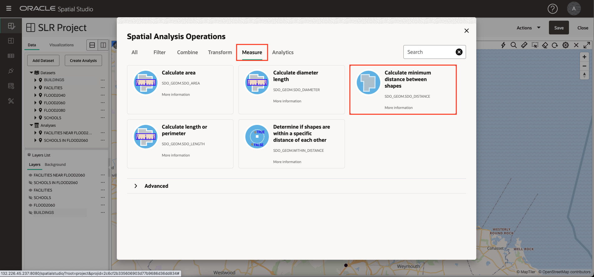

# Analizar relaciones espaciales

## Introducción

En este laboratorio se realiza una serie de análisis espaciales para identificar las relaciones entre una región de inundación proyectada y las características culturales. Los análisis se crean sin codificación y, a continuación, se visualizan los resultados en mapas y formato tabular.

Tiempo estimado: 30 minutos

Vea el siguiente vídeo para una breve introducción al laboratorio.

[Analizar relaciones espaciales](videohub:1_u0a3coe3)

### Objetivos

*   Descubra cómo realizar análisis espaciales de autoservicio, sin necesidad de escribir código.
*   Descubra cómo acceder al código de consulta espacial subyacente si lo desea.

### Requisitos

*   Finalización del laboratorio 3: visualización de datos espaciales

## Tarea 1: Identificar las escuelas en la zona de inundación proyectada

Comienza por realizar un análisis para filtrar las escuelas en función de la contención en una región de inundación proyectada.

1.  Para centrarse en las escuelas y el área de inundación proyectada, apague la visibilidad de las instalaciones y edificios. A continuación, en el menú de acción de FLOOD2060, seleccione **Acercar a capa**.
    
    
    
2.  En el menú de acción de ESCUELAS, seleccione **Análisis espacial**. Esto abre el cuadro de diálogo para acceder a las funciones de análisis espacial de Oracle Database.
    
    
    
3.  Aplicará un filtro espacial en las escuelas basado en la contención en el área de inundación proyectada. Por lo tanto, seleccione el separador **Filtro** y haga clic en el mosaico **Devolver unidades que estén dentro de otra**.
    
    
    
4.  Para el nombre de análisis, introduzca **SCHOOLS IN FLOOD2060**. Para filtrar la capa, seleccione **SCHOOLS LON&LAT** y para que la capa la utilice como filtro, seleccione **FLOOD2060. GEOM**. A continuación, haga clic en **Ejecutar**.
    
    
    
5.  Observe el análisis que aparece en Análisis. Haga clic y mantenga presionado el análisis y, a continuación, arrástrelo y suéltelo en el mapa. Como ya ha hecho anteriormente, cambie el estilo de la capa: abra el menú de acción para **SCHOOLS IN FLOOD2060**, seleccione **Configuración** y cambie el color a relleno rojo con trazo blanco (esquema).
    
    
    
    **Nota:** Puede pasar el mouse sobre un nombre de capa, juego de datos o análisis truncado para ver su nombre completo en una pista.
    
6.  Para ver los resultados del análisis espacial en formato tabular, haga clic en el separador **Visualizaciones** y, a continuación, arrastre y suelte una tabla junto al mapa. Puede borrar la tabla en cualquier borde del mapa.
    
    
    
7.  Haga clic en el separador **Datos** y, a continuación, haga clic y mantenga pulsado el análisis y, a continuación, arrástrelo y suéltelo en la vista de tabla.
    
    
    
8.  Los detalles técnicos detrás de los análisis están disponibles. En el menú de acción del análisis, seleccione Properties (Propiedades).
    
    
    
9.  En el cuadro de diálogo Propiedades, observe la sección que muestra el SQL de análisis. En particular, tenga en cuenta el operador SDO\_INSIDE que realiza el filtro espacial. El SQL está un poco más implicado que el ejemplo más genérico porque implica un índice espacial basado en funciones para centros docentes en lugar de una columna de geometría, y también ajusta la consulta principal con un SELECT externo para desduplicar centros docentes en caso de que un centro docente estuviera dentro de varias regiones.
    
    Observe también el punto final generado automáticamente que transmite los resultados del análisis en formato GeoJSON para que lo consuma cualquier cliente de asignación basada en estándares.
    
    Cuando haya terminado, haga clic en **Cancelar** y, a continuación, haga clic en la **X** para cerrar la vista de tabla.
    
    
    
10.  En Spatial Studio, los análisis son en sí mismos conjuntos de datos. En el panel de navegación principal, haga clic en el botón de la página **Conjuntos de datos**. Observe que el análisis se muestra para que se pueda utilizar en otros proyectos, exportar o guardar como una tabla o vista.
    

## Tarea 2: Identificar las instalaciones cerca de la zona de inundación proyectada

A continuación, identifique las instalaciones cerca del área de inundación proyectada. Esta es una operación de filtro espacial, donde las instalaciones se filtran en función de la proximidad al área de inundación proyectada. Esto se conoce como una operación "dentro de la distancia".

1.  En el panel de navegación principal, haga clic en el botón para volver al **proyecto activo**. Ajuste la visibilidad de la capa para que el área de inundación proyectada y las instalaciones sean visibles. En el menú de acción de FACILITIES, seleccione **Spatial Analysis** (Análisis espacial).
    
    
    
2.  Haga clic en el separador para los análisis de **Filtro** y, a continuación, haga clic en el mosaico para **Devolver unidades a una distancia especificada de otra**.
    
    
    
3.  En el cuadro de diálogo de análisis, para el nombre del análisis, introduzca **FACILITIES NEAR FLOOD2060**, para filtrar la capa, seleccione **FACILITIES LONGITUDE&LATITUDE** y para que la capa se utilice como filtro, introduzca **FLOOD2060. GEOM**.  
    Introduzca **10** para la distancia y seleccione **Kilómetro** como unidad. A continuación, haga clic en **Ejecutar**.
    
    
    
4.  Antes de agregar los resultados del análisis al mapa, cambie el estilo de la capa de instalaciones sin filtrar original para que los resultados del análisis sean claramente visibles. Como ha hecho anteriormente, en el menú de acción de Centros, seleccione **Configuración**. A continuación, cambie el radio a 6, el color a negro y la opacidad al máximo.
    
    
    
5.  Arrastre y suelte el análisis **FACILIDADES CERCA DE FLOOD2060** en el mapa.
    
    A continuación, en su menú de acción, seleccione Configuración y, a continuación, actualice su tamaño a 3, color a amarillo, opacidad a máximo y trazo (esquema) a negro. Los resultados son claramente visibles en la capa de instalaciones sin filtrar,
    
    
    
6.  Spatial Studio permite modificar los parámetros de un análisis. En el menú de acción de **FACILIDADES CERCA DE FLOOD2060**, seleccione **Modificar parámetros**.
    
    
    
7.  Actualice la distancia a 3 y, a continuación, haga clic en **Ejecutar**.
    
    
    
8.  Observe el refrescamiento del mapa con los resultados de análisis actualizados.
    
    
    
9.  A continuación, determinará la distancia de cada instalación en el resultado del análisis al área de inundación proyectada. En el menú de acción de **FACILITIES NEAR FLOOD2060**, seleccione **Spatial Analysis**.
    
    
    
10.  Seleccione el separador para los análisis de **medida**. A continuación, haga clic en el mosaico para **Calcular distancia mínima entre unidades**.
    

11.  Para el nombre del análisis, introduzca **FACILITIES NEAR FLOOD2060 DISTANCE**. Para el nombre de columna del resultado, introduzca **DISTANCE\_KM**. Para la geometría 1, seleccione **FACILITIES NEAR FLOOD2060. LATITUDE\_LONGITUDE\_GEOMETRY** y, para Geometría 2, seleccione **FLOOD2060. GEOM**, cambie las unidades a **Kilómetro**. A continuación, haga clic en **Run** (Ejecutar).

12.  Para los elementos con un nombre truncado, desplácese para ver una pista con el nombre completo.

Para centrarse en los resultados del análisis, desactive la visibilidad de todas las capas excepto FLOOD2060.

13.  Arrastre y suelte el análisis **FACILITIES NEAR FLOOD2060 DISTANCE** en el mapa y, a continuación, vaya a Settings (Configuración). Establezca un estilo de su elección. Seleccione **Interacción** en la lista desplegable de configuración. Desplácese hasta la sección de la ventana de información. Active la ventana de información y seleccione las columnas que desea mostrar, incluida la columna de resultados de análisis denominada DISTANCE\_KM. A continuación, en el mapa, haga clic en un centro para ver la información del elemento.

## Tarea 3: Identificar los edificios en contacto con la zona de inundación proyectada

A continuación, identifique los edificios que tienen cualquier interacción espacial con la región de inundación proyectada. Esto incluye edificios contenidos en la región, superponiendo la región o tocando el límite.

1.  En la lista de capas, active la visibilidad de la capa BUILDINGS. Mientras se aleja, solo verá una parte de los edificios, ya que hay demasiados para mostrar a una escala tan pequeña. En el menú de acción de EDIFICIOS, seleccione **Análisis espacial**.
    
    
    
2.  Usted identificará los edificios haciendo cualquier contacto con el área de inundación proyectada. Por lo tanto, seleccione el separador para los análisis de **Filtro** y, a continuación, seleccione el mosaico para **Devolver formas que tengan alguna interacción espacial con otra**.
    
    
    
3.  Para el nombre, introduzca **BUILDINGS FLOOD CONTACT**, para que se filtre la capa, seleccione **BUILDINGS.GEOM** y para que la capa se utilice como filtro, seleccione **FLOOD2060. GEOM**. A continuación, haga clic en **Ejecutar**.
    
    
    
4.  Arrastre y suelte el nuevo análisis en el mapa. A continuación, para la nueva capa de mapa, vaya a Configuración para actualizar el estilo. En la sección Rellenar, arrastre el control deslizante de opacidad a 0 para que no se muestre ningún relleno. En la sección Esquema, cambie el color a rojo, la opacidad al máximo y el ancho a 2. Esto resaltará efectivamente los edificios en contacto con la zona de inundación proyectada.
    
    
    
5.  Zoom en un área de su elección para ver edificios con aquellos en contacto con el área de inundación delineada en rojo. También puede experimentar con la adición de una lista de tablas de los resultados.
    
    
    
    También puede activar una pista, una ventana de información o una vista de tabla para el resultado del análisis.
    

Ahora puede **proceder al siguiente laboratorio**.

## Más información

*   [Página del producto Oracle Spatial](https://www.oracle.com/database/spatial)
*   [Introducción a Spatial Studio](https://www.oracle.com/database/technologies/spatial-studio/get-started.html)
*   [Documentación de Spatial Studio](https://docs.oracle.com/en/database/oracle/spatial-studio)

## Reconocimientos

*   **Autor**: David Lapp, Database Product Management, Oracle
*   **Contribuyentes**: Denise Myrick, Jayant Sharma
*   **Última actualización por/fecha**: David Lapp, agosto de 2023