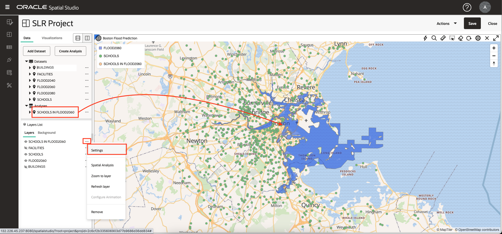
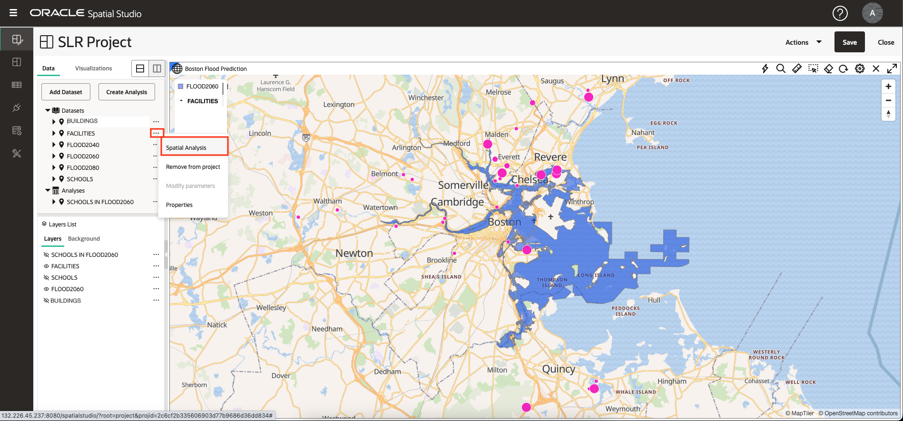
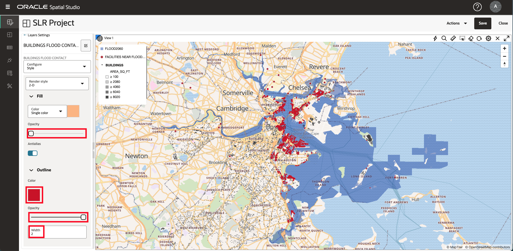

# Analyser les relations spatiales

## Présentation

Dans cet atelier, vous allez effectuer une série d'analyses spatiales afin d'identifier les relations entre une région inondable projetée et des caractéristiques culturelles. Vous créez les analyses sans codage, puis visualisez les résultats sous forme de cartes et de tableau.

Durée estimée : 30 minutes

Regardez la vidéo ci-dessous pour une présentation rapide du laboratoire.

[Analyser les relations spatiales](videohub:1_u0a3coe3)

### Objectifs

*   Découvrez comment effectuer des analyses spatiales en libre-service, sans avoir à écrire de code.
*   Découvrez comment accéder au code de requête spatiale sous-jacent si vous le souhaitez.

### Prérequis

*   Achèvement de l'atelier 3 : Visualisation des données spatiales

## Tâche 1 : Identifier les écoles dans la zone d'inondation projetée

Vous commencez par effectuer une analyse pour filtrer les écoles en fonction du confinement dans une région inondable projetée.

1.  Pour se concentrer sur les écoles et la zone d'inondation projetée, désactivez la visibilité pour les équipements et les bâtiments. Ensuite, dans le menu d'action de FLOOD2060, sélectionnez **Zoom sur la couche**.
    
    
    
2.  Dans le menu d'actions des écoles, sélectionnez **Analyse spatiale**. Cela ouvre la boîte de dialogue permettant d'accéder aux fonctionnalités d'analyse spatiale d'Oracle Database.
    
    
    
3.  Vous appliquerez un filtre spatial sur les écoles en fonction du confinement dans la zone d'inondation projetée. Sélectionnez donc l'onglet **Filtrer** et cliquez sur la mosaïque **Renvoyer les formes qui se trouvent dans une autre**.
    
    
    
4.  Pour le nom Analysis, entrez **SCHOOLS IN FLOOD2060**. Pour la couche à filtrer, sélectionnez **SCHOOLS LON&LAT** et pour la couche à utiliser comme filtre, sélectionnez **FLOOD2060. GEOM**. Cliquez ensuite sur **Exécuter**.
    
    
    
5.  Observez votre analyse répertoriée sous Analyses. Cliquez et maintenez votre analyse enfoncée, puis glissez-déplacez sur la carte. Comme vous l'avez fait précédemment, modifiez le style du calque : ouvrez le menu d'actions pour **SCHOOLS IN FLOOD2060**, sélectionnez **Settings** et remplacez la couleur par le remplissage rouge avec un trait blanc (outline).
    
    
    
    **Remarque :** vous pouvez passer le pointeur de la souris sur un nom de couche, d'ensemble de données ou d'analyse tronqué pour afficher son nom complet dans une info-bulle.
    
6.  Pour afficher les résultats de votre analyse spatiale sous forme de tableau, cliquez sur l'onglet **Visualisations**, puis glissez-déplacez une table en regard de la carte. Vous pouvez déposer le tableau sur n'importe quel bord de la carte.
    
    
    
7.  Cliquez sur l'onglet **Données**, puis cliquez sur l'analyse et maintenez-la enfoncée, puis faites-la glisser vers la vue de table.
    
    
    
8.  Les détails techniques derrière les analyses sont disponibles. Dans le menu d'actions de votre analyse, sélectionnez Propriétés.
    
    
    
9.  Dans la boîte de dialogue Properties, observez la section présentant le code SQL d'analyse. Notez en particulier l'opérateur SDO\_INSIDE qui exécute le filtre spatial. Le langage SQL est légèrement plus impliqué que l'exemple le plus générique car il implique un index spatial basé sur la fonction pour les écoles au lieu d'une colonne de géométrie, et encapsule également la requête principale avec un SELECT externe pour dédupliquer les écoles dans le cas où une école se trouvait dans plusieurs régions.
    
    Notez également l'adresse générée automatiquement qui transmet les résultats de l'analyse au format GeoJSON pour utilisation par n'importe quel client de mapping basé sur des normes.
    
    Lorsque vous avez terminé, cliquez sur **Annuler**, puis sur la croix (**X**) pour fermer la vue de table.
    
    
    
10.  Dans Spatial Studio, les analyses sont elles-mêmes des jeux de données. Dans le panneau de navigation principal, cliquez sur le bouton de la page **Ensembles de données**. Observez que votre analyse est répertoriée pour pouvoir être utilisée dans d'autres projets, exportée ou enregistrée sous forme de table ou de vue.
    

## Tâche 2 : Identifier les installations près de la zone d'inondation projetée

Vous identifiez ensuite les installations près de la zone d'inondation projetée. Il s'agit d'une opération de filtrage spatial, où les installations sont filtrées en fonction de la proximité de la zone d'inondation projetée. Il s'agit d'une opération "à distance".

1.  Dans le panneau de navigation principal, cliquez sur le bouton pour revenir à votre **projet actif**. Ajustez la visibilité de la couche de sorte que la zone d'inondation projetée et les installations soient visibles. Dans le menu d'actions de FACILITIES, sélectionnez **Analyse spatiale**.
    
    
    
2.  Cliquez sur l'onglet pour les analyses **Filtrer**, puis sur la mosaïque **Renvoyer les formes à une distance spécifiée d'une autre**.
    
    
    
3.  Dans la boîte de dialogue d'analyse, pour le nom de l'analyse, entrez **FACILITIES NEAR FLOOD2060**, pour la couche à filtrer, sélectionnez **FACILITIES LONGITUDE&LATITUDE** et pour la couche à utiliser comme filtre, entrez **FLOOD2060. GEOM**.  
    Saisissez **10** comme distance et sélectionnez **Kilomètre** comme unité. Cliquez ensuite sur **Exécuter**.
    
    
    
4.  Avant d'ajouter les résultats de l'analyse à la carte, modifiez le style de la couche Facilities non filtrée d'origine afin que les résultats de l'analyse soient clairement visibles. Comme vous l'avez fait précédemment, dans le menu d'actions des établissements, sélectionnez **Paramètres**. Ensuite, remplacez le rayon par 6, la couleur par le noir et l'opacité par le maximum.
    
    
    
5.  Glissez-déplacez votre analyse **FACILITIES NEAR FLOOD2060** sur la carte.
    
    Ensuite, dans son menu d'action, sélectionnez Paramètres, puis mettez à jour sa taille à 3, la couleur à jaune, l'opacité à maximum et le contour (outline) à noir. Les résultats sont clairement visibles sur la couche FACILITIES non filtrée,
    
    
    
6.  Spatial Studio vous permet de modifier les paramètres d'une analyse. Dans le menu d'actions de **FACILITIES NEAR FLOOD2060**, sélectionnez **Modify Parameters**.
    
    
    
7.  Mettez à jour la distance sur 3, puis cliquez sur **Run** (Exécuter).
    
    
    
8.  Observez l'actualisation de la carte avec les résultats d'analyse mis à jour.
    
    
    
9.  Vous allez ensuite déterminer la distance de chaque installation du résultat de votre analyse par rapport à la zone d'inondation projetée. Dans le menu d'actions de **FACILITIES NEAR FLOOD2060**, sélectionnez **Analyse spatiale**.
    
    
    
10.  Sélectionnez l'onglet pour les analyses **Mesure**. Cliquez ensuite sur la mosaïque **Calculer la distance minimale entre les formes**.
    

11.  Pour le nom d'analyse, entrez **FACILITIES NEAR FLOOD2060 DISTANCE**, pour le nom de colonne du résultat, entrez **DISTANCE\_KM**, pour la géométrie 1, sélectionnez **FACILITIES NEAR FLOOD2060. LATITUDE\_LONGITUDE\_GEOMETRY** et pour la géométrie 2, sélectionnez **FLOOD2060. GEOM**, remplacez Units par **Kilometer**. Cliquez ensuite sur **Exécuter**.

12.  Pour les éléments dont le nom est tronqué, positionnez le pointeur de la souris pour afficher une info-bulle indiquant le nom complet.

Pour vous concentrer sur les résultats de votre analyse, désactivez la visibilité pour toutes les couches à l'exception de FLOOD2060.

13.  Glissez-déplacez l'analyse **FACILITIES NEAR FLOOD2060 DISTANCE** sur la carte, puis accédez à ses paramètres. Définissez le style de votre choix. Sélectionnez **Interaction** dans la liste déroulante de configuration. Faites défiler l'affichage jusqu'à la section Fenêtre d'informations. Activez la fenêtre d'informations et sélectionnez les colonnes à afficher, y compris la colonne de résultat d'analyse nommée DISTANCE\_KM. Ensuite, dans la carte, cliquez sur un établissement pour afficher les informations de l'article.

## Tâche 3 : Identifier les bâtiments en contact avec la zone d'inondation projetée

Vous allez ensuite identifier les bâtiments qui ont une interaction spatiale avec la région inondable projetée. Cela inclut les bâtiments contenus dans la région, qui chevauchent la région ou qui touchent la limite.

1.  Dans la liste des calques, activez la visibilité pour la couche BUILDINGS. Bien que zoomé, vous ne verrez qu'une partie des bâtiments car il y en a trop à afficher à une si petite échelle. Dans le menu d'actions de BUILDINGS, sélectionnez **Analyse spatiale**.
    
    
    
2.  Vous identifiez les bâtiments qui entrent en contact avec la zone d'inondation projetée. Sélectionnez donc l'onglet pour les analyses **Filtrer**, puis la mosaïque pour les **formes de retour ayant une interaction spatiale avec une autre**.
    
    
    
3.  Pour le nom, entrez **BUILDINGS FLOOD CONTACT**, pour la couche à filtrer, sélectionnez **BUILDINGS.GEOM** et pour la couche à utiliser comme filtre, sélectionnez **FLOOD2060. GEOM**. Cliquez ensuite sur **Exécuter**.
    
    
    
4.  Faites glisser votre nouvelle analyse sur la carte. Ensuite, pour la nouvelle couche de carte, accédez à Paramètres pour mettre à jour le style. Dans la section Remplissage, faites glisser le curseur d'opacité sur 0 pour qu'aucun remplissage ne soit affiché. Dans la section Profil, remplacez la couleur par le rouge, l'opacité par le maximum et la largeur par 2. Cela permettra effectivement de mettre en évidence les bâtiments en contact avec la zone d'inondation projetée.
    
    
    
5.  Zoom sur une zone de votre choix pour voir les bâtiments avec ceux en contact avec la zone inondable esquissée en rouge. Vous pouvez également essayer d'ajouter une liste de tableaux des résultats.
    
    
    
    Vous pouvez éventuellement activer une info-bulle, une fenêtre d'informations ou une vue de tableau pour le résultat de l'analyse.
    

Vous pouvez maintenant **passer à l'exercice suivant**.

## En savoir plus

*   [Page produit Oracle Spatial](https://www.oracle.com/database/spatial)
*   [Lancez-vous avec Spatial Studio](https://www.oracle.com/database/technologies/spatial-studio/get-started.html)
*   [Documentation de Spatial Studio](https://docs.oracle.com/en/database/oracle/spatial-studio)

## Accusés de réception

*   **Auteur** - David Lapp, Database Product Management, Oracle
*   **Contributeurs** - Denise Myrick, Jayant Sharma
*   **Dernière mise à jour par/date** - David Lapp, août 2023