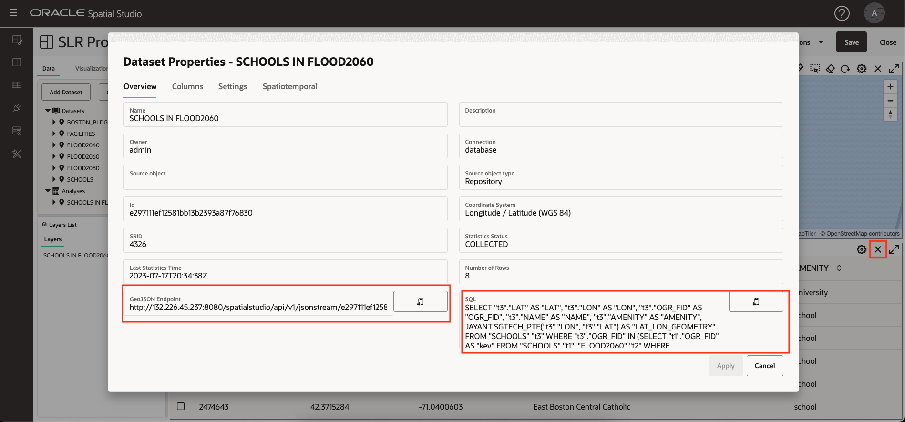
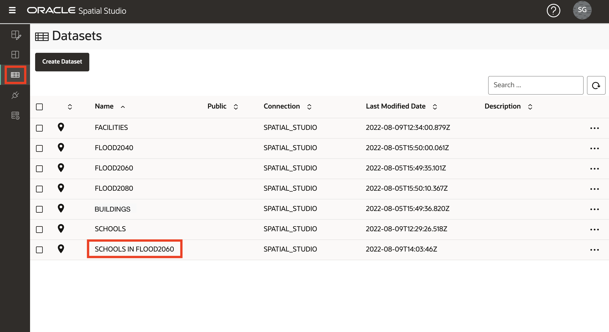
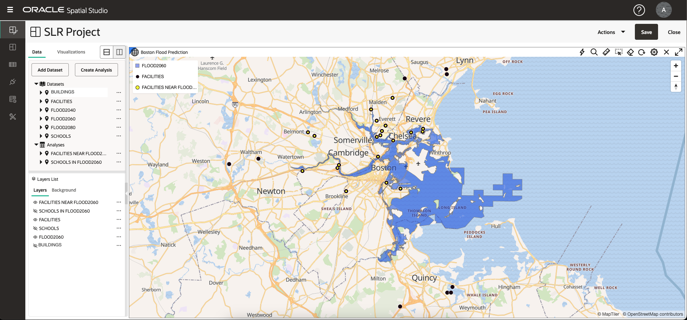

# 空間関係の分析

## 概要

この演習では、一連の空間分析を実行して、予測洪水地域と文化的特徴の関係を識別します。分析をコーディングせずに作成し、結果をマップおよび表形式で視覚化します。

見積時間: 30分

ラボのクイック・ウォークスルーについては、次のビデオをご覧ください。

[空間関係の分析](videohub:1_u0a3coe3)

### 目標

*   コードを記述せずにセルフサービス空間分析を実行する方法を学習します。
*   必要に応じて、基礎となる空間問合せコードにアクセスする方法を学習します。

### 前提条件

*   演習3の完了: 空間データのビジュアル化

## タスク1: 洪水が予想される地域の学校の特定

まず、予測洪水地域内の封じ込めに基づいて学校をフィルタリングする分析を実行します。

1.  学校と予想される洪水エリアに焦点を当てるには、施設と建物の視界をオフにします。次に、FLOOD2060のアクション・メニューから、**「レイヤーにズーム」**を選択します。
    
    
    
2.  SCHOOLSのアクション・メニューから、**「空間分析」**を選択します。これにより、Oracle Databaseの空間分析機能にアクセスするためのダイアログが開きます。
    
    
    
3.  投影洪水区域の封じ込めに基づいて、学校に空間フィルタを適用します。そのため、**「フィルタ」**のタブを選択し、**「別の図形を戻す」**のタイルをクリックします。
    
    
    
4.  For Analysis name, enter **SCHOOLS IN FLOOD2060**. For Layer to be filtered select **SCHOOLS LON&LAT** and for Layer to use as the filter select **FLOOD2060.GEOM**. Then click **Run**.
    
    
    
5.  「分析」の下にリストされている分析を確認します。分析をクリックしたまま、マップにドラッグ・アンド・ドロップします。以前に行ったように、レイヤーのスタイルを変更します。**「SCHOOLS IN FLOOD2060」**のアクション・メニューを開き、**「設定」**を選択し、色を白色のストローク(アウトライン)で赤色の塗りつぶしに変更します。
    
    
    
    **ノート:**切り捨てられたレイヤー、データセットまたは分析名の上にカーソルを置くと、ツールチップにそのフルネームが表示されます。
    
6.  空間分析の結果を表形式で表示するには、**「ビジュアライゼーション」**タブをクリックし、マップの横にある表をドラッグ・アンド・ドロップします。表はマップの任意の端にドロップできます。
    
    
    
7.  **「データ」**タブをクリックし、分析をクリックしたまま、表ビューにドラッグ・アンド・ドロップします。
    
    
    
8.  分析の背後にある技術的な詳細をご覧いただけます。分析用のアクション・メニューから、「プロパティ」を選択します。
    
    
    
9.  「プロパティ」ダイアログで、分析SQLを示すセクションを確認します。特に、空間フィルタを実行するSDO\_INSIDE演算子に注意してください。SQLは、ジオメトリ列ではなく学校用のファンクションベースの空間索引を含むため、最も一般的な例よりも多少関与します。また、学校が複数のリージョン内にあった場合に学校を複製解除するために、外部SELECTでメイン問合せをラップします。
    
    また、分析をストリームする自動生成されたエンドポイントは、標準ベースのマッピング・クライアントによる消費のためにGeoJSON形式になります。
    
    完了したら、**「取消」**をクリックし、**「X」**をクリックして表ビューを閉じます。
    
    
    
10.  Spatial Studioでは、分析自体がデータセットです。メイン・ナビゲーション・パネルで、**「データセット」**ページのボタンをクリックします。他のプロジェクトで使用したり、エクスポートしたり、表またはビューとして保存できるように、分析がリストされていることを確認します。
    

## タスク2: 予想される洪水地域の近くの施設の特定

次に、予想される洪水地域の近くの施設を識別します。これは空間フィルタ操作で、施設は投影フラッド領域への近接性に基づいてフィルタされます。これは「距離内」操作と呼ばれます。

1.  メイン・ナビゲーション・パネルで、ボタンをクリックして**アクティブ・プロジェクト**に戻ります。投影されたフラッド領域と施設が表示されるようにレイヤーの可視性を調整します。FACILITIESのアクション・メニューから、**「空間分析」**を選択します。
    
    
    
2.  **「フィルタ」**分析のタブをクリックし、タイルをクリックして**「指定した距離内の別の図形を戻します」**。
    
    
    
3.  In the analysis dialog, for analysis name enter **FACILITIES NEAR FLOOD2060**, for layer to be filtered select **FACILITIES LONGITUDE&LATITUDE**, and for layer to be used as the filter enter **FLOOD2060.GEOM**.  
    Enter **10** for the distance and select **Kilometer** as the unit. Then click **Run**.
    
    
    
4.  分析結果をマップに追加する前に、分析結果が明確に見えるように、フィルタされていない元の施設レイヤーのスタイルを変更します。前述のように、「施設」のアクション・メニューから**「設定」**を選択します。次に、半径を6に、色を黒に、不透明度を最大に変更します。
    
    
    
5.  **「FACILITIES NEAR」FLOOD2060**分析をマップにドラッグ・アンド・ドロップします。
    
    次に、アクション・メニューから「設定」を選択し、そのサイズを3に、色を黄色に、不透明度を最大に、ストローク(アウトライン)を黒に更新します。結果は、フィルタされていないFACILITIES層に明確に見えます。
    
    
    
6.  Spatial Studioでは、分析のパラメータを変更できます。**「FACILITIES NEAR FLOOD2060」**のアクション・メニューから、**「パラメータの変更」**を選択します。
    
    
    
7.  距離を3に更新し、**「実行」**をクリックします。
    
    
    
8.  更新された分析結果を使用してマップのリフレッシュを確認します。
    
    
    
9.  次に、解析結果の各施設が投影フラッド領域までの距離を決定します。**「FACILITIES NEAR」FLOOD2060**のアクション・メニューから、**「空間分析」**を選択します。
    
    
    
10.  **「メジャー」**分析のタブを選択します。次に、**「図形間の最小距離の計算」**のタイルをクリックします。
    

11.  分析名に**FACILITIES NEAR FLOOD2060 DISTANCE**と入力し、結果の列名に**DISTANCE\_KM**と入力し、ジオメトリ1に**FACILITIES NEAR FLOOD2060を選択します。LATITUDE\_LONGITUDE\_GEOMETRY**で、ジオメトリ2の場合は**FLOOD2060を選択します。GEOM**、Unitsを **Kilometer**に変更します。次に、**「実行」**をクリックします。

12.  名前が切り捨てられたアイテムの場合は、マウス・ポインタを重ねると、フルネームを示すツールチップが表示されます。

分析結果にフォーカスするには、FLOOD2060を除くすべてのレイヤーの表示をオフにします。

13.  **「FACILITIES NEAR FLOOD2060 DISTANCE」**分析をマップにドラッグ・アンド・ドロップし、「設定」に移動します。選択したスタイルを設定します。構成ドロップダウンから**「相互作用」**を選択します。「情報ウィンドウ」セクションまで下にスクロールします。情報ウィンドウを有効にし、DISTANCE\_KMという名前の分析結果列を含む表示する列を選択します。次に、マップで施設をクリックして、品目の情報を表示します。

## タスク3: 予想される洪水地域と接触している建物の識別

次に、投影された洪水領域と空間的に相互作用する建物を識別します。これには、地域に含まれる建物、地域を重ねる建物、または境界に触れる建物が含まれます。

1.  画層リストで、BUILDINGS画層の表示をオンにします。ズームアウトしている間は、そのような小規模で表示するには多すぎるため、建物の一部のみが表示されます。BUILDINGSのアクション・メニューから、**「空間分析」**を選択します。
    
    
    
2.  予想される洪水地域と接触している建物を特定します。そのため、**「フィルタ」**分析のタブを選択し、**「別のものとの空間相互作用がある形状を返す」**のタイルを選択します。
    
    
    
3.  For name, enter **BUILDINGS FLOOD CONTACT**, for layer to be filtered select **BUILDINGS.GEOM**, and for layer to be used as filter select **FLOOD2060.GEOM**. Then click **Run**.
    
    
    
4.  新しい分析をマップにドラッグ・アンド・ドロップします。次に、新しいマップ レイヤについて、\[設定\]に移動してスタイルを更新します。「塗りつぶし」セクションで、不透明度スライダを0にドラッグして、塗りつぶしが表示されないようにします。「アウトライン」セクションで、色を赤に、不透明度を最大に、幅を2に変更します。これにより、予想される洪水地帯と接触している建物が効果的に強調されます。
    
    
    
5.  選択したエリアにズームして、洪水区域と接触している建物を赤で概説します。結果の表リストの追加も試行できます。
    
    
    
    オプションで、分析結果のツールチップ、情報ウィンドウまたは表ビューを有効にします。
    

**次の演習に進む**ことができます。

## さらに学ぶ

*   [Oracle Spatial製品ページ](https://www.oracle.com/database/spatial)
*   [Spatial Studioの開始](https://www.oracle.com/database/technologies/spatial-studio/get-started.html)
*   [Spatial Studioのドキュメント](https://docs.oracle.com/en/database/oracle/spatial-studio)

## 謝辞

*   **著者** - Oracle、データベース製品管理、David Lapp氏
*   **貢献者** - Denise Myrick、 Jayant Sharma
*   **最終更新者/日付** - David Lapp、2023年8月