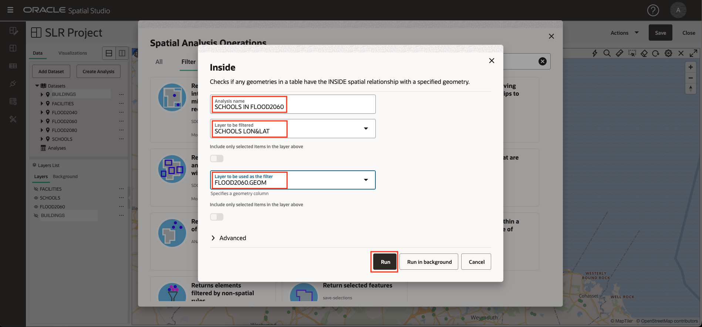
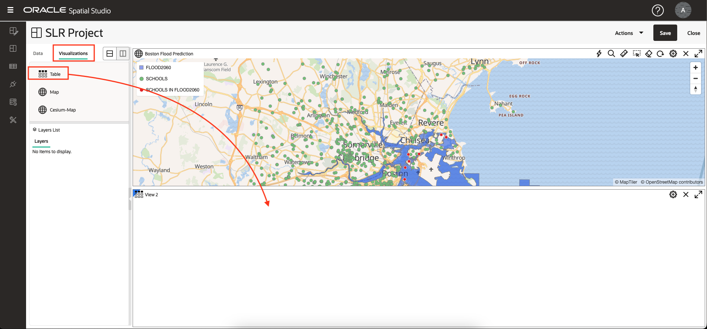
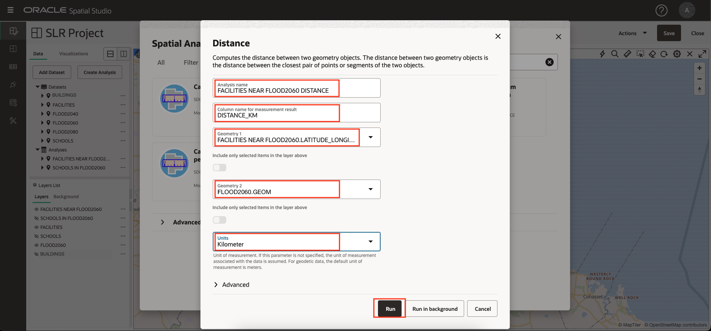
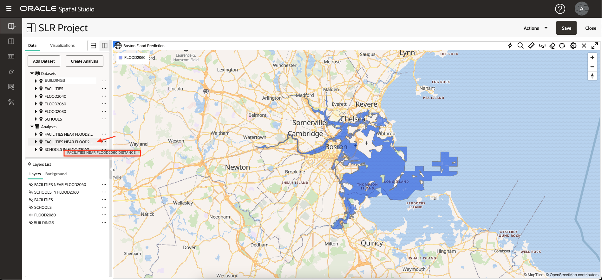
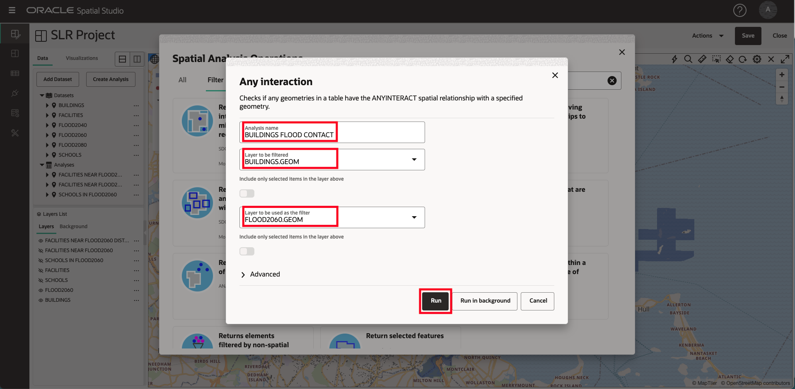

# 공간 관계 분석

## 소개

이 실습에서는 일련의 공간 분석을 수행하여 예상 홍수 지역과 문화적 특징 사이의 관계를 식별합니다. 코딩 없이 분석을 생성한 다음 맵 및 표 형식으로 결과를 시각화합니다.

예상 시간: 30분

실습 과정을 간단히 살펴보려면 아래 비디오를 시청하십시오.

[공간 관계 분석](videohub:1_u0a3coe3)

### 목표

*   코드를 작성하지 않고도 셀프 서비스 공간 분석을 수행하는 방법을 알아봅니다.
*   필요한 경우 기본 공간 쿼리 코드에 액세스하는 방법을 알아봅니다.

### 필요 조건

*   실습 3: 공간 데이터 시각화

## 작업 1: 예상 홍수 지역의 학교 식별

먼저 분석을 수행하여 예상 홍수 지역의 격리를 기반으로 학교를 필터링합니다.

1.  학교와 예상 홍수 지역에 집중하려면 시설 및 건물에 대한 가시성을 끄십시오. 그런 다음 FLOOD2060의 작업 메뉴에서 **계층으로 확대/축소**를 선택합니다.
    
    
    
2.  학교 작업 메뉴에서 **공간 분석**을 선택합니다. 그러면 Oracle Database의 공간 분석 기능에 액세스할 수 있는 대화상자가 열립니다.
    
    
    
3.  예상 홍수 지역의 격리에 따라 학교에 공간 필터를 적용합니다. 따라서 **Filter**에 대한 탭을 선택하고 **Return shapes that are inside another**에 대한 타일을 누릅니다.
    
    
    
4.  분석 이름에 **SCHOOLS IN FLOOD2060**를 입력합니다. 필터링할 레이어에 대해 **SCHOOLS LON&LAT**를 선택하고 레이어에서 필터로 사용하려면 **FLOOD2060를 선택합니다. GEOM**그런 다음 **실행**을 누릅니다.
    
    
    
5.  분석 아래에 나열된 분석을 살펴봅니다. 분석을 누른 상태에서 맵으로 끌어 놓습니다. 이전에 완료했듯이 층의 스타일을 변경합니다. **FLOOD2060의 CHOOLS 작업 메뉴**를 열고 **설정**을 선택한 다음 색상을 흰색 선(아웃라인)으로 빨간색 채우기로 변경합니다.
    
    
    
    **주:** 잘린 계층, 데이터 집합 또는 분석 이름에 마우스를 갖다 대면 도구 설명에 전체 이름이 표시됩니다.
    
6.  공간 분석 결과를 표 형식으로 보려면 **시각화** 탭을 누른 다음 맵 옆에 있는 테이블을 끌어 놓습니다. 지도의 가장자리에 테이블을 놓을 수 있습니다.
    
    
    
7.  **데이터** 탭을 누른 후 분석을 누르고 테이블 뷰로 끌어 놓습니다.
    
    
    
8.  분석에 대한 기술적인 세부 사항은 다음과 같습니다. 분석할 작업 메뉴에서 속성을 선택합니다.
    
    
    
9.  Properties 대화상자에서 분석 SQL을 보여주는 섹션을 살펴봅니다. 특히 공간 필터를 수행하는 SDO\_INSIDE 연산자를 확인합니다. SQL은 지오메트리 열 대신 학교에 대한 함수 기반 공간 인덱스를 포함하고, 학교가 여러 지역에 있을 경우 학교를 중복 제거하도록 외부 SELECT로 기본 질의를 줄바꿈하기 때문에 가장 일반적인 예제보다 약간 더 관련됩니다.
    
    표준 기반 매핑 클라이언트가 사용할 수 있도록 분석 결과를 GeoJSON 형식으로 스트리밍하는 자동 생성된 엔드포인트도 참고하십시오.
    
    완료되면 **취소**를 누른 다음 **X**를 눌러 테이블 뷰를 닫습니다.
    
    
    
10.  Spatial Studio에서는 분석 자체가 데이터 집합입니다. 기본 탐색 패널에서 **데이터 세트** 페이지의 버튼을 누릅니다. 다른 프로젝트에서 사용하거나, 내보내거나, 테이블 또는 뷰로 저장할 수 있도록 분석이 나열되는지 확인합니다.
    

## 작업 2: 예상 홍수 지역 근처 시설 식별

다음으로 예상 홍수 지역 근처의 시설을 식별합니다. 공간 필터 작업으로, 투영된 플러드 영역에 근접하여 설비를 필터링합니다. 이를 "거리 내" 작업이라고 합니다.

1.  기본 탐색 패널에서 단추를 눌러 **활성 프로젝트**로 돌아갑니다. 도면층 가시성을 조정하여 투영된 플러드 영역과 설비를 표시합니다. 시설 작업 메뉴에서 **공간 분석**을 선택합니다.
    
    
    
2.  **필터** 분석에 대한 탭을 누른 다음 타일을 눌러 **지정된 거리 내에 모양 반환**을 선택합니다.
    
    
    
3.  분석 대화상자에서 분석 이름에 **FACILITIES NEAR FLOOD2060**을 입력하고 필터링할 층에 대해 **FACILITIES LONGITUDE&LATITUDE**를 선택하고 필터로 사용할 층에 대해 **FLOOD2060을 입력합니다. GEOM**  
    거리에 **10**을 입력하고 **킬로미터**를 단위로 선택합니다. 그런 다음 **실행**을 누릅니다.
    
    
    
4.  해석 결과를 지도에 추가하기 전에 해석 결과가 명확하게 표시되도록 필터링되지 않은 원래 Facilities 도면층의 스타일을 변경합니다. 이전에 완료했듯이 Facilities의 작업 메뉴에서 **Settings**를 선택합니다. 그런 다음 반지름을 6으로, 색상을 검정색으로, 불투명도를 최대로 변경합니다.
    
    
    
5.  **FACILITIES NEAR FLOOD2060** 분석을 맵으로 끌어 놓습니다.
    
    그런 다음 작업 메뉴에서 설정을 선택한 다음 크기를 3으로, 색상은 노란색, 불투명도는 최대, 획(아웃라인)은 검정으로 업데이트합니다. 필터링되지 않은 FACILITIES 도면층에서 결과가 명확하게 표시됩니다.
    
    
    
6.  Spatial Studio를 사용하면 분석 매개변수를 수정할 수 있습니다. **FACILITIES NEAR FLOOD2060**에 대한 작업 메뉴에서 **Modify Parameters**를 선택합니다.
    
    
    
7.  거리를 3으로 업데이트한 다음 **실행**을 누릅니다.
    
    
    
8.  업데이트된 분석 결과가 포함된 맵 새로고침을 확인합니다.
    
    
    
9.  다음으로 분석 결과의 각 설비에서 예상 홍수 영역까지의 거리를 확인합니다. **FACILITIES NEAR FLOOD2060**에 대한 작업 메뉴에서 **Spatial Analysis**를 선택합니다.
    
    
    
10.  **측정항목** 분석에 대한 탭을 선택합니다. 그런 다음 타일을 눌러 **모양 간 최소 거리 계산**을 수행합니다.
    

11.  분석 이름에 **FACILITIES NEAR FLOOD2060 DISTANCE**를 입력하고 결과의 열 이름에 **DISTANCE\_KM**를 입력하고 Geometry 1에 대해 **FACILITIES NEAR FLOOD2060를 선택합니다. LATITUDE\_LONGITUDE\_GEOMETRY** 및 형상 2에 대해 **FLOOD2060을 선택합니다. GEOM**, Units를 **Kilometer**로 변경합니다. 그런 다음 **실행**을 누릅니다.

12.  이름이 잘린 항목의 경우 커서를 가져가면 전체 이름을 표시하는 도구 설명이 표시됩니다.

분석 결과에 집중하려면 FLOOD2060를 제외한 모든 레이어에 대한 가시성을 끕니다.

13.  **FACILITIES NEAR FLOOD2060 DISTANCE** 분석을 맵으로 끌어 놓은 다음 해당 설정으로 이동합니다. 선택한 스타일을 설정합니다. 구성 드롭다운에서 **상호 작용**을 선택합니다. Info Window 섹션이 표시될 때까지 아래로 이동합니다. 정보 창을 사용으로 설정하고 DISTANCE\_KM라는 분석 결과 열을 포함하여 표시할 열을 선택합니다. 그런 다음 맵에서 설비를 눌러 항목의 정보를 봅니다.

## 작업 3: 예상 홍수 지역과 접촉하는 건물 식별

그런 다음 예상 홍수 지역과 공간적 상호 작용이 있는 건물을 식별합니다. 여기에는 지역에 포함된 건물, 해당 지역 중첩 또는 경계 접촉이 포함됩니다.

1.  도면층 리스트에서 BUILDINGS 도면층에 대한 가시성을 켭니다. 축소하는 동안 당신은 단지 건물의 일부를 볼 수 있기 때문에 너무 많은 작은 규모로 표시 할 수 있습니다. BUILDINGS의 작업 메뉴에서 **공간 분석**을 선택합니다.
    
    
    
2.  예상 홍수 지역과 접촉하는 건물을 식별합니다. 따라서 **필터** 분석에 대한 탭을 선택한 다음 **다른 사람과 공간적 상호 작용이 있는 모양 반환**의 타일을 선택합니다.
    
    
    
3.  이름에 **BUILDINGS FLOOD CONTACT**를 입력하고 필터링할 계층에 대해 **BUILDINGS.GEOM**을 선택하고 필터로 사용할 계층에 대해 **FLOOD2060을 선택합니다. GEOM**그런 다음 **실행**을 누릅니다.
    
    
    
4.  새 분석을 맵에 끌어 놓습니다. 그런 다음 새 맵 레이어의 경우 설정으로 이동하여 스타일을 업데이트합니다. 채우기 섹션에서 불투명도 슬라이더를 0으로 드래그하여 채우기가 표시되지 않도록 합니다. Outline 섹션에서 색상을 빨간색으로, 불투명도를 최대로, 너비를 2로 변경합니다. 이것은 예상 홍수 구역과 접촉하는 건물을 효과적으로 강조합니다.
    
    
    
5.  선택한 영역을 확대하여 빨간색으로 표시된 홍수 영역과 접촉하는 건물을 봅니다. 결과의 테이블 리스트도 추가해 볼 수 있습니다.
    
    
    
    선택적으로 분석 결과에 대한 도구 설명, 정보 창 또는 테이블 뷰를 사용으로 설정합니다.
    

이제 **다음 실습을 진행하십시오**.

## 자세히 알아보기

*   [Oracle Spatial 제품 페이지](https://www.oracle.com/database/spatial)
*   [Spatial Studio 시작하기](https://www.oracle.com/database/technologies/spatial-studio/get-started.html)
*   [Spatial Studio 설명서](https://docs.oracle.com/en/database/oracle/spatial-studio)

## 확인

*   **작성자** - David Lapp, Oracle 데이터베이스 제품 관리
*   **제공자** - Denise Myrick, Jayant Sharma
*   **최종 업데이트 수행자/날짜** - David Lapp, 2023년 8월