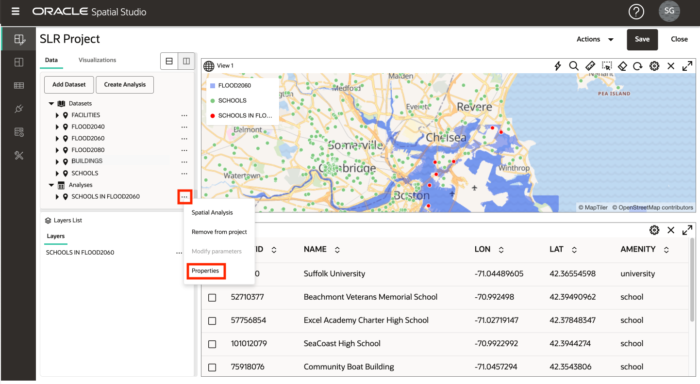
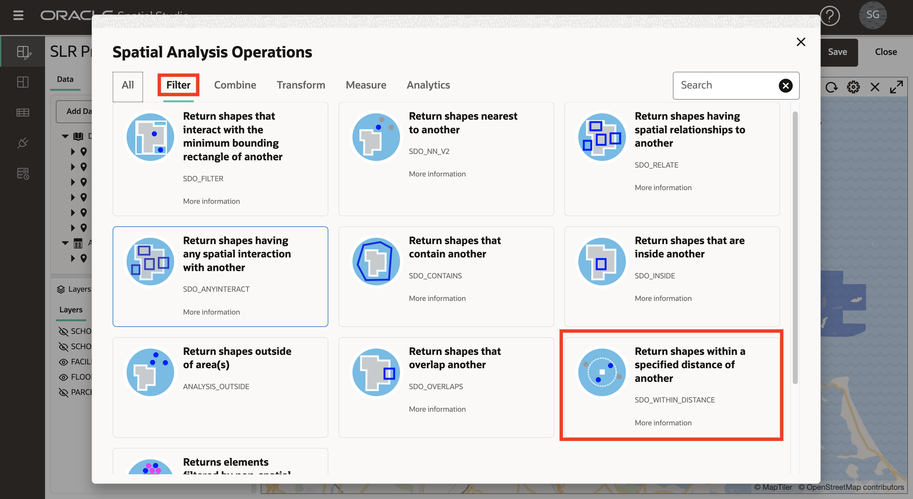
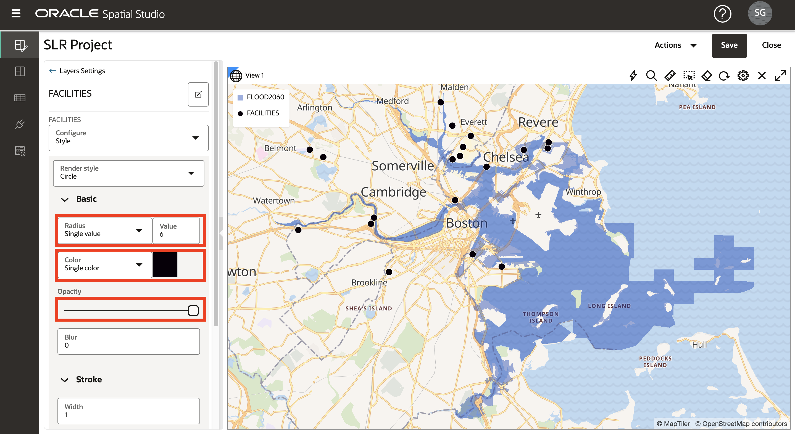
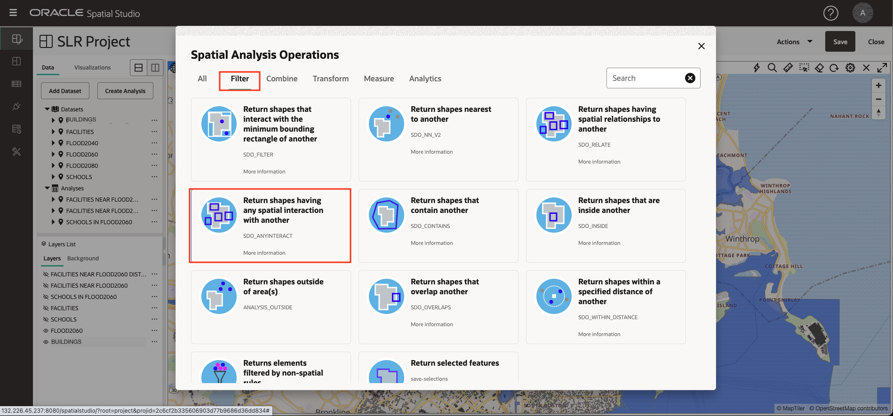

# Analisar relações espaciais

## Introdução

Neste laboratório você realiza uma série de análises espaciais para identificar as relações entre uma região de inundação projetada e características culturais. Você cria as análises sem codificação e, em seguida, visualiza os resultados em mapas e em formato tabular.

Tempo Estimado: 30 minutos

Assista ao vídeo abaixo para uma rápida apresentação do laboratório.

[Analisar relações espaciais](videohub:1_u0a3coe3)

### Objetivos

*   Aprenda a realizar análises espaciais de autoatendimento, sem a necessidade de escrever código.
*   Saiba como acessar o código de consulta espacial subjacente, se desejado.

### Pré-requisitos

*   Conclusão do Laboratório 3: Visualizar dados espaciais

## Tarefa 1: Identificar escolas na área de inundação projetada

Você começa realizando uma análise para filtrar as escolas com base na contenção em uma região de inundação projetada.

1.  Para se concentrar nas escolas e na área de inundação projetada, desligue a visibilidade para instalações e edifícios. Em seguida, no menu de ação de FLOOD2060, selecione **Zoom para camada**.
    
    
    
2.  No menu de ação de ESCOLAS, selecione **Análise Espacial**. Isso abre a caixa de diálogo para acessar os recursos de análise espacial do Oracle Database.
    
    
    
3.  Você aplicará um filtro espacial em escolas com base na contenção na área de inundação projetada. Portanto, selecione a guia para **Filtro** e clique no mosaico para **Retornar formas que estão dentro de outra**.
    
    
    
4.  Para o nome da Análise, digite **SCHOOLS IN FLOOD2060**. Para Camada a ser filtrada, selecione **SCHOOLS LON&LAT** e para Camada a ser usada como filtro, selecione **FLOOD2060. GEOM**. Em seguida, clique em **Executar**.
    
    
    
5.  Observe sua análise listada em Análises. Clique e mantenha pressionada a análise e arraste e solte no mapa. Como você fez anteriormente, altere o estilo da camada: abra o menu de ação para **SCHOOLS IN FLOOD2060**, selecione **Definições** e altere a cor para preenchimento vermelho com traço branco (outline).
    
    
    
    **Observação:** você pode passar o mouse sobre um nome de Camada, Conjunto de Dados ou Análise truncado para ver seu nome completo em uma dica de ferramenta.
    
6.  Para exibir os resultados da sua análise espacial em formato tabular, clique na guia **Visualizações** e arraste e solte uma tabela ao lado do mapa. Você pode soltar a tabela em qualquer borda do mapa.
    
    
    
7.  Clique na guia **Dados** e, em seguida, clique e mantenha pressionada a análise e arraste e solte na exibição de tabela.
    
    
    
8.  Detalhes técnicos por trás das análises estão disponíveis. No menu de ação para sua análise, selecione Propriedades.
    
    
    
9.  Na caixa de diálogo Propriedades, observe a seção mostrando o SQL de análise. Em particular, observe o operador SDO\_INSIDE que executa o filtro espacial. O SQL é um pouco mais envolvido do que o exemplo mais genérico porque envolve um índice espacial baseado em função para escolas em vez de uma coluna de geometria e também envolve a consulta principal com uma SELECT externa para desduplicar escolas no caso de uma escola estar dentro de várias regiões.
    
    Observe também o ponto final gerado automaticamente que transmite os resultados da análise no formato GeoJSON para consumo por qualquer cliente de mapeamento baseado em padrões.
    
    Quando terminar, clique em **Cancelar** e, em seguida, clique no **X** para fechar a view de tabela.
    
    
    
10.  No Spatial Studio, as análises são elas mesmas Conjuntos de Dados. No painel de navegação principal, clique no botão da página **Conjuntos de Dados**. Observe que sua análise está listada para que possa ser usada em outros projetos, exportada ou salva como uma tabela ou view.
    

## Tarefa 2: Identificar instalações perto da área de inundação projetada

Em seguida, identifique as instalações perto da área de inundação projetada. Esta é uma operação de filtro espacial, onde as instalações são filtradas com base na proximidade da área de inundação projetada. Isso é chamado de operação "dentro da distância".

1.  No painel de navegação principal, clique no botão para retornar ao **Projeto Ativo**. Ajuste a visibilidade da camada para que a área de inundação projetada e as instalações fiquem visíveis. No menu de ação de FACILIDADES, selecione **Análise Espacial**.
    
    
    
2.  Clique na guia para análises de **Filtro** e, em seguida, clique no bloco para **Retornar formas dentro de uma distância especificada de outra**.
    
    
    
3.  Na caixa de diálogo de análise, para o nome da análise, digite **FACILITIES NEAR FLOOD2060**; para a camada a ser filtrada, selecione **FACILITIES LONGITUDE&LATITUDE** e para a camada a ser usada como filtro, digite **FLOOD2060. GEOM**.  
    Informe **10** para a distância e selecione **Kilômetro** como a unidade. Em seguida, clique em **Executar**.
    
    
    
4.  Antes de adicionar os resultados da análise ao mapa, altere o estilo da camada de Instalações não filtradas original para que os resultados da análise sejam claramente visíveis. Como você fez anteriormente, no menu de ação das Instalações, selecione **Configurações**. Em seguida, altere o raio para 6, cor para preto e opacidade para o máximo.
    
    
    
5.  Arraste e solte suas **FACILIDADES PRÓXIMAS de FLOOD2060** análise no mapa.
    
    Em seguida, no menu de ação, selecione Configurações e, em seguida, atualize seu tamanho para 3, cor para amarelo, opacidade para máximo e traçado (quadro) para preto. Os resultados são claramente visíveis sobre a camada de FACILIDADES não filtradas,
    
    
    
6.  O Spatial Studio permite modificar os parâmetros de uma análise. No menu de ação de **FACILITIES NEAR FLOOD2060**, selecione **Modify Parameters**.
    
    
    
7.  Atualize a distância para 3 e clique em **Executar**.
    
    
    
8.  Observe a atualização do mapa com os resultados da análise atualizada.
    
    
    
9.  Em seguida, você determinará a distância de cada instalação em seu resultado de análise para a área de inundação projetada. No menu de ação de **FACILITIES NEAR FLOOD2060**, selecione **Spatial Analysis**.
    
    
    
10.  Selecione a guia para análises de **Medida**. Em seguida, clique no mosaico para **Calcular a distância mínima entre as formas**.
    

11.  Para o nome da análise, digite **FACILITIES NEAR FLOOD2060 DISTANCE**; para o nome da coluna do resultado, digite **DISTANCE\_KM**. Para Geometria 1, selecione **FACILITIES NEAR FLOOD2060. LATITUDE\_LONGITUDE\_GEOMETRY** e, para Geometria 2, selecione **FLOOD2060. GEOM**, altere Unidades para **quilômetro**. Em seguida, clique em **Executar**.

12.  Para itens com um nome truncado, passe o cursor do mouse para ver uma dica de ferramenta mostrando o nome completo.

Para se concentrar nos resultados da análise, desative a visibilidade de todas as camadas, exceto FLOOD2060.

13.  Arraste e solte a análise **FACILITIES NEAR FLOOD2060 DISTANCE** no mapa e, em seguida, vá para suas Definições. Defina um estilo de sua escolha. Selecione **Interação** no menu suspenso de configuração. Role para baixo até a seção Janela de Informações. Ative a janela de informações e selecione as colunas a serem exibidas, incluindo a coluna de resultados da análise chamada DISTANCE\_KM. Em seguida, no mapa, clique em uma unidade para visualizar as informações do item.

## Tarefa 3: Identificar edifícios em contato com a área de inundação projetada

Em seguida, você identifica edifícios que têm qualquer interação espacial com a região de inundação projetada. Isso inclui edifícios contidos na região, sobrepondo a região ou tocando a fronteira.

1.  Na lista de camadas, ative a visibilidade da camada BUILDINGS. Enquanto ampliado, você só verá uma parte dos edifícios, pois há muitos para exibir em uma escala tão pequena. No menu de ação para PRÉDIOS, selecione **Análise Espacial**.
    
    
    
2.  Você identificará os edifícios que fazem qualquer contato com a área de inundação projetada. Portanto, selecione a guia para análises de **Filtro** e, em seguida, selecione o bloco para **Retornar formas que tenham qualquer interação espacial com outra**.
    
    
    
3.  Para obter o nome, digite **BUILDINGS FLOOD CONTACT**, para a camada a ser filtrada, selecione **BUILDINGS.GEOM** e para a camada a ser usada como filtro, selecione **FLOOD2060. GEOM**. Em seguida, clique em **Executar**.
    
    
    
4.  Arraste e solte sua nova análise no mapa. Em seguida, para a nova camada de mapa, vá para Configurações para atualizar o estilo. Na seção Preenchimento, arraste o controle deslizante de opacidade para 0 para que nenhum preenchimento seja mostrado. Na seção Estrutura de Tópicos, altere a cor para vermelho, opacidade para máximo e largura para 2. Isso irá efetivamente destacar os edifícios em contato com a zona de inundação projetada.
    
    
    
5.  Zoom em uma área de sua escolha para ver edifícios com aqueles em contato com a área de inundação delineada em vermelho. Você também pode experimentar adicionar uma lista de tabelas dos resultados.
    
    
    
    Opcionalmente, ative uma dica de ferramenta, uma janela de informações ou uma exibição de tabela para o resultado da análise.
    

Agora você pode **prosseguir para o próximo laboratório**.

## Saiba Mais

*   [Página do produto Oracle Spatial](https://www.oracle.com/database/spatial)
*   [Conceitos Básicos do Spatial Studio](https://www.oracle.com/database/technologies/spatial-studio/get-started.html)
*   [Documentação do Spatial Studio](https://docs.oracle.com/en/database/oracle/spatial-studio)

## Agradecimentos

*   **Autor** - David Lapp, Database Product Management, Oracle
*   **Colaboradores** - Denise Myrick, Jayant Sharma
*   **Última Atualização em/Data** - David Lapp, agosto de 2023