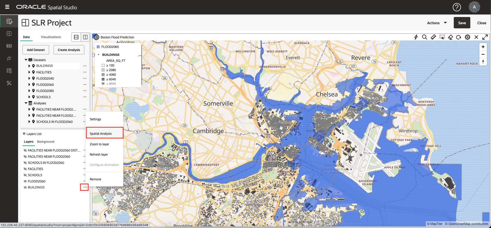

# 分析空间关系

## 简介

在此实验室中，您将执行一系列空间分析，以确定预计洪水区域与文化特征之间的关系。您无需编码即可创建分析，然后以地图和表格形式可视化结果。

估计时间：30 分钟

观看下面的视频，快速浏览实验室。

[分析空间关系](videohub:1_u0a3coe3)

### 目标

*   了解如何执行自助式空间分析，而无需编写代码。
*   了解如何根据需要访问底层空间查询代码。

### 先备条件

*   实验室 3 的完成：可视化空间数据

## 任务 1：确定预计洪水地区的学校

首先执行分析，根据预测洪水区域中的遏制来筛选学校。

1.  要重点关注学校和预计的洪水区域，请关闭设施和建筑的可见性。然后，从 FLOOD2060 的操作菜单中，选择**缩放到层**。
    
    
    
2.  从“学校”的操作菜单中，选择**空间分析**。这将打开用于访问 Oracle Database 的空间分析功能的对话框。
    
    
    
3.  您将根据预测洪水区域中的遏制对学校应用空间过滤器。因此，选择**筛选器**的选项卡，然后单击**返回其他形状**的磁贴。
    
    
    
4.  对于“分析”名称，输入 **SCHOOLS IN FLOOD2060** 。对于要过滤的层，请选择 **SCHOOLS LON&LAT** ，对于要用作过滤器的层，请选择 **FLOOD2060。GEOM** 。然后单击**运行**。
    
    
    
5.  观察分析下列出的分析。单击并按住分析，然后拖放到地图上。如您之前所做的那样，更改层的样式：打开 **SCHOOLS IN FLOOD2060** 的操作菜单，选择 **Settings（设置）**，然后将颜色更改为用白色笔划（大纲）填充的红色。
    
    
    
    **注：**您可以将鼠标悬停在被截断的层、数据集或分析名称上，以便在工具提示中查看其全名。
    
6.  要以表格形式查看空间分析的结果，请单击**可视化**选项卡，然后拖放映射旁边的表。可以将表放置在地图的任何边缘。
    
    
    
7.  单击**数据**选项卡，然后单击并按住分析，然后拖放到表视图中。
    
    
    
8.  分析背后的技术细节可用。从分析的操作菜单中，选择“属性”。
    
    
    
9.  在“Properties（属性）”对话框中，观察显示分析 SQL 的部分。特别是，请注意执行空间过滤器的 SDO\_INSIDE 运算符。SQL 比最通用的示例稍微多一些，因为它涉及学校的基于函数的空间索引，而不是几何列，并且还使用外部 SELECT 包装主查询，以便在学校位于多个区域内时消除重复的学校。
    
    另请注意，以 GeoJSON 格式流式传输分析的自动生成的端点，供任何基于标准的映射客户机使用。
    
    完成后，单击**取消**，然后单击 **X** 以关闭表视图。
    
    
    
10.  在 Spatial Studio 中，分析本身就是数据集。在主导航面板中，单击 **Datasets（数据集）**页的按钮。观察您的分析是否已列出，以便将其用于其他项目、导出或另存为表或视图。
    

## 任务 2：确定预计洪水区附近的设施

接下来，您将确定预计洪水区域附近的设施。这是一个空间滤波器操作，其中设施根据距离预计洪水区域的距离进行过滤。这称为“在距离内”操作。

1.  在主导航面板中，单击该按钮以返回到**活动项目**。调整层可见性，以便可以看到预计的洪水和设施。从“设施”的操作菜单中，选择**空间分析**。
    
    
    
2.  单击**筛选**分析的选项卡，然后单击**在另一个指定距离内返回形状**的磁贴。
    
    
    
3.  在分析对话框中，为分析名称输入 **FACILITIES NEAR FLOOD2060** ，为要筛选的层选择 **FACILITIES LONGITUDE&LATITUDE** ，为要用作筛选器的层输入 **FLOOD2060。GEOM** 。  
    为距离输入 **10** ，然后选择 **Kilometer** 作为单位。然后单击**运行**。
    
    
    
4.  在将分析结果添加到地图之前，更改原始未筛选的“设施”层的样式，以便分析结果清晰可见。正如您之前所做的那样，从设施的操作菜单中选择**设置**。然后将半径更改为 6，将颜色更改为黑色，将不透明度更改为最大值。
    
    
    
5.  将 **FACILITIES NEAR FLOOD2060** 分析拖放到地图上。
    
    然后从其操作菜单中选择设置，然后将其大小更新为 3，颜色更新为黄色，不透明度更新为最大值，笔划（轮廓）更新为黑色。结果在未过滤的设施层上清晰可见，
    
    
    
6.  Spatial Studio 允许您修改分析的参数。从 **FACILITIES NEAR FLOOD2060** 的操作菜单中，选择**修改参数**。
    
    
    
7.  将距离更新为 3，然后单击**运行**。
    
    
    
8.  使用更新的分析结果观察映射刷新。
    
    
    
9.  接下来，您将确定分析结果中每个设施到预计洪水区域的距离。从 **FACILITIES NEAR FLOOD2060** 的操作菜单中选择**空间分析**。
    
    
    
10.  选择**度量**分析的选项卡。然后单击**计算形状之间的最小距离**的磁贴。
    

11.  对于分析名称，输入 **FACILITIES NEAR FLOOD2060 DISTANCE** ；对于结果的列名称，输入 **DISTANCE\_KM** ；对于几何体 1，选择 **FACILITIES NEAR FLOOD2060。LATITUDE\_LONGITUDE\_GEOMETRY** ，对于 Geometry 2，选择 **FLOOD2060。GEOM** ，将“单位”更改为**公里**。然后单击**运行**。

12.  对于名称被截断的项，悬停可查看显示全名的工具提示。

要重点关注分析结果，请关闭除 FLOOD2060 以外的所有层的可见性。

13.  将 **FACILITIES NEAR FLOOD2060 DISTANCE** 分析拖放到地图上，然后转到其设置。设置您选择的样式。从配置下拉列表中选择**交互**。向下滚动到“信息窗口”部分。启用信息窗口并选择要显示的列，包括名为 DISTANCE\_KM 的分析结果列。然后，在地图中，单击设施以查看货品的信息。

## 任务 3：确定与预计洪水区接触的建筑物

接下来，您将确定与预计洪水区域有任何空间交互的建筑物。这包括该区域包含的建筑物、区域重叠或触摸边界。

1.  在“图层”列表中，打开“单元楼”层的可见性。虽然缩小，你只会看到建筑物的一部分，因为有太多的显示在一个如此小的规模。从“单元楼”的操作菜单中，选择**空间分析**。
    
    
    
2.  您将确定与预计洪水区域进行任何接触的建筑物。因此，选择**筛选**分析的选项卡，然后选择**返回与另一个空间交互的任何空间形状**的磁贴。
    
    
    
3.  对于名称，输入 **BUILDINGS FLOOD CONTACT** ；对于要过滤的层，选择 **BUILDINGS.GEOM** ；对于要用作过滤器的层，选择 **FLOOD2060。GEOM** 。然后单击**运行**。
    
    
    
4.  将新分析拖放到地图上。然后，对于新的地图层，转到“设置”以更新样式。在“填充”部分中，将不透明度滑块拖动到 0，因此不显示填充。在“Outline（大纲）”部分中，将颜色更改为红色、将不透明度更改为最大值，将宽度更改为 2。这将有效地突出与预计洪水区接触的建筑物。
    
    
    
5.  放大到您选择的区域，以查看与红色列出的洪水区域接触的建筑物。您也可以尝试添加结果的表列表。
    
    
    
    （可选）为分析结果启用工具提示、信息窗口或表视图。
    

现在，您可以**进入下一个练习**。

## 了解详细信息

*   [Oracle Spatial 产品页面](https://www.oracle.com/database/spatial)
*   [Spatial Studio 入门](https://www.oracle.com/database/technologies/spatial-studio/get-started.html)
*   [Spatial Studio 文档](https://docs.oracle.com/en/database/oracle/spatial-studio)

## 确认

*   **作者** - David Lapp，Oracle 数据库产品管理
*   **贡献者** - Denise Myrick、Jayant Sharma
*   **上次更新者/日期** - David Lapp，2023 年 8 月