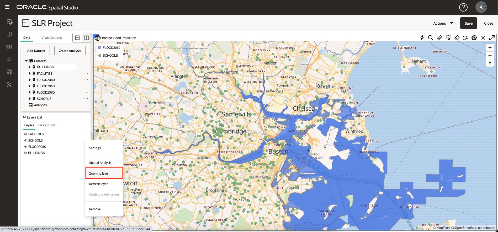
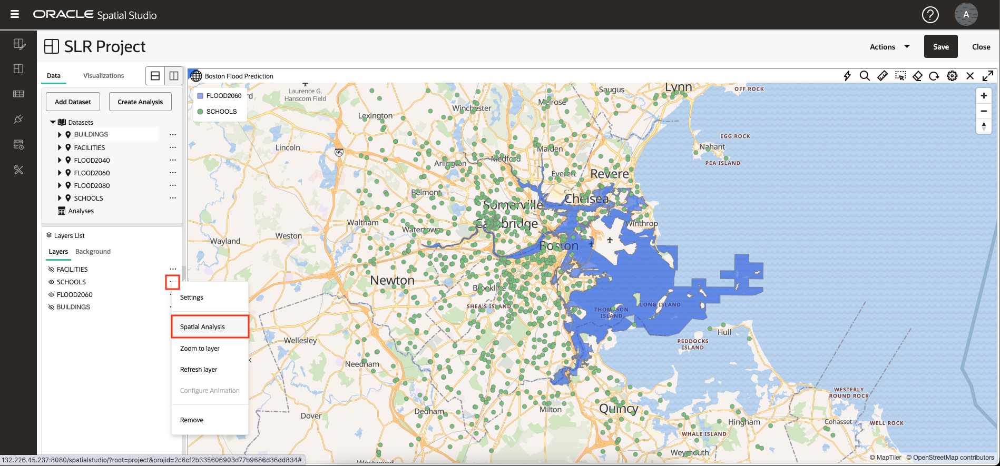

# 分析空間關係

## 簡介

在這個實驗室中，您將執行一系列的空間分析，找出預計的洪水區域和文化特色之間的關係。您無須編寫程式碼即可建立分析，然後在地圖和列表化表單中將結果視覺化。

預估時間：30 分鐘

請觀看下方影片，快速瞭解實驗室的逐步解說。

[分析空間關係](videohub:1_u0a3coe3)

### 目標

*   瞭解如何執行自助服務空間分析，無須撰寫程式碼。
*   瞭解如何視需要存取基礎空間查詢程式碼。

### 先決條件

*   實驗室 3：視覺化空間資料

## 工作一：識別預計洪水區內的學校

首先，您可以執行分析，根據預測洪水區中的內容來篩選學校。

1.  為關注學校和預計洪水區，FACILITIES 和 BUILDINGS 關閉可見度。然後從 FLOOD2060 的動作功能表中選取**縮放至圖層**。
    
    
    
2.  從 SCHOOLS 的動作功能表中，選取**空間分析**。這會開啟對話方塊以存取 Oracle Database 的空間分析功能。
    
    
    
3.  您將根據預計洪水區的容器，對學校套用空間過濾器。因此，請選取**篩選**的頁籤，然後按一下磚塊來**傳回另一個形狀**。
    
    
    
4.  若為「分析」名稱，請輸入 **SCHOOLS IN FLOOD2060** 。若要篩選「圖層」，請選取 **SCHOOLS LON&LAT** ，若要讓「圖層」作為篩選，請選取 **FLOOD2060。GEOM** 。然後按一下**執行 (Run)** 。
    
    
    
5.  觀察「分析」下所列的分析。按一下並按住分析，然後拖放至地圖。先前完成時，請變更層的樣式：開啟 **SCHOOLS IN FLOOD2060** 的動作功能表，選取**設定值**，然後將顏色變更為以白色筆畫 (大綱) 填滿。
    
    
    
    **注意：**您可以將游標停留在截斷的「圖層」、「資料集」或「分析」名稱上，在工具提示中查看其全名。
    
6.  若要以表格形式檢視空間分析的結果，請按一下**視覺化**頁籤，然後拖放地圖旁的表格。您可以在地圖的任何邊緣放置表格。
    
    
    
7.  按一下**資料**頁籤，然後按一下並保留分析，然後拖放至表格檢視。
    
    
    
8.  提供分析背後的技術詳細資訊。從分析的動作功能表中，選取「屬性」。
    
    
    
9.  在「屬性」對話方塊中，觀察顯示分析 SQL 的區段。特別是請注意執行空間篩選的 SDO\_INSIDE 運算子。此 SQL 比最一般的範例稍有不同，因為它涉及學校的功能型空間索引而不是幾何欄，而且在學校位於多個區域時，也包裝了外部 SELECT 的主要查詢，以去除重複的學校。
    
    並請注意，串流分析結果的自動產生端點，會以 GeoJSON 格式供任何標準對應從屬端使用。
    
    完成後，請按一下**取消**，然後按一下 **X** 以關閉表格檢視。
    
    
    
10.  在 Spatial Studio 中，分析本身就是「資料集」。在主要導覽面板中，按一下**資料集**頁面的按鈕。列出您的分析，使其可用於其他專案、匯出或儲存為表格或檢視。
    

## 任務 2：識別預計洪水區附近的設施

接下來，您可以識別預計洪水區附近的設施。這是空間篩選作業，其中設施是根據預計洪水區的鄰近程度進行篩選。這稱為「距離內」作業。

1.  在主要導覽面板中，按一下按鈕返回您的**作用中專案**。調整圖層可見度，以顯示預計的洪水區域和設施。從 FACILITIES 的動作功能表中，選取**空間分析**。
    
    
    
2.  按一下**篩選**分析的頁籤，然後按一下**在指定距離內傳回形狀**的磚塊。
    
    
    
3.  在分析對話方塊中，針對要篩選的圖層，輸入 **FACILITIES NEAR FLOOD2060** ，選取 **FACILITIES LONGITUDE&LATITUDE** ，針對要作為篩選的圖層輸入 **FLOOD2060。GEOM** 。  
    輸入 **10** 代表距離，並選取 **Kilometer** 作為單位。然後按一下**執行 (Run)** 。
    
    
    
4.  將分析結果新增至對應之前，請變更原始未篩選「設施」層的樣式，以便清楚顯示分析結果。先前完成之後，請從「設備」的動作功能表中選取**設定**。然後將半徑變更為 6，將顏色變更為黑色，並將不透明度變更為最大。
    
    
    
5.  將您的 **FACILITIES NEAR FLOOD2060** 分析拖放至地圖上。
    
    接著，從其動作功能表選取「設定」，然後將其大小更新為 3、顏色為黃色、不透明度為最大值，以及將筆觸 (大綱) 更新為黑色。結果在未經篩選的 FACILITIES 層上清楚可見，
    
    
    
6.  Spatial Studio 可讓您修改分析的參數。從 **FACILITIES NEAR FLOOD2060** 的動作功能表中，選取**修改參數**。
    
    
    
7.  將距離更新為 3，然後按一下**執行**。
    
    
    
8.  使用更新的分析結果觀察地圖重新整理。
    
    
    
9.  接下來，您將決定分析結果中每個場所與預計洪水區之間的距離。從 **FACILITIES NEAR FLOOD2060** 的動作功能表中，選取**空間分析**。
    
    
    
10.  選取**評量**分析的頁標。然後按一下**計算形狀之間的最小距離**磚塊。
    

11.  若為分析名稱，請輸入 **FACILITIES NEAR FLOOD2060 DISTANCE** ，若為結果的資料欄名稱，請輸入 **DISTANCE\_KM** ，若為幾何 1，請選取 **FACILITIES NEAR FLOOD2060。LATITUDE\_LONGITUDE\_GEOMETRY** ，對於幾何 2，請選取 **FLOOD2060。GEOM** ，將「單位」變更為 **Kilometer** 。然後按一下**執行 (Run)** 。

12.  若項目的名稱被截斷，請將游標暫留以查看顯示完整名稱的工具提示。

若要聚焦於分析結果，請關閉 FLOOD2060 以外的所有圖層可見度。

13.  將 **FACILITIES NEAR FLOOD2060 DISTANCE** 分析拖放至地圖，然後執行其「設定值」。設定選擇樣式。從組態下拉式清單中選取**互動**。向下捲動至「資訊視窗」區段。啟用資訊視窗並選取要顯示的資料欄，包括名稱為 DISTANCE\_KM 的分析結果資料欄。然後，在地圖上按一下場所以檢視項目的資訊。

## 任務 3：識別與預計洪水區相關的建築物

您下一步會識別與預計洪水區間互動的建築物。這包括區域中包含的建築物、區域重疊或觸碰邊界。

1.  在圖層清單中，開啟 BUILDINGS 圖層可見度。縮小時，您只會看到部分建築物，因為太多無法以此類小比例顯示。從 BUILDINGS 的動作功能表中，選取**空間分析**。
    
    
    
2.  你會發現任何與預計洪水區接觸的建築物。因此，選取**篩選**分析的頁標，然後選取**傳回具有任何其他空間互動的形狀**磚塊。
    
    
    
3.  若為名稱，請輸入 **BUILDINGS FLOOD CONTACT** ，若為要篩選的圖層，請選取 **BUILDINGS.GEOM** ，若為要作為篩選的圖層，請選取 **FLOOD2060。GEOM** 。然後按一下**執行 (Run)** 。
    
    
    
4.  將您的新分析拖放至地圖。然後，新地圖圖層會移至「設定」以更新樣式。在「填滿」區段中，將不透明度滑動鈕拖曳至 0，因此不會顯示任何填滿。在「大綱」區段中，將顏色變更為紅色、不透明度至最大，以及寬度變更為 2。這將有效地強調與預計洪水區相關的建築物。
    
    
    
5.  縮放至您選擇的區域，以查看與紅色的洪水區相關的建築物。您也可嘗試新增結果的表格清單。
    
    
    
    選擇性地啟用分析結果的工具提示、資訊視窗或表格檢視。
    

您現在可以**進入下一個實驗室**。

## 進一步瞭解

*   [Oracle Spatial 產品頁面](https://www.oracle.com/database/spatial)
*   [開始使用 Spatial Studio](https://www.oracle.com/database/technologies/spatial-studio/get-started.html)
*   [Spatial Studio 文件](https://docs.oracle.com/en/database/oracle/spatial-studio)

## 確認

*   **作者** - Oracle 資料庫產品管理 David Lapp
*   **貢獻者** - Denise Myrick，Jayant Sharma
*   **上次更新者 / 日期** - David Lapp，2023 年 8 月