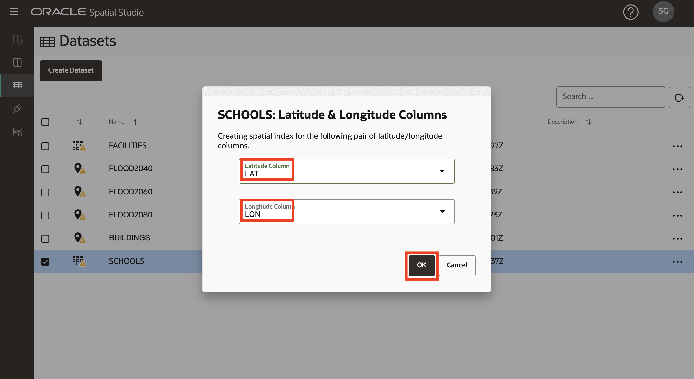
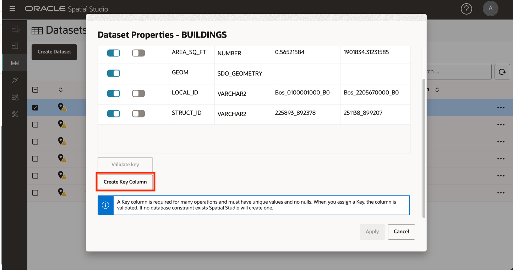
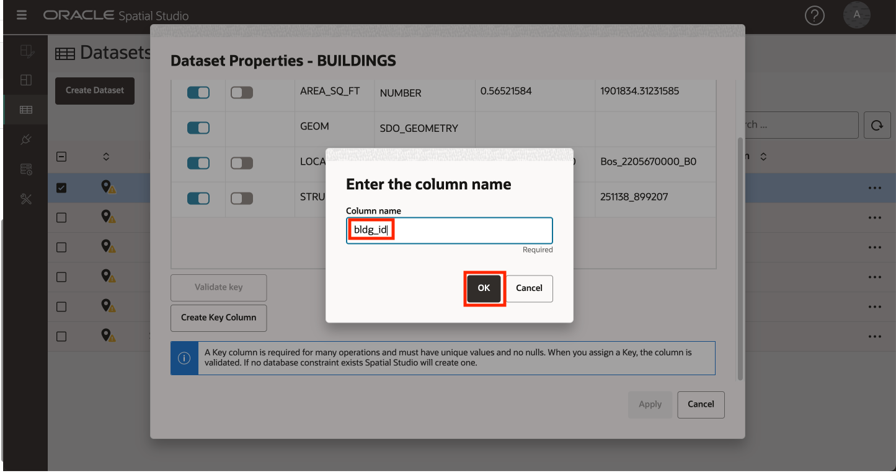

# Daten laden und vorbereiten

## Einführung

Spatial Studio arbeitet mit Daten, die in Oracle-Datenbanken gespeichert sind. In Spatial Studio arbeiten Sie mit "Datasets", d.h. Datenbanktabellen und Views, auf die über Datenbankverbindungen zugegriffen wird. Datasets sind Zeiger auf Datenbanktabellen und Views und können benutzerfreundliche Namen erhalten, die selbstbeschreibender sind als der Name der zugrunde liegenden Datenbanktabelle oder View.

Benutzer müssen häufig Daten aus verschiedenen Quellen einbeziehen. Um dies zu unterstützen, bietet Spatial Studio Funktionen zum Laden von Daten aus Standardformaten in Oracle Database. Dazu gehört das Laden der 2 gängigsten Formate für den Austausch räumlicher Daten: Shapefiles und GeoJSON-Dateien. Zusätzlich zum Laden räumlicher Formate unterstützt Spatial Studio das Laden von Tabellen und CSV-Dateien. In diesem Fall ist eine zusätzliche Vorbereitung erforderlich, um Geometrien aus räumlichen Attributen wie Adressen ("Adressgeocoding") und Breiten-/Längengradkoordinaten ("Koordinatenindexierung") abzuleiten. In dieser Übung werden die Schritte zum Laden und Vorbereiten von Daten in diesen Formaten mit Spatial Studio beschrieben.

**Bitte beachten Sie die folgenden wichtigen Informationen über die in diesem Workshop verwendeten öffentlichen Daten:**

In dieser Übung laden Sie eine einzelne ZIP-Datei herunter, die Folgendes enthält:

*   **Prognostizierte Überschwemmungsregionen** wurden von öffentlichen Daten vereinfacht, die unter [https://data.boston.gov/group/geospatial?q=sea+level+rise+flood](https://data.boston.gov/group/geospatial?q=sea+level+rise+flood) veröffentlicht wurden. Da sie von ihrer veröffentlichten Form vereinfacht wurden, sollen sie nicht die genauen Ausdehnungen der veröffentlichten Modelle darstellen.
*   **Gebäude**, die aus öffentlichen Daten extrahiert werden, die unter [https://www.mass.gov/info-details/massgis-data-building-structures-2-d](https://www.mass.gov/info-details/massgis-data-building-structures-2-d) veröffentlicht werden.
*   **Schulen** aus OpenStreetMap mit [https://wiki.openstreetmap.org/wiki/Overpass\_turbo](https://wiki.openstreetmap.org/wiki/Overpass_turbo) abgerufen
*   **TRI-Einrichtungen** aus der US-EPA wurden mit [https://edap.EPA.gov/public/extensions/TRIToxicsTracker/TRIToxicsTracker.html](https://edap.epa.gov/public/extensions/TRIToxicsTracker/TRIToxicsTracker.html) abgerufen. Das Toxics Release Inventory (TRI) ist eine Ressource für das Erlernen von toxischen chemischen Freisetzungen und Aktivitäten zur Vermeidung von Umweltverschmutzung, die von Industrie- und Bundeseinrichtungen gemeldet werden.

Geschätzte Laborzeit: 10 Minuten

Sehen Sie sich das Video unten an, um einen schnellen Durchgang des Labors zu erhalten.

[Daten laden und vorbereiten](videohub:1_h1cmu08i)

### Ziele

*   Erfahren Sie, wie Sie räumliche Daten laden und vorbereiten

### Voraussetzungen

*   Abschließende Übung 1: Spatial Studio in Oracle Cloud bereitstellen
*   Es ist keine vorherige Erfahrung mit Oracle Spatial erforderlich.

## Aufgabe 1: Daten laden

Sie beginnen damit, projizierte Hochwasserregionen, Pakete, Schulen und Einrichtungen aus gängigen Formaten zu laden.

1.  Laden Sie die ZIP-Datei mit den Daten an einen geeigneten Speicherort herunter: [SpatialStudioSlrData.zip](https://objectstorage.us-ashburn-1.oraclecloud.com/p/jyHA4nclWcTaekNIdpKPq3u2gsLb00v_1mmRKDIuOEsp--D6GJWS_tMrqGmb85R2/n/c4u04/b/livelabsfiles/o/labfiles/SpatialStudioSlrData.zip). Die ZIP-Datei enthält Folgendes:
    
    
    
2.  Navigieren Sie in Spatial Studio im linken Fensterbereichmenü zur Seite "Datasets", klicken Sie auf **Dataset erstellen**, und wählen Sie **Aus Dateiupload** aus. Klicken Sie auf den Uploadbereich, navigieren Sie zum Downloadspeicherort, und wählen Sie die ZIP-Datei aus. Sie können die Datei auch per Drag-and-Drop in den Uploadbereich verschieben. Klicken Sie dann auf **Erstellen**.
    
    
    
3.  Eine Vorschau der 1. hochgeladenen Datei wird angezeigt. Wählen Sie die Zielverbindung für diesen Upload aus. Wählen Sie die Verbindung **SPATIAL\_STUDIO** (das Spatial Studio-Metadaten-Repository). In einem Produktionsszenario hätten Sie andere Verbindungen für solche Geschäftsdaten, getrennt vom Metadaten-Repository. Klicken Sie auf **Weiterleiten**, um den 1. Upload zu starten.
    
    
    
4.  Wiederholen Sie den Vorgang für alle Datasets.
    
5.  Nach Abschluss werden die Datasets mit einem kleinen Warnsymbol aufgelistet, um anzuzeigen, dass 1 oder mehr Vorbereitungsschritte erforderlich sind. Diese Schritte führen Sie in der nächsten Aufgabe aus.
    
    
    

## Aufgabe 2: Daten vorbereiten

Die Datenvorbereitung umfasst Vorgänge, mit denen Datasets für räumliche Analysen und Kartenvisualisierungen verwendet werden können. Beispiele: Adressgeocoding, Koordinatenindexierung und Identifizierung eindeutiger Schlüsselspalten. In dieser Aufgabe führen Sie die Koordinatenindexierung durch und legen Dataset-Schlüssel fest.

1.  Die Datasets werden mit einem kleinen Warnsymbol aufgelistet, um anzuzeigen, dass 1 oder mehr Vorbereitungsschritte erforderlich sind. Klicken Sie zunächst auf das Warnungsbadge für **SCHOOLS**. Dieses Dataset wurde aus einem nicht räumlichen Format (CSV) geladen und muss für die Mappingvisualisierung vorbereitet werden. Das Dataset enthält Breiten-/Längengradspalten. Wählen Sie also **Breiten-/Längengradindex erstellen** aus, und klicken Sie auf **OK**.
    
    
    
2.  Füllen Sie die Spalten für Breiten- und Längengrad für die Indexierung auf, und klicken Sie auf **OK**.
    
    
    
3.  Wiederholen Sie den Vorgang für **Einrichtungen**, indem Sie auf das Warnungsbadge klicken und **Breiten-/Längenindex erstellen** auswählen. Beachten Sie, dass die Symbole SCHULEN und EINRICHTUNGEN von einer Tabelle in einen Pin geändert wurden, der angibt, dass die Datensätze für die Kartenvisualisierung verwendet werden können.
    
4.  Die verbleibenden Warnausweise weisen darauf hin, dass Schlüssel für Ihre Datasets definiert werden müssen. Auch wenn dies für das grundlegende Mapping nicht erforderlich ist, fügen Sie Schlüssel hinzu, da sie für Analysen erforderlich sind, die Sie später im Workshop ausführen. Klicken Sie auf das Warnsymbol für **BUILDINGS**. Klicken Sie auf den Link **Gehe zu Datensetspalten**.
    
    
    
    Klicken Sie auf die Schaltfläche **Schlüsselspalte erstellen**.  
    
    
    Benennen Sie die Schlüsselspalte **bldg\_id**, und klicken Sie auf **OK**.  
    
    
    Klicken Sie schließlich auf **Apply**. 
    
5.  Klicken Sie auf das Warnsymbol für **Einrichtungen**, und klicken Sie auf den Link **Zu Datensetspalten gehen**.
    
    
    
6.  Wählen Sie **FACILITY\_ID** als Schlüssel aus, klicken Sie auf **Schlüssel validieren**, **Anwenden**.
    
    
    
7.  Wiederholen Sie diesen Vorgang, um Schlüssel für die anderen Datasets mit den folgenden Spalten hinzuzufügen:
    
    | Datenset | Als Schlüssel zu verwendende Spalte |
    | --- | --- |
    | FLOOD2040 | FID |
    | FLOOD2060 | FID |
    | FLOOD2080 | FID |
    | BILDUNGSEINRICHTUNGEN | OGR\_FID |
    
8.  Beachten Sie, dass alle Ihre Datasets vollständig für die Mapping- und räumliche Analyse vorbereitet sind.
    
    
    

Sie können jetzt **mit der nächsten Übung fortfahren**.

## Weitere Informationen

*   [Oracle Spatial-Produktseite](https://www.oracle.com/database/spatial)
*   [Erste Schritte mit Spatial Studio](https://www.oracle.com/database/technologies/spatial-studio/get-started.html)
*   [Dokumentation zu Spatial Studio](https://docs.oracle.com/en/database/oracle/spatial-studio)

## Danksagungen

*   **Autor** - David Lapp, Database Product Management, Oracle
*   **Mitwirkende** - Jayant Sharma, Denise Myrick
*   **Zuletzt aktualisiert am/um** - David Lapp, August 2023