# Cargar y preparar datos

## Introducción

Spatial Studio funciona en datos almacenados en bases de datos Oracle. En Spatial Studio se trabaja con "Conjuntos de datos", que son tablas y vistas de base de datos a las que se accede a través de conexiones de base de datos. Los juegos de datos son punteros a tablas y vistas de base de datos y se les pueden asignar nombres fáciles de recordar para que sean más autodescriptivos que el nombre de vista o tabla de base de datos subyacente.

Los usuarios a menudo necesitan incorporar datos adquiridos de varias fuentes. Para ello, Spatial Studio proporciona funciones para cargar datos de formatos estándar en Oracle Database. Esto incluye la carga de los 2 formatos más comunes para el intercambio de datos espaciales: archivos de forma y archivos GeoJSON. Además de cargar formatos espaciales, Spatial Studio admite la carga de hojas de cálculo y archivos csv. En ese caso, se necesita una preparación adicional para derivar geometrías de atributos espaciales como direcciones ("geocodificación de dirección") y coordenadas de latitud/longitud ("índice de coordenadas"). Este laboratorio le guiará por los pasos para cargar y preparar datos en estos formatos mediante Spatial Studio.

**Tenga en cuenta la siguiente información importante sobre los datos públicos utilizados en este taller:**

En este laboratorio, descargará un único archivo zip que contiene lo siguiente:

*   Las **regiones de inundación previstas** se han simplificado a partir de los datos públicos publicados en [https://data.boston.gov/group/geospatial?q=sea+level+rise+flood](https://data.boston.gov/group/geospatial?q=sea+level+rise+flood). Dado que se han simplificado a partir de su forma publicada, no están destinados a representar las extensiones precisas de los modelos publicados.
*   **Edificios** extraídos de datos públicos publicados en [https://www.mass.gov/info-details/massgis-data-building-structures-2-d](https://www.mass.gov/info-details/massgis-data-building-structures-2-d).
*   **Escuelas** de OpenStreetMap recuperadas mediante [https://wiki.openstreetmap.org/wiki/Overpass\_turbo](https://wiki.openstreetmap.org/wiki/Overpass_turbo)
*   **Instalaciones de TRI** de la EPA de EE. UU. recuperadas mediante [https://edap.epa.gov/public/extensions/TRIToxicsTracker/TRIToxicsTracker.html](https://edap.epa.gov/public/extensions/TRIToxicsTracker/TRIToxicsTracker.html). El inventario de liberación de tóxicos (TRI) es un recurso para aprender sobre las liberaciones de sustancias químicas tóxicas y las actividades de prevención de la contaminación informadas por instalaciones industriales y federales.

Tiempo de laboratorio estimado: 10 minutos

Vea el siguiente vídeo para una breve introducción al laboratorio.

[Cargar y preparar datos](videohub:1_h1cmu08i)

### Objetivos

*   Aprender a cargar y preparar datos espaciales

### Requisitos

*   Laboratorio completo 1: Despliegue de Spatial Studio en Oracle Cloud
*   No se requiere experiencia previa con Oracle Spatial.

## Tarea 1: Cargar datos

Comienza cargando regiones proyectadas de inundación, parcelas, escuelas e instalaciones desde formatos comunes.

1.  Descargue el archivo zip que contiene los datos en una ubicación conveniente: [SpatialStudioSlrData.zip](https://objectstorage.us-ashburn-1.oraclecloud.com/p/jyHA4nclWcTaekNIdpKPq3u2gsLb00v_1mmRKDIuOEsp--D6GJWS_tMrqGmb85R2/n/c4u04/b/livelabsfiles/o/labfiles/SpatialStudioSlrData.zip). El archivo zip contiene lo siguiente:
    
    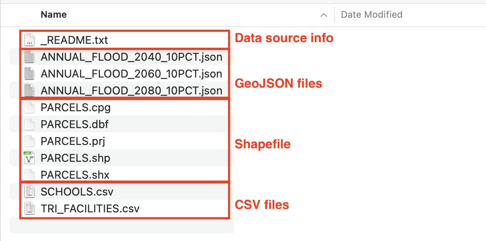
    
2.  En Spatial Studio, en el menú del panel izquierdo, navegue hasta la página Juegos de datos, haga clic en **Crear juego de datos** y seleccione **De carga de archivo**. Haga clic en la región de carga, navegue hasta la ubicación de descarga y seleccione el archivo zip. También puede arrastrar y soltar el archivo en la región de carga. A continuación, haga clic en **Crear**.
    
    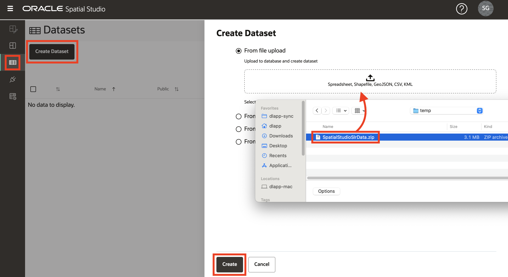
    
3.  Se mostrará una vista previa del 1er archivo cargado. Seleccione la conexión de destino para esta carga. Seleccione la conexión **SPATIAL\_STUDIO** (repositorio de metadatos de Spatial Studio). En un escenario de producción tendría otras conexiones para dichos datos de negocio, separadas del repositorio de metadatos. Haga clic en **Enviar** para iniciar la 1a carga.
    
    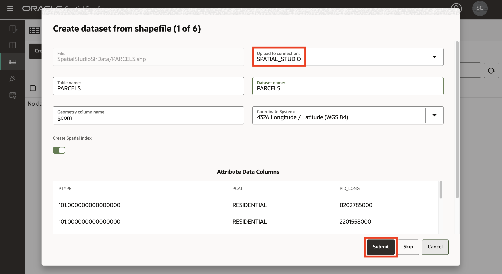
    
4.  Repita el proceso para todos los juegos de datos.
    
5.  Una vez completados, los conjuntos de datos se muestran con un pequeño ícono de advertencia para indicar que se necesitan 1 o más pasos de preparación. Estos pasos se realizarán en la siguiente tarea.
    
    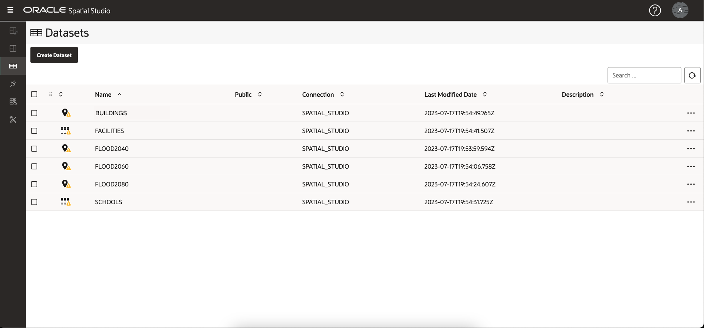
    

## Tarea 2: Preparación de datos

La preparación de datos incluye operaciones que permiten utilizar conjuntos de datos para el análisis espacial y la visualización de mapas. Entre los ejemplos se incluyen la geocodificación de direcciones, la indexación de coordenadas y la identificación de columnas de clave única. En esta tarea, realiza la indexación de coordenadas y define las claves del juego de datos.

1.  Los conjuntos de datos se muestran con un pequeño ícono de advertencia para indicar que se necesitan 1 o más pasos de preparación. Comience haciendo clic en la insignia de advertencia para **SCHOOLS**. Este conjunto de datos se cargó desde un formato no espacial (csv) y requiere preparación para la visualización de mapas. El juego de datos incluye columnas de latitud/longitud, así que seleccione **Crear índice de latitud/longitud** y, a continuación, haga clic en **Aceptar**.
    
    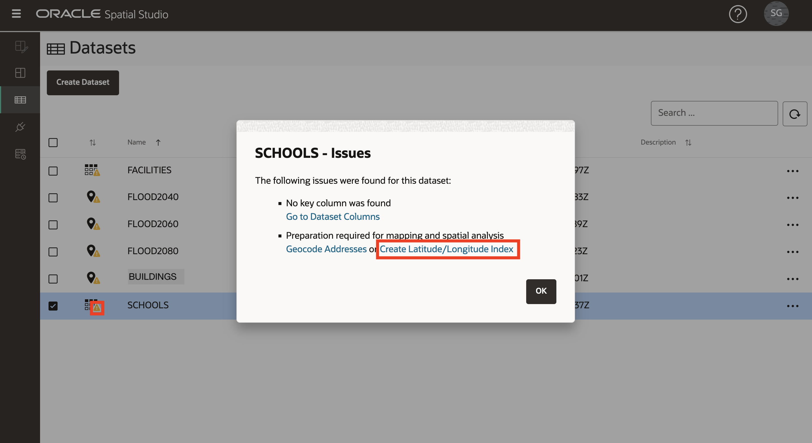
    
2.  Rellene las columnas de latitud y longitud para la indexación y haga clic en **Aceptar**.
    
    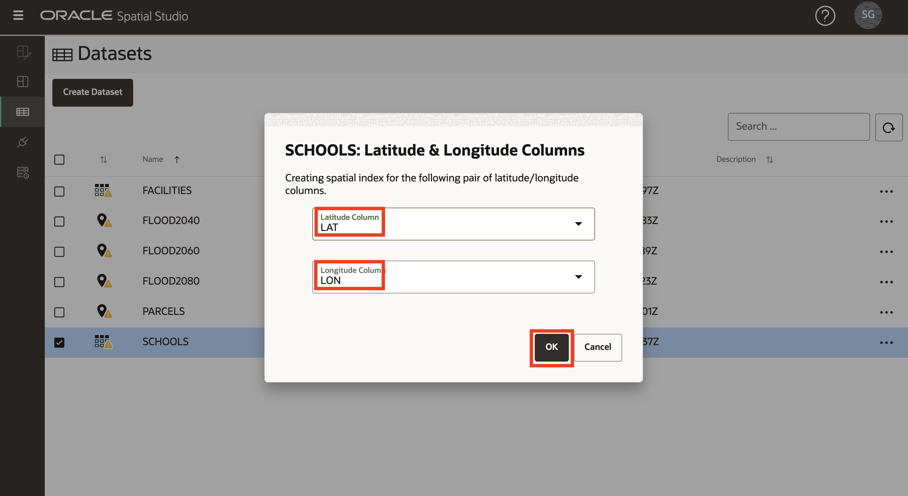
    
3.  Repita el proceso para **FACILIDADES** haciendo clic en la insignia de advertencia y seleccionando **Crear índice de latitud/longitud**. Cuando haya terminado, observe que los iconos SCHOOLS y FACILITIES han cambiado de una tabla a un pin, lo que indica que los juegos de datos se pueden utilizar para la visualización de mapas.
    
4.  Las insignias de advertencia restantes indican que se deben definir claves para los juegos de datos. Aunque no es necesario para la asignación básica, agregue claves, ya que son necesarias para los análisis que realizará más adelante en el taller. Haga clic en el icono de advertencia de **BUILDINGS**. Haga clic en el enlace **Ir a columnas de juego de datos**.
    
    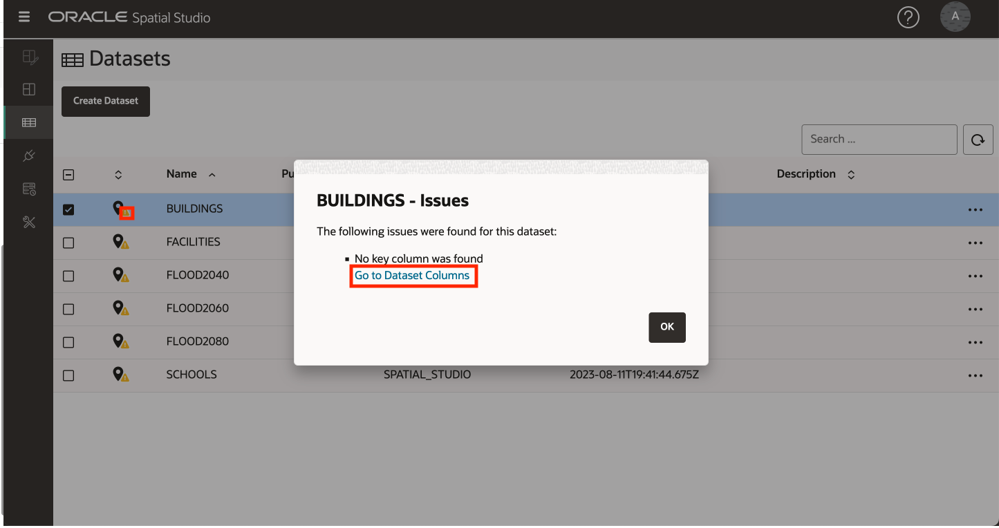
    
    Haga clic en el botón **Crear columna de clave**.  
    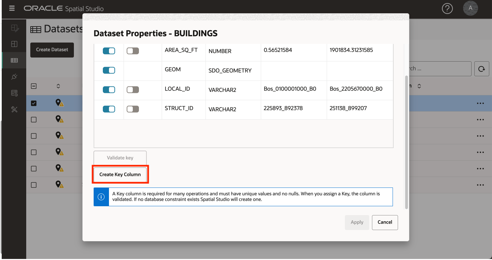
    
    Asigne un nombre a la columna de clave **bldg\_id** y haga clic en **Aceptar**.  
    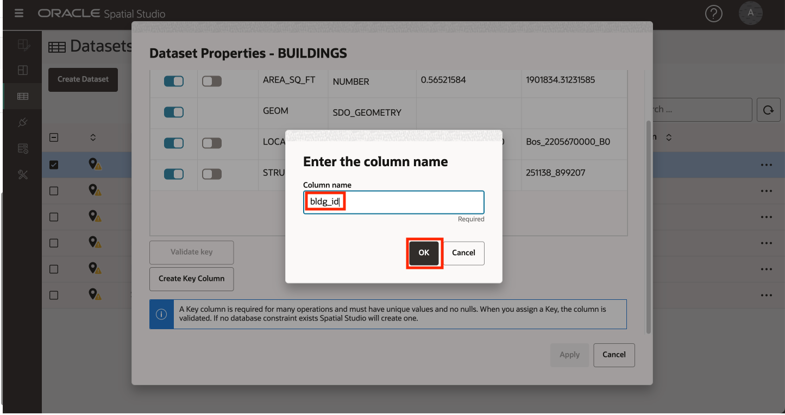
    
    Por último, haga clic en **Aplicar**. 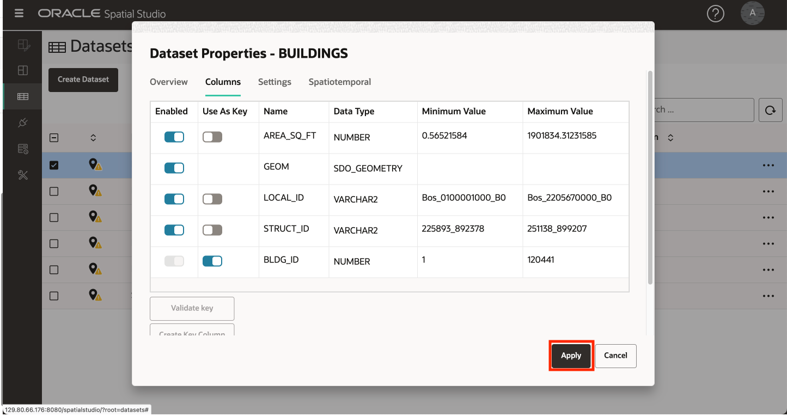
    
5.  Haga clic en el icono de advertencia de **FACILIDADES** y haga clic en el enlace **Ir a Columnas de Juego de Datos**.
    
    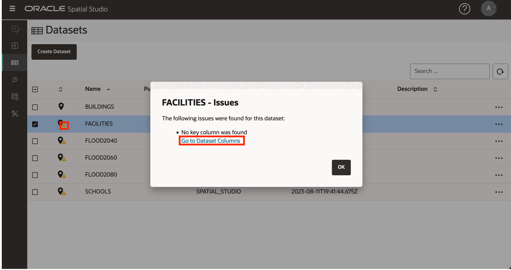
    
6.  Seleccione **FACILITY\_ID** como clave, haga clic en **Validar clave** y, a continuación, en **Aplicar**.
    
    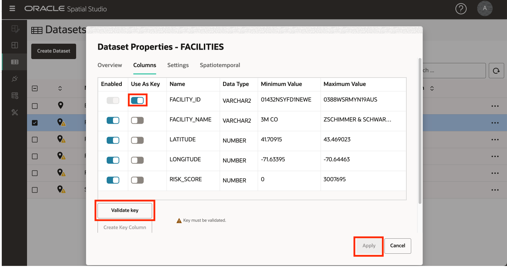
    
7.  Repita este procedimiento para agregar claves para otros juegos de datos mediante las siguientes columnas:
    
    | Juego de datos | Columna para usar como clave |
    | --- | --- |
    | FLOOD2040 | FID |
    | FLOOD2060 | FID |
    | FLOOD2080 | FID |
    | CENTROS EDUCATIVOS | OGR\_FID |
    
8.  Observe que todos sus conjuntos de datos están completamente preparados para el mapeo y el análisis espacial.
    
    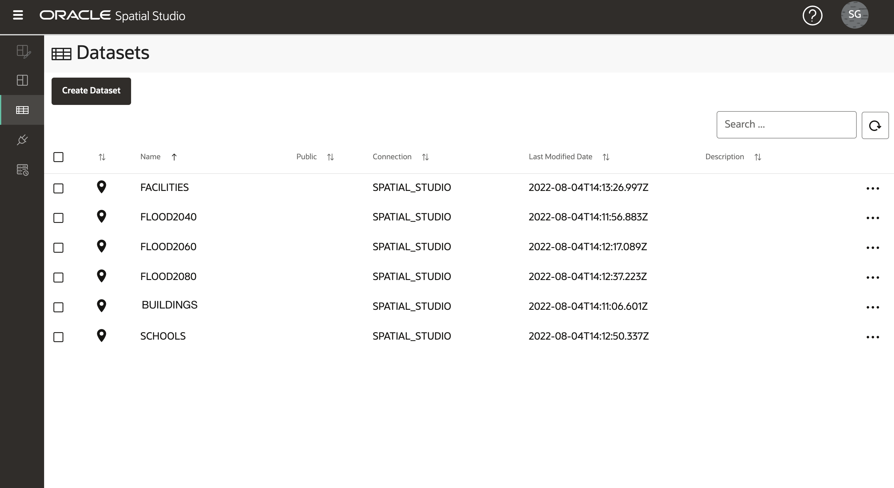
    

Ahora puede **proceder al siguiente laboratorio**.

## Más información

*   [Página del producto Oracle Spatial](https://www.oracle.com/database/spatial)
*   [Introducción a Spatial Studio](https://www.oracle.com/database/technologies/spatial-studio/get-started.html)
*   [Documentación de Spatial Studio](https://docs.oracle.com/en/database/oracle/spatial-studio)

## Reconocimientos

*   **Autor**: David Lapp, Database Product Management, Oracle
*   **Contribuyentes**: Jayant Sharma, Denise Myrick
*   **Última actualización por/fecha**: David Lapp, agosto de 2023