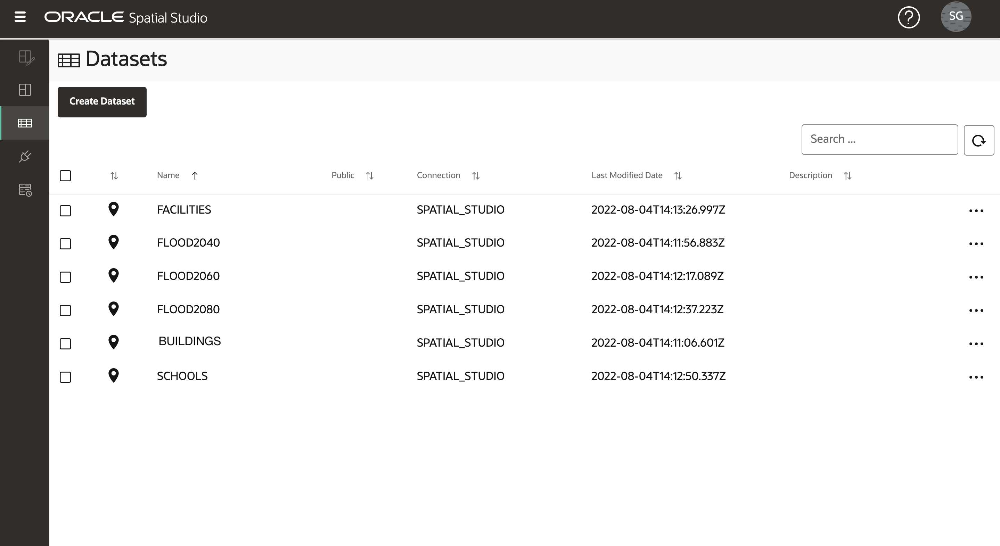

# データのロードおよび準備

## 概要

Spatial Studioは、Oracle Databasesに格納されているデータを操作します。Spatial Studioでは、データベース接続を介してアクセスされるデータベース表およびビューであるデータセットを使用します。データセットはデータベース表およびビューへのポインタであり、基礎となるデータベース表またはビュー名よりも自己記述的なわかりやすい名前を付けることができます。

多くの場合、ユーザーは様々なソースから取得したデータを組み込む必要があります。これをサポートするために、Spatial Studioには標準フォーマットからOracle Databaseにデータをロードする機能が用意されています。これには、空間データを交換するための最も一般的な2つの形式のロード(シェイプファイルおよびGeoJSONファイル)が含まれます。Spatial Studioでは、空間フォーマットのロードに加えて、スプレッドシートおよびcsvファイルのロードがサポートされています。その場合、アドレス(アドレス・ジオコーディング)や緯度/経度座標(座標索引付け)などの空間属性からジオメトリを導出するために、追加の準備が必要です。このラボでは、Spatial Studioを使用してこれらの形式でデータをロードおよび準備するステップについて説明します。

**このワークショップで使用される公開データに関する次の重要な情報に注意してください。**

この演習では、次の内容を含む単一のzipファイルをダウンロードします。

*   **予測フラッド・リージョン**は、[https://data.boston.gov/group/geospatial?q=sea+level+rise+flood](https://data.boston.gov/group/geospatial?q=sea+level+rise+flood)で公開されているパブリック・データから簡素化されています。公開済フォームから簡略化されているため、公開済モデルの正確なエクステントを表すものではありません。
*   **https://www.mass.gov/info-details/massgis-data-building-structures-2-d**で公開されているパブリック・データから抽出された[建物](https://www.mass.gov/info-details/massgis-data-building-structures-2-d)。
*   **https://wiki.openstreetmap.org/wiki/Overpass\_turbo**を使用してフェッチされたOpenStreetMapからの[学校](https://wiki.openstreetmap.org/wiki/Overpass_turbo)
*   [https://edap.EPA.gov/public/extensions/TRIToxicsTracker/TRIToxicsTracker.html](https://edap.epa.gov/public/extensions/TRIToxicsTracker/TRIToxicsTracker.html)を使用してフェッチされたUS EPAの**TRI Facilities**。Toxics Release Inventory(TRI)は、工業施設や連邦施設によって報告された毒性化学物質放出および汚染防止活動について学ぶためのリソースです。

推定ラボ時間: 10分

ラボのクイック・ウォークスルーについては、次のビデオをご覧ください。

[データのロードおよび準備](videohub:1_h1cmu08i)

### 目標

*   空間データのロードおよび準備方法を学習します

### 前提条件

*   完全なラボ1: Spatial StudioをOracle Cloudにデプロイ
*   Oracle Spatialに関する経験は必要ありません。

## タスク1: データのロード

まず、予測される洪水地域、区画、学校、施設を共通のフォーマットからロードします。

1.  データを含むzipファイルを便利な場所([SpatialStudioSlrData.zip](https://objectstorage.us-ashburn-1.oraclecloud.com/p/jyHA4nclWcTaekNIdpKPq3u2gsLb00v_1mmRKDIuOEsp--D6GJWS_tMrqGmb85R2/n/c4u04/b/livelabsfiles/o/labfiles/SpatialStudioSlrData.zip))にダウンロードします。圧縮ファイルには、次のファイルが含まれています。
    
    
    
2.  Spatial Studioで、左側のパネル・メニューから「データセット」ページに移動し、**「データセットの作成」**をクリックして**「ファイルのアップロードから」**を選択します。アップロード・リージョンをクリックし、ダウンロード場所に移動して、zipファイルを選択します。ファイルをアップロード・リージョンにドラッグ・アンド・ドロップすることもできます。次に、**「作成」**をクリックします。
    
    
    
3.  アップロードされた最初のファイルのプレビューが表示されます。このアップロードの宛先接続を選択します。**SPATIAL\_STUDIO**接続(Spatial Studioメタデータ・リポジトリ)を選択します。本番シナリオでは、メタデータ・リポジトリとは別の、このようなビジネス・データ用の他の接続があります。**「送信」**をクリックして、最初のアップロードを開始します。
    
    
    
4.  すべてのデータセットに対して繰り返します。
    
5.  完了すると、1つ以上の準備手順が必要であることを示す小さな警告アイコンとともにデータセットが一覧表示されます。これらのステップは、次のタスクで実行します。
    
    
    

## タスク2: データの準備

データ準備には、空間分析およびマップ視覚化にデータセットを使用できる操作が含まれます。たとえば、アドレスのジオコーディング、座標の索引付け、一意キー列の識別などがあります。このタスクでは、座標索引付けを実行し、データセット・キーを設定します。

1.  データセットは、1つ以上の準備手順が必要であることを示す小さな警告アイコンとともに一覧表示されます。まず、**SCHOOLS**の警告バッジをクリックします。このデータセットは非空間形式(csv)からロードされ、マッピング・ビジュアライゼーションの準備が必要です。データセットには緯度/経度列が含まれているため、**「緯度/経度索引の作成」**を選択し、**「OK」**をクリックします。
    
    
    
2.  索引付けの緯度列と経度列を移入し、**「OK」**をクリックします。
    
    
    
3.  警告バッジをクリックし、**「緯度/経度索引の作成」**を選択して、**FACILITIES**に対して繰り返します。完了したら、「SCHOOLS」アイコンと「FACILITIES」アイコンが表からピンに変わり、データセットをマップの視覚化に使用できることを確認します。
    
4.  残りの警告バッジは、データセットにキーを定義する必要があることを示しています。基本マッピングには必須ではありませんが、キーは、後でワークショップで実行する分析に必要であるため、追加します。**BUILDINGS**の警告アイコンをクリックします。**「データセット列に移動」**リンクをクリックします。
    
    
    
    **「キー列の作成」**ボタンをクリックします。  
    
    
    キー列に**bldg\_id**という名前を付け、**「OK」**をクリックします。  
    
    
    最後に、**「適用」**をクリックします。 
    
5.  **「FACILITIES」**の警告アイコンをクリックし、**「データセット列に移動」**リンクをクリックします。
    
    
    
6.  キーとして**FACILITY\_ID**を選択し、**「キーの検証」**、**「適用」**の順にクリックします。
    
    
    
7.  次の列を使用して、他のデータセットのキーを追加する手順を繰り返します。
    
    | データセット | キーとして使用する列 |
    | --- | --- |
    | FLOOD2040 | FID |
    | FLOOD2060 | FID |
    | FLOOD2080 | FID |
    | 学校 | OGR\_FID |
    
8.  すべてのデータセットがマッピングおよび空間分析用に完全に準備されていることを確認します。
    
    
    

**次の演習に進む**ことができます。

## さらに学ぶ

*   [Oracle Spatial製品ページ](https://www.oracle.com/database/spatial)
*   [Spatial Studioの開始](https://www.oracle.com/database/technologies/spatial-studio/get-started.html)
*   [Spatial Studioのドキュメント](https://docs.oracle.com/en/database/oracle/spatial-studio)

## 謝辞

*   **著者** - Oracle、データベース製品管理、David Lapp氏
*   **貢献者** - Jayant Sharma、Denise Myrick
*   **最終更新者/日付** - David Lapp、2023年8月