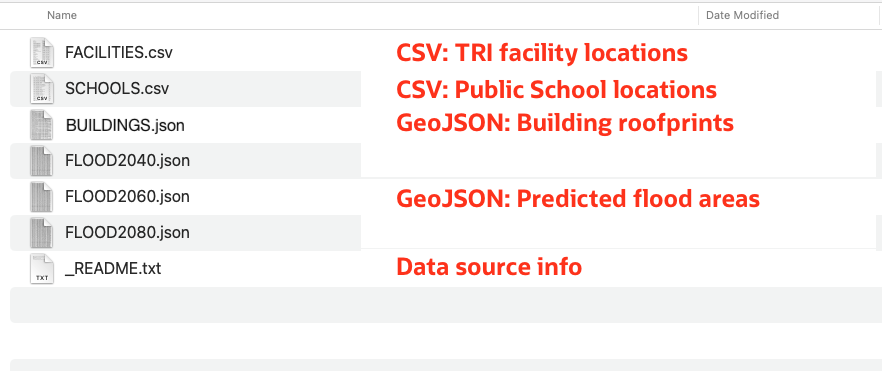

# 데이터 로드 및 준비

## 소개

Spatial Studio는 Oracle Databases에 저장된 데이터에서 작동합니다. Spatial Studio에서는 데이터베이스 연결을 통해 액세스되는 데이터베이스 테이블 및 뷰인 "데이터 집합"으로 작업합니다. 데이터 집합은 데이터베이스 테이블 및 뷰에 대한 포인터이며 기본 데이터베이스 테이블 또는 뷰 이름보다 자체 설명할 수 있도록 친숙한 이름을 지정할 수 있습니다.

사용자는 종종 다양한 소스에서 획득한 데이터를 통합해야 합니다. 이를 지원하기 위해 Spatial Studio는 표준 형식에서 Oracle Database로 데이터를 로드하는 기능을 제공합니다. 여기에는 공간 데이터 교환을 위한 가장 일반적인 두 가지 형식인 Shapefiles 및 GeoJSON 파일 로드가 포함됩니다. 공간 형식을 로드하는 것 외에도 Spatial Studio는 스프레드시트 및 csv 파일 로드를 지원합니다. 이 경우 주소("주소 지오코딩") 및 위도/경도 좌표("좌표 인덱싱")와 같은 공간 속성에서 지오메트리를 파생하려면 추가 준비가 필요합니다. 이 실습에서는 Spatial Studio를 사용하여 이러한 형식으로 데이터를 로드하고 준비하는 단계를 안내합니다.

**이 워크샵에서 사용된 공용 데이터에 대한 다음 중요 정보에 유의하십시오.**

이 실습에서는 다음이 포함된 단일 zip 파일을 다운로드합니다.

*   [https://data.boston.gov/group/geospatial?q=sea+level+rise+flood](https://data.boston.gov/group/geospatial?q=sea+level+rise+flood)에 게시된 공용 데이터에서 간소화된 **예상 홍수 지역**. 게시된 양식에서 단순화되었으므로 게시된 모델의 정확한 범위를 나타내지 않습니다.
*   **https://www.mass.gov/info-details/massgis-data-building-structures-2-d**에 게시된 공용 데이터에서 추출된 [빌딩](https://www.mass.gov/info-details/massgis-data-building-structures-2-d)
*   OpenStreetMap에서 **https://wiki.openstreetmap.org/wiki/Overpass\_turbo**를 사용하여 가져온 [학교](https://wiki.openstreetmap.org/wiki/Overpass_turbo)
*   **https://edap.EPA.gov/public/extensions/TRIToxicsTracker/TRIToxicsTracker.html**를 사용하여 미국 EPA의 [TRI Facilities](https://edap.epa.gov/public/extensions/TRIToxicsTracker/TRIToxicsTracker.html)를 인출했습니다. Toxics Release Inventory (TRI)는 산업 및 연방 시설에서보고 한 독성 화학 방출 및 오염 방지 활동에 대해 배우기위한 자원입니다.

예상 실험 시간: 10분

실습 과정을 간단히 살펴보려면 아래 비디오를 시청하십시오.

[데이터 로드 및 준비](videohub:1_h1cmu08i)

### 목표

*   공간 데이터 로드 및 준비 방법 학습

### 필요 조건

*   전체 실습 1: Oracle Cloud에 Spatial Studio 배포
*   Oracle Spatial에 대한 이전 경험은 필요하지 않습니다.

## 작업 1: 데이터 로드

일반적인 형식에서 예상 홍수 지역, 소화물, 학교 및 시설을 로드하는 것으로 시작합니다.

1.  데이터가 포함된 zip 파일을 편리한 위치([SpatialStudioSlrData.zip](https://objectstorage.us-ashburn-1.oraclecloud.com/p/jyHA4nclWcTaekNIdpKPq3u2gsLb00v_1mmRKDIuOEsp--D6GJWS_tMrqGmb85R2/n/c4u04/b/livelabsfiles/o/labfiles/SpatialStudioSlrData.zip))로 다운로드합니다. zip 파일에는 다음이 포함됩니다.
    
    
    
2.  Spatial Studio의 왼쪽 패널 메뉴에서 데이터 집합 페이지로 이동하여 **데이터 집합 생성**을 누르고 **파일 업로드에서**를 선택합니다. 업로드 영역을 누르고 다운로드 위치로 이동한 다음 zip 파일을 선택합니다. 파일을 업로드 영역으로 끌어 놓을 수도 있습니다. 그런 다음 **생성**을 누릅니다.
    
    
    
3.  업로드된 첫 번째 파일의 미리보기가 표시됩니다. 이 업로드에 대한 대상 접속을 선택합니다. **SPATIAL\_STUDIO** 접속(Spatial Studio 메타데이터 저장소)을 선택합니다. 운용 시나리오에서는 메타 데이터 저장소와는 별개로 이러한 업무 데이터에 대한 다른 연결이 있습니다. **제출**을 눌러 첫번째 업로드를 시작합니다.
    
    
    
4.  모든 데이터 세트에 대해 반복합니다.
    
5.  완료되면 하나 이상의 준비 단계가 필요함을 나타내는 작은 경고 아이콘과 함께 데이터 세트가 나열됩니다. 다음 작업에서 이러한 단계를 수행하게 됩니다.
    
    
    

## 작업 2: 데이터 준비

데이터 준비에는 공간 분석 및 맵 시각화에 데이터 세트를 사용할 수 있는 작업이 포함됩니다. 예를 들어 주소 지오코딩, 좌표 인덱스화 및 고유 키 열 식별이 있습니다. 이 작업에서는 좌표 인덱싱을 수행하고 데이터 집합 키를 설정합니다.

1.  하나 이상의 준비 단계가 필요함을 나타내는 작은 경고 아이콘과 함께 데이터 세트가 나열됩니다. 먼저 **SCHOOLS**에 대한 경고 배지를 누릅니다. 이 데이터 세트는 비공간 형식(csv)에서 로드되었으며 시각화 매핑을 위한 준비가 필요합니다. 데이터 집합에는 위도/경도 열이 포함되므로 **위도/경도 인덱스 생성**을 선택한 다음 **확인**을 누릅니다.
    
    
    
2.  인덱스화할 위도 및 경도 열을 채우고 **확인**을 누릅니다.
    
    
    
3.  경고 뱃지를 누르고 **위도/경도 인덱스 생성**을 선택하여 **시설**에 대해 반복합니다. 완료되면 SCHOOLS 및 FACILITIES 아이콘이 테이블에서 핀으로 변경되어 데이터 세트를 맵 시각화에 사용할 수 있음을 나타냅니다.
    
4.  나머지 경고 배지는 데이터 세트에 대해 키를 정의해야 함을 나타냅니다. 기본 매핑에는 필요하지 않지만 나중에 워크샵에서 수행할 분석에 키가 필요하므로 키를 추가하십시오. **BUILDINGS**에 대한 경고 아이콘을 누릅니다. **데이터 집합 열로 이동** 링크를 누릅니다.
    
    
    
    **키 열 생성** 단추를 누릅니다.  
    
    
    키 열 이름을 **bldg\_id**로 지정하고 **Ok**를 누릅니다.  
    
    
    마지막으로 **적용**을 누릅니다. 
    
5.  **FACILITIES(시설)**에 대한 경고 아이콘을 누르고 **Go to Dataset Columns(데이터 세트 열로 이동)** 링크를 누릅니다.
    
    
    
6.  **FACILITY\_ID**을 키로 선택하고 **키 검증**, **적용** 순으로 누릅니다.
    
    
    
7.  다음 열을 사용하여 다른 데이터 세트에 대한 키를 추가하려면 반복합니다.
    
    | 데이터 집합 | 키로 사용할 열 |
    | --- | --- |
    | FLOOD2040 | FID |
    | FLOOD2060 | FID |
    | FLOOD2080 | FID |
    | 학교 | OGR\_FID |
    
8.  모든 데이터 집합이 매핑 및 공간 분석을 위해 완전히 준비되었는지 확인합니다.
    
    
    

이제 **다음 실습을 진행하십시오**.

## 자세히 알아보기

*   [Oracle Spatial 제품 페이지](https://www.oracle.com/database/spatial)
*   [Spatial Studio 시작하기](https://www.oracle.com/database/technologies/spatial-studio/get-started.html)
*   [Spatial Studio 설명서](https://docs.oracle.com/en/database/oracle/spatial-studio)

## 확인

*   **작성자** - David Lapp, Oracle 데이터베이스 제품 관리
*   **제공자** - Jayant Sharma, Denise Myrick
*   **최종 업데이트 수행자/날짜** - David Lapp, 2023년 8월