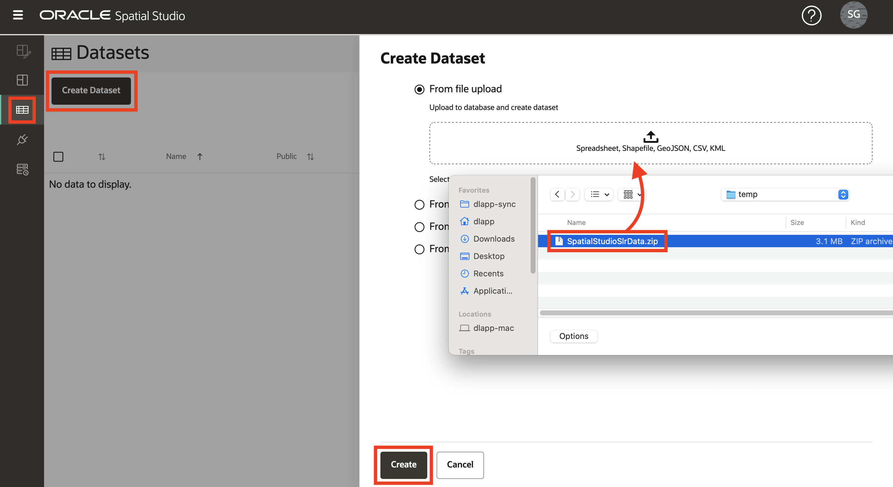

# Carregar e preparar dados

## Introdução

O Spatial Studio opera em dados armazenados em Bancos de Dados Oracle. No Spatial Studio, você trabalha com "Conjuntos de Dados", que são tabelas e views de banco de dados acessadas por meio de conexões de banco de dados. Os conjuntos de dados são ponteiros para tabelas e views de banco de dados e podem receber nomes amigáveis para serem mais autodescritivos do que a tabela de banco de dados subjacente ou o nome da view.

Os usuários geralmente precisam incorporar dados adquiridos de várias fontes. Para oferecer suporte a isso, o Spatial Studio fornece recursos para carregar dados de formatos padrão para o Oracle Database. Isso inclui o carregamento dos 2 formatos mais comuns para troca de dados espaciais: Shapefiles e arquivos GeoJSON. Além de carregar formatos espaciais, o Spatial Studio suporta o carregamento de planilhas e arquivos csv. Nesse caso, é necessária uma preparação adicional para derivar geometrias de atributos espaciais, como endereços ("geocodificação de endereço") e coordenadas de latitude/longitude (" indexação de coordenadas"). Este laboratório orienta você pelas etapas para carregar e preparar dados nesses formatos usando o Spatial Studio.

**Observe as seguintes informações importantes sobre os dados públicos usados neste workshop:**

Neste laboratório, você fará download de um único arquivo zip contendo o seguinte:

*   **Regiões de inundação projetadas** simplificadas com base em dados públicos publicados em [https://data.boston.gov/group/geospatial?q=sea+level+rise+flood](https://data.boston.gov/group/geospatial?q=sea+level+rise+flood). Uma vez que foram simplificados a partir de sua forma publicada, eles não são destinados a descrever as extensões precisas dos modelos publicados.
*   **Buildings** extraídos de dados públicos publicados em [https://www.mass.gov/info-details/massgis-data-building-structures-2-d](https://www.mass.gov/info-details/massgis-data-building-structures-2-d).
*   **Escolas** de OpenStreetMap extraídas usando [https://wiki.openstreetmap.org/wiki/Overpass\_turbo](https://wiki.openstreetmap.org/wiki/Overpass_turbo)
*   **Instalações de TRI** do EPA dos EUA extraídas usando [https://edap.epa.gov/public/extensions/TRIToxicsTracker/TRIToxicsTracker.html](https://edap.epa.gov/public/extensions/TRIToxicsTracker/TRIToxicsTracker.html). O Toxics Release Inventory (TRI) é um recurso para aprender sobre liberações químicas tóxicas e atividades de prevenção da poluição relatadas por instalações industriais e federais.

Tempo de Laboratório Estimado: 10 minutos

Assista ao vídeo abaixo para uma rápida apresentação do laboratório.

[Carregar e preparar dados](videohub:1_h1cmu08i)

### Objetivos

*   Saiba como carregar e preparar dados espaciais

### Pré-requisitos

*   Laboratório Completo 1: Implante o Spatial Studio no Oracle Cloud
*   Nenhuma experiência anterior com o Oracle Spatial é necessária.

## Tarefa 1: Carregar dados

Você começa carregando regiões de inundação projetadas, parcelas, escolas e instalações de formatos comuns.

1.  Faça download do arquivo zip que contém os dados em um local conveniente: [SpatialStudioSlrData.zip](https://objectstorage.us-ashburn-1.oraclecloud.com/p/jyHA4nclWcTaekNIdpKPq3u2gsLb00v_1mmRKDIuOEsp--D6GJWS_tMrqGmb85R2/n/c4u04/b/livelabsfiles/o/labfiles/SpatialStudioSlrData.zip). O arquivo zip contém o seguinte:
    
    
    
2.  No Spatial Studio, no menu do painel esquerdo, navegue até a página Conjuntos de Dados, clique em **Criar Conjunto de Dados** e selecione **Do upload de arquivo**. Clique na região de upload, navegue até seu local de download e selecione o arquivo zip. Você também pode arrastar e soltar o arquivo na região de upload. Em seguida, clique em **Criar**.
    
    
    
3.  Uma visualização do 1o arquivo carregado será exibida. Selecione a Conexão de destino para este upload. Selecione a conexão **SPATIAL\_STUDIO** (o repositório de metadados do Spatial Studio). Em um cenário de produção, você teria outras conexões para esses dados de negócios, separadas do repositório de metadados. Clique em **Enviar** para iniciar o 1o upload.
    
    
    
4.  Repita para todos os conjuntos de dados.
    
5.  Quando concluído, os conjuntos de dados são listados com um pequeno ícone de aviso para indicar que são necessárias 1 ou mais etapas de preparação. Você executará essas etapas na próxima tarefa.
    
    
    

## Tarefa 2: Preparar Dados

A preparação de dados inclui operações que permitem que conjuntos de dados sejam usados para análise espacial e visualização de mapas. Os exemplos incluem geocodificação de endereço, indexação de coordenadas e identificação de colunas de chave exclusivas. Nesta tarefa, você executa a indexação de coordenadas e define chaves de conjunto de dados.

1.  Os conjuntos de dados são listados com um pequeno ícone de aviso para indicar que 1 ou mais etapas de preparação são necessárias. Comece clicando no selo de aviso de **SCHOOLS**. Este conjunto de dados foi carregado de um formato não espacial (csv) e requer preparação para visualização de mapeamento. O conjunto de dados inclui colunas de latitude/longitude; portanto, selecione **Criar Índice de Latitude/Longitude** e clique em **Ok**.
    
    
    
2.  Preencha as colunas de latitude e longitude para indexação e clique em **OK**.
    
    
    
3.  Repita o procedimento para **FACILIDADES** clicando no selo de aviso e selecionando **Criar Índice de Latitude/Longitude**. Quando concluído, observe que os ícones ESCOLAS e INSTALAÇÕES foram alterados de uma tabela para um pin indicando que os conjuntos de dados podem ser usados para visualização de mapas.
    
4.  Os emblemas de aviso restantes indicam que as chaves precisam ser definidas para seus conjuntos de dados. Embora não seja necessário para o mapeamento básico, adicione chaves, pois elas são necessárias para análises que você executará posteriormente no workshop. Clique no ícone de aviso de **CRIANÇAS**. Clique no link **Ir para Colunas do Conjunto de Dados**.
    
    
    
    Clique no botão **Criar Coluna de Chaves**.  
    
    
    Nomeie a coluna de chaves como **bldg\_id** e clique em **Ok**.  
    
    
    Por fim, clique em **Aplicar**. 
    
5.  Clique no ícone de aviso de **FACILIDADES** e clique no link **Ir para Colunas do Conjunto de Dados**.
    
    
    
6.  Selecione **FACILITY\_ID** como chave, clique em **Validar chave** e, em seguida, em **Aplicar**.
    
    
    
7.  Repita para adicionar chaves para seus outros conjuntos de dados usando as seguintes colunas:
    
    | Conjunto de Dados | Coluna a ser usada como Chave |
    | --- | --- |
    | FLOOD2040 | FID |
    | FLOOD2060 | FID |
    | FLOOD2080 | FID |
    | ESCOLAS | OGR\_FID |
    
8.  Observe que todos os seus conjuntos de dados estão totalmente preparados para mapeamento e análise espacial.
    
    
    

Agora você pode **prosseguir para o próximo laboratório**.

## Saiba mais

*   [Página do produto Oracle Spatial](https://www.oracle.com/database/spatial)
*   [Conceitos Básicos do Spatial Studio](https://www.oracle.com/database/technologies/spatial-studio/get-started.html)
*   [Documentação do Spatial Studio](https://docs.oracle.com/en/database/oracle/spatial-studio)

## Agradecimentos

*   **Autor** - David Lapp, Database Product Management, Oracle
*   **Colaboradores** - Jayant Sharma, Denise Myrick
*   **Última Atualização em/Data** - David Lapp, agosto de 2023