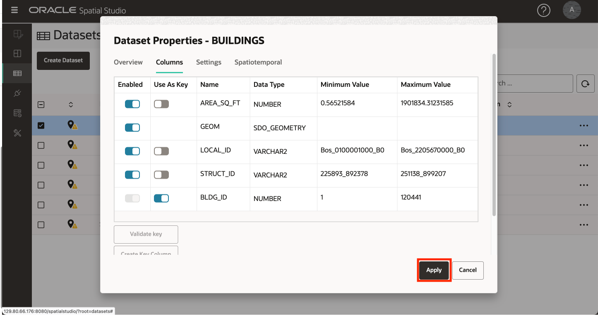
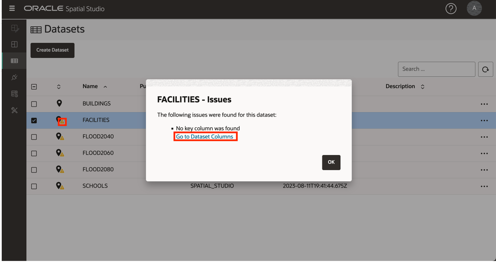

# 加载和准备数据

## 简介

Spatial Studio 对存储在 Oracle 数据库中的数据进行操作。在 Spatial Studio 中，您可以使用“数据集”，即通过数据库连接访问的数据库表和视图。数据集是指向数据库表和视图的指针，并且可能被赋予友好的名称，以比基础数据库表或视图名称更能自我描述。

用户通常需要整合从各种来源获取的数据。为了支持这一点，Spatial Studio 提供了将数据从标准格式加载到 Oracle Database 的功能。这包括加载用于交换空间数据的 2 种最常用的格式：Shapefiles 和 GeoJSON 文件。除了加载空间格式外，Spatial Studio 还支持加载电子表格和 csv 文件。在这种情况下，需要额外准备从空间属性（如地址（“地址地理编码”）和纬度/经度坐标（“坐标索引”）推导几何。此实验室将指导您完成使用 Spatial Studio 加载和准备这些格式的数据的步骤。

**请注意以下有关本研讨会中使用的公共数据的重要信息：**

在此练习中，您将下载包含以下内容的单个 zip 文件：

*   **预计洪水区域**简化了 [https://data.boston.gov/group/geospatial?q=sea+level+rise+flood](https://data.boston.gov/group/geospatial?q=sea+level+rise+flood) 上发布的公共数据。由于它们已经从其发布的形式简化，因此它们不是用来描绘已发布模型的精确区。
*   从 **https://www.mass.gov/info-details/massgis-data-building-structures-2-d** 上发布的公共数据中提取的[构建](https://www.mass.gov/info-details/massgis-data-building-structures-2-d)。
*   使用 **https://wiki.openstreetmap.org/wiki/Overpass\_turbo** 从 OpenStreetMap 提取的[学校](https://wiki.openstreetmap.org/wiki/Overpass_turbo)
*   使用 **https://edap.epa.gov/public/extensions/TRIToxicsTracker/TRIToxicsTracker.html** 从美国 EPA 提取的 [TRI 设施](https://edap.epa.gov/public/extensions/TRIToxicsTracker/TRIToxicsTracker.html)。毒物释放清单 (TRI) 是了解工业和联邦设施报告的有毒化学品释放和污染预防活动的资源。

估计的实验室时间：10 分钟

观看下面的视频，快速浏览实验室。

[加载和准备数据](videohub:1_h1cmu08i)

### 目标

*   了解如何加载和准备空间数据

### 先备条件

*   完整的实验室 1：将 Spatial Studio 部署到 Oracle Cloud
*   以前不需要具备 Oracle Spatial 经验。

## 任务 1：加载数据

首先，从常见格式加载预计的洪水区域、地块、学校和设施。

1.  将包含数据的 zip 文件下载到方便的位置：[SpatialStudioSlrData.zip](https://objectstorage.us-ashburn-1.oraclecloud.com/p/jyHA4nclWcTaekNIdpKPq3u2gsLb00v_1mmRKDIuOEsp--D6GJWS_tMrqGmb85R2/n/c4u04/b/livelabsfiles/o/labfiles/SpatialStudioSlrData.zip) 。zip 文件包含以下内容：
    
    
    
2.  在 Spatial Studio 中，从左侧面板菜单导航到“数据集”页，单击**创建数据集**，然后选择**从文件上载**。单击上载区域，导航到下载位置，然后选择 zip 文件。您还可以将文件拖放到上载区域中。然后单击**创建**。
    
    
    
3.  将显示第一个上载的文件的预览。选择此上载的目标连接。选择 **SPATIAL\_STUDIO** 连接（Spatial Studio 元数据系统信息库）。在生产方案中，对于此类业务数据，您将有其他连接，独立于元数据资料档案库。单击**提交**以启动第一次上载。
    
    
    
4.  对所有数据集重复此操作。
    
5.  完成后，数据集将以小警告图标列出，以指示需要 1 个或多个准备步骤。您将在下一个任务中执行这些步骤。
    
    
    

## 任务 2：准备数据

数据准备包括允许数据集用于空间分析和地图可视化的操作。示例包括地址地理编码、坐标索引编制以及唯一键列的标识。在此任务中，您将执行协调索引并设置数据集关键字。

1.  列出了数据集，其中包含一个小警告图标，指示需要 1 个或多个准备步骤。首先单击 **SCHOOLS** 的警告标记。此数据集是从非空间格式 (csv) 加载的，需要准备映射可视化。数据集包括纬度/经度列，因此选择**创建纬度/经度索引**，然后单击**确定**。
    
    
    
2.  填充用于索引的纬度和经度列，然后单击**确定**。
    
    
    
3.  通过单击警告标记并选择**创建纬度/经度索引**，重复**设施**。完成后，请注意“SCHOOLS（学校）”和“FACILITIES（设施）”图标已从表更改为别针，指示数据集可用于地图可视化。
    
4.  其余警告标记指示需要为数据集定义密钥。尽管基本映射不是必需的，但请添加键，因为这些键是您稍后将在研习会中执行的分析所必需的。单击**单元楼**的警告图标。单击**转到数据集列**链接。
    
    
    
    单击**创建键列**按钮。  
    
    
    将键列命名为 **bldg\_id** ，然后单击**确定**。  
    
    
    最后，单击**应用**。 
    
5.  单击 **FACILITIES** 的警告图标，然后单击链接 **Go to Dataset Columns** 。
    
    
    
6.  选择 **FACILITY\_ID** 作为密钥，依次单击**验证密钥**和**应用**。
    
    
    
7.  重复此操作，使用以下列为您的其他数据集添加键：
    
    | 数据集 | 用作键的列 |
    | --- | --- |
    | FLOOD2040 | FID |
    | FLOOD2060 | FID |
    | FLOOD2080 | FID |
    | 学校 | OGR\_FID |
    
8.  请注意，所有数据集都已做好充分准备，可用于映射和空间分析。
    
    
    

现在，您可以**进入下一个练习**。

## 了解详细信息

*   [Oracle Spatial 产品页面](https://www.oracle.com/database/spatial)
*   [Spatial Studio 入门](https://www.oracle.com/database/technologies/spatial-studio/get-started.html)
*   [Spatial Studio 文档](https://docs.oracle.com/en/database/oracle/spatial-studio)

## 确认

*   **作者** - David Lapp，Oracle 数据库产品管理
*   **贡献者** - Jayant Sharma、Denise Myrick
*   **上次更新者/日期** - David Lapp，2023 年 8 月