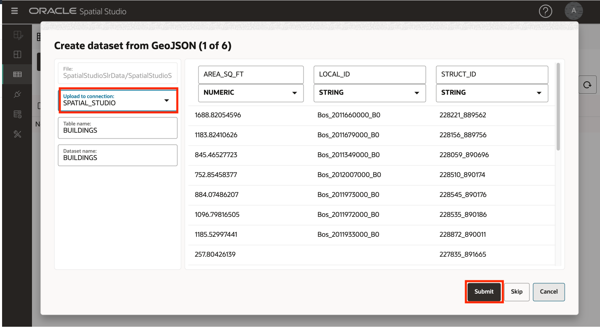
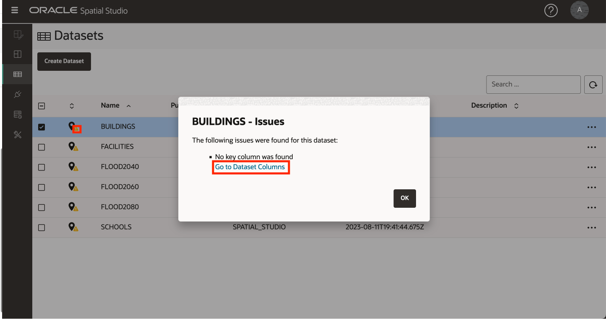

# 載入和準備資料

## 簡介

Spatial Studio 會針對儲存在 Oracle 資料庫中的資料運作。在 Spatial Studio 中，您使用「資料集」，這是透過資料庫連線存取的資料庫表格和視觀表。資料集是資料庫表格和視觀表的指標，而且可能給予易記名稱，使其比基礎資料庫表格或視觀表名稱更具有自我描述性。

使用者通常需要結合從各種來源取得的資料。為了支援此功能，Spatial Studio 提供將資料從標準格式載入 Oracle Database 的功能。這包括載入兩個最常見的空間資料交換格式：Shapefiles 和 GeoJSON 檔案。除了載入空間格式之外，Spatial Studio 還支援載入試算表和 csv 檔案。在此情況下，需要進行額外的準備，才能從空間屬性 (例如地址 (地址地理編碼) 和緯度 / 經度座標 (協調索引) 衍生幾何圖形。這個實驗室會逐步引導您使用 Spatial Studio 載入和準備這些格式的資料。

**請注意下列有關本研討會中公開資料的重要資訊：**

在此實驗室中，您將下載包含下列項目的單一 zip 檔案：

*   **預計洪水區域**從 [https://data.boston.gov/group/geospatial?q=sea+level+rise+flood](https://data.boston.gov/group/geospatial?q=sea+level+rise+flood) 發佈的公共資料中簡化。由於它們已經從發布的表單中簡化，因此不用描述已發布模型的精確範圍
*   從 **https://www.mass.gov/info-details/massgis-data-building-structures-2-d** 發佈的公開資料擷取[建築物](https://www.mass.gov/info-details/massgis-data-building-structures-2-d)。
*   OpenStreetMap 中的**學校**使用 [https://wiki.openstreetmap.org/wiki/Overpass\_turbo](https://wiki.openstreetmap.org/wiki/Overpass_turbo) 擷取
*   使用 **https://edap.epa.gov/public/extensions/TRIToxicsTracker/TRIToxicsTracker.html** 從美國 EPA 擷取的 [TRI 設備](https://edap.epa.gov/public/extensions/TRIToxicsTracker/TRIToxicsTracker.html)。Toxics Release Inventory (TRI) 是一項資源，可供您瞭解工業和聯邦設施所報告的有毒化學版本和預防汙染活動。

預估實驗室時間：10 分鐘

請觀看下方影片，快速瞭解實驗室的逐步解說。

[載入和準備資料](videohub:1_h1cmu08i)

### 目標

*   瞭解如何載入及準備空間資料

### 先決條件

*   完整實驗室 1：將 Spatial Studio 部署至 Oracle Cloud
*   不需要使用 Oracle Spatial 的使用經驗。

## 作業 1：載入資料

從一般格式載入預計洪水區域、包裹、學校和設施開始。

1.  將包含資料的壓縮檔下載至方便的位置：[SpatialStudioSlrData.zip](https://objectstorage.us-ashburn-1.oraclecloud.com/p/jyHA4nclWcTaekNIdpKPq3u2gsLb00v_1mmRKDIuOEsp--D6GJWS_tMrqGmb85R2/n/c4u04/b/livelabsfiles/o/labfiles/SpatialStudioSlrData.zip) 。zip 檔案包含下列項目：
    
    
    
2.  在 Spatial Studio 中，從左側面板功能表瀏覽至「資料集」頁面，按一下**建立資料集**，然後選取**從檔案上傳**。按一下上傳區域，瀏覽至您的下載位置，然後選取壓縮檔。您也可以將檔案拖放至上傳區域。然後按一下**建立 (Create)** 。
    
    
    
3.  將會顯示第一個上傳檔案的預覽。選取此上傳的目的地連線。選取 **SPATIAL\_STUDIO** 連線 (Spatial Studio 描述資料儲存區域)。在生產案例中，您會有這類業務資料的其他連線，與中繼資料儲存庫不同。按一下**送出**以起始第一次上傳。
    
    
    
4.  對所有資料集重複。
    
5.  完成時，會列出資料集並顯示小警告圖示，以指出需要一或多個準備步驟。您將在下一個作業中執行這些步驟。
    
    
    

## 作業 2：準備資料

資料準備包括允許資料集用於空間分析和地圖視覺化的作業。範例包括地址地理編碼、座標索引及唯一索引鍵資料欄的識別。在這項任務中，您將執行座標編製索引並設定資料集索引鍵。

1.  資料集會列出小警告圖示，指出需要一或多個準備步驟。首先，按一下 **SCHOOLS** 的警告標記。此資料集是從非空間格式 (csv) 載入的，需要準備對應視覺化。資料集包含緯度 / 經度資料欄，因此請選取**建立緯度 / 經度索引**，然後按一下**確定**。
    
    
    
2.  填入要編製索引的緯度與經度資料欄，然後按一下**確定**。
    
    
    
3.  按一下警告標記並選取**建立緯度 / 經度索引**來重複 **FACILITIES** 。完成時，請注意 SCHOOLS 與 FACILITIES 圖示已從表格變更為圖釘，表示資料集可用於地圖視覺化。
    
4.  剩餘的警告識別證則表示需要定義資料集的關鍵碼。雖然基本對應不需要，但新增關鍵碼，因為這些關鍵碼需要分析，您稍後會在研討會中執行。按一下 **BUILDINGS** 的警告圖示。按一下**前往資料集資料欄**連結。
    
    
    
    按一下**建立索引鍵資料欄**按鈕。  
    
    
    將索引鍵資料欄命名為 **bldg\_id** ，然後按一下**確定**。  
    
    
    最後，按一下**套用 (Apply)** 。 
    
5.  按一下 **FACILITIES** 的警告圖示，然後按一下**前往資料集資料欄**連結。
    
    
    
6.  選取 **FACILITY\_ID** 作為金鑰，依序按一下**驗證金鑰**和**套用**。
    
    
    
7.  重複以使用下列資料欄為其他資料集新增金鑰：
    
    | 資料集 | 用作索引鍵的資料欄 |
    | --- | --- |
    | FLOOD2040 | FID |
    | FLOOD2060 | FID |
    | FLOOD2080 | FID |
    | 學校 | OGR\_FID |
    
8.  請注意，您的所有資料集都已完全準備好進行對應和空間分析。
    
    
    

您現在可以**進入下一個實驗室**。

## 進一步瞭解

*   [Oracle Spatial 產品頁面](https://www.oracle.com/database/spatial)
*   [開始使用 Spatial Studio](https://www.oracle.com/database/technologies/spatial-studio/get-started.html)
*   [Spatial Studio 文件](https://docs.oracle.com/en/database/oracle/spatial-studio)

## 確認

*   **作者** - Oracle 資料庫產品管理 David Lapp
*   **貢獻者** - Jayant Sharma，Denise Myrick
*   **上次更新者 / 日期** - David Lapp，2023 年 8 月