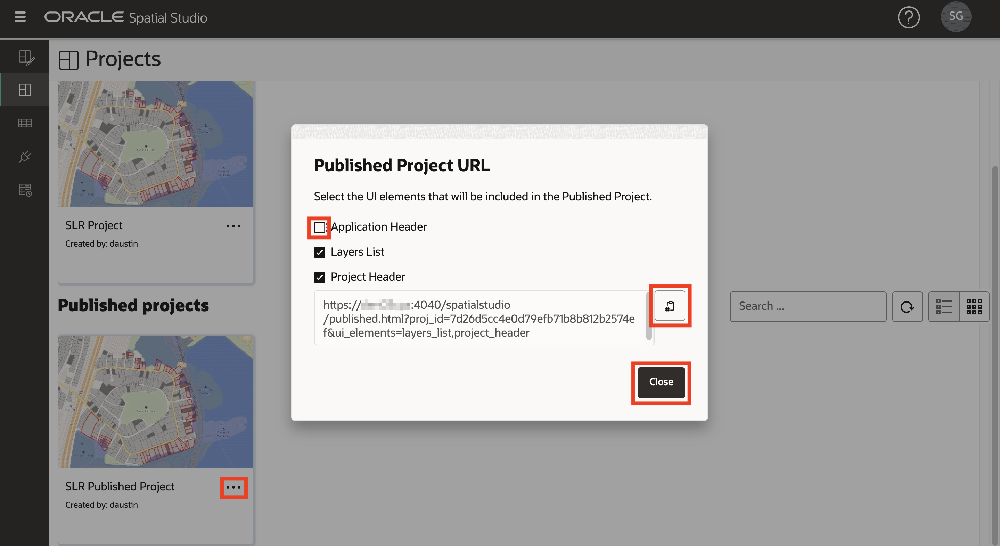
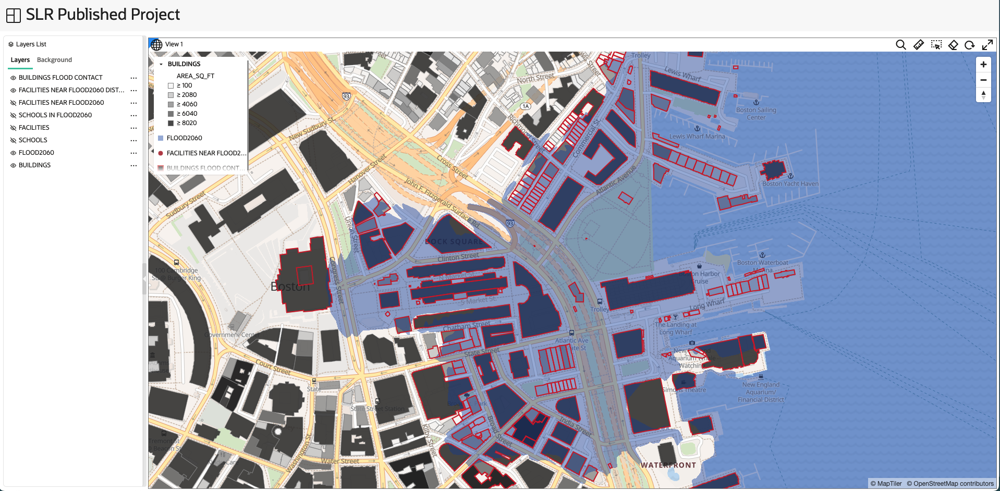

# Guardar y compartir resultados

## Introducción

Spatial Studio le permite compartir sus resultados de varias maneras. Una de estas formas es publicar los mapas interactivos para el acceso de solo lectura.

Tiempo estimado: 5 minutos

Vea el siguiente vídeo para una breve introducción al laboratorio.

[Guardar y compartir resultados](videohub:1_3nnjltvt)

### Objetivos

*   Describir cómo publicar mapas para acceso de solo lectura

### Requisitos

*   Finalización del laboratorio 4: análisis de relaciones espaciales

## Tarea 1: Guardar y publicar proyecto

A continuación, guarde el trabajo y publique el mapa para el acceso de solo lectura.

1.  Para guardar el proyecto, haga clic en el botón **Guardar** situado encima de la asignación para actualizar el proyecto guardado con los cambios.
    
    
    
2.  A continuación, en el menú Acciones situado encima de la asignación, seleccione **Publicar proyecto**.
    
    
    
3.  En el cuadro de diálogo emergente, introduzca **SLR Published Project** o un nombre de su elección. Esto permite que su mapa sea compartido con otros a través de una simple URL.
    
    
    
4.  En el panel de navegación principal de la izquierda, vaya a la **página Proyectos** para ver las miniaturas del proyecto y el proyecto publicado.
    
    
    

## Tarea 2: Probar el proyecto publicado

Por último, se abre el mapa compartido como sería visto por otros.

1.  En el menú de acción del proyecto publicado, seleccione **URL**.
    
    
    
2.  El cuadro de diálogo URL de proyecto publicado permite seleccionar los elementos de página que se van a mostrar. Por ejemplo, para obtener una URL que muestre el mapa sin el banner de la aplicación Spatial Studio de nivel superior, desmarque Application Header en la lista de elementos de interfaz de usuario. A continuación, haga clic en el botón para copiar la URL.
    
    
    
3.  Abra un nuevo separador del explorador, pegue y ejecute la URL que ha copiado. Observe que el mapa se muestra sin el banner de la aplicación. Como es de solo lectura, no se pueden crear nuevos análisis y no se pueden agregar nuevas capas. Pero el mapa es totalmente interactivo y permite el replanteamiento, la interactividad y el filtrado de capas.
    
    
    

¡Esperamos que haya encontrado que este taller es útil! Hay más que aprender sobre Spatial Studio y la plataforma espacial en general. Esperamos que continúen este viaje.

## Más información

*   [Página del producto Oracle Spatial](https://www.oracle.com/database/spatial)
*   [Introducción a Spatial Studio](https://www.oracle.com/database/technologies/spatial-studio/get-started.html)
*   [Documentación de Spatial Studio](https://docs.oracle.com/en/database/oracle/spatial-studio)

## Reconocimientos

*   **Autor**: David Lapp, Database Product Management, Oracle
*   **Contribuyentes**: Denise Myrick, Jayant Sharma
*   **Última actualización por/fecha**: David Lapp, agosto de 2023