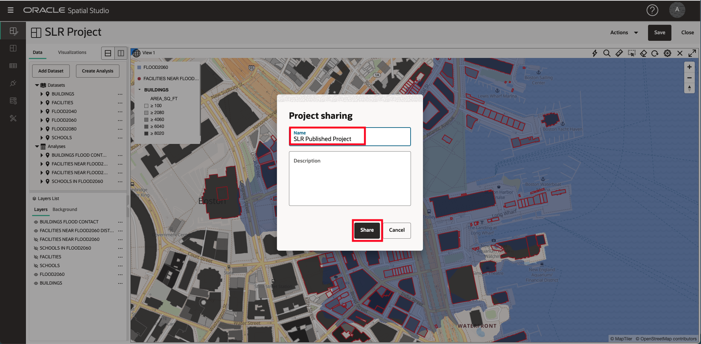

# Enregistrer et partager les résultats

## Présentation

Spatial Studio vous permet de partager vos résultats de plusieurs façons. L'une de ces méthodes consiste à publier vos cartes interactives pour un accès en lecture seule.

Durée estimée : 5 minutes

Regardez la vidéo ci-dessous pour une présentation rapide du laboratoire.

[Enregistrer et partager les résultats](videohub:1_3nnjltvt)

### Objectifs

*   Comprendre comment publier des cartes pour un accès en lecture seule

### Prérequis

*   Achèvement de l'atelier 4 : Analyser les relations spatiales

## Tâche 1 : enregistrer et publier le projet

Vous enregistrez ensuite votre travail et publiez votre carte pour un accès en lecture seule.

1.  Pour enregistrer votre projet, cliquez sur le bouton **Enregistrer** au-dessus de la carte pour mettre à jour le projet enregistré avec vos modifications.
    
    
    
2.  Ensuite, dans le menu Actions au-dessus de la carte, sélectionnez **Publier le projet**.
    
    
    
3.  Dans la boîte de dialogue contextuelle, entrez **SLR Published Project** ou le nom de votre choix. Cela permet à votre carte d'être partagée avec d'autres personnes via une URL simple.
    
    
    
4.  Dans le panneau de navigation principal à gauche, accédez à la **page Projets** pour afficher les miniatures de votre projet et de votre projet publié.
    
    
    

## Tâche 2 : tester un projet publié

Enfin, vous ouvrez la carte partagée telle qu'elle serait vue par d'autres.

1.  Dans le menu d'actions de votre projet publié, sélectionnez **URL**.
    
    
    
2.  La boîte de dialogue URL du projet publié vous permet de sélectionner les éléments de page à afficher. Par exemple, pour obtenir une URL qui affiche votre matrice sans la bannière d'application Spatial Studio de niveau supérieur, désélectionnez En-tête d'application dans la liste des éléments d'interface utilisateur. Cliquez ensuite sur le bouton pour copier l'URL.
    
    
    
3.  Ouvrez un nouvel onglet du navigateur, collez-le et exécutez l'URL que vous avez copiée. Observez que la carte s'affiche sans la bannière de l'application. En lecture seule, de nouvelles analyses ne peuvent pas être créées et de nouvelles couches ne peuvent pas être ajoutées. Mais la carte est entièrement interactive et permet de modifier le style, l'interactivité et le filtrage des couches.
    
    
    

Nous espérons que cet atelier vous sera utile ! Il y a plus à apprendre sur Spatial Studio et la plateforme Spatial en général. Nous espérons que vous poursuivrez ce voyage.

## En savoir plus

*   [Page produit Oracle Spatial](https://www.oracle.com/database/spatial)
*   [Lancez-vous avec Spatial Studio](https://www.oracle.com/database/technologies/spatial-studio/get-started.html)
*   [Documentation de Spatial Studio](https://docs.oracle.com/en/database/oracle/spatial-studio)

## Accusés de réception

*   **Auteur** - David Lapp, Database Product Management, Oracle
*   **Contributeurs** - Denise Myrick, Jayant Sharma
*   **Dernière mise à jour par/date** - David Lapp, août 2023