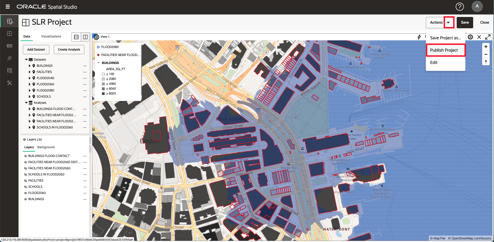

# 결과 저장 및 공유

## 소개

Spatial Studio를 사용하면 여러 가지 방법으로 결과를 공유할 수 있습니다. 이러한 방법 중 하나는 읽기 전용 액세스를 위해 대화식 맵을 게시하는 것입니다.

예상 시간: 5분

실습 과정을 간단히 살펴보려면 아래 비디오를 시청하십시오.

[결과 저장 및 공유](videohub:1_3nnjltvt)

### 목표

*   읽기 전용 액세스를 위해 맵을 게시하는 방법 이해

### 필요 조건

*   실습 4: 공간 관계 분석

## 작업 1: 프로젝트 저장 및 게시

그런 다음 작업을 저장하고 읽기 전용 액세스를 위해 지도를 게시합니다.

1.  프로젝트를 저장하려면 맵 위의 **저장** 버튼을 눌러 저장된 프로젝트를 변경사항으로 업데이트합니다.
    
    
    
2.  그런 다음 맵 위의 작업 메뉴에서 **프로젝트 게시**를 선택합니다.
    
    
    
3.  팝업 대화상자에서 **SLR 게시된 프로젝트** 또는 선택한 이름을 입력합니다. 이렇게 하면 간단한 URL을 통해 지도를 다른 사람과 공유할 수 있습니다.
    
    
    
4.  왼쪽의 기본 탐색 패널에서 **프로젝트 페이지**로 이동하여 프로젝트 및 게시된 프로젝트의 축소판을 확인합니다.
    
    
    

## 작업 2: 게시된 프로젝트 테스트

마지막으로 공유 맵을 다른 사용자가 보는 것처럼 엽니다.

1.  게시된 프로젝트의 작업 메뉴에서 **URL**을 선택합니다.
    
    
    
2.  게시된 프로젝트 URL 대화상자에서는 표시할 페이지 요소를 선택할 수 있습니다. 예를 들어, 최상위 레벨 Spatial Studio 애플리케이션 배너 없이 맵을 표시하는 URL을 가져오려면 UI 요소 목록에서 애플리케이션 헤더의 선택을 취소합니다. 그런 다음 버튼을 눌러 URL을 복사합니다.
    
    
    
3.  새 브라우저 탭을 열고 복사한 URL을 붙여넣고 실행합니다. 맵이 응용 프로그램 배너 없이 표시되는지 확인합니다. 읽기 전용이므로 새 분석을 생성할 수 없으며 새 레이어를 추가할 수 없습니다. 그러나 맵은 완전히 상호 작용하며 레이어의 스타일 조정, 상호 작용 및 필터링을 허용합니다.
    
    
    

우리는 당신이이 워크샵이 유용하다는 것을 발견하기를 바랍니다! 일반적으로 Spatial Studio와 Spatial 플랫폼에 대해 더 많이 배울 수 있습니다. 이 여행을 계속하시길 바랍니다.

## 자세히 알아보기

*   [Oracle Spatial 제품 페이지](https://www.oracle.com/database/spatial)
*   [Spatial Studio 시작하기](https://www.oracle.com/database/technologies/spatial-studio/get-started.html)
*   [Spatial Studio 설명서](https://docs.oracle.com/en/database/oracle/spatial-studio)

## 확인

*   **작성자** - David Lapp, Oracle 데이터베이스 제품 관리
*   **제공자** - Denise Myrick, Jayant Sharma
*   **최종 업데이트 수행자/날짜** - David Lapp, 2023년 8월