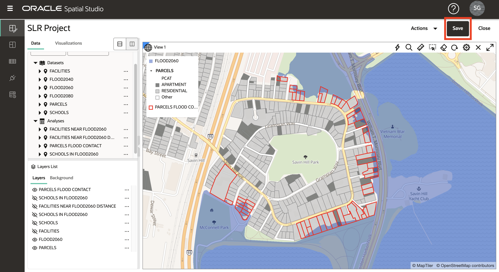
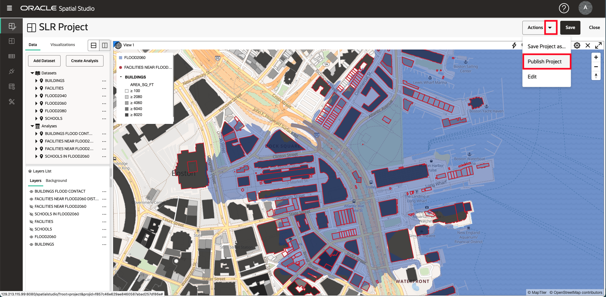
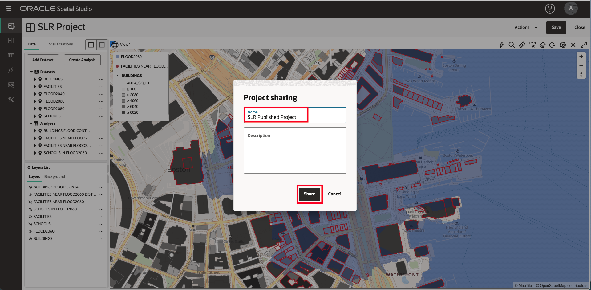
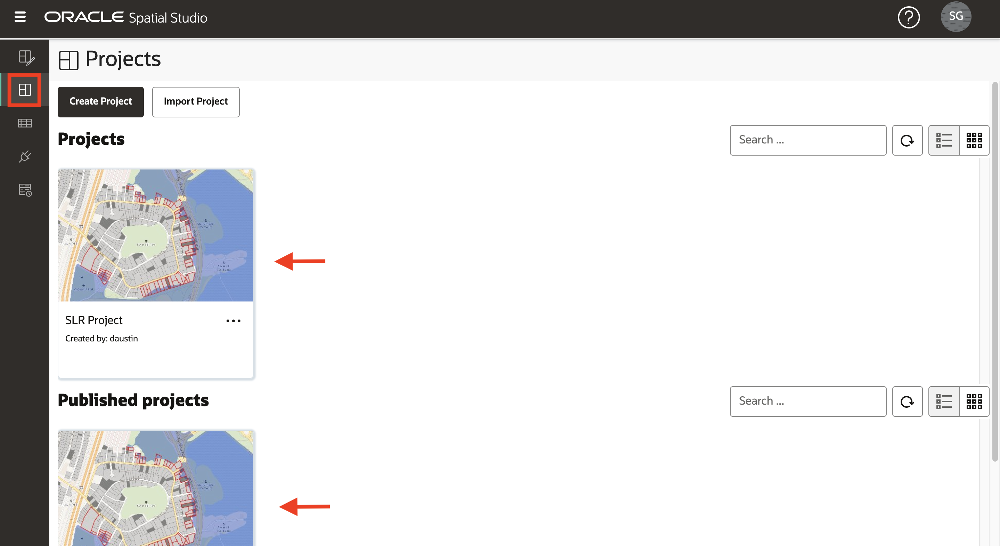
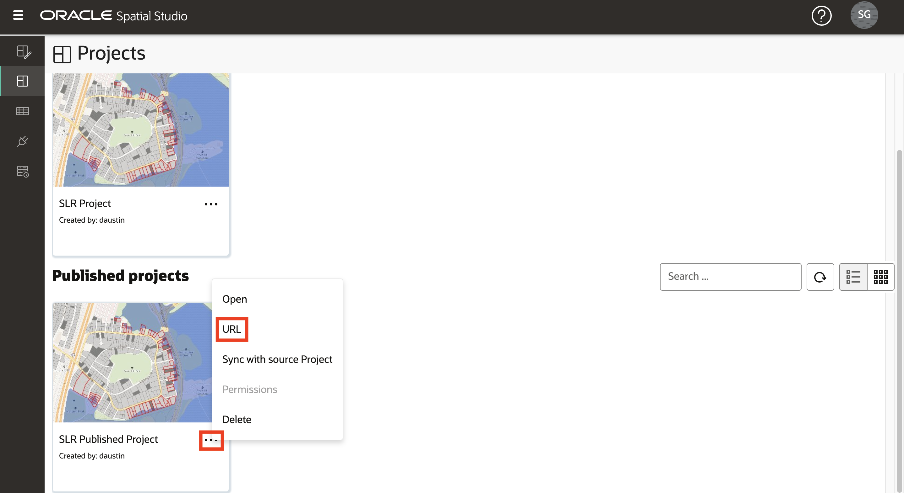
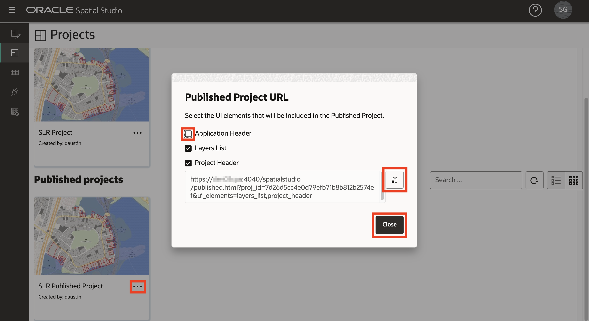
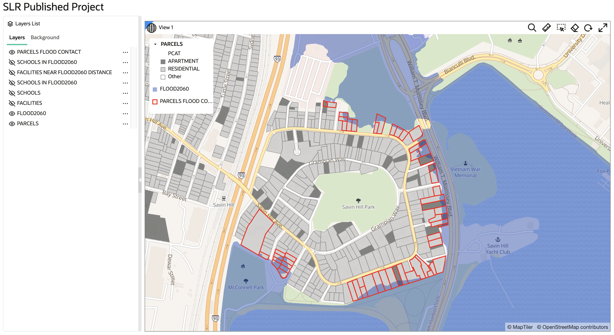

# Salvar e compartilhar resultados

## Introdução

O Spatial Studio permite que você compartilhe seus resultados de várias maneiras. Uma dessas maneiras é publicar seus mapas interativos para acesso somente leitura.

Tempo Estimado: 5 minutos

Assista ao vídeo abaixo para uma rápida apresentação do laboratório.

[Salvar e compartilhar resultados](videohub:1_3nnjltvt)

### Objetivos

*   Compreender como publicar mapas para acesso somente leitura

### Pré-requisitos

*   Conclusão do Laboratório 4: Analisar relações espaciais

## Tarefa 1: Salvar e publicar projeto

Em seguida, salve seu trabalho e publique seu mapa para acesso somente leitura.

1.  Para salvar seu projeto, clique no botão **Salvar** acima do mapa para atualizar o projeto salvo com suas alterações.
    
    
    
2.  Em seguida, no menu Ações acima do mapa, selecione **Publicar Projeto**.
    
    
    
3.  Na caixa de diálogo pop-up, informe **Projeto Publicado de SLR** ou um nome de sua escolha. Isso permite que seu mapa seja compartilhado com outras pessoas por meio de um URL simples.
    
    
    
4.  No painel de navegação principal à esquerda, navegue até a **página Projetos** para ver as miniaturas do projeto e do projeto publicado.
    
    
    

## Tarefa 2: Testar projeto publicado

Finalmente, você abre o mapa compartilhado como seria visto por outros.

1.  No menu de ação do seu projeto publicado, selecione **URL**.
    
    
    
2.  A caixa de diálogo URL do projeto publicado permite selecionar os elementos de página a serem exibidos. Por exemplo, para obter um URL que exiba seu mapa sem o banner do aplicativo Spatial Studio de nível superior, desmarque o Cabeçalho do Aplicativo na lista de elementos da IU. Em seguida, clique no botão para copiar o URL.
    
    
    
3.  Abra uma nova guia do navegador, cole e execute o URL copiado. Observe que o mapa é exibido sem o banner do aplicativo. Como é somente leitura, não é possível criar novas análises e adicionar novas camadas. Mas o mapa é totalmente interativo e permite re-styling, interatividade e filtragem de camadas.
    
    
    

Esperamos que você tenha achado este workshop útil! Há mais para aprender sobre o Spatial Studio e a plataforma Spatial em geral. Esperamos que continue esta viagem.

## Saiba mais

*   [Página do produto Oracle Spatial](https://www.oracle.com/database/spatial)
*   [Conceitos Básicos do Spatial Studio](https://www.oracle.com/database/technologies/spatial-studio/get-started.html)
*   [Documentação do Spatial Studio](https://docs.oracle.com/en/database/oracle/spatial-studio)

## Agradecimentos

*   **Autor** - David Lapp, Database Product Management, Oracle
*   **Colaboradores** - Denise Myrick, Jayant Sharma
*   **Última Atualização em/Data** - David Lapp, agosto de 2023