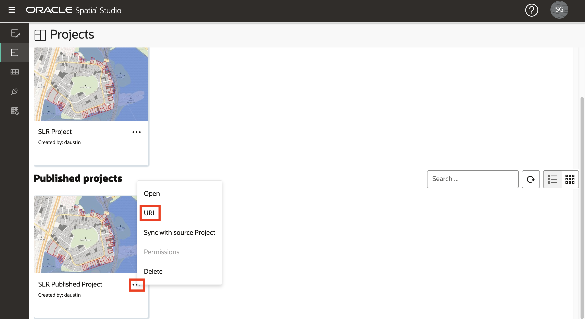

# 保存并共享结果

## 简介

Spatial Studio 允许您以多种方式共享结果。其中一种方法是发布交互式地图以进行只读访问。

估计时间：5 分钟

观看下面的视频，快速浏览实验室。

[保存并共享结果](videohub:1_3nnjltvt)

### 目标

*   了解如何发布地图以进行只读访问

### 先备条件

*   实验室 4 的完成：分析空间关系

## 任务 1：保存和发布项目

接下来，保存您的工作并发布地图以进行只读访问。

1.  要保存项目，请单击映射上方的**保存**按钮以使用更改更新保存的项目。
    
    
    
2.  然后，从映射上方的“操作”菜单中，选择**发布项目**。
    
    
    
3.  在弹出对话框中，输入 **SLR Published Project** 或您选择的名称。这允许您的地图通过简单的 URL 与其他人共享。
    
    
    
4.  从左侧的主导航面板中，导航到**“项目”页**以查看项目和已发布项目的缩略图。
    
    
    

## 任务 2：测试已发布的项目

最后，打开共享地图，就像其他人看到的那样。

1.  从已发布项目的操作菜单中选择 **URL** 。
    
    
    
2.  使用发布的项目 URL 对话框可以选择要显示的页面元素。例如，要获取没有顶级 Spatial Studio 应用程序横幅的地图显示的 URL，请从 UI 元素列表中取消选中“应用程序标题”。然后单击该按钮以复制 URL。
    
    
    
3.  打开新的浏览器标签页并粘贴并运行您复制的网址。观察是否显示没有应用程序标题的映射。由于它是只读的，因此无法创建新分析，并且无法添加新层。但地图是完全交互式的，允许重新样式，交互性和筛选层。
    
    
    

我们希望您发现此研讨会非常有用！还有更多关于 Spatial Studio 和 Spatial 平台的知识。我们希望你能继续这个旅程。

## 了解详细信息

*   [Oracle Spatial 产品页面](https://www.oracle.com/database/spatial)
*   [Spatial Studio 入门](https://www.oracle.com/database/technologies/spatial-studio/get-started.html)
*   [Spatial Studio 文档](https://docs.oracle.com/en/database/oracle/spatial-studio)

## 确认

*   **作者** - David Lapp，Oracle 数据库产品管理
*   **贡献者** - Denise Myrick、Jayant Sharma
*   **上次更新者/日期** - David Lapp，2023 年 8 月