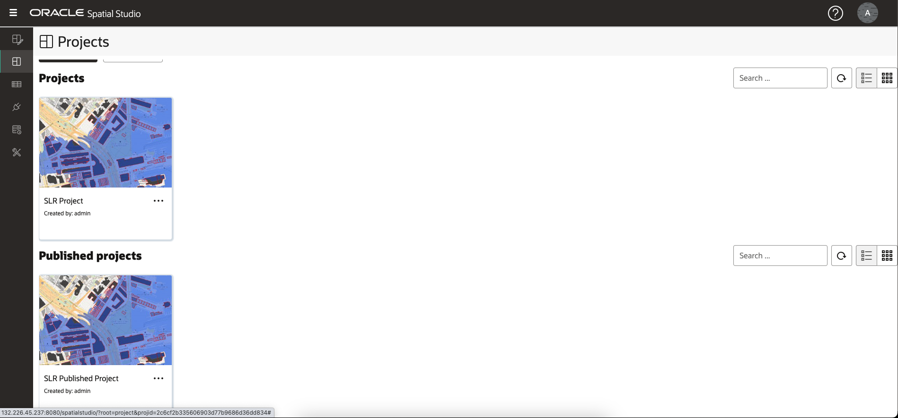

# 儲存並分享結果

## 簡介

Spatial Studio 可讓您以多種方式共用結果。其中一種方式是發布您的互動式地圖以進行唯讀存取。

預估時間：5 分鐘

請觀看下方影片，快速瞭解實驗室的逐步解說。

[儲存並分享結果](videohub:1_3nnjltvt)

### 目標

*   瞭解如何發布唯讀存取權的地圖

### 先決條件

*   完成實驗室 4：分析空間關係

## 作業 1：儲存與公布專案

您下次儲存工作並發布地圖以供唯讀存取。

1.  若要儲存您的專案，請按一下地圖上方的**儲存**按鈕，以使用您的變更來更新已儲存的專案。
    
    
    
2.  然後從地圖上方的「動作」功能表中選取**發布專案**。
    
    
    
3.  在快顯對話方塊中，輸入 **SLR 發佈的專案**或您選擇的名稱。這樣可以透過簡單的 URL 與其他人共用您的地圖。
    
    
    
4.  從左側的主要導覽面板，瀏覽至**專案頁面**，查看專案與已發布專案的縮圖。
    
    
    

## 作業 2：測試已發布的專案

最後，您可以開啟共用地圖，因為其他地圖會加以檢視。

1.  從您所發布專案的動作功能表中，選取 **URL** 。
    
    
    
2.  發布的專案 URL 對話方塊可讓您選取要顯示的頁面元素。例如，若要取得不含頂層 Spatial Studio 應用程式標幟之地圖的 URL，請從 UI 元素清單中取消勾選「應用程式標頭」。然後按一下按鈕以複製 URL。
    
    
    
3.  開啟新的瀏覽器分頁，貼上並執行您複製的 URL。顯示地圖時，不會顯示應用程式橫幅。由於它是唯讀的，因此無法建立新的分析，且無法新增新層級。但是地圖是完全互動的，允許對圖層的重新設定樣式、互動及篩選。
    
    
    

我們希望您找到這間研討會是有用的！「空間工作室」和「空間」平台的整體功能更詳盡。希望您能繼續此旅程。

## 進一步瞭解

*   [Oracle Spatial 產品頁面](https://www.oracle.com/database/spatial)
*   [開始使用 Spatial Studio](https://www.oracle.com/database/technologies/spatial-studio/get-started.html)
*   [Spatial Studio 文件](https://docs.oracle.com/en/database/oracle/spatial-studio)

## 確認

*   **作者** - Oracle 資料庫產品管理 David Lapp
*   **貢獻者** - Denise Myrick，Jayant Sharma
*   **上次更新者 / 日期** - David Lapp，2023 年 8 月