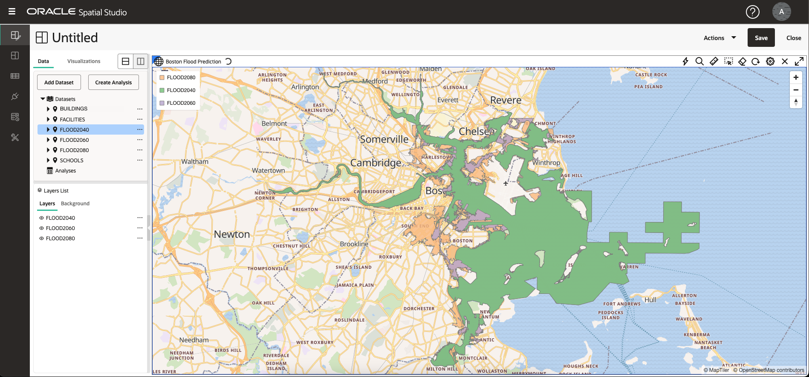
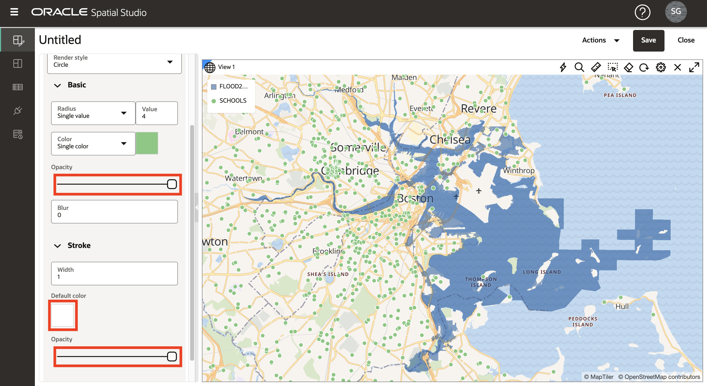

# Räumliche Daten visualisieren

## Einführung

In dieser Übung erkunden Sie die projizierten Hochwasserregionen und kulturellen Besonderheiten visuell. Sie erstellen eine interaktive Karte und wenden datengesteuertes Styling an, um Standortbeziehungen und -muster anzuzeigen.

Geschätzte Laborzeit: 20 Minuten

Sehen Sie sich das Video unten an, um einen schnellen Durchgang des Labors zu erhalten.

[Räumliche Daten mit Oracle Spatial Studio visualisieren](videohub:1_74fmvydy)

### Ziele

*   Erfahren Sie, wie Sie interaktive Karten basierend auf den von Ihnen erstellten Daten erstellen.
*   Erfahren Sie, wie Sie den Stil und das interaktive Verhalten Ihrer Karte konfigurieren.
*   Verstehen Sie die Verwendung von Projekten, um Ihre Arbeit zu speichern.

### Voraussetzungen

*   Abschluss von Übung 2: Daten laden und vorbereiten

## Aufgabe 1: Projekt erstellen

Zunächst erstellen Sie ein Projekt. In einem Projekt können Sie Ihre Daten visualisieren und analysieren und dann Ihre Arbeit speichern.

1.  Navigieren Sie zur Seite "Projekte", und klicken Sie auf **Projekt erstellen**.
    
    
    
2.  Bewegen Sie die Maus über die Karte. Um den Schwenkbereich zu verschieben, klicken und halten und ziehen Sie die Karte. Verwenden Sie zum Vergrößern und Verkleinern das Mausrad.
    
    Alternativ können Sie ein Navigationswidget anzeigen, indem Sie auf das Zahnradsymbol über der Karte klicken und das Dropdown-Menü **Navigationsleiste** auswählen. Wählen Sie **Zoom und Kompass**, und klicken Sie auf **OK**.
    
    
    
    Durch Aktivieren von Navigationssteuerelementen wird ein Navigationswidget in der Karte angezeigt.
    
    
    
3.  Klicken Sie auf **Dataset hinzufügen**, wählen Sie alle Datensets aus, und klicken Sie auf **OK**.
    
    
    
4.  Ziehen Sie FLOOD2080 per Drag-and-Drop in die Karte.
    
    
    
5.  Wiederholen Sie den Vorgang für FLOOD2060 und dann für FLOOD2040.
    
    
    
    **Hinweis:** Wenn sich die Ebenen in einer anderen Reihenfolge befinden, können Sie Ebenen in der Liste "Ebenen" durch Klicken und Halten nach oben oder unten ziehen, um ihre Reihenfolge zu ändern.
    
6.  Vergrößern Sie einen Bereich überlappender Hochwasserbereiche, um die Unterschiede in den Hochwassermodellen im Laufe der Zeit zu beobachten.
    
    
    
7.  Zeigen Sie einzelne Flutmodelle an, indem Sie auf das Augensymbol klicken, um die Ebenensichtbarkeit umzuschalten.
    
    
    
8.  Sie verwenden FLOOD2060 für die folgenden Schritte. Entfernen Sie daher FLOOD2040 und FLOOD2080 aus der Map. Wählen Sie im Aktionsmenü für FLOOD2040 die Option **Entfernen** aus.
    
    
    
    Wiederholen Sie dann FLOOD2080.
    
9.  Passen Sie die Karte an FLOOD2060 an, indem Sie im Aktionsmenü die Option **Auf Ebene zoomen** auswählen.
    
    
    

## Aufgabe 2: Map-Layer konfigurieren

Als Nächstes fügen Sie Kartenebenen hinzu und wenden Styling an.

1.  Klicken Sie im Aktionsmenü für FLOOD2060 auf **Einstellungen**.
    
    
    
2.  Sie befinden sich jetzt im Dialogfeld "Layer-Einstellungen". Klicken Sie unter Füllen auf die Farbkachel, stellen Sie sie auf dunkelblau ein und verwenden Sie den Schieberegler, um die Deckkraft zu reduzieren. Unter Gliederung ändern Sie die Breite in 0. Möglicherweise müssen Sie nach unten scrollen, um alle Einstellungen anzuzeigen.
    
    
    
3.  In späteren Schritten wählen Sie Elemente in der Karte aus. Um zu vermeiden, dass der gesamte Hochwasserbereich ausgewählt wird, konfigurieren Sie den Layer so, dass er nicht auswählbar ist. Wählen Sie im Pulldown-Menü "Konfigurieren" die Option **Interaktion** aus. Setzen Sie den Schalter **Auswahl zulassen** auf "Aus". Der Überschwemmungsbereich kann weiterhin zur Visualisierung und Analyse genutzt werden, er wird einfach nicht mit einem Mausklick in der Karte ausgewählt.
    
    
    
4.  Klicken Sie oben im Dialogfeld "Ebeneneinstellungen" auf den **Pfeil nach hinten**, um zur Ebenenliste zurückzukehren. Bitte beachten Sie diesen Schritt, da Sie in diesem Workshop mehrmals mit diesem Pfeil nach hinten navigieren werden.
    
    
    
5.  Ziehen Sie **SCHOOLS** per Drag-and-Drop auf die Karte. Wählen Sie dann im Aktionsmenü der Schicht "SCHOOLS" die Option **Einstellungen**.
    
    
    
6.  Scrollen Sie nach unten, um Abschnitte zu einfachen (Füll-) und Strich- (Gliederungs-)Stilen anzuzeigen. Ändern Sie die Füll Opazität in 100%. Ändern Sie die Strichfarbe in Weiß und die Deckkraft in 100%.
    
    
    
7.  Scrollen Sie zum oberen Rand des Dialogfelds "Einstellungen", blenden Sie das Menü "Konfigurieren" ein, und wählen Sie **Interaktion** aus.
    
    
    
8.  Scrollen Sie nach unten zum Abschnitt "QuickInfo". Aktivieren Sie QuickInfos, und wählen Sie **NAME** als QuickInfo-Spalte aus. Zeigen Sie dann mit der Maus auf die Schulen, um die QuickInfos anzuzeigen.
    
    
    
    Scrollen Sie wie in einem vorherigen Schritt zum Anfang des Dialogfelds "Einstellungen", und klicken Sie auf den **Rückwärtspfeil**, um zur Liste "Layer" zurückzukehren.
    
    
    
    Als Nächstes konfigurieren Sie Stile dynamisch, die von Daten gesteuert werden.
    
9.  Verschieben Sie das Dataset **FACILITIES** per Drag-and-Drop auf die Karte. Wählen Sie dann im Aktionsmenü der Ebene "Einrichtungen" die Option **Einstellungen**.
    
    
    
10.  Ändern Sie die Füllfarbe in Magenta und die Deckkraft in 100%. Ändern Sie die Strichfarbe in Weiß und die Deckkraft in 100%.
    
    
    
11.  Wählen Sie im Menü "Radius" die Option **Basierend auf Daten**.
    

11.  Wählen Sie im Spaltenmenü **RISK\_SCORE** als Spalte, um die Größe des Kartensymbols zu steuern. Klicken Sie auf die **Stiftschaltfläche**, um Wert-Bins für die Symbolgröße zu erstellen. Geben Sie **0** für den Mindestwert, **1000** für den Höchstwert, **Intervall** für die Gruppierung und **4** für die Anzahl der Bereiche ein. Klicken Sie dann auf **Bin-Werte neu generieren**.

12.  Aktualisieren Sie die Größen für die Lagerplätze in **4**, **6**, **8**, **10**.

Klicken Sie dann auf den **Rückwärtspfeil** im oberen Link, um zu "Layereinstellungen" zurückzukehren.

13.  Als Nächstes konfigurieren Sie Popup-Fenster. Wählen Sie im Menü "Konfigurieren" die Option **Interaktion**.

14.  Scrollen Sie im Dialogfeld "Einstellungen" nach unten zum Abschnitt "Info". Aktivieren Sie Infofenster mit dem Schalter **Infofenster anzeigen**, und wählen Sie Spalten Ihrer Wahl aus. Klicken Sie dann auf eine Einrichtung in der Karte, um das Popup-Fenster zu sehen.

Scrollen Sie zum oberen Rand des Dialogfelds "Einstellungen", und klicken Sie auf **Rückwärtspfeil**, um zur Liste "Layer" zurückzukehren.

15.  Verschieben Sie das Dataset **BUILDINGS** per Drag-and-Drop auf die Karte. Verschieben Sie dann die Ebene BUILDINGS an den unteren Rand der Ebenenliste, sodass andere Ebenen wie das Flutmodell oben gerendert werden. Um die Ebene in der Ebenenliste zu verschieben, halten Sie die Ebene an und ziehen Sie sie.

16.  Vergrößern Sie einen Bereich mit Gebäuden entlang der Überschwemmungsgrenze, um die Überschneidung zu beobachten.

Die Ebene BUILDINGS enthält ein Attribut für Quadratmeter. Als Nächstes werden die Parzellen entsprechend diesem Attribut formatiert.

17.  Wie bereits in den vorherigen Schritten, wählen Sie im Aktionsmenü der Ebene BUILDINGS die Option **Einstellungen**. Ändern Sie im Abschnitt "Füllen" die Menüauswahl "Farbe" in **Basierend auf Daten**.

18.  Wählen Sie im Menü "Spalte" **AREA\_SQ\_FT** als Spalte zur Steuerung der Füllfarbe für Gebäude. Klicken Sie auf die Schaltfläche, um **Lagerplatzwerte zu erstellen**. Setzen Sie den Mindest- und Höchstwert auf 100 bzw. 10.000, und klicken Sie auf "Bin-Werte neu generieren".

    Click the **Set palette** button and select a color palette of your choosing.
    
       
    
       Navigate the map to explore the relationships between the flood area and your other layers. Add and remove the other flood models to observe differences in the relationships.
    
       In the next lab you will perform spatial analyses to identify items that satisfy various spatial relationships with the flood model.
    

19.  Dies ist ein guter Zeitpunkt, um Ihre Arbeit zu retten. Klicken Sie oben rechts auf die Schaltfläche **Speichern**. Geben Sie Ihrem Projekt einen Namen wie SLR-Projekt, und klicken Sie auf **Speichern**.

20.  Navigieren Sie im Hauptnavigationsbereich auf der linken Seite zur Seite **Projekte**. Beachten Sie, dass die Miniaturansicht Ihres Projekts angezeigt wird. Sie können das Projekt später erneut besuchen, indem Sie auf die Miniaturansicht klicken.

Sie können jetzt **mit der nächsten Übung fortfahren**.

## Weitere Informationen

*   [Oracle Spatial-Produktseite](https://www.oracle.com/database/spatial)
*   [Erste Schritte mit Spatial Studio](https://www.oracle.com/database/technologies/spatial-studio/get-started.html)
*   [Dokumentation zu Spatial Studio](https://docs.oracle.com/en/database/oracle/spatial-studio)

## Danksagungen

*   **Autor** - David Lapp, Database Product Management, Oracle
*   **Mitwirkende** - Denise Myrick, Jayant Sharma
*   **Zuletzt aktualisiert am/um** - David Lapp, August 2023