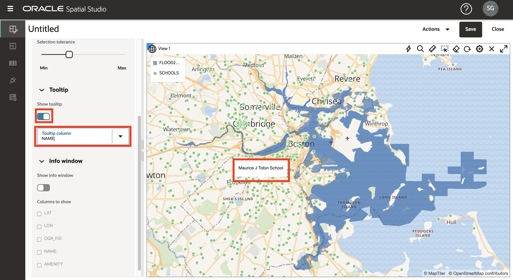

# Visualizar datos espaciales

## Introducción

En este laboratorio, explorará visualmente las regiones de inundación proyectadas y las características culturales. Puede crear un mapa interactivo y aplicar un estilo basado en datos para exponer las relaciones y los patrones de ubicación.

Tiempo de laboratorio estimado: 20 minutos

Vea el siguiente vídeo para una breve introducción al laboratorio.

[Visualice datos espaciales mediante Oracle Spatial Studio.](videohub:1_74fmvydy)

### Objetivos

*   Aprenda a crear mapas interactivos basados en los datos que ha preparado.
*   Aprenda a configurar el estilo y el comportamiento interactivo de su mapa.
*   Comprenda el uso de Projects para guardar su trabajo.

### Requisitos

*   Finalización del laboratorio 2: Carga y preparación de datos

## Tarea 1: Crear un proyecto

Comienza por crear un proyecto. Un proyecto es donde visualiza y analiza los datos y, a continuación, guarda el trabajo.

1.  Vaya a la página Proyectos y haga clic en **Crear proyecto**.
    
    
    
2.  Mueva el ratón sobre el mapa. Para desplazar el panel, haga clic y mantenga pulsado y, a continuación, arrastre el mapa. Para acercar y alejar, utilice la rueda del mouse.
    
    También puede mostrar un widget de navegación haciendo clic en el icono de engranaje situado encima del mapa y seleccionando la lista desplegable **Barra de navegación**. Seleccione **Zoom and Compass** y, a continuación, haga clic en **OK** (Aceptar).
    
    
    
    La activación de los controles de navegación mostrará un widget de navegación en el mapa.
    
    
    
3.  Haga clic en **Agregar juego de datos**, seleccione todos los juegos de datos y, a continuación, haga clic en **Aceptar**.
    
    
    
4.  Arrastre y suelte FLOOD2080 en el mapa.
    
    
    
5.  Repita el proceso para FLOOD2060 y, a continuación, FLOOD2040.
    
    
    
    **Nota:** Si las capas están en un orden diferente, puede arrastrarlas hacia arriba o hacia abajo en la lista Capas para cambiar su orden.
    
6.  Zoom en un área de áreas de inundación superpuestas para observar las diferencias en los modelos de inundación a lo largo del tiempo.
    
    
    
7.  Vea los modelos individuales de inundación haciendo clic en el icono del ojo para alternar la visibilidad de la capa.
    
    
    
8.  Utilizará FLOOD2060 para los siguientes pasos, así que elimine FLOOD2040 y FLOOD2080 de la asignación. Seleccione **Eliminar** en el menú de acción de FLOOD2040.
    
    
    
    A continuación, repita para FLOOD2080.
    
9.  Ajuste el mapa para que se ajuste a FLOOD2060 seleccionando **Acercar a capa** en el menú de acción.
    
    
    

## Tarea 2: Configurar capas de mapa

A continuación, agregue capas de mapa y aplique el estilo.

1.  En el menú de acción de FLOOD2060, haga clic en **Configuración**.
    
    
    
2.  Ahora está en el cuadro de diálogo Configuración de capa. En Fill, haga clic en el mosaico de color y ajústelo al azul oscuro y utilice el control deslizante para reducir la opacidad. En Outline, cambie el ancho a 0. Puede que tenga que desplazarse hacia abajo para ver toda la configuración.
    
    
    
3.  En pasos posteriores, seleccionará elementos en el mapa. Para evitar seleccionar toda el área de inundación, configure la capa para que no se pueda seleccionar. En la lista desplegable Configurar, seleccione **Interacción**. Cambie el conmutador **Permitir selección** a desactivado. El área de inundación todavía se puede utilizar para la visualización y el análisis, simplemente no se selecciona en el mapa con un clic del ratón.
    
    
    
4.  En la parte superior del cuadro de diálogo Configuración de capa, haga clic en la **flecha posterior** para volver a la lista Capas. Toma nota de este paso, ya que navegarás usando esta flecha hacia atrás muchas veces en este taller.
    
    
    
5.  Arrastre y suelte **SCHOOLS** en el mapa. A continuación, en el menú de acción de capa ESCUELAS, seleccione **Configuración**.
    
    
    
6.  Desplácese hacia abajo para ver secciones sobre estilos básicos (relleno) y trazo (esquema). Cambie la opacidad de relleno al 100 %. Cambie el color del trazo a blanco y la opacidad al 100%.
    
    
    
7.  Desplácese a la parte superior del cuadro de diálogo Configuración, despliegue el menú Configurar y seleccione **Interacción**.
    
    
    
8.  Desplácese hacia abajo hasta la sección Pista. Active las pistas y seleccione **NAME** como columna de pista. A continuación, pase el mouse sobre las escuelas para ver las pistas.
    
    
    
    Como hizo en un paso anterior, desplácese hasta la parte superior del cuadro de diálogo Configuración y haga clic en la **flecha de retroceso** para volver a la lista Capas.
    
    
    
    A continuación, configure estilos controlados dinámicamente por datos.
    
9.  Arrastre y suelte el juego de datos **FACILITIES** en el mapa. A continuación, en el menú de acción de capa FACILITIES, seleccione **Settings** (Configuración).
    
    
    
10.  Cambie el color de relleno a magenta y la opacidad al 100%. Cambie el color del trazo a blanco y la opacidad al 100%.
    
    
    
11.  En el menú Radio, seleccione la opción **Basado en datos**.
    

11.  En el menú de columna, seleccione **RISK\_SCORE** como columna para controlar el tamaño del símbolo de mapa. Haga clic en el **botón de lápiz** para crear bandejas de valores para el tamaño del símbolo. Introduzca **0** para mínimo, **1000** para máximo, **Intervalo** para agrupación y **4** para número de rangos. A continuación, haga clic en **Volver a generar valores bin**.

12.  Actualice los tamaños de los depósitos a **4**, **6**, **8**, **10**.

A continuación, haga clic en la **flecha hacia atrás** en el enlace superior para volver a Configuración de capa.

13.  A continuación, configure las ventanas emergentes. En el menú Configurar, seleccione **Interacción**.

14.  En el cuadro de diálogo Configuración, desplácese a la sección de la ventana Información. Active las ventanas de información con el conmutador **Mostrar ventana de información** y seleccione las columnas que desee. A continuación, haga clic en una instalación en el mapa para observar la ventana de información emergente.

Desplácese a la parte superior del cuadro de diálogo Configuración y haga clic en la **flecha hacia atrás** para volver a la lista Capas.

15.  Arrastre y suelte el juego de datos **BUILDINGS** en el mapa. A continuación, mueva la capa BUILDINGS a la parte inferior de la lista de capas para que otras capas, como el modelo de flujo, se representen en la parte superior. Para mover la capa en la lista de capas, haga clic para mantener la capa.

16.  Zoom en un área con edificios a lo largo del límite de inundación para observar la superposición.

La capa BUILDINGS incluye un atributo para el metraje cuadrado. A continuación, aplica el estilo a las parcelas según este atributo.

17.  Como ha hecho en pasos anteriores, en el menú de acción de capa BUILDINGS, seleccione **Configuración**. En la sección Rellenar, cambie la selección del menú Color a **Basado en datos**.

18.  En el menú Columna, seleccione **AREA\_SQ\_FT** como la columna que desea utilizar para controlar el color de relleno del edificio. Haga clic en el botón para **crear valores binarios**. Defina los valores mínimo y máximo en 100 y 10 000 respectivamente y haga clic en "Regenerate bin values".

    Click the **Set palette** button and select a color palette of your choosing.
    
       
    
       Navigate the map to explore the relationships between the flood area and your other layers. Add and remove the other flood models to observe differences in the relationships.
    
       In the next lab you will perform spatial analyses to identify items that satisfy various spatial relationships with the flood model.
    

19.  Es un buen momento para salvar su trabajo. Haga clic en el botón **Save** (Guardar) en la parte superior derecha. Asigne a su proyecto un nombre como SLR Project y, a continuación, haga clic en **Guardar**.

20.  En el panel de navegación principal de la izquierda, navegue hasta la página **Proyectos**. Observe que se muestra la miniatura del proyecto. Puede volver a visitar el proyecto más tarde haciendo clic en la miniatura.

Ahora puede **proceder al siguiente laboratorio**.

## Más información

*   [Página del producto Oracle Spatial](https://www.oracle.com/database/spatial)
*   [Introducción a Spatial Studio](https://www.oracle.com/database/technologies/spatial-studio/get-started.html)
*   [Documentación de Spatial Studio](https://docs.oracle.com/en/database/oracle/spatial-studio)

## Reconocimientos

*   **Autor**: David Lapp, Database Product Management, Oracle
*   **Contribuyentes**: Denise Myrick, Jayant Sharma
*   **Última actualización por/fecha**: David Lapp, agosto de 2023