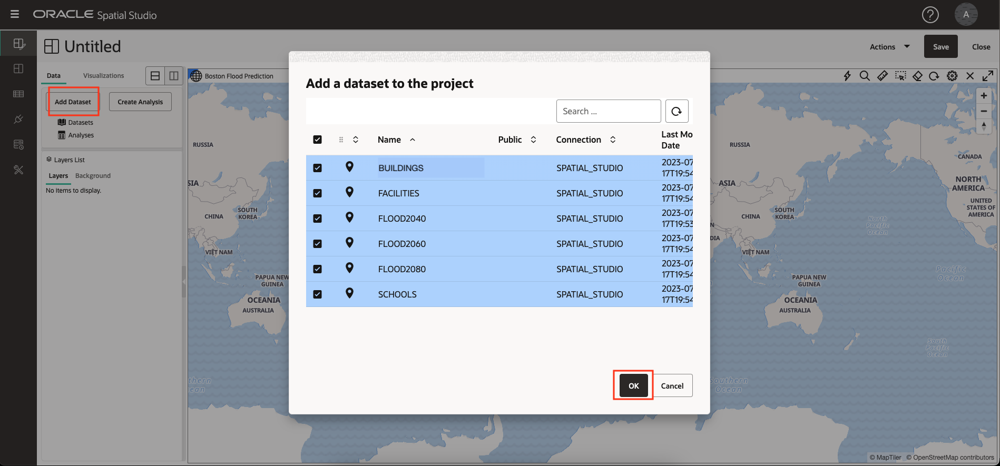
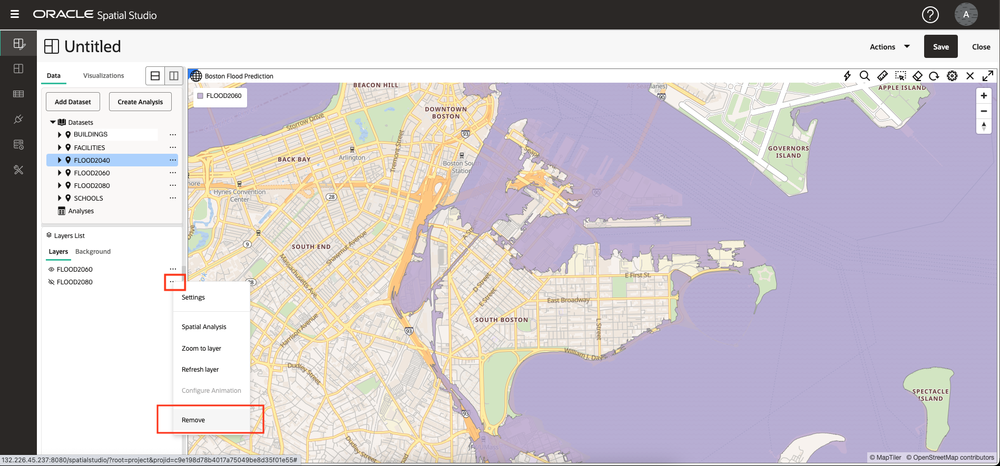
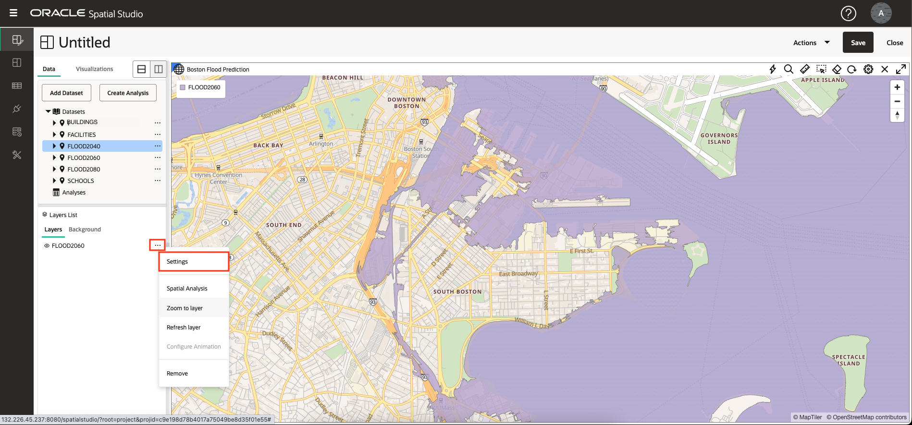

# Visualiser des données spatiales

## Présentation

Dans ce laboratoire, vous explorerez visuellement les régions inondables projetées et les caractéristiques culturelles. Vous créez une carte interactive et appliquez un style basé sur les données pour exposer les relations et les modèles d'emplacement.

Temps de laboratoire estimé : 20 minutes

Regardez la vidéo ci-dessous pour une présentation rapide du laboratoire.

[Visualiser les données spatiales à l'aide d'Oracle Spatial Studio](videohub:1_74fmvydy)

### Objectifs

*   Découvrez comment créer des cartes interactives basées sur les données que vous avez préparées.
*   Découvrez comment configurer le style et le comportement interactif de votre carte.
*   Comprendre l'utilisation de Projects pour enregistrer votre travail.

### Prérequis

*   Achèvement de l'atelier 2 : Charger et préparer les données

## Tâche 1 : créer un projet

Vous commencez par créer un projet. Un projet est l'endroit où vous visualisez et analysez vos données, puis enregistrez votre travail.

1.  Accédez à la page Projets et cliquez sur **Créer un projet**.
    
    
    
2.  Placez votre souris sur la carte. Pour faire un panoramique, cliquez et maintenez le bouton enfoncé, puis faites glisser la carte. Pour effectuer un zoom avant ou arrière, utilisez la molette de votre souris.
    
    Vous pouvez également afficher un widget de navigation en cliquant sur l'icône en forme d'engrenage au-dessus de la carte et en sélectionnant la liste déroulante **Barre de navigation**. Choisissez **Zoom et boussole**, puis cliquez sur **OK**.
    
    
    
    L'activation des contrôles de navigation affichera un widget de navigation dans la carte.
    
    
    
3.  Cliquez sur **Ajouter un ensemble de données**, sélectionnez tous vos ensembles de données, puis cliquez sur **OK**.
    
    
    
4.  Glissez-déplacez FLOOD2080 vers la carte.
    
    
    
5.  Répétez l'opération pour FLOOD2060, puis pour FLOOD2040.
    
    
    
    **Remarque :** si vos couches sont dans un ordre différent, vous pouvez faire glisser les couches vers le haut ou vers le bas dans la liste Couches pour modifier leur ordre.
    
6.  Effectuez un zoom sur une zone de zones d'inondation qui se chevauchent pour observer les différences dans les modèles d'inondation au fil du temps.
    
    
    
7.  Affichez les modèles d'inondation individuels en cliquant sur l'icône représentant un œil pour activer/désactiver la visibilité des calques.
    
    
    
8.  Vous utiliserez FLOOD2060 pour les étapes suivantes. Enlevez donc FLOOD2040 et FLOOD2080 de la carte. Sélectionnez **Enlever** dans le menu d'actions de FLOOD2040.
    
    
    
    Répétez ensuite pour FLOOD2080.
    
9.  Ajustez la carte pour l'adapter à FLOOD2060 en sélectionnant **Zoom sur la couche** dans le menu d'actions.
    
    
    

## Tâche 2 : configurer les couches de carte

Ensuite, vous ajoutez des calques de carte et appliquez un style.

1.  Dans le menu d'actions de FLOOD2060, cliquez sur **Paramètres**.
    
    
    
2.  Vous êtes maintenant dans la boîte de dialogue Paramètres de couche. Sous Remplissage, cliquez sur la mosaïque de couleur et ajustez-la au bleu foncé et utilisez le curseur pour réduire l'opacité. Sous Outline, remplacez la largeur par 0. Vous devrez peut-être faire défiler l'affichage vers le bas pour voir tous les paramètres.
    
    
    
3.  Dans les étapes suivantes, vous allez sélectionner des éléments dans la carte. Pour éviter de sélectionner la totalité de la zone d'inondation, vous configurez maintenant le calque pour qu'il ne soit pas sélectionnable. Dans la liste déroulante Configurer, sélectionnez **Interaction**. Désactivez l'option **Autoriser la sélection**. La zone inondable peut toujours être utilisée pour la visualisation et l'analyse, elle n'est tout simplement pas sélectionnée dans la carte avec un clic de souris.
    
    
    
4.  En haut de la boîte de dialogue Paramètres de couche, cliquez sur la **flèche vers l'arrière** pour revenir à la liste des couches. Prenez note de cette étape car vous naviguerez plusieurs fois à l'aide de cette flèche vers le bas dans cet atelier.
    
    
    
5.  Glissez-déplacez **SCHOOLS** sur la carte. Ensuite, dans le menu d'action de la couche SCHOOLS, sélectionnez **Paramètres**.
    
    
    
6.  Faites défiler vers le bas pour voir les sections sur les styles de base (remplissage) et de trait (outline). Définissez l'opacité de remplissage sur 100 %. Définissez la couleur du trait sur blanc et l'opacité sur 100 %.
    
    
    
7.  Faites défiler la boîte de dialogue Paramètres jusqu'en haut, déroulez le menu Configurer et sélectionnez **Interaction**.
    
    
    
8.  Faites défiler la page jusqu'à la section Info-bulle. Activez les info-bulles et sélectionnez **NAME** comme colonne d'info-bulle. Passez ensuite la souris sur les écoles pour afficher les info-bulles.
    
    
    
    Comme vous l'avez fait à une étape précédente, faites défiler la page jusqu'en haut de la boîte de dialogue Paramètres et cliquez sur la **flèche vers l'arrière** pour revenir à la liste Couches.
    
    
    
    Ensuite, vous configurez les styles de manière dynamique en fonction des données.
    
9.  Glissez-déplacez l'ensemble de données **FACILITIES** sur la carte. Ensuite, dans le menu d'action de la couche FACILITIES, sélectionnez **Paramètres**.
    
    
    
10.  Remplacez la couleur de remplissage par magenta et l'opacité par 100 %. Définissez la couleur du trait sur blanc et l'opacité sur 100 %.
    
    
    
11.  Dans le menu Rayon, sélectionnez l'option **Basé sur les données**.
    

11.  Dans le menu de colonne, sélectionnez **RISK\_SCORE** comme colonne pour déterminer la taille du symbole de carte. Cliquez sur le **bouton en crayon** pour créer des plages de valeurs pour le dimensionnement des symboles. Saisissez **0** pour le minimum, **1000** pour le maximum, **Intervalle** pour le regroupement et **4** pour le nombre de plages. Cliquez ensuite sur **Régénérer les valeurs d'emplacement**.

12.  Mettez à jour les tailles des emplacements sur **4**, **6**, **8**, **10**.

Cliquez ensuite sur la **flèche vers l'arrière** en haut du lien pour revenir aux paramètres de couche.

13.  Vous allez maintenant configurer les fenêtres contextuelles. Dans le menu Configurer, sélectionnez **Interaction**.

14.  Dans la boîte de dialogue Paramètres, faites défiler la page jusqu'à la section de la fenêtre Informations. Activez les fenêtres d'informations à l'aide du commutateur **Afficher la fenêtre d'informations** et sélectionnez les colonnes de votre choix. Ensuite, cliquez sur une installation dans la carte pour observer la fenêtre contextuelle de la fenêtre d'informations.

Faites défiler la boîte de dialogue Paramètres jusqu'en haut et cliquez sur la **flèche vers l'arrière** pour revenir à la liste Couches.

15.  Glissez-déplacez l'ensemble de données **BUILDINGS** sur la carte. Déplacez ensuite le calque BUILDINGS vers le bas de la liste des calques afin que d'autres calques tels que le modèle Flood soient affichés en haut. Pour déplacer le calque dans la liste des calques, cliquez-maintenez-le glisser.

16.  Effectuez un zoom avant sur une zone avec des bâtiments le long de la limite d'inondation pour observer le chevauchement.

La couche BUILDINGS inclut un attribut pour la superficie. Définissez ensuite le style des parcelles en fonction de cet attribut.

17.  Comme vous l'avez fait dans les étapes précédentes, dans le menu d'actions de la couche BUILDINGS, sélectionnez **Paramètres**. Sous la section Remplissage, remplacez la sélection du menu Couleur par **Basé sur les données**.

18.  Dans le menu Colonne, sélectionnez **AREA\_SQ\_FT** comme colonne à utiliser pour contrôler la couleur de remplissage du bâtiment. Cliquez sur le bouton pour **créer des valeurs d'emplacement**. Définissez les valeurs minimale et maximale sur 100 et 10 000 respectivement, puis cliquez sur "Regenerate bin values".

    Click the **Set palette** button and select a color palette of your choosing.
    
       
    
       Navigate the map to explore the relationships between the flood area and your other layers. Add and remove the other flood models to observe differences in the relationships.
    
       In the next lab you will perform spatial analyses to identify items that satisfy various spatial relationships with the flood model.
    

19.  C'est le bon moment pour sauver votre travail. Cliquez sur le bouton **Save** en haut à droite. Donnez à votre projet un nom tel que Projet SLR, puis cliquez sur **Enregistrer**.

20.  Dans le panneau de navigation principal à gauche, accédez à la page **Projets**. Observez que la miniature de votre projet s'affiche. Vous pouvez revenir sur le projet plus tard en cliquant sur la miniature.

Vous pouvez maintenant **passer à l'exercice suivant**.

## En savoir plus

*   [Page produit Oracle Spatial](https://www.oracle.com/database/spatial)
*   [Lancez-vous avec Spatial Studio](https://www.oracle.com/database/technologies/spatial-studio/get-started.html)
*   [Documentation de Spatial Studio](https://docs.oracle.com/en/database/oracle/spatial-studio)

## Accusés de réception

*   **Auteur** - David Lapp, Database Product Management, Oracle
*   **Contributeurs** - Denise Myrick, Jayant Sharma
*   **Dernière mise à jour par/date** - David Lapp, août 2023