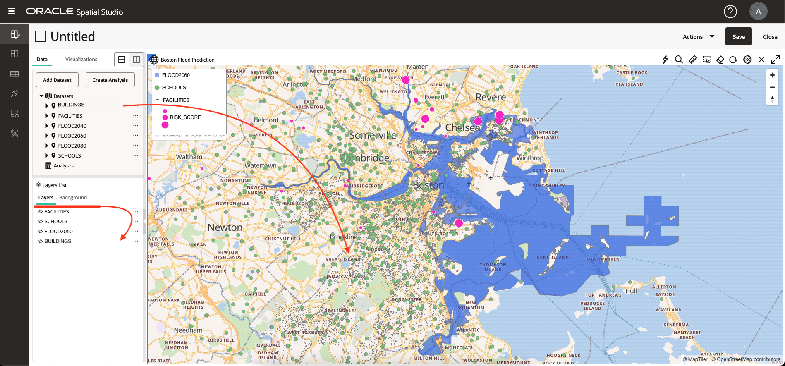

# 空間データのビジュアル化

## 概要

このラボでは、予測される洪水地域と文化的特徴を視覚的に調べます。対話型マップを作成し、データドリブン・スタイルを適用して、場所の関係とパターンを公開します。

推定ラボ時間: 20分

ラボのクイック・ウォークスルーについては、次のビデオをご覧ください。

[Oracle Spatial Studioを使用した空間データの視覚化](videohub:1_74fmvydy)

### 目標

*   準備したデータに基づいて対話型マップを作成する方法を学習します。
*   マップのスタイルとインタラクティブな動作を構成する方法を学習します。
*   プロジェクトを使用して作業内容を保存します。

### 前提条件

*   演習2の完了: データのロードと準備

## タスク1: プロジェクトの作成

まず、プロジェクトを作成します。プロジェクトは、データをビジュアル化して分析し、作業内容を保存します。

1.  「プロジェクト」ページにナビゲートし、**「プロジェクトの作成」**をクリックします。
    
    
    
2.  マウスをマップの上に移動します。パンをパンするには、クリックして保持し、マップをドラッグします。ズーム・インおよびズーム・アウトするには、マウス・ホイールを使用します。
    
    または、マップの上にある歯車アイコンをクリックし、**「ナビゲーション・バー」**ドロップダウンを選択して、ナビゲーション・ウィジェットを表示できます。**「ズームおよびコンパス」**を選択し、**「OK」**をクリックします。
    
    
    
    ナビゲーション・コントロールを有効にすると、マップにナビゲーション・ウィジェットが表示されます。
    
    
    
3.  **「データセットの追加」**をクリックし、すべてのデータセットを選択して、**「OK」**をクリックします。
    
    
    
4.  FLOOD2080をマップにドラッグ・アンド・ドロップします。
    
    
    
5.  FLOOD2060、FLOOD2040の順に繰り返します。
    
    
    
    **ノート:**レイヤーの順序が異なる場合は、「レイヤー」リストでレイヤーを上下にドラッグして順番を変更できます。
    
6.  重複する洪水領域の領域にズームして、時間の経過に伴う洪水モデルの違いを確認します。
    
    
    
7.  アイ・アイコンをクリックしてレイヤーの可視性を切り替えることで、個々のフラッド・モデルを表示します。
    
    
    
8.  次のステップではFLOOD2060を使用するため、マップからFLOOD2040およびFLOOD2080を削除します。FLOOD2040のアクション・メニューから**「削除」**を選択します。
    
    
    
    次に、FLOOD2080について繰り返します。
    
9.  アクション・メニューから**「レイヤーにズーム」**を選択して、マップをFLOOD2060に合せるように調整します。
    
    
    

## タスク2: マップ・レイヤーの構成

次に、マップ・レイヤーを追加し、スタイルを適用します。

1.  FLOOD2060のアクション・メニューから、**「設定」**をクリックします。
    
    
    
2.  「レイヤー設定」ダイアログが表示されます。\[塗りつぶし\]で、カラー タイルをクリックし、濃い青に調整し、スライダを使用して不透明度を減らします。「アウトライン」で、幅を0に変更します。すべての設定を表示するには、下にスクロールする必要がある場合があります。
    
    
    
3.  後のステップでは、マップでアイテムを選択します。フラッド領域全体を選択しないようにするには、選択できないようにレイヤーを構成します。「構成」プルダウンから、**「相互作用」**を選択します。**「選択の許可」**スイッチをオフに変更します。フラッド領域は引き続きビジュアライゼーションおよび分析に使用でき、マウス・クリックではマップで選択されません。
    
    
    
4.  「レイヤー設定」ダイアログの上部で、**戻る矢印**をクリックしてレイヤー・リストに戻ります。このワークショップではこの戻る矢印を使用して何度もナビゲートするため、このステップに注意してください。
    
    
    
5.  **SCHOOLS**をマップにドラッグ・アンド・ドロップします。次に、SCHOOLSレイヤーのアクション・メニューから**「設定」**を選択します。
    
    
    
6.  下にスクロールして、基本(塗りつぶし)スタイルとストローク(アウトライン)スタイルのセクションを表示します。塗りつぶしの不透明度を100%に変更します。ストロークの色を白に、不透明度を100%に変更します。
    
    
    
7.  「設定」ダイアログの上部までスクロールし、「構成」メニューをプルダウンして、**「相互作用」**を選択します。
    
    
    
8.  「ツールチップ」セクションまで下にスクロールします。ツールチップを有効にし、ツールチップ列として**「名前」**を選択します。次に、学校の上にマウスを置いてツールチップを表示します。
    
    
    
    前のステップで行ったように、「設定」ダイアログの上部までスクロールし、**戻る矢印**をクリックして「レイヤー」リストに戻ります。
    
    
    
    次に、データによって動的に駆動されるスタイルを構成します。
    
9.  **FACILITIES**データセットをマップにドラッグ・アンド・ドロップします。次に、「FACILITIES」レイヤーのアクション・メニューから**「Settings」**を選択します。
    
    
    
10.  塗りつぶしの色をマゼンタに、不透明度を100%に変更します。ストロークの色を白に、不透明度を100%に変更します。
    
    
    
11.  「半径」メニューから、**「データに基づく」**オプションを選択します。
    

11.  列メニューから、マップ・シンボル・サイズを制御する列として**RISK\_SCORE**を選択します。**鉛筆ボタン**をクリックして、記号サイズ設定用の値ビンを作成します。最小値には **0**、最大値には **1000**、グループ化には **Interval**、範囲数には **4**を入力します。次に、**「ビン値の再生成」**をクリックします。

12.  ビンのサイズを **4**、**6**、**8**、**10**に更新します。

次に、上部のリンクにある**戻る矢印**をクリックして、「レイヤー設定」に戻ります。

13.  次に、ポップアップ・ウィンドウを構成します。「構成」メニューから、**「相互作用」**を選択します。

14.  「設定」ダイアログで、「情報」ウィンドウ・セクションまで下にスクロールします。**「情報ウィンドウの表示」**スイッチを使用して情報ウィンドウを有効にし、選択した列を選択します。次に、マップ内の施設をクリックして、情報ウィンドウのポップアップを確認します。

「設定」ダイアログの上部までスクロールし、**戻る矢印**をクリックして「レイヤー」リストに戻ります。

15.  **BUILDINGS**データセットをマップにドラッグ・アンド・ドロップします。次に、BUILDINGSレイヤーをレイヤー・リストの下部に移動して、フラッド・モデルなどの他のレイヤーが上部にレンダリングされるようにします。レイヤ リストのレイヤを移動するには、レイヤをクリックしてドラッグします。

16.  洪水境界に沿った建物のあるエリアにズームして、重複を確認します。

BUILDINGSレイヤーには、平方映像の属性が含まれます。次に、この属性に従って区画をスタイル設定します。

17.  前のステップで実行したように、BUILDINGSレイヤーのアクション・メニューから**「設定」**を選択します。「塗りつぶし」セクションで、「色」メニューの選択を**「データに基づく」**に変更します。

18.  「列」メニューで、塗りつぶしの色を制御するために使用する列として**AREA\_SQ\_FT**を選択します。**「ビン値の作成」**ボタンをクリックします。最小値と最大値をそれぞれ100および10,000に設定し、「ビン値を再生成」をクリックします。

    Click the **Set palette** button and select a color palette of your choosing.
    
       
    
       Navigate the map to explore the relationships between the flood area and your other layers. Add and remove the other flood models to observe differences in the relationships.
    
       In the next lab you will perform spatial analyses to identify items that satisfy various spatial relationships with the flood model.
    

19.  仕事を救うには良い時期です。右上の**「保存」**ボタンをクリックします。SLRプロジェクトなどのプロジェクトに名前を付けて、**「保存」**をクリックします。

20.  左側のメイン・ナビゲーション・パネルから、**「プロジェクト」**ページにナビゲートします。プロジェクトのサムネイルが表示されることを確認します。サムネイルをクリックすると、後でプロジェクトを再確認できます。

**次の演習に進む**ことができます。

## さらに学ぶ

*   [Oracle Spatial製品ページ](https://www.oracle.com/database/spatial)
*   [Spatial Studioの開始](https://www.oracle.com/database/technologies/spatial-studio/get-started.html)
*   [Spatial Studioのドキュメント](https://docs.oracle.com/en/database/oracle/spatial-studio)

## 確認

*   **著者** - Oracle、データベース製品管理、David Lapp氏
*   **貢献者** - Denise Myrick、 Jayant Sharma
*   **最終更新者/日付** - David Lapp、2023年8月