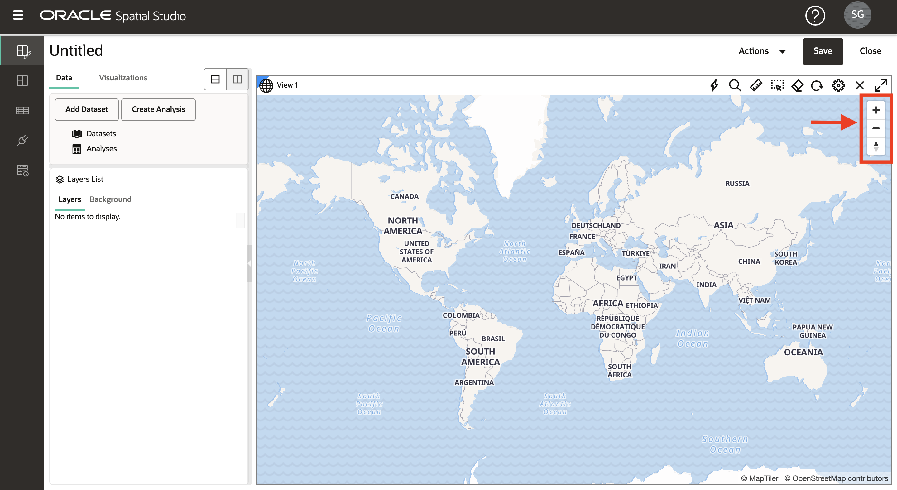
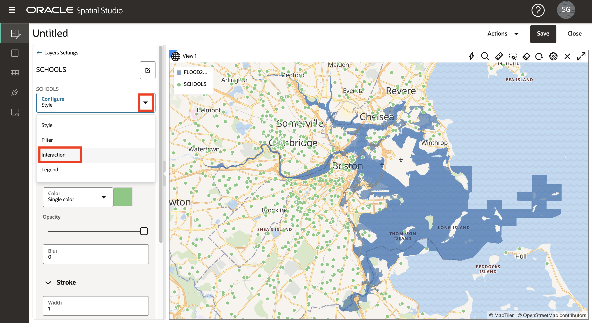
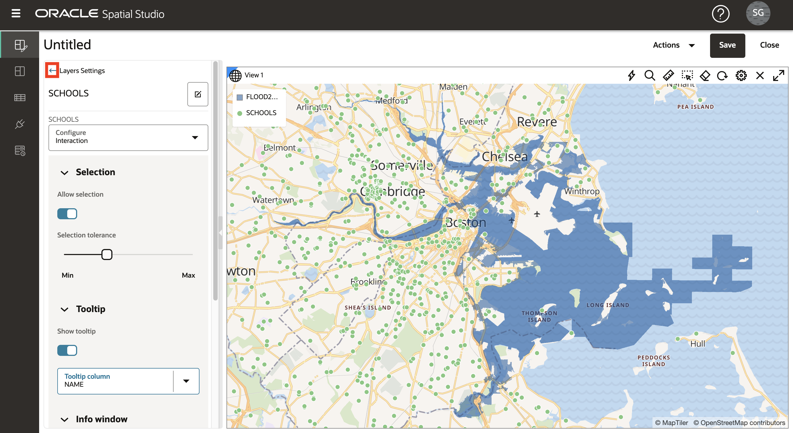

# 공간 데이터 시각화

## 소개

이 실습에서는 예상 홍수 지역과 문화적 특징을 시각적으로 살펴봅니다. 대화식 맵을 생성하고 데이터 기반 스타일 지정을 적용하여 위치 관계 및 패턴을 표시합니다.

예상 실험 시간: 20분

실습 과정을 간단히 살펴보려면 아래 비디오를 시청하십시오.

[Oracle Spatial Studio를 사용한 공간 데이터 시각화](videohub:1_74fmvydy)

### 목표

*   준비한 데이터를 기반으로 대화식 맵을 생성하는 방법을 알아봅니다.
*   맵의 스타일 및 대화식 동작을 구성하는 방법을 알아봅니다.
*   프로젝트 사용을 이해하여 작업을 저장합니다.

### 필요 조건

*   실습 2 완료: 데이터 로드 및 준비

## 작업 1: 프로젝트 생성

먼저 프로젝트를 만듭니다. 프로젝트는 데이터를 시각화하고 분석한 다음 작업을 저장하는 곳입니다.

1.  프로젝트 페이지로 이동하여 **프로젝트 생성**을 누릅니다.
    
    
    
2.  지도 위로 마우스를 이동합니다. 팬을 초점이동하려면 길게 클릭한 다음 지도를 드래그합니다. 확대 및 축소하려면 마우스 휠을 사용합니다.
    
    또는 맵 위의 기어 아이콘을 누르고 **탐색 막대** 드롭다운을 선택하여 탐색 위젯을 표시할 수 있습니다. **확대/축소 및 나침반**을 선택한 다음 **확인**을 누릅니다.
    
    
    
    탐색 콘트롤을 사용으로 설정하면 맵에 탐색 위젯이 표시됩니다.
    
    
    
3.  **데이터 집합 추가**를 누르고 모든 데이터 집합을 선택한 다음 **확인**을 누릅니다.
    
    
    
4.  FLOOD2080를 맵으로 끌어 놓습니다.
    
    
    
5.  FLOOD2060에 대해 반복한 다음 FLOOD2040를 반복합니다.
    
    
    
    **주:** 레이어가 다른 순서로 되어 있는 경우 \[레이어\] 목록에서 레이어를 위 또는 아래로 클릭하여 순서를 변경할 수 있습니다.
    
6.  겹치는 홍수 영역의 영역을 확대하여 시간에 따른 홍수 모델의 차이를 관찰합니다.
    
    
    
7.  눈 아이콘을 클릭하여 레이어 가시성을 전환하여 개별 홍수 모델을 봅니다.
    
    
    
8.  다음 단계에 FLOOD2060를 사용하므로 맵에서 FLOOD2040 및 FLOOD2080를 제거하십시오. FLOOD2040의 작업 메뉴에서 **제거**를 선택합니다.
    
    
    
    그런 다음 FLOOD2080에 대해 반복합니다.
    
9.  작업 메뉴에서 **계층으로 확대/축소**를 선택하여 FLOOD2060에 맞게 맵을 조정합니다.
    
    
    

## 작업 2: 맵 도면층 구성

다음으로 지도 도면층을 추가하고 스타일을 적용합니다.

1.  FLOOD2060의 작업 메뉴에서 **설정**을 누릅니다.
    
    
    
2.  이제 도면층 설정 대화상자에 있습니다. 채우기 아래에서 색상 타일을 클릭하고 진한 파란색으로 조정한 다음 슬라이더를 사용하여 불투명도를 줄입니다. Outline에서 폭을 0으로 변경합니다. 모든 설정을 보려면 아래로 스크롤해야 할 수 있습니다.
    
    
    
3.  다음 단계에서는 맵에서 항목을 선택합니다. 전체 플러드 영역을 선택하지 않으려면 이제 레이어를 선택할 수 없도록 구성합니다. 구성 풀다운에서 **상호 작용**을 선택합니다. **선택 허용** 스위치를 해제로 변경합니다. 홍수 영역은 여전히 시각화 및 분석에 사용할 수 있으며 마우스 클릭만으로 지도에서 선택되지 않습니다.
    
    
    
4.  \[레이어 설정\] 대화상자의 맨 위에서 **뒤쪽 화살표**를 눌러 \[레이어 목록\]으로 돌아갑니다. 이 워크샵에서 뒤로 화살표를 여러 번 사용하여 탐색할 것이므로 이 단계를 기록해 두십시오.
    
    
    
5.  **SCHOOLS**를 맵으로 끌어 놓습니다. 그런 다음 SCHOOLS 계층 작업 메뉴에서 **설정**을 선택합니다.
    
    
    
6.  아래로 스크롤하여 기본(채우기) 및 획(아웃라인) 스타일에 대한 섹션을 확인합니다. 채우기 불투명도를 100%로 변경합니다. 획 색상을 흰색으로, 불투명도를 100%로 변경합니다.
    
    
    
7.  \[설정\] 대화상자의 맨 위로 스크롤하여 \[구성\] 메뉴를 풀다운하고 **상호작용**을 선택합니다.
    
    
    
8.  Tooltip 섹션으로 이동합니다. 도구 설명을 사용으로 설정하고 **NAME**을 도구 설명 열로 선택합니다. 그런 다음 학교 위로 마우스를 가져가 툴팁을 확인합니다.
    
    
    
    이전 단계에서와 마찬가지로 \[설정\] 대화상자의 맨 위로 스크롤하고 **뒤로 화살표**를 눌러 \[레이어\] 목록으로 돌아갑니다.
    
    
    
    다음으로 데이터에 의해 동적으로 구동되는 스타일을 구성합니다.
    
9.  **FACILITIES** 데이터 세트를 맵으로 끌어 놓습니다. 그런 다음 FACILITIES 계층 작업 메뉴에서 **설정**을 선택합니다.
    
    
    
10.  칠 색상을 자홍색, 불투명도를 100%로 변경합니다. 획 색상을 흰색으로, 불투명도를 100%로 변경합니다.
    
    
    
11.  \[반경\] 메뉴에서 **데이터 기반** 옵션을 선택합니다.
    

11.  열 메뉴에서 **RISK\_SCORE**을 열로 선택하여 맵 기호 크기를 조정합니다. 기호 크기 조정을 위한 값 빈을 생성하려면 **연필 버튼**을 누릅니다. 최소값은 **0**, 최대값은 **1000**, 그룹화용 **간격**, 범위 수는 **4**를 입력합니다. 그런 다음 **저장소 값 재생성**을 누릅니다.

12.  저장소 크기를 **4**, **6**, **8**, **10**으로 업데이트합니다.

그런 다음 상단 링크에서 **뒤로 화살표**를 눌러 Layer Settings로 돌아갑니다.

13.  다음으로 팝업 창을 구성합니다. 구성 메뉴에서 **상호 작용**을 선택합니다.

14.  Settings 대화상자에서 Info window 섹션으로 이동합니다. **정보 창 표시** 스위치를 사용하여 정보 창을 사용으로 설정하고 선택한 열을 선택합니다. 그런 다음 지도에서 협업공간을 클릭하여 정보 창 팝업을 확인합니다.

\[설정\] 대화상자의 맨 위로 스크롤하고 **뒤로 화살표**를 눌러 \[레이어\] 목록으로 돌아갑니다.

15.  **BUILDINGS** 데이터 세트를 맵으로 끌어 놓습니다. 그런 다음 범람 모델과 같은 다른 도면층이 맨 위에 렌더링되도록 BUILDINGS 도면층을 도면층 리스트의 맨 아래로 이동합니다. 도면층 리스트에서 도면층을 이동하려면 보류(Click-hold) - 도면층을 드래그합니다.

16.  홍수 경계를 따라 건물이 있는 영역을 확대하여 겹침을 관찰합니다.

BUILDINGS 레이어에는 사각형 푸티지에 대한 속성이 포함됩니다. 그런 다음 이 속성에 따라 구획의 스타일을 지정합니다.

17.  이전 단계에서 수행한 대로 BUILDINGS 층 작업 메뉴에서 **설정**을 선택합니다. \[채우기\] 섹션에서 \[색상\] 메뉴 선택을 **데이터 기반**으로 변경합니다.

18.  \[열\] 메뉴에서 **AREA\_SQ\_FT**을 건물 채우기 색상 제어에 사용할 열로 선택합니다. 단추를 눌러 **저장소 값 생성**을 수행합니다. 최소값과 최대값을 각각 100과 10,000으로 설정하고 "저장소 값 재생성"을 누릅니다.

    Click the **Set palette** button and select a color palette of your choosing.
    
       
    
       Navigate the map to explore the relationships between the flood area and your other layers. Add and remove the other flood models to observe differences in the relationships.
    
       In the next lab you will perform spatial analyses to identify items that satisfy various spatial relationships with the flood model.
    

19.  이것은 당신의 일을 구하기 좋은 시간입니다. 오른쪽 위에 있는 **Save** 버튼을 누릅니다. 프로젝트에 SLR 프로젝트와 같은 이름을 지정한 다음 **Save**를 누릅니다.

20.  왼쪽의 기본 탐색 패널에서 **프로젝트** 페이지로 이동합니다. 프로젝트의 축소판 그림이 표시되는지 확인합니다. 축소판을 눌러 나중에 프로젝트를 다시 방문할 수 있습니다.

이제 **다음 실습을 진행하십시오**.

## 자세히 알아보기

*   [Oracle Spatial 제품 페이지](https://www.oracle.com/database/spatial)
*   [Spatial Studio 시작하기](https://www.oracle.com/database/technologies/spatial-studio/get-started.html)
*   [Spatial Studio 설명서](https://docs.oracle.com/en/database/oracle/spatial-studio)

## 확인

*   **작성자** - David Lapp, Oracle 데이터베이스 제품 관리
*   **제공자** - Denise Myrick, Jayant Sharma
*   **최종 업데이트 수행자/날짜** - David Lapp, 2023년 8월