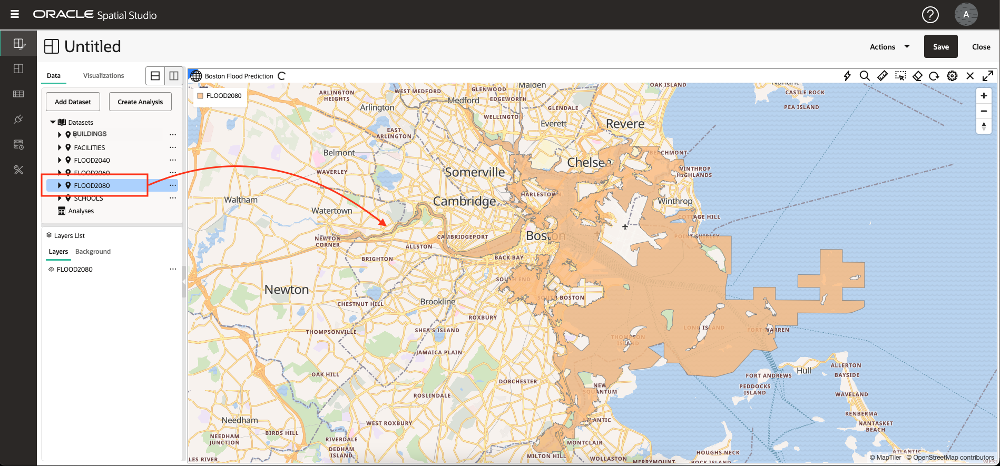
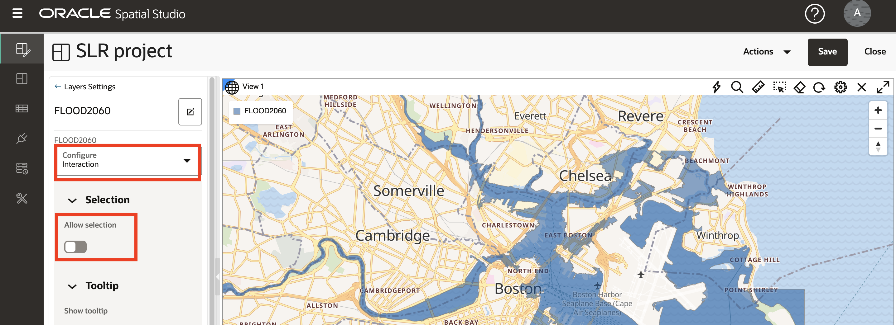

# Visualizar dados espaciais

## Introdução

Neste laboratório, você explora visualmente as regiões de inundação projetadas e as características culturais. Você cria um mapa interativo e aplica estilo orientado por dados para expor relacionamentos e padrões de localização.

Tempo de Laboratório Estimado: 20 minutos

Assista ao vídeo abaixo para uma rápida apresentação do laboratório.

[Visualize dados espaciais usando o Oracle Spatial Studio](videohub:1_74fmvydy)

### Objetivos

*   Saiba como criar mapas interativos com base nos dados que você preparou.
*   Saiba como configurar o estilo e o comportamento interativo do seu mapa.
*   Entenda o uso de Projetos para salvar seu trabalho.

### Pré-requisitos

*   Conclusão do Laboratório 2: Carregar e preparar dados

## Tarefa 1: Criar projeto

Comece criando um projeto. Um Projeto é onde você visualiza e analisa seus dados e, em seguida, salva seu trabalho.

1.  Navegue até a página Projetos e clique em **Criar Projeto**.
    
    
    
2.  Mova o mouse sobre o mapa. Para panorâmica, clique e segure e arraste o mapa. Para aumentar e diminuir o zoom, use a roda do mouse.
    
    Como alternativa, você pode exibir um widget de navegação clicando no ícone de engrenagem acima do mapa e selecionando o menu suspenso **Barra de Navegação**. Escolha **Zoom e Bússola** e clique em **OK**.
    
    
    
    A ativação dos controles de navegação mostrará um widget de navegação no mapa.
    
    
    
3.  Clique em **Adicionar Conjunto de Dados**, selecione todos os seus conjuntos de dados e clique em **OK**.
    
    
    
4.  Arraste e solte FLOOD2080 no mapa.
    
    
    
5.  Repita para FLOOD2060 e, em seguida, FLOOD2040.
    
    
    
    **Observação:** Se suas camadas estiverem em uma ordem diferente, você poderá clicar em reter e arrastar camadas para cima ou para baixo na lista Camadas para alterar sua ordem.
    
6.  Zoom em uma área de áreas de inundação sobrepostas para observar as diferenças nos modelos de inundação ao longo do tempo.
    
    
    
7.  Visualize modelos de inundação individuais clicando no ícone do olho para alternar a visibilidade da camada.
    
    
    
8.  Você usará o FLOOD2060 para as etapas a seguir; portanto, remova FLOOD2040 e FLOOD2080 do mapa. Selecione **Remover** no menu de ação para FLOOD2040.
    
    
    
    Em seguida, repita para FLOOD2080.
    
9.  Ajuste o mapa para ajustar-se a FLOOD2060 selecionando **Zoom para camada** no menu de ação.
    
    
    

## Tarefa 2: Configurar camadas de mapa

Em seguida, adicione camadas de mapa e aplique o estilo.

1.  No menu de ação de FLOOD2060, clique em **Definições**.
    
    
    
2.  Agora você está na caixa de diálogo Configurações de Camada. Em Preencher clique no bloco de cores e ajuste para azul escuro e use o controle deslizante para reduzir a opacidade. Em Outline, altere a largura para 0. Pode ser necessário rolar para baixo para ver todas as configurações.
    
    
    
3.  Em etapas posteriores, você está selecionando itens no mapa. Para evitar a seleção de toda a área de inundação, agora você configura a camada para não ser selecionável. Na lista suspensa Configurar, selecione **Interação**. Altere a opção **Permitir seleção** para desativada. A área de inundação ainda pode ser usada para visualização e análise, ela simplesmente não é selecionada no mapa com um clique do mouse.
    
    
    
4.  Na parte superior da caixa de diálogo Definições de Camada, clique na **seta para trás** para retornar à Lista de Camadas. Anote esta etapa, pois você navegará usando esta seta para trás muitas vezes neste workshop.
    
    
    
5.  Arraste e solte **SCHOOLS** no mapa. Em seguida, no menu de ação da camada SCHOOLS, selecione **Definições**.
    
    
    
6.  Role para baixo para ver seções nos estilos básico (preencher) e traçado (outline). Altere a opacidade de preenchimento para 100%. Altere a cor do traço para branco e opacidade para 100%.
    
    
    
7.  Role até a parte superior da caixa de diálogo Definições, acesse o menu Configurar e selecione **Interação**.
    
    
    
8.  Role para baixo até a seção Dica de ferramenta. Ative as dicas de ferramenta e selecione **NOME** como a coluna da dica de ferramenta. Em seguida, passe o mouse sobre as escolas para ver as dicas de ferramentas.
    
    
    
    Como você fez em uma etapa anterior, role até a parte superior da caixa de diálogo Configurações e clique na **seta para trás** para retornar à lista Camadas.
    
    
    
    Em seguida, você configura estilos dinamicamente orientados por dados.
    
9.  Arraste e solte o conjunto de dados **FACILITIES** no mapa. Em seguida, no menu de ação da camada FACILITIES, selecione **Definições**.
    
    
    
10.  Altere a cor de preenchimento para magenta e opacidade para 100%. Altere a cor do traço para branco e opacidade para 100%.
    
    
    
11.  No menu Raio, selecione a opção **Baseado em dados**.
    

11.  No menu de colunas, selecione **RISK\_SCORE** como a coluna para orientar o tamanho do símbolo de mapa. Clique no **botão de lápis** para criar compartimentos de valor para dimensionamento de símbolo. Informe **0** para o mínimo, **1000** para o máximo, **Intervalo** para agrupamento e **4** para o número de intervalos. Em seguida, clique em **Gerar novamente valores de compartimento**.

12.  Atualize os tamanhos dos compartimentos para **4**, **6**, **8**, **10**.

Em seguida, clique na **seta para trás** no link superior para retornar às Definições de Camada.

13.  Em seguida, você configura janelas pop-up. No menu Configurar, selecione **Interação**.

14.  Na caixa de diálogo Configurações, role para baixo até a seção da janela Informações. Ative as janelas de informações usando a opção **Mostrar janela de informações** e selecione as colunas de sua escolha. Em seguida, clique em uma instalação no mapa para observar o pop-up da janela de informações.

Role até a parte superior da caixa de diálogo Definições e clique na **seta para trás** para retornar à lista Camadas.

15.  Arraste e solte o conjunto de dados **BUILDINGS** no mapa. Em seguida, mova a camada BUILDINGS para a parte inferior da lista de camadas para que outras camadas, como o modelo de inundação, sejam renderizadas na parte superior. Para mover a camada na lista de camadas, clique em segurar-arrastar a camada.

16.  Zoom em uma área com edifícios ao longo da fronteira da inundação para observar a sobreposição.

A camada BUILDINGS inclui um atributo para imagens quadradas. Em seguida, estilize as parcelas de acordo com este atributo.

17.  Como você fez nas etapas anteriores, no menu de ação da camada PRÉDIOS, selecione **Definições**. Na seção Preenchimento, altere a seleção do menu Cor para **Com base nos dados**.

18.  No menu Coluna, selecione **AREA\_SQ\_FT** como a coluna a ser usada para controlar a cor de preenchimento do edifício. Clique no botão para **Criar valores de compartimento**. Defina os valores mínimo e máximo como 100 e 10.000 respectivamente e clique em "Gerar novamente valores de bin".

    Click the **Set palette** button and select a color palette of your choosing.
    
       
    
       Navigate the map to explore the relationships between the flood area and your other layers. Add and remove the other flood models to observe differences in the relationships.
    
       In the next lab you will perform spatial analyses to identify items that satisfy various spatial relationships with the flood model.
    

19.  Este é um bom momento para salvar o seu trabalho. Clique no botão **Salvar** no canto superior direito. Atribua um nome ao seu projeto, como SLR Project, e clique em **Save**.

20.  No painel de navegação principal à esquerda, navegue até a página **Projetos**. Observe que a miniatura do seu projeto é exibida. Você pode revisitar o projeto mais tarde clicando na miniatura.

Agora você pode **prosseguir para o próximo laboratório**.

## Saiba mais

*   [Página do produto Oracle Spatial](https://www.oracle.com/database/spatial)
*   [Conceitos Básicos do Spatial Studio](https://www.oracle.com/database/technologies/spatial-studio/get-started.html)
*   [Documentação do Spatial Studio](https://docs.oracle.com/en/database/oracle/spatial-studio)

## Agradecimentos

*   **Autor** - David Lapp, Database Product Management, Oracle
*   **Colaboradores** - Denise Myrick, Jayant Sharma
*   **Última Atualização em/Data** - David Lapp, agosto de 2023