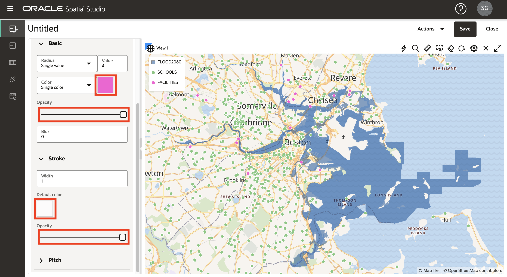

# 可视化空间数据

## 简介

在此实验室中，您可以直观地探索预计的洪水区域和文化特征。创建交互式地图并应用数据驱动的样式来公开位置关系和模式。

估计的实验室时间：20 分钟

观看下面的视频，快速浏览实验室。

[使用 Oracle Spatial Studio 可视化空间数据](videohub:1_74fmvydy)

### 目标

*   了解如何根据您准备的数据创建交互式地图。
*   了解如何配置地图的样式和交互行为。
*   了解如何使用项目来保存您的工作。

### 先备条件

*   实验室 2 的完成：加载和准备数据

## 任务 1：创建项目

首先创建一个项目。项目是可视化和分析数据，然后保存您所做的工作的地方。

1.  导航到“项目”页，然后单击**创建项目**。
    
    
    
2.  将鼠标移到地图上。要平移平移，请单击并按住，然后拖动地图。要放大和缩小，请使用鼠标滚轮。
    
    或者，可以通过单击地图上方的齿轮图标并选择**导航栏**下拉列表来显示导航窗口部件。选择**缩放和指南针**，然后单击**确定**。
    
    
    
    启用导航控件将在地图中显示导航窗口部件。
    
    
    
3.  单击**添加数据集**，选择所有数据集，然后单击**确定**。
    
    
    
4.  将 FLOOD2080 拖放到地图中。
    
    
    
5.  重复执行 FLOOD2060，然后重复执行 FLOOD2040。
    
    
    
    **注：**如果层的顺序不同，则可以在“层”列表中向上或向下单击暂挂拖动层以更改其顺序。
    
6.  放大重叠的洪水区域，以观察随着时间的推移洪水模型的差异。
    
    
    
7.  通过单击眼睛图标切换层可见性来查看单个洪水模型。
    
    
    
8.  您将使用 FLOOD2060 执行以下步骤，因此请从映射中删除 FLOOD2040 和 FLOOD2080。从 FLOOD2040 的操作菜单中选择**删除**。
    
    
    
    然后重复执行 FLOOD2080。
    
9.  通过从操作菜单中选择**缩放到层**，调整映射以适合 FLOOD2060。
    
    
    

## 任务 2：配置映射层

下一步，添加地图层并应用样式。

1.  从 FLOOD2060 的操作菜单中，单击**设置**。
    
    
    
2.  您现在处于“层设置”对话框中。在“填充”下，单击颜色磁贴并调整为深蓝色，然后使用滑块减少不透明度。在“Outline（大纲）”下，将宽度更改为 0。您可能需要向下滚动才能查看所有设置。
    
    
    
3.  在后面的步骤中，您将选择映射中的项。为了避免选择整个洪水区域，您现在将层配置为不可选择。从“配置”下拉列表中选择**交互**。将 **Allow selection（允许选择）**开关更改为 off。洪水区域仍然可用于可视化和分析，它只是没有在地图上选择鼠标点击。
    
    
    
4.  在“层设置”对话框的顶部，单击**向后箭头**以返回到“层列表”。请注意此步骤，因为您将在本研讨会中多次使用此向后箭头进行导航。
    
    
    
5.  将 **SCHOOLS** 拖放到地图上。然后，从“学校”层操作菜单中选择**设置**。
    
    
    
6.  向下滚动以查看有关基本（填充）和中风（大纲）样式的部分。将填充不透明度更改为 100%。将笔划颜色更改为白色，将不透明度更改为 100%。
    
    
    
7.  滚动到 "Settings"（设置）对话框的顶部，下拉 "Configure"（配置）菜单，然后选择 **Interaction（交互）**。
    
    
    
8.  向下滚动到“Tooltip（工具提示）”部分。启用工具提示并选择 **NAME** 作为工具提示列。然后将鼠标悬停在学校上方以查看工具提示。
    
    
    
    与上一步一样，滚动到 "Settings"（设置）对话框的顶部，然后单击 **back arrow（返回箭头）**以返回到 "Layers"（层）列表。
    
    
    
    接下来，配置由数据动态驱动的样式。
    
9.  将 **FACILITIES** 数据集拖放到地图上。然后，从“设施”层操作菜单中选择**设置**。
    
    
    
10.  将填充颜色更改为洋红色，将不透明度更改为 100%。将笔划颜色更改为白色，将不透明度更改为 100%。
    
    
    
11.  从“半径”菜单中，选择**基于数据**选项。
    

11.  从列菜单中，选择 **RISK\_SCORE** 作为用于驱动映射符号大小的列。单击**铅笔按钮**以创建用于符号大小调整的值框。输入 **0** 表示最小值，输入 **1000** 表示最大值，输入 **Interval** 表示分组，输入 **4** 表示范围数。然后单击**重新生成库位值**。

12.  将库位的大小更新为 **4** 、 **6** 、 **8** 、 **10** 。

然后单击顶部的**向后箭头**以返回到“层设置”。

13.  下一步，配置弹出窗口。从“配置”菜单中选择**交互**。

14.  在“设置”对话框中，向下滚动到“信息”窗口部分。使用**显示信息窗口**开关启用信息窗口，然后选择您选择的列。然后单击地图中的某个工具以观察信息窗口弹出窗口。

滚动到 "Settings"（设置）对话框的顶部，然后单击 **back arrow（返回箭头）**返回到 "Layers"（层）列表。

15.  将 **BUILDINGS** 数据集拖放到地图上。然后将 "BUILDINGS"（单元楼）层移至层列表的底部，以便其他层（如洪水模型）呈现于顶部。要移动图层列表中的图层，请单击 - 按住 - 拖动图层。

16.  放大沿洪水边界的建筑物以观察重叠的区域。

“单元楼”层包含平方英尺的属性。下一步，根据此属性设置地块样式。

17.  正如您在前面的步骤中所做的那样，从 "BUILDINGS" 层操作菜单中，选择**设置**。在“填充”部分下，将“颜色”菜单选择更改为**基于数据**。

18.  在“列”菜单中，选择 **AREA\_SQ\_FT** 作为用于控制建筑填充颜色的列。单击按钮以**创建库位值**。将最小值和最大值分别设置为 100 和 10,000，然后单击“重新生成库位值”。

    Click the **Set palette** button and select a color palette of your choosing.
    
       
    
       Navigate the map to explore the relationships between the flood area and your other layers. Add and remove the other flood models to observe differences in the relationships.
    
       In the next lab you will perform spatial analyses to identify items that satisfy various spatial relationships with the flood model.
    

19.  这是一个很好的时间来拯救你的工作。单击右上角的**保存**按钮。为项目指定一个名称（如 SLR 项目），然后单击 **Save（保存）**。

20.  从左侧的主导航面板中，导航到**项目**页。观察是否显示了项目的缩略图。您可以稍后通过单击缩略图重新访问项目。

现在，您可以**进入下一个练习**。

## 了解详细信息

*   [Oracle Spatial 产品页面](https://www.oracle.com/database/spatial)
*   [Spatial Studio 入门](https://www.oracle.com/database/technologies/spatial-studio/get-started.html)
*   [Spatial Studio 文档](https://docs.oracle.com/en/database/oracle/spatial-studio)

## 确认

*   **作者** - David Lapp，Oracle 数据库产品管理
*   **贡献者** - Denise Myrick、Jayant Sharma
*   **上次更新者/日期** - David Lapp，2023 年 8 月