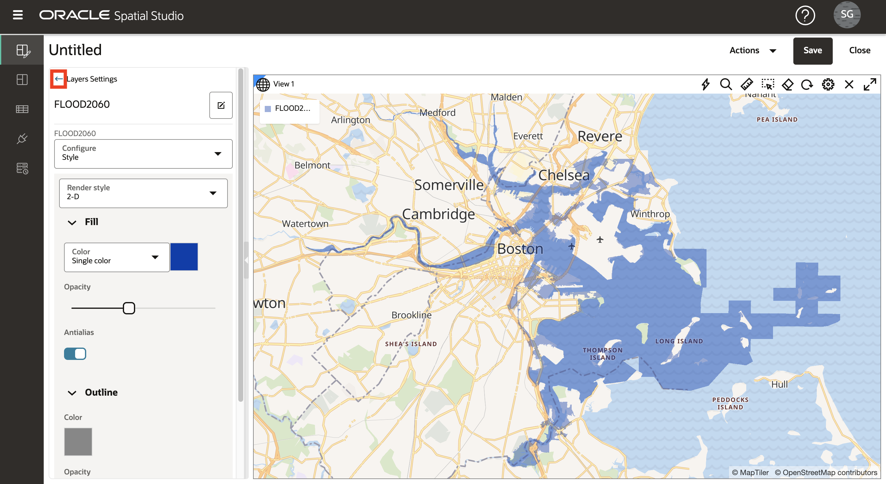
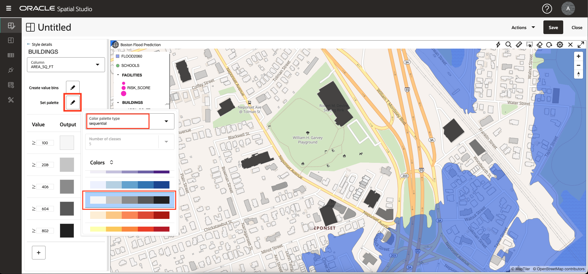

# 視覺化空間資料

## 簡介

在這個實驗室中，您將以視覺方式探索預計的洪水區域和文化特色。您可以建立互動式地圖並套用資料導向樣式，以顯示位置關係和模式。

預估實驗室時間：20 分鐘

請觀看下方影片，快速瞭解實驗室的逐步解說。

[使用 Oracle Spatial Studio 將空間資料視覺化](videohub:1_74fmvydy)

### 目標

*   瞭解如何根據您準備的資料建立互動式地圖。
*   了解如何設定地圖的樣式與互動行為。
*   瞭解專案的使用以儲存作業。

### 先決條件

*   完成實驗室 2：載入並準備資料

## 工作 1：建立專案

開始建立專案。「專案」是您視覺化並分析資料的位置，然後儲存工作。

1.  瀏覽至「專案 (Projects)」頁面，然後按一下**建立專案 (Create Project)** 。
    
    
    
2.  將滑鼠移至地圖上方。若要平移平移，請按一下並按住地圖，然後拖曳地圖。若要放大或縮小，請使用滑鼠滾輪。
    
    或者，您可以按一下地圖上方的齒輪圖示，然後選取**導覽列**下拉式清單，來顯示導覽小工具。選擇**縮放與指南**，然後按一下**確定**。
    
    
    
    啟用導覽控制項將會顯示地圖中的導覽小工具。
    
    
    
3.  按一下**新增資料集**，選取所有資料集，然後按一下**確定**。
    
    
    
4.  將 FLOOD2080 拖放至地圖。
    
    
    
5.  重複 FLOOD2060，然後重複 FLOOD2040。
    
    
    
    **備註：**如果圖層順序不同，您可以按一下「圖層」清單中的保留拖曳圖層來變更其順序。
    
6.  縮放至重疊的洪水區域，觀察一段時間的洪水模型差異。
    
    
    
7.  按一下眼睛圖示切換圖層可見性，即可檢視個別的洪水模型。
    
    
    
8.  您將使用 FLOOD2060 進行下列步驟，因此請從地圖移除 FLOOD2040 和 FLOOD2080。從 FLOOD2040 的動作功能表中選取**移除**。
    
    
    
    然後重複 FLOOD2080。
    
9.  從動作功能表選取**縮放至圖層**，調整地圖以容納 FLOOD2060。
    
    
    

## 工作 2：設定地圖圖層

接下來新增地圖圖層並套用樣式。

1.  從 FLOOD2060 的動作功能表中，按一下**設定值**。
    
    
    
2.  您現在在「 圖層設定」對話框中了 。在「填滿」下，按一下顏色磚並調整為深藍色，並使用滑桿來減少不透明度。在「大綱」下，將寬度變更為 0。您可能需要向下捲動才能看到所有設定值。
    
    
    
3.  在稍後步驟中，您要在地圖中選取項目。為了避免選取整個洪水區域，您現在將該圖層設定為不可選取。從「設定」下拉式清單中選取**互動**。將**允許選取**開關變更為關閉。洪水區仍然可以用於視覺化和分析，只是在地圖中選取按一下滑鼠即可。
    
    
    
4.  在「圖層設定」對話方塊的頂端，按一下**返回箭頭**以返回「圖層清單」。請記下此步驟，因為您將在此研討會中使用此向後箭頭進行導覽。
    
    
    
5.  將 **SCHOOLS** 拖放至地圖。然後從 SCHOOLS 層動作功能表選取**設定值**。
    
    
    
6.  向下捲動以查看基本 (填滿) 和筆劃 (大綱) 樣式的區段。將填滿不透明度變更為 100%。將筆畫顏色變更為白色，不透明度為 100%。
    
    
    
7.  捲動至「設定值」對話方塊的頂端，下拉「設定」功能表，然後選取**互動**。
    
    
    
8.  向下捲動至 \[Tooltip\] (工具提示) 區段。啟用工具提示並選取 **NAME** 作為工具提示資料欄。然後將滑鼠移到學校上來檢視工具提示。
    
    
    
    如同前一個步驟，捲動至「設定」對話方塊的頂端，然後按一下**返回箭頭**以返回「圖層」清單。
    
    
    
    接下來，您將設定由資料動態驅動的樣式。
    
9.  將 **FACILITIES** 資料集拖放至地圖。然後從 FACILITIES 層動作功能表選取**設定值**。
    
    
    
10.  將填滿顏色變更為洋紅色，不透明度為 100%。將筆畫顏色變更為白色，不透明度為 100%。
    
    
    
11.  從「半徑」功能表中，選取**根據資料**選項。
    

11.  從資料欄功能表中，選取 **RISK\_SCORE** 作為資料欄以驅動對應符號大小。按一下**鉛筆按鈕**，以建立用於符號大小的值儲位。輸入 **0** 表示最小值，輸入 **1000** 表示最大值，輸入**間隔**表示分組，輸入 **4** 表示範圍數。然後按一下**重新產生儲位值**。

12.  將儲位的大小更新為 **4** 、 **6** 、 **8** 、 **10** 。

然後按一下頂端連結的**返回箭頭**，以返回「圖層設定值」。

13.  接下來，設定快顯視窗。從「設定」功能表中選取**互動**。

14.  在「設定」對話方塊中，向下捲動至「資訊」視窗區段。使用**顯示資訊視窗**切換來啟用資訊視窗，並選取您所選擇的資料欄。然後按一下地圖中的設施，以觀察資訊視窗的蹦現視窗。

捲動至「設定值」對話方塊的頂端，然後按一下**返回箭頭**以返回「圖層」清單。

15.  將 **BUILDINGS** 資料集拖放至地圖。然後將 BUILDINGS 層移到圖層清單底部，以便其他圖層 (例如洪水模型) 在頂端呈現。若要移動圖層清單中的圖層，請按住並拖曳圖層。

16.  沿著洪水邊界的建築物縮放至區域，以觀察重疊。

BUILDINGS 層包含平方英呎的屬性。您可以根據此屬性來設定宗地樣式。

17.  在先前步驟中完成後，請從 BUILDINGS 層動作功能表中選取**設定值**。在「填滿」區段下，將「顏色」功能表選項變更為**根據資料**。

18.  在「資料欄」功能表中，選取 **AREA\_SQ\_FT** 作為控制組建填滿顏色的欄。按一下按鈕以**建立儲位值**。將最小值與最大值分別設為 100 與 10,000，然後按一下「重新產生儲位值」。

    Click the **Set palette** button and select a color palette of your choosing.
    
       
    
       Navigate the map to explore the relationships between the flood area and your other layers. Add and remove the other flood models to observe differences in the relationships.
    
       In the next lab you will perform spatial analyses to identify items that satisfy various spatial relationships with the flood model.
    

19.  這是節省您工作的好時機。按一下右上方的**儲存**按鈕。為您的專案命名 (例如 SLR 專案)，然後按一下**儲存 (Save)** 。

20.  從左側的主要導覽面板，瀏覽至**專案**頁面。注意會顯示您專案的縮圖。您稍後可以點選縮圖來重新查看專案。

您現在可以**進入下一個實驗室**。

## 進一步瞭解

*   [Oracle Spatial 產品頁面](https://www.oracle.com/database/spatial)
*   [開始使用 Spatial Studio](https://www.oracle.com/database/technologies/spatial-studio/get-started.html)
*   [Spatial Studio 文件](https://docs.oracle.com/en/database/oracle/spatial-studio)

## 確認

*   **作者** - Oracle 資料庫產品管理 David Lapp
*   **貢獻者** - Denise Myrick，Jayant Sharma
*   **上次更新者 / 日期** - David Lapp，2023 年 8 月