# Räumliche Analysen ausführen

## Einführung

Spatial Studio bietet Zugriff auf die räumlichen Analysefeatures von Oracle Database, ohne Code schreiben zu müssen. Einfache Benutzeroberflächen werden für räumliche Analysen bereitgestellt, und die gesamte zugrunde liegende Datenbanksyntax wird automatisch im Hintergrund verarbeitet. Räumliche Analyseoperationen in Spatial Studio sind in folgende Kategorien unterteilt:

**Filter**

*   Containment: "Welches meiner Vermögenswerte befindet sich in einem Gefahrenbereich?"
*   Nähe: "Welche unserer Standorte sind innerhalb von 5 Meilen von einem projizierten Sturmpfad?"
*   ... und andere

**Kombinieren**

*   Join nach Standort: "Verknüpfen Sie Leads mit Vertriebsgebieten basierend auf Containment."
*   Artikel zusammenfassen: "Mehrere Countys in 1 Verkaufsgebiet zusammenfassen"
*   ... und andere

**Transformation**

*   Puffer: "Erstellen Sie die Form, die einen Feuerumfang um 10 Meilen umgibt."
*   Zentroid: "Erstellen Sie Punkte in der Mitte jedes Feuerumkreises."
*   ... und andere

**Kennzahl**

*   Gebiet: "Was sind die Gebiete der Sturmflutregionen in Quadratkilometern?"
*   Entfernung: "Was ist der Mindestabstand von jedem unserer Vermögenswerte zu einem prognostizierten Sturmpfad?"
*   ... und andere

**Analysen**

*   Zusammenfassend nach Region: "Wie hoch ist das Durchschnittsalter der Gebäude innerhalb jeder Planungsregion?"
*   Nächster Artikel: "Was ist das nächstgelegene Lager für jeden Filialstandort und wie weit ist es?"
*   ... und andere

In dieser Übung untersuchen Sie mehrere dieser räumlichen Analysen.

Geschätzte Laborzeit: 45 Minuten

### Ziele

*   Kategorien räumlicher Analysen in Spatial Studio verstehen
*   Spatial-Analysen durchführen und Ergebnisse visualisieren

### Voraussetzungen

*   Laborergebnisse 1-3 erfolgreich abgeschlossen

## Aufgabe 1: Nach Nähe filtern

In diesem Schritt verwenden Sie einen räumlichen Filter, um Unfälle innerhalb einer bestimmten Entfernung einer ausgewählten Polizeistation zu identifizieren.

1.  Klicken Sie zunächst auf eine Polizeistation. Im Bild unten habe ich auf die Polizeistation in der roten Box geklickt. Dadurch wird die Polizeistation ausgewählt, die für die Näherungsanalyse verwendet werden soll. Wenn bei der Auswahl ein Problem auftritt, bestätigen Sie, dass **Auswahl zulassen** für die Ebene POLICE\_POINTS aktiviert ist, wie in Übung 3, Aufgabe 6 beschrieben.

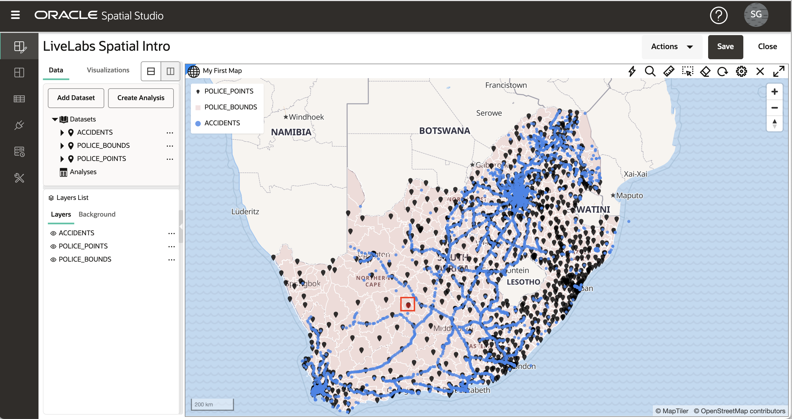

2.  Öffnen Sie das Aktionsmenü für die Schicht ACCIDENTS, und wählen Sie **Räumliche Analyse** aus.
    
    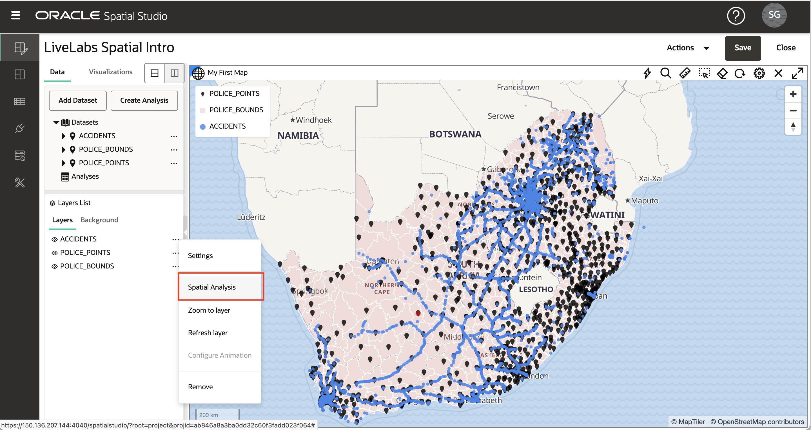
    
3.  Klicken Sie auf die Registerkarte **Filter**, und wählen Sie **Ausprägungen in einer bestimmten Entfernung von einer anderen zurückgeben** aus.
    
    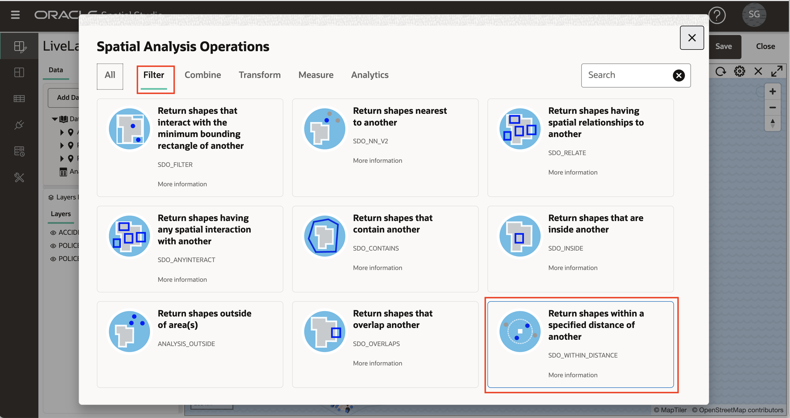
    
4.  Im Analysedialog können Sie einen Namen für das Ergebnis eingeben oder den Standardwert beibehalten. Wir filtern ACCIDENTS basierend auf der Entfernung zu einem ausgewählten Element in POLICE\_POINTS. Im Beispiel unten habe ich eine Entfernung von 150 Kilometern verwendet.
    
    **Hinweis:** Die Analyse enthält Switches zu **• Nur ausgewählte Elemente im Layer oben** für die beteiligten Layer. Wir sind nur daran interessiert, in diesem Beispiel die 1 ausgewählte Polizeistation zur Näherungsanalyse einzubeziehen. Daher muss für POLICE\_POINTS für **• Nur ausgewählte Elemente im Layer oben einschließen** der Wert **Ein** angegeben werden.
    
    Klicken Sie nach der Auswahl auf **Run**.
    
    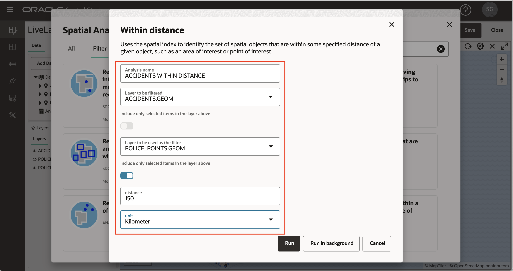
    
5.  Das Analyseergebnis wird im Bereich "Datenelemente" unter "Analysen" aufgeführt. Ziehen Sie das Analyseergebnis per Drag-and-Drop auf die Karte. Dadurch wird eine neue Kartenschicht erstellt, die nur die Unfälle innerhalb der angegebenen Entfernung der ausgewählten Polizeistation anzeigt.
    
    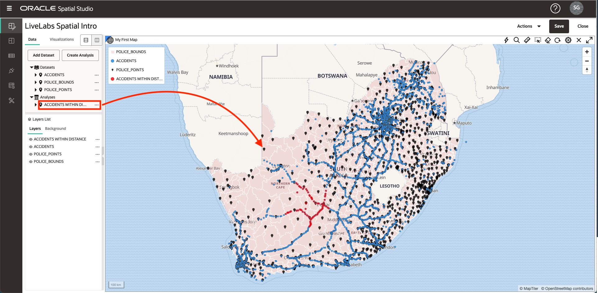
    
    **Hinweis:** Analyseergebnisse sind nur ein anderer Dataset-Typ in Spatial Studio. Wie Sie in einer späteren Übung sehen, können Analyseergebnisse anderen Karten/Tabellen hinzugefügt, in anderen Projekten verwendet, programmgesteuert über REST oder SQL aufgerufen oder als Datei exportiert werden.
    
6.  Sie benötigen dieses Analyseergebnis nicht mehr in der Karte. Um Unordnung zu vermeiden, entfernen Sie sie als Nächstes von der Karte. Klicken Sie mit der rechten Maustaste auf das Analyseergebnis in der Ebenenliste, und wählen Sie **Entfernen** aus.
    
    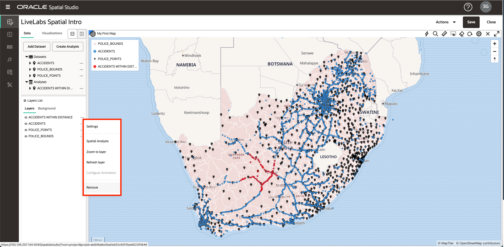
    
    **Hinweis:** Ein Layer ist nur ein Dataset, das in einer Karte gerendert wird. Nach dem Entfernen einer Ebene (in diesem Fall unser Analyseergebnis) wird das Dataset weiterhin im Bereich "Datenelemente" aufgeführt und kann der Karte erneut hinzugefügt werden. Um ein Dataset aus einem Projekt zu entfernen, klicken Sie im Bereich "Datenelemente" mit der rechten Maustaste auf das Dataset, und wählen Sie **Aus Projekt entfernen** aus.
    

## Aufgabe 2: Nach Containment filtern

In diesem Schritt verwenden Sie einen räumlichen Filter, um Unfälle innerhalb einer ausgewählten Polizeiregion zu identifizieren.

1.  Klicken Sie zunächst in eine Region in der Ebene POLICE\_BOUNDS. Die ausgewählte Region wird zum Filtern von Unfällen verwendet. Im Bild unten wurde der Bereich im roten Feld ausgewählt.
    
    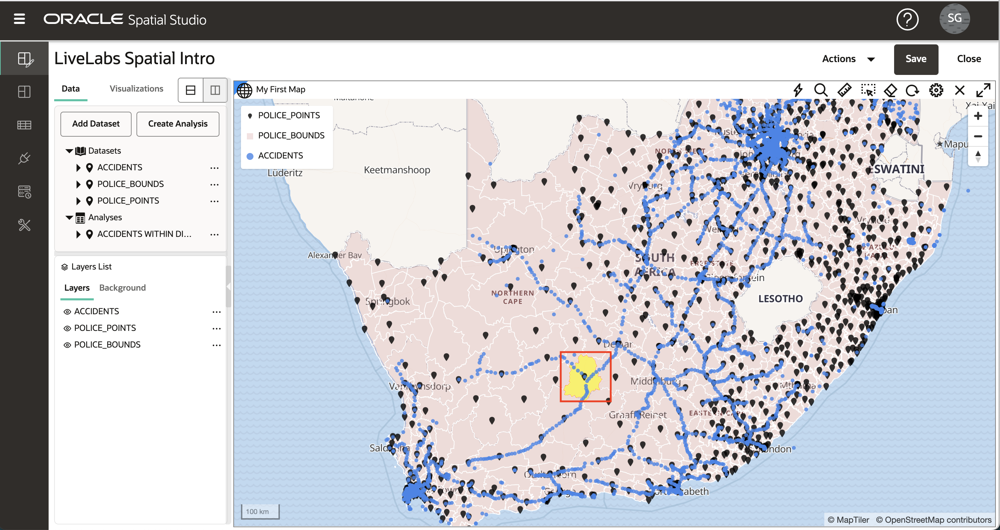
    
2.  Öffnen Sie wie bei der vorherigen Analyse in Schritt 1 das Aktionsmenü für die Schicht ACCIDENTS, und wählen Sie Räumliche Analyse aus. Diesmal filtern wir nach Containment. Wählen Sie also die Kachel **Ausprägungen zurückgeben, die sich in einer anderen befinden**
    
    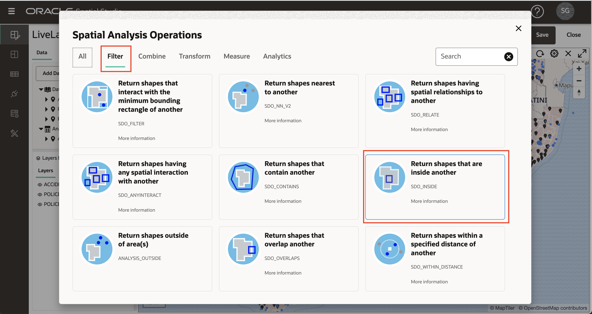
    
3.  Sie können einen Namen für die Ergebnisse eingeben oder den Standardwert übernehmen. Der zu filternde Layer ist ACCIDENTS, und der als Filter verwendete Layer ist POLICE\_BOUNDS. Die Option **Nur ausgewählte Elemente einschließen** sollte für POLICE\_BOUNDS ausgewählt werden, da nur nach Unfällen gefiltert wird, die in der einzelnen ausgewählten Polizeiregion enthalten sind.
    
    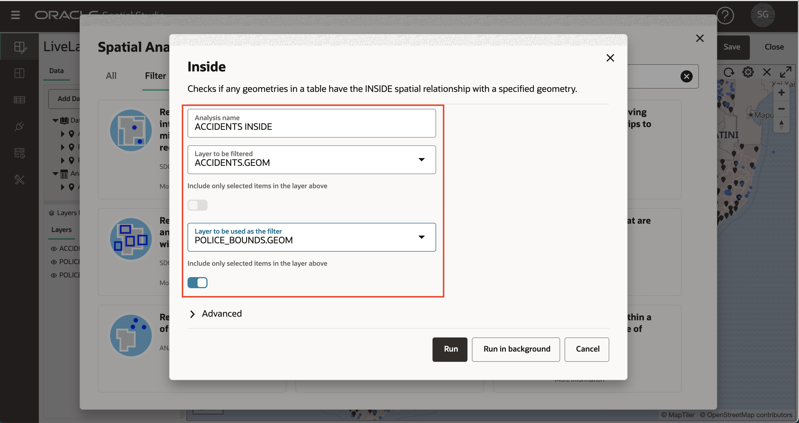
    
4.  Ziehen Sie das Analyseergebnis per Drag-and-Drop in die Karte. Beobachten Sie die neue Ebene mit den Unfällen innerhalb der ausgewählten Polizeiregion.
    
    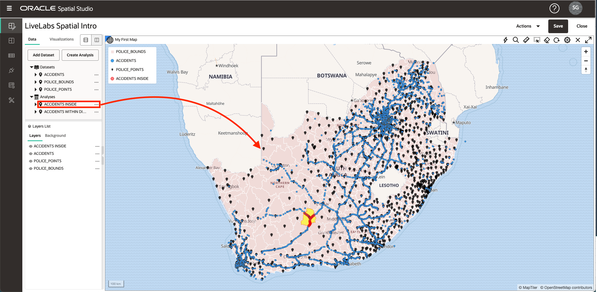
    
    Mit dem Mausrad können Sie den Ergebnisbereich vergrößern. Im Bild unter der Schicht ACCIDENTS ist der Fokus auf das Analyseergebnis deaktiviert.
    
    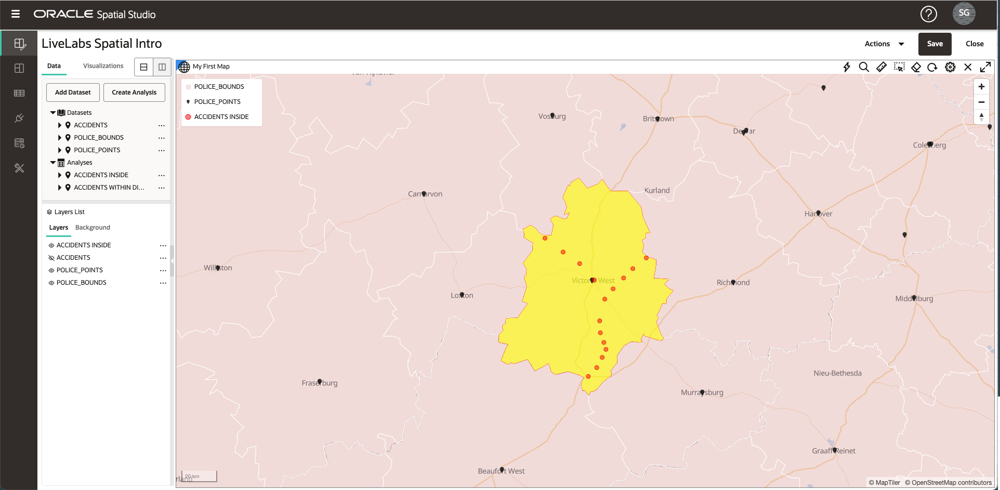
    
5.  Bevor Sie mit der nächsten Analyse fortfahren, vergrößern Sie den vollständigen Umfang Ihrer Daten, indem Sie das Aktionsmenü für die Ebene POLICE\_BOUNDS öffnen und **Zoom auf Ebene** auswählen und die Containment-Analyse aus der Karte entfernen.
    

## Aufgabe 3: Nach Containment beitreten

Hier verbinden Sie Datasets basierend auf einer räumlichen Beziehung. Sie werden ACCIDENTS je nach Containment mit POLICE\_BOUNDS verbinden. Sie können sich das als Bereicherung oder Kennzeichnung jedes Unfalls mit der Polizeiregion vorstellen, die ihn enthält.

1.  Wie bei früheren Analysen öffnen Sie in der Ebenenliste das Aktionsmenü für die Schicht ACCIDENTS, und wählen Sie Räumliche Analyse aus. Wählen Sie die Registerkarte **Kombinieren** und dann die Kachel **Spatial Join** aus.
    
    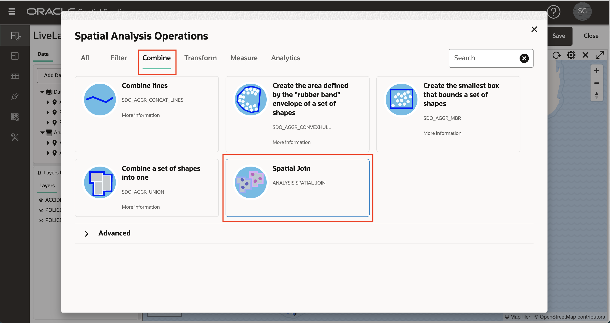
    
2.  Geben Sie im Dialogfeld "Spatial Join" den Namen ACCIDENTS\_JOIN\_POLICE\_BOUNDS für das Ergebnis ein. Für die zusätzlichen Einträge verknüpfen Sie Elemente in ACCIDENTS basierend auf der räumlichen Beziehung Inside mit Elementen in POLICE\_BOUNDS. Dieser Vorgang führt zu einem neuen Dataset mit ACCIDENTS, das mit der eindeutigen ID der Region POLICE\_BOUNDS angereichert ist, die jedes Element enthält. Die eindeutige ID (d.h. Schlüsselspalte) für POLICE\_BOUNDS ist COMPNT\_NM. Daher wird erwartet, dass diese Spalte im Ergebnis angezeigt wird. Klicken Sie auf **Run**.
    
    **Hinweis:** Mit der Option "Erweitert" können Sie alle Spalten aus dem sekundären Dataset (in diesem Fall POLICE\_BOUNDS) in das Ergebnis aufnehmen, anstatt nur die eindeutige ID.
    
    
    
3.  Das Ergebnis wird im Bereich "Datenelemente" unter "Analysen" aufgeführt. Erweitern Sie das Ergebnis, um seine Spalten anzuzeigen. Alle ursprünglichen Spalten aus ACCIDENTS plus COMPNT\_NM (d.h. Name der Polizeiregion) wie erwartet.
    
    
    
4.  Ziehen Sie die Analyse ACCIDENTS\_JOIN\_POLICE\_BOUNDS per Drag-and-Drop in die Karte. Öffnen Sie in der Ebenenliste das Aktionsmenü für die Ebene ACCIDENTS\_JOIN\_POLICE\_BOUNDS, und wählen Sie "Einstellungen", um den Stil nach Bedarf festzulegen und "Interaktion" zu aktivieren. Aktivieren Sie für Interaction ein Infofenster mit der Spalte COMPNT\_NM. Klicken Sie auf ein Absturzobjekt in der Karte und beobachten Sie COMPNT\_NM (d.h. den Namen der Polizeiregion) im Infofenster.
    
    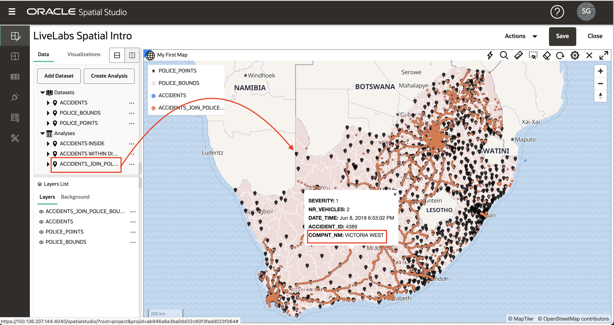
    
    Sie haben jetzt die Absturzdaten mit dem Namen der Polizeiregion pro Element erweitert. Die Ergebnisse können für weitere Analysen verwendet werden: Spatial Studio oder Zugriff durch andere Tools und Anwendungen wie Oracle Analytics Cloud für umfassendere Analysen.
    

## Aufgabe 4: Artikel nach Region zusammenfassen

Im vorherigen Schritt haben Sie Crash-Elemente mit der Polizeiregion erweitert. In diesem Schritt tun Sie das Gegenteil: Sie erweitern Polizeiregionen mit einer Zusammenfassung der Absturzinformationen.

1.  Öffnen Sie das Aktionsmenü für den Layer POLICE\_BOUNDS in der Ebenenliste, und wählen Sie Räumliche Analyse aus. Wählen Sie die Registerkarte **Analysen** und dann die Kachel **Nach Region zusammenfassen** aus.
    
    
    
2.  Im Dialogfeld "Nach Region zusammenfassen" können Sie den Dataset-Namen POLICE\_BOUNDS SUMMARIZE als Standardergebnis beibehalten. Geben Sie die anderen Elemente im Dialogfeld ein: Für jedes Element in POLICE\_BOUNDS fassen Sie ACCIDENTS basierend auf Anzahl zusammen. Geben Sie NUM\_ACCIDENTS als Spalte ein, die mit der Anzahl der Unfälle hinzugefügt werden soll. Klicken Sie auf **Run**.
    
    **Hinweis:** Neben "Anzahl" können Sie auch numerische Attribute mit dieser Analyse zusammenfassen, z.B. mit "Durchschnitt".
    
    
    
3.  Ziehen Sie das Ergebnis POLICE\_BOUNDS SUMMARIZE auf die Karte. Öffnen Sie dann in der Ebenenliste das Aktionsmenü für POLICE\_BOUNDS SUMMARIZE und wählen Sie Einstellungen aus. Ändern Sie unter "Stil" die Farbe in **Basierend auf Daten**.
    
    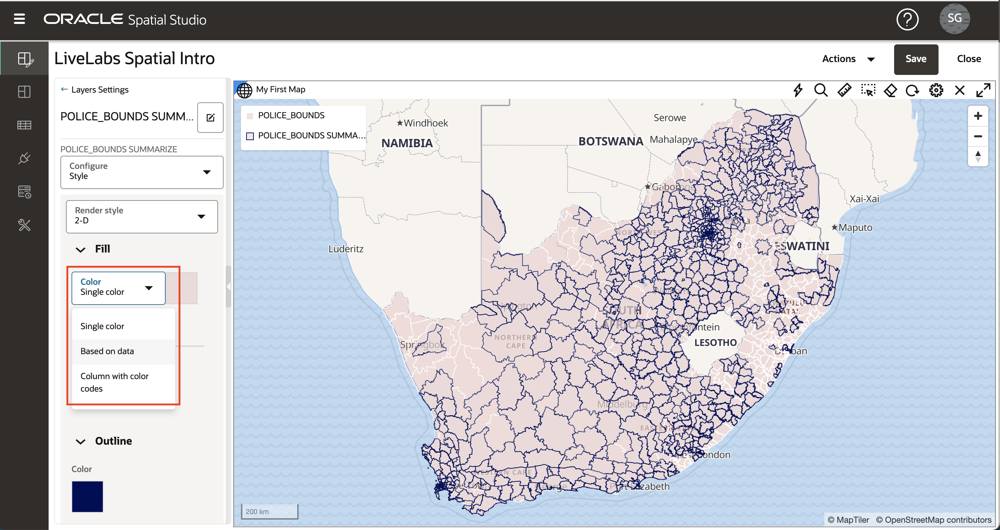
    
4.  Wählen Sie für die Spalte NUM\_ACCIDENTS aus. Aktualisieren Sie die Werte mit 1, 5, 10, 15, 20. Geben Sie jeden Wert in eine beliebige Zelle ein, da er automatisch in der Werteliste sortiert wird. Nachdem die Werte eingegeben wurden, klicken Sie auf das Bearbeitungssymbol, um die Palette festzulegen, und wählen Sie eine Farbpalette aus. Beobachten Sie die Kartenanzeige Polizeiregionen farblich codiert durch die Anzahl der Unfälle entsprechend Ihrem Wert und Palette Einträge.
    
    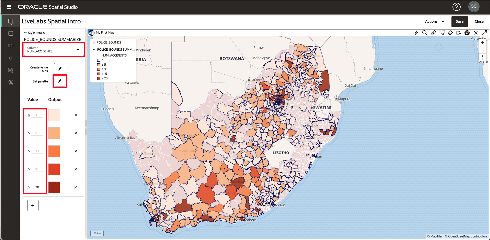
    
    Fühlen Sie sich frei, ein Infofenster oder eine QuickInfo mit Unfallzahlen hinzuzufügen, wenn Sie auf eine Polizeiregion klicken oder mit der Maus über diese fahren. Wie in Übung 2, Aufgabe 3, können Sie auch eine Tabellenansicht hinzufügen und in POLICE\_BOUNDS SUMMARIZE ziehen, um die Informationen in tabellarischer Form anzuzeigen.
    

## Aufgabe 5: Nächstgelegene Artikel identifizieren

In diesem Schritt bestimmen Sie den nächsten Unfall zu jeder Polizeistation. Das Ergebnis enthält jede Polizeistation, die mit der ID und der Entfernung zum nächsten Unfall ergänzt wird. Die Analyse bietet auch eine Option, alle Spalten für das nächste Element anstelle von ID und Entfernung einzubeziehen.

1.  Öffnen Sie das Aktionsmenü für den Layer POLICE\_POINTS in der Ebenenliste, und wählen Sie Räumliche Analyse aus. Wählen Sie die Registerkarte **Analysen** aus, und klicken Sie auf die Kachel **Nächste pro Element**.
    
    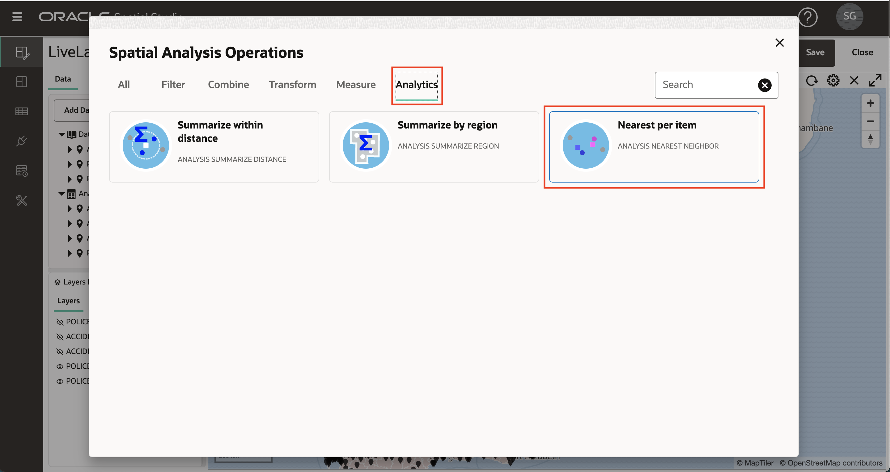
    
2.  Benennen Sie im Dialogfeld "Nächster Wert pro Element" das Ergebnis POLICE\_POINTS WITH NEAREST ACCIDENT (oder einen Namen Ihrer Wahl). Für jedes Element in POLICE\_POINTS finden Sie das nächste Element in ACCIDENTS. Blenden Sie den Abschnitt "Erweitert" ein. Aktivieren Sie die Optionen zum Einbeziehen der Entfernung in das Ergebnis. Geben Sie als Namen der Abstandsspalte DISTANCE\_TO\_ACCIDENT (oder einen Namen Ihrer Wahl) ein. Ändern Sie die Entfernungseinheiten in Kilometer (oder eine andere Einheit Ihrer Wahl).
    
    Klicken Sie dann auf **Run**.
    
    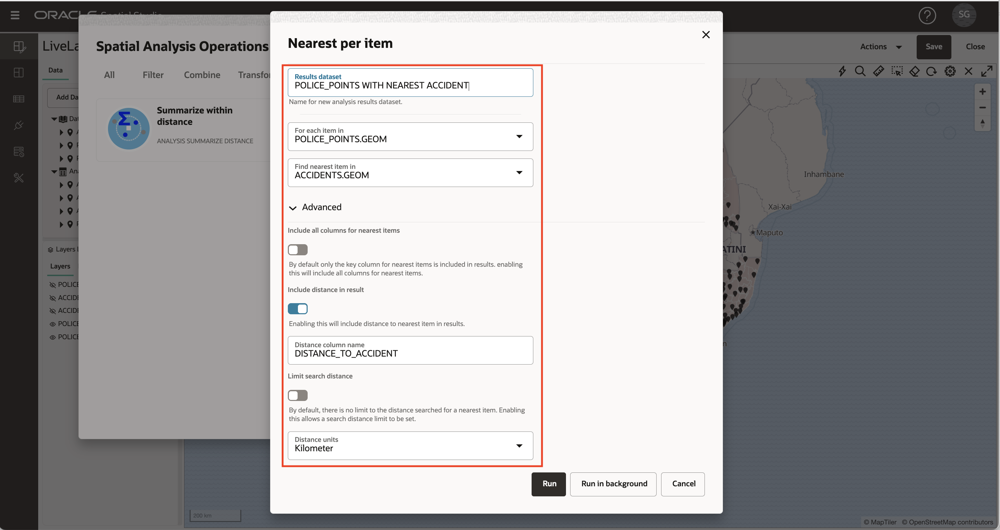
    
3.  Deaktivieren Sie in der Liste "Layer" die Ebene POLICE\_POINTS. Ziehen Sie die Analyse POLICE\_POINTS WITH NEAREST ACCIDENT auf die Karte.
    
    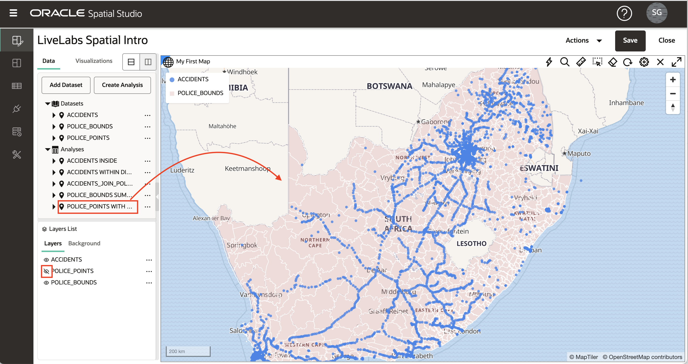
    
4.  Gehen Sie zu Einstellungen für die Ebene POLICE\_POINTS WITH NEAREST ACCIDENT und legen Sie einen Stil Ihrer Wahl fest. Wählen Sie im Pulldown-Menü "Konfigurieren" die Option "Interaktion", und aktivieren Sie dann ein Infofenster. Wählen Sie Spalten Ihrer Wahl aus, einschließlich der von dieser Analyse hinzugefügten Spalten: ACCIDENT\_ID und DISTANCE\_TO\_ACCIDENT. Klicken Sie auf ein POLICE\_POINTS-Element, und beobachten Sie, wie im Infofenster die ID und der Abstand zum nächsten Element in ACCIDENTS angezeigt werden. 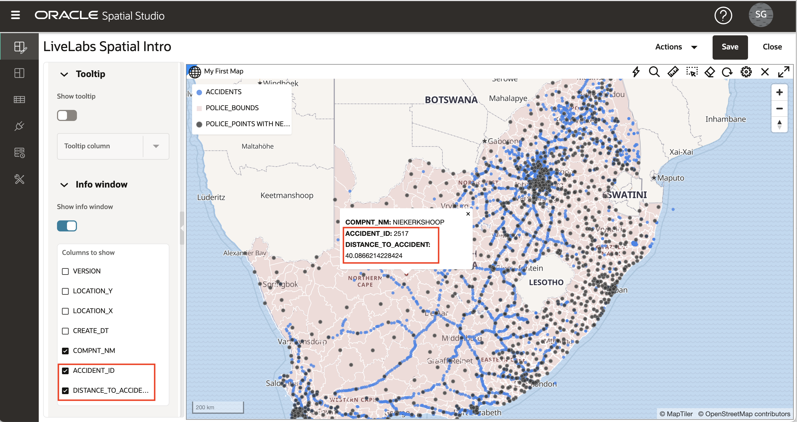
    
    Fühlen Sie sich frei, jetzt Polizeistationen basierend auf der Entfernung zum nächsten Unfall mit Farben oder Größe zu stylen.
    
    Speichern Sie das Projekt, um die Änderungen beizubehalten.
    

## Aufgabe 6: Auf SQL-Code und GeoJSON-Endpunkt zugreifen \[Optional\]

Dieser optionale Schritt richtet sich an Entwickler, die programmgesteuert auf Ergebnisse zugreifen möchten. Mit Spatial Studio können Sie den SQL-Code für räumliche Analysen anzeigen und einen Webendpunkt bereitstellen, der Ergebnisse als GeoJSON zurückgibt. Diese Informationen sind in Datenset-Eigenschaften verfügbar und werden entweder in einem Projekt oder über die Datensetseite aufgerufen. Sie greifen von Ihrem Projekt aus auf die Informationen zu.

1.  Öffnen Sie im Bereich "Datenelemente" das Aktionsmenü für eine Ihrer Analysen. Beispiel: **ACCIDENTS INSIDE**, und wählen Sie **Eigenschaften** aus.

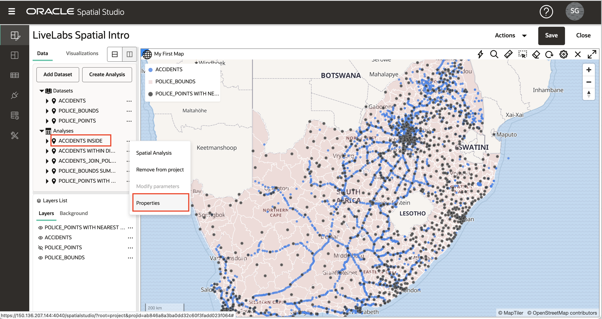

2.  Beachten Sie die Abschnitte mit SQL-Code und dem Endpunkt GeoJSON.

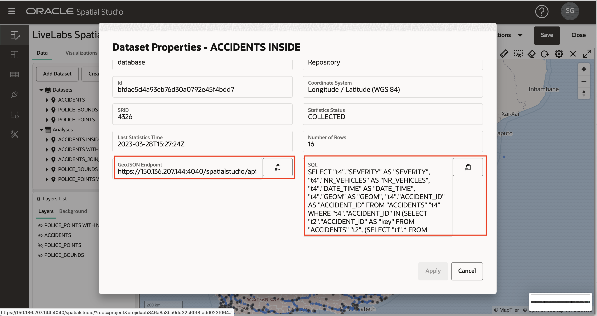

    On your own, paste the GeoJSON endpoint into a browser and observe your results returned as GeoJSON. Similarly, you may copy and paste the SQL code into SQL Developer Web to run the analysis directly. 
    

Damit ist der Workshop "Intro to Oracle Spatial Studio" abgeschlossen.

## Danksagungen

*   **Autor** - David Lapp, Database Product Management
*   **Zuletzt aktualisiert am/um** - Denise Myrick, Database Product Management, April 2023