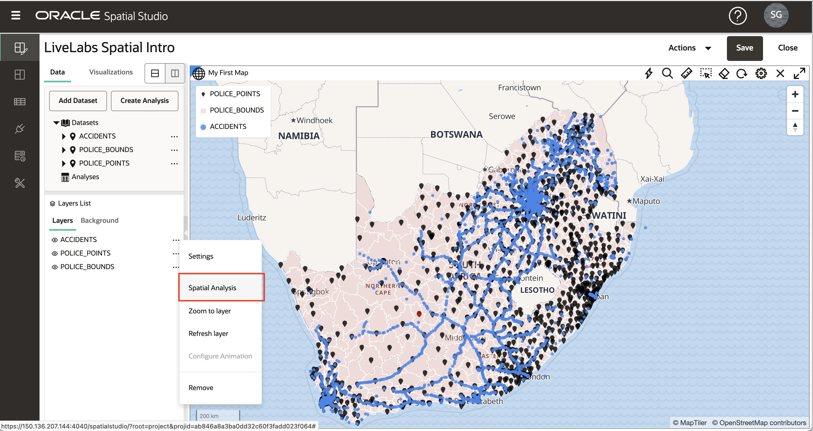
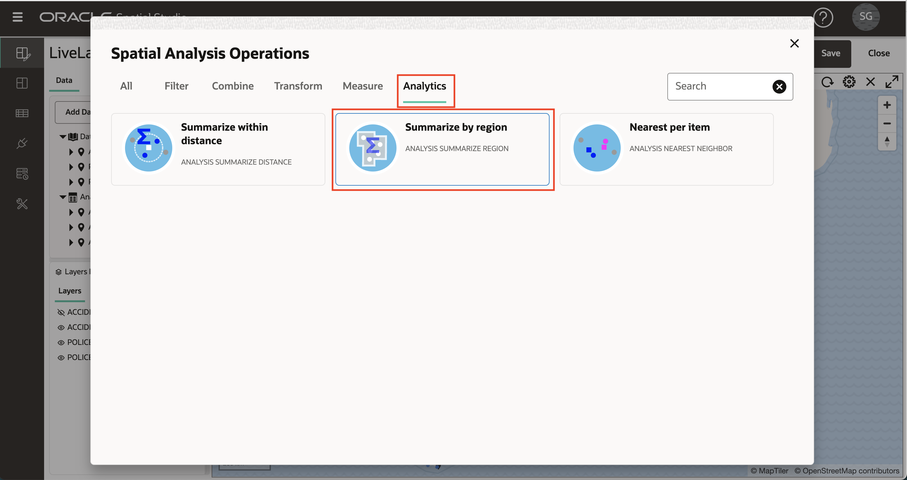
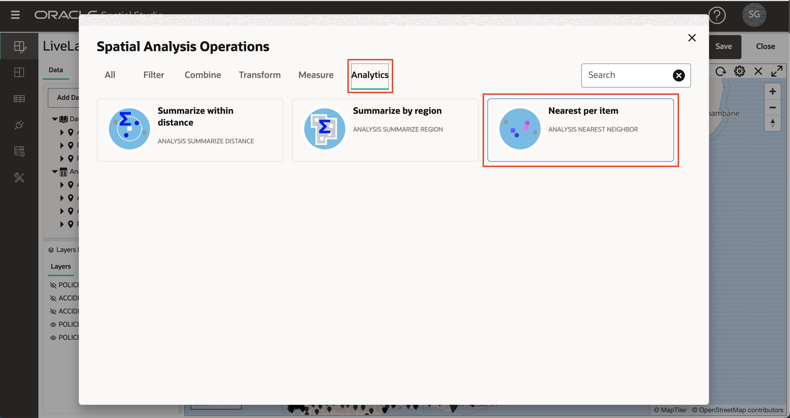

# Realizar análisis espaciales

## Introducción

Spatial Studio proporciona acceso a las funciones de análisis espacial de Oracle Database sin necesidad de escribir código. Se proporcionan interfaces de usuario sencillas para los análisis espaciales y toda la sintaxis de la base de datos subyacente se maneja automáticamente en segundo plano. Las operaciones de análisis espacial en Spatial Studio se organizan en categorías:

**Filtro**

*   Contención: "¿Cuál de mis activos se encuentra dentro de un área de peligro?"
*   Proximidad: "¿Cuál de nuestros sitios está a 5 millas de un camino de tormenta proyectado?"
*   ... y otros

**Combinar**

*   Unirse por ubicación: "Asociar oportunidades potenciales de venta con territorios de ventas basados en la contención".
*   Combinar artículos: "Combinar varios condados en 1 territorio de ventas"
*   ... y otros

**Transformar**

*   Buffer: "Crea la forma que rodea un perímetro de fuego por 10 millas".
*   Centroide: "Crea puntos en medio de cada perímetro de fuego".
*   ... y otros

**Medida**

*   Área: "¿Cuáles son las áreas de las regiones de marejadas pluviales en kilómetros cuadrados?"
*   Distancia: "¿Cuál es la distancia mínima de cada uno de nuestros activos a una trayectoria de tormenta proyectada?"
*   ... y otros

**Análisis**

*   Resumir por región: "¿Cuál es la edad promedio de los edificios dentro de cada región de planificación?"
*   Más cercano por artículo: "¿Cuál es el almacén más cercano a cada ubicación de sucursal y hasta dónde está?"
*   ... y otros

En este laboratorio, explorará varios de estos análisis espaciales.

Tiempo de laboratorio estimado: 45 minutos

### Objetivos

*   Comprender las categorías de análisis espaciales en Spatial Studio
*   Aprender a realizar análisis espaciales y visualizar resultados

### Requisitos

*   Análisis completados correctamente 1-3

## Tarea 1: Filtrar por proximidad

En este paso se utiliza un filtro espacial para identificar accidentes dentro de una distancia especificada de una estación de policía seleccionada.

1.  Comience haciendo clic en una estación de policía. En la imagen de abajo, he hecho clic en la estación de policía en la caja roja. De esta forma se selecciona la comisaría que se utilizará para el análisis de proximidad. Si hay algún problema al realizar la selección, confirme que **Permitir selección** está activado para la capa POLICE\_POINTS, como se describe en la tarea 6 del laboratorio 3.

2.  Abra el menú de acción de la capa ACCIDENTS y seleccione **Spatial Analysis**.
    
    
    
3.  Haga clic en el separador **Filtro** y seleccione **Devolver unidades a una distancia específica de otra**
    
    
    
4.  En el cuadro de diálogo de análisis, puede introducir un nombre para el resultado o dejar el valor por defecto. Estamos filtrando ACCIDENTES en función de la distancia de un elemento seleccionado en POLICE\_POINTS. En el ejemplo que se muestra a continuación, he utilizado una distancia de 150 kilómetros.
    
    **Nota:** El análisis incluye cambios a **• Incluir solo los elementos seleccionados en la capa superior** para las capas implicadas. Solo estamos interesados en incluir la 1 estación de policía seleccionada para el análisis de proximidad en este ejemplo. Por lo tanto, **• Incluir solo los elementos seleccionados en la capa superior** debe estar **Activado** para POLICE\_POINTS.
    
    Una vez realizadas las selecciones, haga clic en **Ejecutar**.
    
    
    
5.  El resultado del análisis se muestra en Análisis en el panel Elementos de datos. Arrastre y suelte el resultado del análisis en el mapa. Esto crea una nueva capa de mapa que muestra solo los accidentes dentro de la distancia especificada de la estación de policía seleccionada.
    
    
    
    **Nota:** Los resultados del análisis son solo otro tipo de juego de datos en Spatial Studio. Como verá en un laboratorio posterior, los resultados del análisis se pueden agregar a otras asignaciones/tablas, utilizar en otros proyectos, acceder mediante programación mediante REST o SQL, o exportar como un archivo.
    
6.  Ya no necesita este resultado de análisis en el mapa. Así que para evitar el desorden, a continuación, elimínelo del mapa. Haga clic con el botón derecho en el resultado del análisis en la lista Capas y seleccione **Eliminar**
    
    
    
    **Nota:** Una capa es solo un juego de datos representado en un mapa. Después de eliminar una capa (nuestro resultado de análisis en este caso), el conjunto de datos sigue apareciendo en el panel Elementos de datos y podría volver a agregarse al mapa. Para eliminar un juego de datos de un proyecto, haga clic con el botón derecho en el juego de datos en el panel Elementos de datos y seleccione **Eliminar del proyecto**.
    

## Tarea 2: Filtrar por contención

En este paso, se utiliza un filtro espacial para identificar accidentes dentro de una región policial seleccionada.

1.  Comience haciendo clic en una región de la capa POLICE\_BOUNDS. La región seleccionada se utilizará para filtrar accidentes. En la siguiente imagen, se seleccionó la región del cuadro rojo.
    
    
    
2.  Como hizo para el análisis anterior en el paso 1, abra el menú de acción de la capa ACCIDENTS y seleccione Spatial Analysis. Esta vez estamos filtrando por contención. Por lo tanto, seleccione el mosaico **Devolver unidades que estén dentro de otra**
    
    
    
3.  Puede escribir un nombre para los resultados o dejar el valor predeterminado. La capa que se va a filtrar son ACCIDENTES y la capa utilizada como filtro es POLICE\_BOUNDS. La opción **Incluir solo elementos seleccionados** se debe seleccionar para POLICE\_BOUNDS, ya que solo estamos filtrando los accidentes incluidos en la única región de policía seleccionada.
    
    
    
4.  Arrastre y suelte el resultado del análisis en el mapa. Observe la nueva capa que contiene los accidentes dentro de la región de policía seleccionada.
    
    
    
    Puede utilizar la rueda del mouse para ampliar el área de resultados. En la imagen debajo de la capa ACCIDENTS se desactiva para centrarse en el resultado del análisis.
    
    
    
5.  Antes de pasar al siguiente análisis, amplíe la extensión completa de los datos abriendo el menú de acción para la capa POLICE\_BOUNDS y seleccionando **Acercar a capa** y eliminando el análisis de contención del mapa.
    

## Tarea 3: Unión por contención

Aquí se unen a los juegos de datos basados en una relación espacial. Unirá ACCIDENTS a POLICE\_BOUNDS según la inclusión. Puede pensar que esto enriquece o etiqueta cada accidente con la región policial que lo contiene.

1.  Como hizo con los análisis anteriores, abra el menú de acción de la capa ACCIDENTS en la lista de capas y seleccione Spatial Analysis. Seleccione el separador **Combinar** y, a continuación, el mosaico **Unión espacial**
    
    
    
2.  En el cuadro de diálogo Unión espacial, introduzca el nombre ACCIDENTS\_JOIN\_POLICE\_BOUNDS para el resultado. Para las entradas adicionales, va a unir elementos en ACCIDENTS según la relación espacial Inside con elementos en POLICE\_BOUNDS. Esta operación dará como resultado un nuevo juego de datos que contiene ACCIDENTES enriquecidos con el ID único de la región POLICE\_BOUNDS que contiene cada elemento. El ID único (es decir, columna de clave) para POLICE\_BOUNDS es COMPNT\_NM, por lo que esperamos ver esa columna en el resultado. Haga clic en **Ejecutar**.
    
    **Nota:** La opción Avanzado permite incluir todas las columnas del juego de datos secundario (POLICE\_BOUNDS en este caso) en el resultado, en lugar de solo el ID único.
    
    
    
3.  El resultado se muestra en Análisis en el panel Elementos de datos. Amplíe el resultado para ver sus columnas; todas las columnas originales de ACCIDENTS, más COMPNT\_NM (es decir, nombre de región de policía) según lo esperado.
    
    
    
4.  Arrastre y suelte el análisis ACCIDENTS\_JOIN\_POLICE\_BOUNDS en el mapa. En la lista Capas, abra el menú de acción de la capa ACCIDENTS\_JOIN\_POLICE\_BOUNDS y seleccione Configuración para definir Estilo como desee y activar Interacción. Para Interacción, active una ventana de información que incluya la columna COMPNT\_NM. Haga clic en un elemento de bloqueo en el mapa y observe COMPNT\_NM (es decir, el nombre de la región de policía) en la ventana de información.
    
    
    
    Ahora ha aumentado los datos del accidente con el nombre de la región policial por elemento. Los resultados se podrían utilizar para realizar un análisis más detallado de Spatial Studio o acceder a ellos mediante otras herramientas y aplicaciones como Oracle Analytics Cloud para obtener análisis más amplios.
    

## Tarea 4: Resumir elementos por región

En el paso anterior, aumentó los elementos de choque con la región policial. En este paso, haces lo contrario: aumentas las regiones policiales con un resumen de la información del accidente.

1.  Abra el menú de acción de la capa POLICE\_BOUNDS en la lista Capas y seleccione Análisis espacial. Seleccione el separador **Análisis** y, a continuación, el mosaico **Resumir por región**
    
    
    
2.  En el cuadro de diálogo Resumir por región, puede dejar el nombre del juego de datos de resultados por defecto, POLICE\_BOUNDS SUMMARIZE. Introduzca los otros elementos del cuadro de diálogo: para cada elemento de POLICE\_BOUNDS, está resumiendo ACCIDENTS según Count. Introduzca NUM\_ACCIDENTS como columna que se va a agregar con los recuentos de accidentes. Haga clic en **Ejecutar**.
    
    **Nota:** Además del recuento, también puede resumir atributos numéricos con este análisis, por ejemplo, mediante Media.
    
    
    
3.  Arrastre el resultado, POLICE\_BOUNDS SUMMARIZE, al mapa. A continuación, en la lista Capas, abra el menú de acción para POLICE\_BOUNDS SUMMARIZE y seleccione Configuración. En Estilo, cambie Color a **Basado en datos**.
    
    
    
4.  Para la columna, seleccione NUM\_ACCIDENTS. Actualice los valores con 1, 5, 10, 15, 20. Escriba cada valor en cualquier celda, ya que se ordenarán automáticamente en la lista de valores. Una vez introducidos los valores, haga clic en el icono de edición para establecer la paleta y seleccione una paleta de colores. Observe el color de las regiones policiales de visualización del mapa codificado por el número de accidentes según el valor y las entradas de la paleta.
    
    
    
    Por su cuenta, no dude en agregar una ventana de información o una pista con recuentos de accidentes al hacer clic o pasar el mouse sobre una región policial. Como hizo en el laboratorio 2, tarea 3, también puede agregar una vista de tabla y arrastrar en POLICE\_BOUNDS SUMMARIZE para ver la información en formato tabular.
    

## Tarea 5: Identificación de elementos más cercanos

En este paso, determina el accidente más cercano a cada estación de policía. El resultado contiene cada estación de policía aumentada con el id y la distancia al accidente más cercano. El análisis también proporciona una opción para incluir todas las columnas del elemento más cercano en lugar de solo el ID y la distancia.

1.  Abra el menú de acción de la capa POLICE\_POINTS en la lista Capas y seleccione Análisis espacial. Seleccione el separador **Análisis** y, a continuación, haga clic en el mosaico **Más cercano por elemento**.
    
    
    
2.  En el cuadro de diálogo Más cercano por elemento, asigne al resultado el nombre POLICE\_POINTS WITH NEAREST ACCIDENT (o un nombre de su elección). Para cada elemento de POLICE\_POINTS, busca el elemento más cercano en ACCIDENTS. Expanda la sección Avanzado. Active las opciones para incluir la distancia en el resultado. Para el nombre de columna de distancia, introduzca DISTANCE\_TO\_ACCIDENT (o un nombre de su elección). Cambie las unidades de distancia a Kilómetro (u otra unidad de su elección).
    
    A continuación, haga clic en **Ejecutar**.
    
    
    
3.  En la lista Capas, desactive la capa POLICE\_POINTS. Arrastre el análisis POLICE\_POINTS WITH NEAREST ACCIDENT al mapa.
    
    
    
4.  Vaya a Configuración de la capa POLICE\_POINTS WITH NEAREST ACCIDENT y defina un estilo de su elección. En la lista desplegable Configurar, seleccione Interacción y, a continuación, active una ventana Información. Seleccione las columnas que desee, incluidas las columnas agregadas por este análisis: ACCIDENT\_ID y DISTANCE\_TO\_ACCIDENT. Haga clic en un elemento POLICE\_POINTS y observe que la ventana de información muestra el ID y la distancia al elemento más cercano en ACCIDENTS. 
    
    Por su cuenta, siéntase libre de diseñar estaciones de policía basadas en la distancia al accidente más cercano, utilizando colores o tamaño.
    
    Por último, guarde el proyecto para conservar los cambios.
    

## Tarea 6: Acceso al código SQL y al punto final GeoJSON \[Opcional\]

Este paso opcional es para los desarrolladores interesados en acceder a los resultados mediante programación. Spatial Studio permite ver el código SQL para los análisis espaciales y proporciona un punto final web que devuelve los resultados como GeoJSON. Esta información está disponible en Propiedades de conjunto de datos y se accede a ella desde un proyecto o desde la página Conjuntos de datos. Accederás a la información desde tu Proyecto.

1.  En el panel Elementos de datos, abra el menú de acción del análisis, por ejemplo, **ACCIDENTES EN EL INTERIOR** y seleccione **Propiedades**.

2.  Observe las secciones con código SQL y el punto final GeoJSON.

    On your own, paste the GeoJSON endpoint into a browser and observe your results returned as GeoJSON. Similarly, you may copy and paste the SQL code into SQL Developer Web to run the analysis directly. 
    

Con esto se concluye el taller Introducción a Oracle Spatial Studio.

## Reconocimientos

*   **Autor**: David Lapp, Database Product Management
*   **Última actualización por/fecha**: Denise Myrick, Database Product Management, abril de 2023