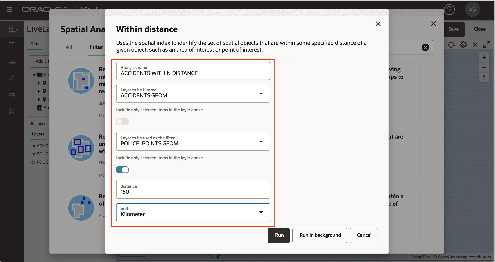
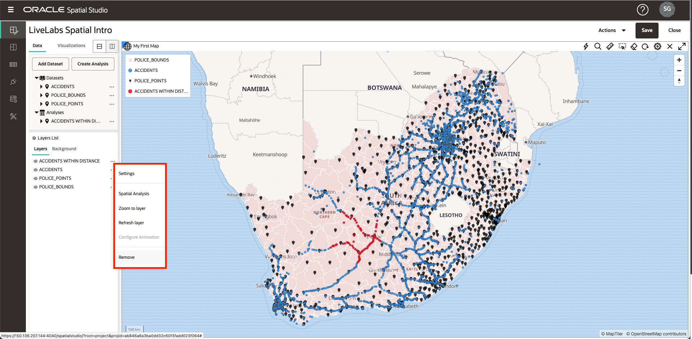
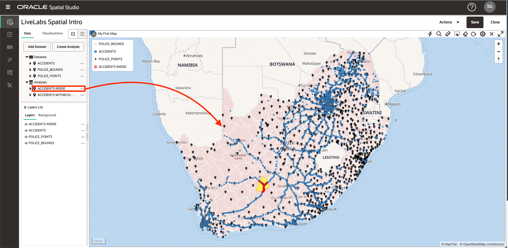
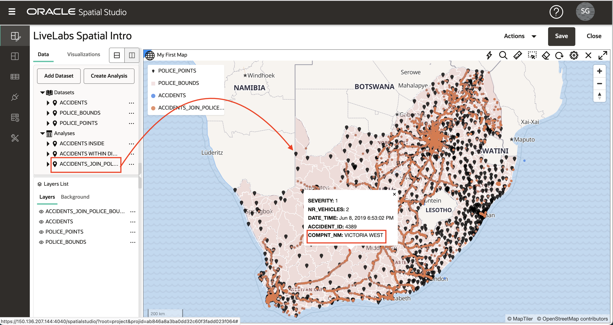

# Effectuer des analyses spatiales

## Présentation

Spatial Studio permet d'accéder aux fonctionnalités d'analyse spatiale d'Oracle Database sans avoir à écrire de code. Des interfaces utilisateur simples sont fournies pour les analyses spatiales et toute la syntaxe de base de données sous-jacente est traitée automatiquement en arrière-plan. Les opérations d'analyse spatiale dans Spatial Studio sont organisées en catégories :

**Filtre**

*   Confinement : "Lequel de mes actifs est situé à l'intérieur d'une zone de danger ?"
*   Proximité : "Lequel de nos sites se trouve à moins de 5 miles d'une trajectoire de tempête projetée ?"
*   ... et autres

**Combiner**

*   Jointure par lieu : "Associer les pistes de vente aux territoires de vente en fonction du confinement".
*   Fusionner les éléments : "Combiner plusieurs comtés en 1 territoire de vente"
*   ... et autres

**Transformation**

*   Buffer : "Créez la forme qui entoure un périmètre de feu de 10 miles."
*   Centroid : "Créez des points au milieu de chaque périmètre de feu."
*   ... et autres

**Mesure**

*   Zone : "Quelles sont les zones des régions de tempête en kilomètres carrés ?"
*   Distance : "Quelle est la distance minimale entre chacun de nos actifs et une trajectoire de tempête projetée ?"
*   ... et autres

**Analyse**

*   Résumer par région : "Quel est l'âge moyen des bâtiments dans chaque région de planification ?"
*   Le plus proche par article : "Quel est l'entrepôt le plus proche de chaque succursale, et à quelle distance ?"
*   ... et autres

Dans cet exercice, vous allez explorer plusieurs de ces analyses spatiales.

Temps de laboratoire estimé : 45 minutes

### Objectifs

*   Comprendre les catégories d'analyses spatiales dans Spatial Studio
*   Apprendre à effectuer des analyses spatiales et à visualiser les résultats

### Prérequis

*   Résultats des exercices 1 à 3

## Tâche 1 : filtrer par proximité

Dans cette étape, vous utilisez un filtre spatial pour identifier les accidents à une distance spécifiée d'un poste de police sélectionné.

1.  Commencez par cliquer sur un poste de police. Dans l'image ci-dessous, j'ai cliqué sur le poste de police dans la boîte rouge. Cela permet de sélectionner le poste de police à utiliser pour l'analyse de proximité. En cas de problème lors de la sélection, vérifiez que l'option **Autoriser la sélection** est activée pour la couche POLICE\_POINTS, comme décrit dans la tâche 6 de l'exercice 3.

2.  Ouvrez le menu d'actions de la couche ACCIDENTS et sélectionnez **Analyse spatiale**.
    
    
    
3.  Cliquez sur l'onglet **Filtre** et sélectionnez **Renvoyer les formes à une distance spécifique d'une autre**.
    
    
    
4.  Dans la boîte de dialogue d'analyse, vous pouvez saisir un nom pour le résultat ou laisser la valeur par défaut. Nous filtrons les ACCIDENTS en fonction de la distance par rapport à un élément sélectionné dans POLICE\_POINTS. Dans l'exemple ci-dessous, j'ai utilisé une distance de 150 kilomètres.
    
    **Remarque :** L'analyse inclut les bascules vers **• Inclure uniquement les éléments sélectionnés dans la couche ci-dessus** pour les couches concernées. Nous sommes seulement intéressés à inclure le 1 poste de police sélectionné pour l'analyse de proximité dans cet exemple. Par conséquent, **• Include only selected items in the layer above** doit avoir la valeur **On** pour POLICE\_POINTS.
    
    Une fois les sélections effectuées, cliquez sur **Exécuter**.
    
    
    
5.  Le résultat de l'analyse est répertorié sous Analyses dans le panneau Eléments de données. Glissez-déplacez le résultat de l'analyse sur la carte. Cela crée une nouvelle couche cartographique affichant uniquement les accidents sur la distance spécifiée du poste de police sélectionné.
    
    
    
    **Remarque :** les résultats d'analyse ne sont qu'un autre type d'ensemble de données dans Spatial Studio. Comme vous le verrez dans un laboratoire ultérieur, les résultats d'analyse peuvent être ajoutés à d'autres cartes/tables, utilisés dans d'autres projets, accessibles par programmation via REST ou SQL, ou exportés en tant que fichier.
    
6.  Vous n'avez plus besoin de ce résultat d'analyse dans la carte. Donc, pour éviter l'encombrement, vous le retirez ensuite de la carte. Cliquez avec le bouton droit de la souris sur le résultat de l'analyse dans la liste des couches et sélectionnez **Enlever**.
    
    
    
    **Remarque :** une couche n'est qu'un ensemble de données affiché dans une carte. Après la suppression d'une couche (notre résultat d'analyse dans ce cas), l'ensemble de données est toujours répertorié dans le panneau Eléments de données et peut être ajouté à nouveau à la carte. Pour enlever un ensemble de données d'un projet, cliquez avec le bouton droit de la souris sur l'ensemble de données dans le panneau Eléments de données et sélectionnez **Enlever du projet**.
    

## Tâche 2 : filtrer par conteneur

Cette étape consiste à utiliser un filtre spatial pour identifier les accidents dans une région de police sélectionnée.

1.  Commencez par cliquer dans une région de la couche POLICE\_BOUNDS. La région sélectionnée sera utilisée pour filtrer les accidents. Dans l'image ci-dessous, la région de la boîte rouge a été sélectionnée.
    
    
    
2.  Comme vous l'avez fait pour l'analyse précédente à l'étape 1, ouvrez le menu d'actions de la couche ACCIDENTS et sélectionnez Analyse spatiale. Cette fois, nous filtrons par confinement. Sélectionnez donc la mosaïque **Renvoyer les formes qui se trouvent à l'intérieur d'une autre**
    
    
    
3.  Vous pouvez saisir un nom pour les résultats ou laisser la valeur par défaut. La couche à filtrer est ACCIDENTS et la couche utilisée comme filtre est POLICE\_BOUNDS. L'option **Inclure uniquement les éléments sélectionnés** doit être sélectionnée pour POLICE\_BOUNDS car nous filtrons uniquement les accidents contenus dans la région de police sélectionnée.
    
    
    
4.  Glissez-déplacez le résultat de l'analyse dans la carte. Observez la nouvelle couche contenant les accidents dans la région de police sélectionnée.
    
    
    
    Vous pouvez utiliser la molette de votre souris pour zoomer sur la zone des résultats. Dans l'image ci-dessous, la couche ACCIDENTS est désactivée pour se concentrer sur le résultat de l'analyse.
    
    
    
5.  Avant de passer à l'analyse suivante, effectuez un zoom avant sur l'intégralité des données en ouvrant le menu d'actions de la couche POLICE\_BOUNDS et en sélectionnant **Zoom sur la couche**, puis enlevez l'analyse d'appartenance de la carte.
    

## Tâche 3 : jointure par conteneur

Vous joignez ici des ensembles de données basés sur une relation spatiale. Vous rejoindrez ACCIDENTS sur POLICE\_BOUNDS en fonction du confinement. Vous pouvez considérer cela comme enrichissant ou étiquetant chaque accident avec la région de police qui le contient.

1.  Comme pour les analyses précédentes, ouvrez le menu d'actions de la couche ACCIDENTS dans la liste des couches et sélectionnez Analyse spatiale. Sélectionnez l'onglet **Combiner**, puis la mosaïque **Jointure spatiale**.
    
    
    
2.  Dans la boîte de dialogue Jointure spatiale, entrez le nom ACCIDENTS\_JOIN\_POLICE\_BOUNDS du résultat. Pour les entrées supplémentaires, vous joignez des éléments dans ACCIDENTS en fonction de la relation spatiale Inside aux éléments dans POLICE\_BOUNDS. Cette opération génère un nouvel ensemble de données contenant des ACCIDENTS enrichi avec l'ID unique de la région POLICE\_BOUNDS contenant chaque élément. L'ID unique (c'est-à-dire la colonne de clé) pour POLICE\_BOUNDS est COMPNT\_NM. Nous espérons donc voir cette colonne dans le résultat. Cliquez sur **Exécuter**.
    
    **Remarque :** l'option Avancé vous permet d'inclure toutes les colonnes de l'ensemble de données secondaire (POLICE\_BOUNDS dans ce cas) dans le résultat, au lieu de simplement l'ID unique.
    
    
    
3.  Le résultat est répertorié sous Analyses dans le panneau Eléments de données. Développez le résultat pour afficher ses colonnes, toutes les colonnes d'origine d'ACCIDENTS, plus COMPNT\_NM (c'est-à-dire le nom de la région de police), comme prévu.
    
    
    
4.  Glissez-déplacez l'analyse ACCIDENTS\_JOIN\_POLICE\_BOUNDS vers la carte. Dans la liste Couches, ouvrez le menu d'actions du calque ACCIDENTS\_JOIN\_POLICE\_BOUNDS et sélectionnez Paramètres pour définir le style souhaité et activer l'interaction. Pour Interaction, activez une fenêtre d'informations incluant la colonne COMPNT\_NM. Cliquez sur un élément de plantage dans la carte et observez COMPNT\_NM (c'est-à-dire le nom de la région de police) dans la fenêtre d'informations.
    
    
    
    Vous avez maintenant augmenté les données de crash avec le nom de la région de police par élément. Les résultats peuvent être utilisés pour une analyse plus approfondie dans Spatial Studio ou accessibles par d'autres outils et applications tels qu'Oracle Analytics Cloud pour des analyses plus larges.
    

## Tâche 4 : synthétiser les éléments par région

Au cours de l'étape précédente, vous avez augmenté les crash items avec la région de police. Dans cette étape, vous faites l'inverse : vous augmentez les régions de police avec un résumé des informations de crash.

1.  Ouvrez le menu d'actions de la couche POLICE\_BOUNDS dans la liste des couches et sélectionnez Analyse spatiale. Sélectionnez l'onglet **Analytics**, puis la mosaïque **Résumer par région**.
    
    
    
2.  Dans la boîte de dialogue Résumer par région, vous pouvez conserver le nom d'ensemble de données de résultats par défaut, POLICE\_BOUNDS SUMMARIZE. Entrez les autres éléments de la boîte de dialogue : pour chaque élément dans POLICE\_BOUNDS, vous récapitulez les ACCIDENTS en fonction du nombre. Entrez NUM\_ACCIDENTS comme colonne à ajouter avec le nombre d'accidents. Cliquez sur **Exécuter**.
    
    **Remarque :** En plus de Compter, vous pouvez également synthétiser les attributs numériques avec cette analyse, par exemple à l'aide de Moyenne.
    
    
    
3.  Faites glisser le résultat, POLICE\_BOUNDS SUMMARIZE, sur la carte. Ensuite, dans la liste des couches, ouvrez le menu d'action pour POLICE\_BOUNDS SUMMARIZE et sélectionnez Paramètres. Sous Style, remplacez la couleur par **Basé sur les données**.
    
    
    
4.  Pour la colonne, sélectionnez NUM\_ACCIDENTS. Mettez à jour les valeurs avec 1, 5, 10, 15, 20. Saisissez chaque valeur dans n'importe quelle cellule, car elle sera automatiquement triée dans la liste de valeurs. Une fois les valeurs saisies, cliquez sur l'icône de modification pour définir la palette et sélectionner une palette de couleurs. Observez la carte pour afficher la couleur des régions de police en fonction du nombre d'accidents en fonction de vos entrées de valeur et de palette.
    
    
    
    N'hésitez pas à ajouter une fenêtre d'informations ou une info-bulle avec le nombre d'accidents lorsque vous cliquez ou survolez une région policière. Comme vous l'avez fait dans la tâche 3 de l'exercice 2, vous pouvez également ajouter une vue Tableau et faire glisser dans POLICE\_BOUNDS SUMMARIZE pour afficher les informations sous forme de tableau.
    

## Tâche 5 : Identifier les éléments les plus proches

Dans cette étape, vous déterminez l'accident le plus proche de chaque poste de police. Le résultat contient chaque poste de police augmenté de l'identifiant et de la distance à l'accident le plus proche. L'analyse fournit également une option qui inclut toutes les colonnes pour l'élément le plus proche au lieu de l'ID et de la distance.

1.  Ouvrez le menu d'actions de la couche POLICE\_POINTS dans la liste des couches et sélectionnez Analyse spatiale. Sélectionnez l'onglet **Analytics**, puis cliquez sur la mosaïque **Le plus proche par élément**.
    
    
    
2.  Dans la boîte de dialogue Par élément le plus proche, nommez le résultat POLICE\_POINTS WITH NEAREST ACCIDENT (ou le nom de votre choix). Pour chaque élément dans POLICE\_POINTS, vous recherchez l'élément le plus proche dans ACCIDENTS. Développez la section Advanced. Activez les options pour inclure la distance dans le résultat. Pour le nom de la colonne Distance, entrez DISTANCE\_TO\_ACCIDENT (ou le nom de votre choix). Remplacez les unités de distance par Kilomètre (ou une autre unité de votre choix).
    
    Cliquez ensuite sur **Exécuter**.
    
    
    
3.  Dans la liste Couches, désactivez la couche POLICE\_POINTS. Faites glisser l'analyse POLICE\_POINTS WITH NEAREST ACCIDENT sur la carte.
    
    
    
4.  Accédez aux paramètres de la couche POLICE\_POINTS WITH NEAREST ACCIDENT et définissez le style de votre choix. Dans la liste déroulante Configurer, sélectionnez Interaction, puis activez une fenêtre Informations. Sélectionnez les colonnes de votre choix, y compris les colonnes ajoutées par cette analyse : ACCIDENT\_ID et DISTANCE\_TO\_ACCIDENT. Cliquez sur un élément POLICE\_POINTS et observez que la fenêtre d'informations affiche l'ID et la distance par rapport à l'élément le plus proche dans ACCIDENTS. 
    
    Par vous-même, n'hésitez pas à maintenant styliser les postes de police en fonction de la distance à l'accident le plus proche, en utilisant des couleurs ou de la taille.
    
    Enfin, enregistrez votre projet pour conserver vos modifications.
    

## Tâche 6 : accéder au code SQL et à l'adresse GeoJSON \[Facultatif\]

Cette étape facultative s'adresse aux développeurs souhaitant accéder aux résultats par programmation. Spatial Studio vous permet de voir le code SQL pour les analyses spatiales et fournit une adresse Web qui renvoie des résultats sous la forme GeoJSON. Ces informations sont disponibles dans les propriétés de jeu de données et sont accessibles dans un projet ou à partir de la page Jeux de données. Vous accéderez aux informations à partir de votre projet.

1.  Dans le panneau Eléments de données, ouvrez le menu d'actions de l'analyse, par exemple **ACCIDENTS INSIDE** et sélectionnez **Propriétés**.

2.  Observez les sections avec du code SQL et l'adresse GeoJSON.

    On your own, paste the GeoJSON endpoint into a browser and observe your results returned as GeoJSON. Similarly, you may copy and paste the SQL code into SQL Developer Web to run the analysis directly. 
    

L'atelier Intro to Oracle Spatial Studio est terminé.

## Accusés de réception

*   **Auteur** - David Lapp, Database Product Management
*   **Dernière mise à jour par/date** - Denise Myrick, Database Product Management, avril 2023