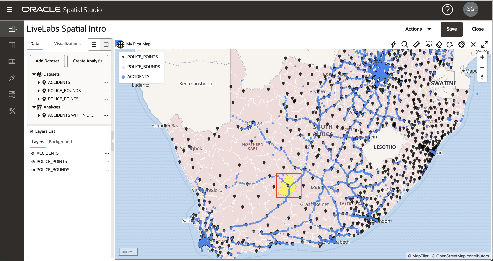

# 空間分析の実行

## 概要

Spatial Studioでは、コードを記述することなく、Oracle Databaseの空間分析機能にアクセスできます。空間分析用のシンプルなユーザー・インタフェースが提供され、基礎となるデータベース構文はすべて自動的にバックグラウンドで処理されます。Spatial Studioでの空間分析操作は、次のカテゴリに編成されます。

**フィルタ**

*   封じ込め: 「私の資産のうち、危険区域内にあるものはどれですか?」
*   近接性: 「予測される嵐の道から5マイル以内の場所はどれですか?」
*   ...およびその他

**結合**

*   場所別に結合: 「封じ込めに基づいて営業リードを営業テリトリに関連付けます。」
*   アイテムのマージ: 「複数の郡を1つの営業テリトリに結合」
*   ...およびその他

**変換**

*   バッファー: 「火の周囲を10マイル囲む形状を作成します。
*   セントロイド: 「各火の周囲の真ん中にポイントを作成します。
*   ...およびその他

**メジャー**

*   エリア: 「平方キロメートルの暴風雨サージ地域とは何ですか?」
*   距離: 「各アセットから予測されるストーム・パスまでの最小距離は何ですか?」
*   ...およびその他

**分析**

*   地域別に要約すると、「各計画地域内の建物の平均年齢は?
*   アイテムごとに最も近い: 「各支店の場所に最も近い倉庫はどれくらいですか。
*   ...およびその他

この演習では、これらの空間分析のいくつかを確認します。

推定ラボ時間: 45分

### 目標

*   Spatial Studioでの空間分析のカテゴリの理解
*   空間分析を実行し、結果を可視化する方法を学びます。

### 前提条件

*   演習1-3が正常に完了していること

## タスク1: 近接度によるフィルタ

このステップでは、空間フィルタを使用して、選択した警察署から指定した距離内の事故を識別します。

1.  まずは警察署をクリックします。下の画像で、赤い箱の中の警察署をクリックしました。これにより、近接解析に使用する警察署が選択されます。選択に問題がある場合は、演習3のタスク6の説明に従って、POLICE\_POINTSレイヤーに対して**「選択の許可」**がオンになっていることを確認します。

2.  ACCIDENTSレイヤーのアクション・メニューを開き、**「空間分析」**を選択します。
    
    
    
3.  **「フィルタ」**タブをクリックし、**「別の図形の特定の距離内の図形を戻します」**を選択します。
    
    
    
4.  分析ダイアログで、結果の名前を入力するか、デフォルトのままにできます。POLICE\_POINTSで選択したアイテムからの距離に基づいてACCIDENTSをフィルタリングしています。下の例では、150キロの距離を使用しています。
    
    **ノート:**分析には、関連するレイヤーについて**• 選択したアイテムのみを上のレイヤーに含めます**。この例では、近接分析用に選択した1つの警察署のみを含めることに興味があります。したがって、POLICE\_POINTSでは、**• 選択したアイテムのみを上のレイヤーに含めます**。
    
    選択したら、**「実行」**をクリックします。
    
    
    
5.  分析結果は、「データ要素」パネルの「分析」の下にリストされます。分析結果をマップにドラッグ・アンド・ドロップします。これにより、選択した警察署の指定した距離内の事故のみを表示する新しいマップ・レイヤーが作成されます。
    
    
    
    **ノート:**分析結果は、Spatial Studioの別のタイプのデータセットにすぎません。後の演習で確認するように、分析結果を他のマップ/表に追加したり、他のプロジェクトで使用したり、RESTまたはSQLを介してプログラムでアクセスしたり、ファイルとしてエクスポートしたりできます。
    
6.  この分析結果をマップに必要なくなりました。そのため、散らばらないように、次にマップから削除します。「レイヤー」リストで分析結果を右クリックし、**「削除」**を選択します。
    
    
    
    **ノート:**レイヤーは、マップにレンダリングされるデータセットにすぎません。レイヤーを削除した後(この場合は分析結果)、データセットは「データ要素」パネルに引き続きリストされ、マップに再追加できます。プロジェクトからデータセットを削除するには、「データ要素」パネルでデータセットを右クリックし、**「プロジェクトから削除」**を選択します。
    

## タスク2: 封じ込めによるフィルタ

このステップでは、空間フィルタを使用して、選択した警察地域内の事故を識別します。

1.  まず、POLICE\_BOUNDSレイヤーのリージョンをクリックします。選択したリージョンは、事故のフィルタに使用されます。次のイメージでは、赤いボックスの領域が選択されています。
    
    
    
2.  ステップ1の前の分析で行ったように、ACCIDENTSレイヤーのアクション・メニューを開き、「空間分析」を選択します。今回は封じ込めで絞り込みます。そのため、**「別の図形を戻す」**タイルを選択します。
    
    
    
3.  結果の名前を入力することも、デフォルトのままにすることもできます。フィルタされるレイヤーはACCIDENTSで、フィルタとして使用されるレイヤーはPOLICE\_BOUNDSです。POLICE\_BOUNDSには**「選択したアイテムのみを含める」**オプションを選択する必要があります。これは、選択した1つの警察リージョンに含まれる事故のみをフィルタリングするためです。
    
    
    
4.  分析結果をマップにドラッグ・アンド・ドロップします。選択した警察リージョン内の事故を含む新しいレイヤーを確認します。
    
    
    
    マウス・ホイールを使用して、結果の領域にズームできます。ACCIDENTSレイヤーの下のイメージでは、分析結果に焦点を当てるためにオフになっています。
    
    
    
5.  次の分析に進む前に、POLICE\_BOUNDSレイヤーのアクション・メニューを開き、**「レイヤーにズーム」**を選択してデータの全範囲にズームし、マップから包含分析を削除します。
    

## タスク3: 包含による結合

ここでは、空間関係に基づいてデータセットを結合します。包含に基づいて、ACCIDENTSをPOLICE\_BOUNDSに結合します。 あなたは、これが含まれている警察地域と各事故を豊かにしたりタグ付けしたりすると考えるかもしれません。

1.  以前の分析と同様に、「レイヤー」リストでACCIDENTSレイヤーのアクション・メニューを開き、「空間分析」を選択します。**「結合」**タブを選択し、**「空間結合」**タイルを選択します。
    
    
    
2.  「空間結合」ダイアログで、結果のACCIDENTS\_JOIN\_POLICE\_BOUNDSの名前を入力します。追加エントリの場合は、POLICE\_BOUNDS内のアイテムに対する空間関係に基づいて、ACCIDENTS内のアイテムを結合します。この操作により、各アイテムを含むPOLICE\_BOUNDSリージョンの一意のIDでエンリッチされたACCIDENTSを含む新しいデータセットが生成されます。POLICE\_BOUNDSの一意のID (キー列)はCOMPNT\_NMであるため、結果にその列が表示されます。**「実行」**をクリックします。
    
    **ノート:**「拡張」オプションを使用すると、一意のIDのみでなく、セカンダリ・データセット(この場合はPOLICE\_BOUNDS)のすべての列を結果に含めることができます。
    
    
    
3.  結果は、「データ要素」パネルの「分析」の下にリストされます。結果を展開して、その列、ACCIDENTSのすべての元の列、および予想どおりにCOMPNT\_NM (警察地域名)を表示します。
    
    
    
4.  分析ACCIDENTS\_JOIN\_POLICE\_BOUNDSをマップにドラッグ・アンド・ドロップします。レイヤー・リストで、ACCIDENTS\_JOIN\_POLICE\_BOUNDSレイヤーのアクション・メニューを開き、「設定」を選択してスタイルを必要に応じて設定し、相互作用を有効にします。「相互作用」の場合は、列COMPNT\_NMを含む情報ウィンドウを有効にします。マップ内のクラッシュ項目をクリックし、情報ウィンドウでCOMPNT\_NM(警察地域名)を確認します。
    
    
    
    これで、項目ごとの警察地域名でクラッシュ・データを拡張しました。結果をさらに分析するために使用することも、より広範な分析のためにOracle Analytics Cloudなどの他のツールやアプリケーションからアクセスすることもできます。
    

## タスク4: 地域別品目の集計

前のステップでは、policeリージョンでクラッシュ・アイテムを拡張しました。このステップでは、逆を実行します。つまり、クラッシュ情報のサマリーを使用して警察リージョンを拡張します。

1.  レイヤー・リストでPOLICE\_BOUNDSレイヤーのアクション・メニューを開き、「空間分析」を選択します。**「分析」**タブを選択し、**「リージョン別に集計」**タイルを選択します
    
    
    
2.  「リージョン別サマリー」ダイアログでは、デフォルトの結果データセット名POLICE\_BOUNDS SUMMARIZEのままにできます。ダイアログに他の項目を入力します。POLICE\_BOUNDSの各項目について、件数に基づいてACCIDENTSを集計します。事故数で追加する列としてNUM\_ACCIDENTSを入力します。**「実行」**をクリックします。
    
    **ノート:**「件数」に加えて、「平均」などを使用して、この分析で数値属性を要約することもできます。
    
    
    
3.  結果POLICE\_BOUNDS SUMMARIZEをマップにドラッグします。次に、レイヤー・リストでPOLICE\_BOUNDS SUMMARIZEのアクション・メニューを開き、「設定」を選択します。「スタイル」で、「色」を**「データに基づく」**に変更します。
    
    
    
4.  列に対して、NUM\_ACCIDENTSを選択します。値を1、5、10、15、20で更新します。値リストで自動的にソートされるため、任意のセルに各値を入力します。値を入力したら、編集アイコンをクリックしてパレットを設定し、カラーパレットを選択します。値およびパレットのエントリに従って、事故の数で色分けされたマップ表示警察リージョンを確認します。
    
    
    
    警察地域をクリックまたはマウスオーバーしたときに、事故数を含む情報ウィンドウまたはツールチップを自分で追加してください。演習2のタスク3で行ったように、表ビューを追加し、POLICE\_BOUNDS SUMMARIZEでドラッグして、情報を表形式で表示することもできます。
    

## タスク5: 最も近い項目の識別

このステップでは、各警察署に最も近い事故を特定します。結果には、IDと最も近い事故までの距離で拡張された各警察署が含まれます。分析には、IDおよび距離のみでなく、最も近いアイテムのすべての列が含まれるオプションもあります。

1.  レイヤー・リストでPOLICE\_POINTSレイヤーのアクション・メニューを開き、「空間分析」を選択します。**「アナリティクス」**タブを選択し、**「アイテムごとに四捨五入」**タイルをクリックします。
    
    
    
2.  「アイテムごとに最も近い」ダイアログで、結果にPOLICE\_POINTS WITH NEAREST ACCIDENT (または選択した名前)という名前を付けます。POLICE\_POINTSの各項目について、ACCIDENTSに最も近い項目を見つけます。「拡張」セクションを展開します。結果に距離を含めるオプションを有効にします。距離列名に、DISTANCE\_TO\_ACCIDENT (または選択した名前)を入力します。距離単位をキロメートル(または選択した別の単位)に変更します。
    
    次に、**「実行」**をクリックします。
    
    
    
3.  「レイヤー」リストで、POLICE\_POINTSレイヤーをオフにします。POLICE\_POINTS WITH NEAREST ACCIDENT分析をマップにドラッグします。
    
    
    
4.  POLICE\_POINTS WITH NEAREST ACCIDENTレイヤーの「設定」に移動し、選択したスタイルを設定します。「構成」プルダウンで「相互作用」を選択し、「情報」ウィンドウを有効にします。この分析によって追加された列(ACCIDENT\_IDおよびDISTANCE\_TO\_ACCIDENT)を含む、選択した列を選択します。POLICE\_POINTS項目をクリックし、情報ウィンドウにACCIDENTS内の最も近い項目へのIDと距離が表示されることを確認します。 
    
    あなた自身で、色またはサイズを使用して、最も近い事故までの距離に基づいて警察署をスタイル付けしてください。
    
    最後に、プロジェクトを保存して、変更を保持します。
    

## タスク6: SQLコードおよびGeoJSONエンドポイントへのアクセス(オプション)

このオプション・ステップは、プログラムによる結果へのアクセスに関心のある開発者を対象としています。Spatial Studioでは、空間分析のSQLコードを表示し、結果をGeoJSONとして返すWebエンドポイントを提供します。この情報はデータセット・プロパティで使用でき、プロジェクトまたはデータセット・ページからアクセスします。プロジェクト内から情報にアクセスします。

1.  「データ要素」パネルで、分析のいずれかのアクション・メニュー(**「内部のACCIDENTS」**など)を開き、**「プロパティ」**を選択します。

2.  SQLコードとGeoJSONエンドポイントを含むセクションを確認します。

    On your own, paste the GeoJSON endpoint into a browser and observe your results returned as GeoJSON. Similarly, you may copy and paste the SQL code into SQL Developer Web to run the analysis directly. 
    

これで、Oracle Spatial Studioの概要ワークショップは終了です。

## 確認

*   **著者** - Database Product Management、David Lapp氏
*   **最終更新者/日付** - Denise Myrick、Database Product Management、2023年4月