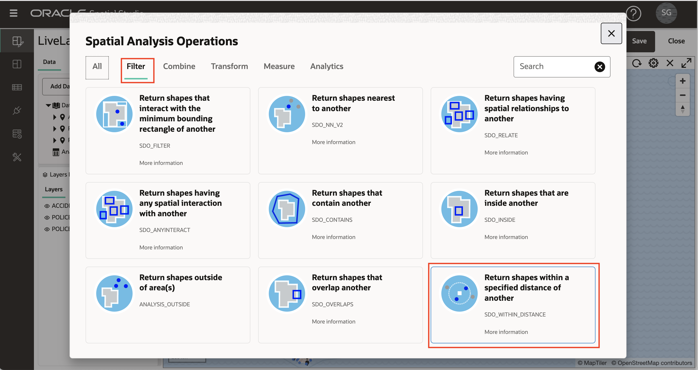
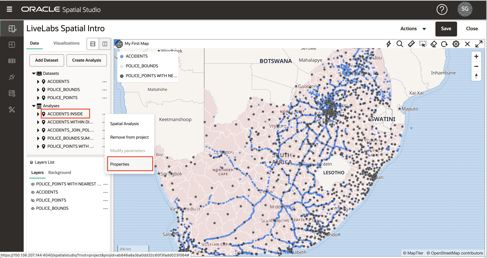

# 공간 분석 수행

## 소개

Spatial Studio는 코드를 작성할 필요 없이 Oracle Database의 공간 분석 기능에 대한 액세스를 제공합니다. 공간 분석을 위한 간단한 사용자 인터페이스가 제공되며 모든 기본 데이터베이스 구문은 백그라운드에서 자동으로 처리됩니다. Spatial Studio의 공간 분석 작업은 다음 범주로 구성됩니다.

**필터**

*   "내 자산 중 위험 지역 내에 있는 자산은 무엇입니까?"
*   근접성 : "우리 사이트 중 예상되는 폭풍 경로에서 5 마일 이내에있는 곳은 무엇입니까?"
*   ... 기타

**조합**

*   위치별 조인: "포기에 따라 영업 가망 고객을 영업 할당영역과 연계합니다."
*   품목 병합: "여러 군을 하나의 판매 구역에 결합"
*   ... 기타

**변환**

*   버퍼 : "불 둘레를 둘러싸는 모양을 10 마일까지 만듭니다."
*   Centroid: "각 화재 경계의 중간에 포인트를 만듭니다."
*   ... 기타

**측정**

*   지역 : "폭풍 서지 지역의 지역은 평방 킬로미터입니까?"
*   거리: "각 자산에서 예상되는 폭풍 경로까지의 최소 거리는 얼마입니까?"
*   ... 기타

**분석**

*   지역별 요약: "각 계획 지역 내 건물의 평균 연령은 얼마입니까?"
*   품목당 가장 가까운 품목: "각 지점 위치에 가장 가까운 창고는 무엇이며 얼마나 멀리 있습니까?"
*   ... 기타

이 실습에서는 이러한 공간 분석 중 몇 가지를 살펴봅니다.

예상 실험실 시간: 45분

### 목표

*   Spatial Studio에서 공간 분석의 범주 이해
*   공간 분석을 수행하고 결과를 시각화하는 방법 알아보기

### 필요 조건

*   실습을 성공적으로 완료 1-3

## 작업 1: 근접도로 필터링

이 단계에서는 공간 필터를 사용하여 선택한 경찰서에서 지정된 거리 내에 있는 사고를 식별합니다.

1.  먼저 경찰서 를 클릭합니다. 아래 이미지에서 빨간색 상자에 있는 경찰서를 클릭했습니다. 이렇게 하면 근접 분석에 사용할 경찰서가 선택됩니다. 선택에 문제가 있는 경우 Lab 3 Task 6에 설명된 대로 POLICE\_POINTS 계층에 대해 **Allow selection**이 설정되었는지 확인합니다.

2.  ACCIDENTS 계층의 작업 메뉴를 열고 **공간 분석**을 선택합니다.
    
    
    
3.  **Filter** 탭을 눌러 **Return shapes within a specific distance of another**를 선택합니다.
    
    
    
4.  분석 대화상자에서 결과 이름을 입력하거나 기본값을 그대로 사용할 수 있습니다. POLICE\_POINTS에서 선택한 항목과의 거리를 기반으로 ACCIDENTS를 필터링하고 있습니다. 아래 예제에서는 150km의 거리를 사용했습니다.
    
    **주:** 분석에는 관련된 계층에 대한 **• 위의 계층에 선택된 항목만 포함**으로의 스위치가 포함됩니다. 이 예제에서는 근접 분석을 위해 1개의 선택된 경찰서만 포함할 수 있습니다. 따라서 **• 위의 층에 선택된 항목만 포함**은 POLICE\_POINTS에 대해 **설정**이어야 합니다.
    
    선택이 완료되면 **실행**을 누릅니다.
    
    
    
5.  분석 결과는 \[데이터 요소\] 패널의 \[분석\] 아래에 나열됩니다. 분석 결과를 맵에 끌어 놓습니다. 그러면 선택한 경찰서에서 지정된 거리 내에 있는 사고만 표시하는 새 지도 도면층이 작성됩니다.
    
    
    
    **주:** 분석 결과는 Spatial Studio의 다른 데이터 집합 유형일 뿐입니다. 나중에 볼 수 있듯이 분석 결과는 다른 맵/테이블에 추가되거나, 다른 프로젝트에서 사용되거나, REST 또는 SQL을 통해 프로그래밍 방식으로 액세스되거나, 파일로 내보낼 수 있습니다.
    
6.  더 이상 이 분석 결과가 맵에 필요하지 않습니다. 따라서 혼란을 피하려면 다음으로 맵에서 제거합니다. \[레이어\] 목록에서 분석 결과를 마우스 오른쪽 단추로 누르고 **제거**를 선택합니다.
    
    
    
    **주:** 층은 맵에 렌더링된 데이터 집합일 뿐입니다. 레이어를 제거한 후(이 경우 분석 결과), 데이터 세트는 데이터 요소 패널에 계속 나열되며 맵에 다시 추가할 수 있습니다. 프로젝트에서 데이터 집합을 제거하려면 \[데이터 요소\] 패널에서 데이터 집합을 마우스 오른쪽 단추로 누르고 **프로젝트에서 제거**를 선택합니다.
    

## 태스크 2: 포함별 필터링

이 단계에서는 공간 필터를 사용하여 선택한 경찰 지역 내의 사고를 식별합니다.

1.  먼저 POLICE\_BOUNDS 계층의 영역을 누릅니다. 선택한 영역이 사고를 필터링하는 데 사용됩니다. 아래 이미지에서 빨간색 상자의 영역이 선택되었습니다.
    
    
    
2.  1단계에서 수행한 것처럼 ACCIDENTS 도면층의 작업 메뉴를 열고 공간 분석을 선택합니다. 이번에는 컨테이너로 필터링합니다. 따라서 타일을 **다른 쉐이프 안에 있는 쉐이프 반환**을 선택합니다.
    
    
    
3.  결과 이름을 입력하거나 기본값을 그대로 사용할 수 있습니다. 필터링할 레이어는 ACCIDENTS이고 필터로 사용되는 레이어는 POLICE\_BOUNDS입니다. 선택한 단일 경찰 지역에 포함된 사고에 대해서만 필터링하므로 POLICE\_BOUNDS에 대해 **선택된 항목만 포함** 옵션을 선택해야 합니다.
    
    
    
4.  분석 결과를 맵에 끌어 놓습니다. 선택된 경찰 지역 내 사고가 포함된 새 층을 관찰합니다.
    
    
    
    마우스 휠을 사용하여 결과 영역을 확대할 수 있습니다. ACCIDENTS 레이어 아래의 이미지에서는 분석 결과에 초점을 맞추기 위해 해제됩니다.
    
    
    
5.  다음 분석으로 이동하기 전에 POLICE\_BOUNDS 계층에 대한 작업 메뉴를 열고 **계층으로 확대/축소**를 선택하고 맵에서 포함 분석을 제거하여 데이터의 전체 범위로 확대/축소합니다.
    

## 작업 3: 포함별 조인

여기서 공간 관계를 기반으로 데이터 집합을 조인합니다. 포함에 따라 ACCIDENTS를 POLICE\_BOUNDS에 조인합니다. 이를 포함하는 경찰 지역으로 각 사고를 보강하거나 태깅하는 것으로 생각할 수 있습니다.

1.  이전 분석과 마찬가지로 도면층 리스트에서 ACCIDENTS 도면층의 작업 메뉴를 열고 공간 분석을 선택합니다. **결합** 탭을 선택한 다음 타일 **공간 조인**을 선택합니다.
    
    
    
2.  Spatial Join 대화상자에서 결과에 대해 ACCIDENTS\_JOIN\_POLICE\_BOUNDS 이름을 입력합니다. 추가 항목의 경우 공간 관계를 기반으로 ACCIDENTS의 항목을 POLICE\_BOUNDS의 항목과 조인합니다. 이 작업을 수행하면 각 항목을 포함하는 POLICE\_BOUNDS 영역의 고유 ID로 보완된 ACCIDENTS를 포함하는 새 데이터 집합이 생성됩니다. POLICE\_BOUNDS의 고유 ID(즉, 키 열)는 COMPNT\_NM이므로 결과에 해당 열이 표시되어야 합니다. **Run**을 누릅니다.
    
    **주:** \[고급\] 옵션을 사용하면 고유 ID 대신 보조 데이터 집합(이 경우 POLICE\_BOUNDS)의 모든 열을 결과에 포함할 수 있습니다.
    
    
    
3.  \[데이터 요소\] 패널의 \[분석\] 아래에 결과가 나열됩니다. 결과를 확장하면 해당 열이 표시됩니다. ACCIDENTS의 모든 원본 열과 예상대로 COMPNT\_NM(즉, 경찰 지역 이름)이 추가됩니다.
    
    
    
4.  ACCIDENTS\_JOIN\_POLICE\_BOUNDS 분석을 맵으로 끌어 놓습니다. 레이어 목록에서 ACCIDENTS\_JOIN\_POLICE\_BOUNDS 레이어의 작업 메뉴를 열고 설정을 선택하여 스타일을 원하는 대로 설정하고 상호 작용을 활성화합니다. 상호작용의 경우 COMPNT\_NM 열을 포함하는 정보 창을 사용으로 설정합니다. 지도에서 충돌 항목을 클릭하고 정보 창에서 COMPNT\_NM(즉, 경찰 지역 이름)을 확인합니다.
    
    
    
    이제 항목당 경찰 지역 이름으로 충돌 데이터를 증강했습니다. 이 결과는 추가 분석에 Spatial Studio를 사용하거나 광범위한 분석을 위해 Oracle Analytics Cloud와 같은 다른 도구 및 애플리케이션에서 액세스할 수 있습니다.
    

## 태스크 4: 영역별 품목 요약

이전 단계에서, 당신은 경찰 지역과 충돌 항목을 증강. 이 단계에서는 역을 수행합니다. 충돌 정보를 요약하여 경찰 지역을 보강합니다.

1.  도면층 리스트에서 POLICE\_BOUNDS 도면층에 대한 작업 메뉴를 열고 공간 분석을 선택합니다. **분석** 탭을 선택한 다음 타일 **영역별 요약**을 선택합니다.
    
    
    
2.  \[영역별 요약\] 대화상자에서 기본 결과 데이터 집합 이름인 POLICE\_BOUNDS 요약을 그대로 둘 수 있습니다. 카운트를 기준으로 ACCIDENTS를 요약하는 POLICE\_BOUNDS의 각 항목에 대해 대화상자에 다른 항목을 입력합니다. 장애 수와 함께 추가할 열로 NUM\_ACCIDENTS을 입력합니다. **Run**을 누릅니다.
    
    **주:** \[개수\] 외에도 이 분석과 함께 숫자 속성을 요약할 수 있습니다(예: 평균 사용).
    
    
    
3.  결과 POLICE\_BOUNDS 요약을 맵으로 끌어옵니다. 그런 다음 레이어 목록에서 POLICE\_BOUNDS 요약에 대한 작업 메뉴를 열고 설정을 선택합니다. 스타일에서 색상을 **데이터 기반**으로 변경합니다.
    
    
    
4.  열에 대해 NUM\_ACCIDENTS을 선택합니다. 값을 1, 5, 10, 15, 20으로 갱신합니다. 값 목록에서 자동으로 정렬되므로 셀에 각 값을 입력합니다. 값을 입력한 후 편집 아이콘을 클릭하여 팔레트를 설정하고 색상 팔레트를 선택합니다. 값 및 팔레트 항목에 따라 사고 수로 코딩된 지도 표시 경찰 지역을 확인합니다.
    
    
    
    경찰 지역을 클릭하거나 가리킬 때 사고 수가 포함된 정보 창 또는 도구 설명을 자유롭게 추가할 수 있습니다. Lab 2 Task 3에서와 마찬가지로 Table 뷰를 추가하고 POLICE\_BOUNDS SUMMARIZE로 끌어 정보를 표 형식으로 볼 수도 있습니다.
    

## 태스크 5: 가장 가까운 품목 식별

이 단계에서는 각 경찰서에서 가장 가까운 사고를 결정합니다. 결과에는 ID와 가장 가까운 사고까지의 거리로 증강된 각 경찰서가 포함됩니다. 분석에서는 ID 및 거리 대신 가장 가까운 항목의 모든 열을 포함하는 옵션도 제공합니다.

1.  도면층 리스트에서 POLICE\_POINTS 도면층에 대한 작업 메뉴를 열고 공간 분석을 선택합니다. **Analytics** 탭을 선택한 다음 타일 **항목당 가장 가까운 항목**을 누릅니다.
    
    
    
2.  \[항목별 가장 근접\] 대화상자에서 결과 이름을 POLICE\_POINTS WITH NEAREST ACCIDENT(또는 선택한 이름)로 지정합니다. POLICE\_POINTS의 각 항목에 대해 ACCIDENTS에서 가장 가까운 항목을 찾습니다. Advanced 섹션을 확장합니다. 결과에 거리를 포함하도록 옵션을 사용으로 설정합니다. 거리 열 이름에 DISTANCE\_TO\_ACCIDENT(또는 선택한 이름)을 입력합니다. 거리 단위를 킬로미터(또는 선택한 다른 단위)로 변경합니다.
    
    그런 다음 **실행**을 누릅니다.
    
    
    
3.  레이어 목록에서 POLICE\_POINTS 레이어를 끕니다. POLICE\_POINTS WITH NEAREST ACCIDENT 분석을 맵으로 끌어옵니다.
    
    
    
4.  POLICE\_POINTS WITH NEAREST ACCIDENT 레이어의 설정으로 이동하여 선택한 스타일을 설정합니다. 구성 풀다운에서 상호 작용을 선택한 다음 정보 창을 활성화합니다. ACCIDENT\_ID 및 DISTANCE\_TO\_ACCIDENT 분석을 통해 추가된 열을 포함하여 선택한 열을 선택합니다. POLICE\_POINTS 항목을 누르고 정보 창에 ACCIDENTS에서 가장 가까운 항목까지의 ID 및 거리가 표시되는지 확인합니다. 
    
    혼자서, 색상이나 크기를 사용하여 가장 가까운 사고까지의 거리를 기반으로 경찰서 스타일을 자유롭게 느끼십시오.
    
    마지막으로 프로젝트를 저장하여 변경 사항을 보존합니다.
    

## 작업 6: SQL 코드 및 GeoJSON 끝점에 액세스 \[선택사항\]

이 선택적 단계는 프로그래밍 방식으로 결과에 액세스하는 데 관심이 있는 개발자를 위한 것입니다. Spatial Studio를 사용하면 공간 분석에 대한 SQL 코드를 볼 수 있으며 결과를 GeoJSON로 반환하는 웹 끝점을 제공합니다. 이 정보는 데이터 집합 속성에서 사용할 수 있으며 프로젝트 또는 데이터 집합 페이지에서 액세스할 수 있습니다. 프로젝트 내에서 정보에 액세스합니다.

1.  \[데이터 요소\] 패널에서 분석 중 하나에 대한 작업 메뉴를 엽니다(예: **ACCIDENTS INSIDE**). **속성**을 선택합니다.

2.  SQL 코드 및 GeoJSON 끝점이 있는 섹션을 살펴봅니다.

    On your own, paste the GeoJSON endpoint into a browser and observe your results returned as GeoJSON. Similarly, you may copy and paste the SQL code into SQL Developer Web to run the analysis directly. 
    

Oracle Spatial Studio 소개 워크숍을 마무리합니다.

## 확인

*   **작성자** - 데이터베이스 제품 관리, David Lapp
*   **최종 업데이트 기한/일자** - Denise Myrick, 데이터베이스 제품 관리, 2023년 4월