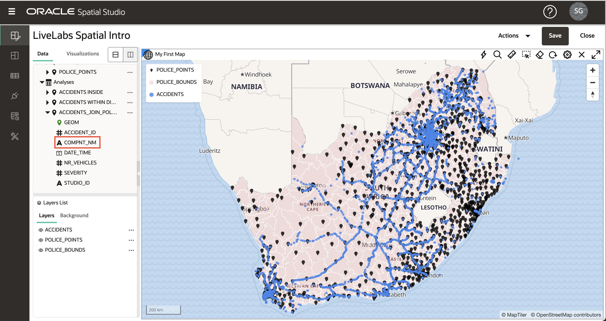

# Executar Análises Espaciais

## Introdução

O Spatial Studio fornece acesso aos recursos de análise espacial do Oracle Database sem a necessidade de escrever código. Interfaces de usuário simples são fornecidas para análises espaciais e toda a sintaxe do banco de dados subjacente é tratada automaticamente nos bastidores. As operações de análise espacial no Spatial Studio são organizadas em categorias:

**Filtro**

*   Contenção: "Quais dos meus ativos estão localizados dentro de uma área de risco?"
*   Proximidade: "Quais dos nossos sites estão a 5 milhas de um caminho de tempestade projetado?"
*   ... e outros

**Combinar**

*   Associar por local: "Associar leads de vendas a territórios de vendas com base na contenção".
*   Mesclar itens: "Combinar vários municípios em 1 território de vendas"
*   ... e outros

**Transformação**

*   Buffer: "Crie a forma que envolve um perímetro de fogo em 10 milhas."
*   Centroid: "Crie pontos no meio de cada perímetro de fogo."
*   ... e outros

**Medida**

*   Área: "Quais são as áreas das regiões de tempestades em quilômetros quadrados?"
*   Distância: "Qual é a distância mínima de cada um dos nossos ativos para um caminho de tempestade projetado?"
*   ... e outros

**Análise**

*   Resumir por região: "Qual é a idade média dos edifícios dentro de cada região de planejamento?"
*   Mais próximo por item: "Qual é o depósito mais próximo de cada local da filial e qual é a distância?"
*   ... e outros

Neste laboratório, você explorará várias dessas análises espaciais.

Tempo de Laboratório Estimado: 45 minutos

### Objetivos

*   Compreender as categorias de análises espaciais no Spatial Studio
*   Aprenda a realizar análises espaciais e visualizar resultados

### Pré-requisitos

*   Laboratórios 1-3 concluídos com sucesso

## Tarefa 1: Filtrar por proximidade

Nesta etapa, você usa um filtro espacial para identificar acidentes a uma distância especificada de uma delegacia selecionada.

1.  Comece clicando em uma delegacia de polícia. Na imagem abaixo, cliquei na delegacia na caixa vermelha. Isso seleciona a delegacia a ser usada para a análise de proximidade. Se houver algum problema ao fazer a seleção, confirme se **Permitir seleção** está ativado para a camada POLICE\_POINTS, conforme descrito na Tarefa 6 do Laboratório 3.

2.  Abra o menu de ação da camada ACCIDENTS e selecione **Análise Espacial**
    
    
    
3.  Clique na guia **Filtro** e selecione **Retornar formas a uma distância específica de outra**
    
    
    
4.  Na caixa de diálogo de análise, você pode informar um nome para o resultado ou deixar o padrão. Estamos filtrando ACIDENTES com base na distância de um item selecionado em POLICE\_POINTS. No exemplo abaixo, usei uma distância de 150 quilômetros.
    
    **Observação:** A análise inclui alternâncias para **• Incluir apenas itens selecionados na camada acima** para as camadas envolvidas. Estamos interessados apenas em incluir a 1 delegacia de polícia selecionada para análise de proximidade neste exemplo. Portanto **• Incluir apenas itens selecionados na camada acima** deve ser **Ativado** para POLICE\_POINTS.
    
    Depois que as seleções forem feitas, clique em **Executar**.
    
    
    
5.  O resultado da análise é listado em Análises no painel Elementos de Dados. Arraste e solte o resultado da análise no mapa. Isso cria uma nova camada de mapa exibindo apenas os acidentes dentro da distância especificada da delegacia de polícia selecionada.
    
    
    
    **Observação:** os resultados da análise são apenas outro tipo de Conjunto de Dados no Spatial Studio. Como você verá em um Laboratório posterior, os resultados da análise podem ser adicionados a outros mapas/tabelas, usados em outros projetos, acessados programaticamente via REST ou SQL ou exportados como um arquivo.
    
6.  Você não precisa mais deste resultado de análise no mapa. Então, para evitar desordem, você a removerá do mapa. Clique com o botão direito do mouse no resultado da análise na Lista de Camadas e selecione **Remover**
    
    
    
    **Observação:** Uma Camada é apenas um Conjunto de Dados renderizado em um mapa. Depois de remover uma Camada (nossa análise resulta nesse caso), o Conjunto de Dados ainda é listado no painel Elementos de Dados e pode ser adicionado novamente ao mapa. Para remover um Conjunto de Dados de um Projeto, clique com o botão direito do mouse no Conjunto de Dados no painel Elementos de Dados e selecione **Remover do projeto**.
    

## Tarefa 2: Filtrar por Contenção

Nesta etapa, você usa um filtro espacial para identificar acidentes dentro de uma região policial selecionada.

1.  Comece clicando em uma região na camada POLICE\_BOUNDS. A região selecionada será usada para filtrar acidentes. Na imagem abaixo, a região na caixa vermelha foi selecionada.
    
    
    
2.  Como você fez para a análise anterior na Etapa 1, abra o menu de ação para a camada ACCIDENTS e selecione Análise Espacial. Desta vez estamos filtrando por contenção. Selecione o bloco **Retornar formas que estão dentro de outro**
    
    
    
3.  Você pode inserir um nome para os resultados ou deixar o padrão. A camada a ser filtrada é ACCIDENTS e a camada usada como filtro é POLICE\_BOUNDS. A opção **Incluir somente itens que foram selecionados** deve ser selecionada para POLICE\_BOUNDS, pois estamos filtrando apenas acidentes contidos na única região policial selecionada.
    
    
    
4.  Arraste e solte o resultado da análise no mapa. Observe a nova camada contendo os acidentes dentro da região policial selecionada.
    
    
    
    Você pode usar a roda do mouse para ampliar a área de resultados. Na imagem abaixo, a camada ACCIDENTS é desativada para se concentrar no resultado da análise.
    
    
    
5.  Antes de passar para a próxima análise, zoom na extensão total de seus dados abrindo o menu de ação da camada POLICE\_BOUNDS e selecionando **Zoom para camada** e remova a análise de contenção do mapa.
    

## Tarefa 3: Participar por Contenção

Aqui você junta Conjuntos de Dados com base em uma relação espacial. Você ingressará no ACCIDENTS em POLICE\_BOUNDS com base na contenção. Você pode pensar nisso como enriquecedor ou marcar cada acidente com a região policial que o contém.

1.  Como você fez para análises anteriores, abra o menu de ação da camada ACCIDENTS na Lista de Camadas e selecione Análise Espacial. Selecione a guia **Combinar** e, em seguida, o bloco **Junção Espacial**
    
    
    
2.  Na caixa de diálogo Junção Espacial, informe o nome ACCIDENTS\_JOIN\_POLICE\_BOUNDS do resultado. Para as entradas adicionais, você está unindo itens em ACIDENTES com base na relação espacial Dentro dos itens em POLICE\_BOUNDS. Essa operação resultará em um novo Conjunto de Dados contendo ACIDENTES enriquecido com o id exclusivo da região POLICE\_BOUNDS que contém cada item. O id exclusivo (ou seja, coluna de chave) para POLICE\_BOUNDS é COMPNT\_NM; portanto, esperamos ver essa coluna no resultado. Clique em **Executar**.
    
    **Observação:** A opção Avançado permite incluir todas as colunas do Conjunto de Dados secundário (POLICE\_BOUNDS nesse caso) no resultado, em vez de incluir apenas o ID exclusivo.
    
    
    
3.  O resultado é listado em Análises no painel Elementos de Dados. Expanda o resultado para ver suas colunas; todas as colunas originais de ACCIDENTS, mais COMPNT\_NM (ou seja, nome da região policial) conforme esperado.
    
    
    
4.  Arraste e solte a análise ACCIDENTS\_JOIN\_POLICE\_BOUNDS no mapa. Na Lista de Camadas, Abra o menu de ação da camada ACCIDENTS\_JOIN\_POLICE\_BOUNDS e selecione Configurações para definir o Estilo como desejado e ative a Interação. Para Interação, ative uma Janela de Informações, incluindo a coluna COMPNT\_NM. Clique em um item de falha no mapa e observe o COMPNT\_NM (ou seja, nome da região policial) na janela de informações.
    
    
    
    Agora você aumentou os dados do acidente com o nome da região policial por item. Os resultados podem ser usados para análise adicional no Spatial Studio ou acessados por outras ferramentas e aplicativos, como o Oracle Analytics Cloud, para análise mais ampla.
    

## Tarefa 4: Sumariar Itens por Região

Na etapa anterior, você aumentou os itens de acidente com a região policial. Nesta etapa, você faz o inverso: aumenta as regiões policiais com um resumo das informações do acidente.

1.  Abra o menu de ação da camada POLICE\_BOUNDS na Lista de Camadas e selecione Análise Espacial. Selecione a guia **Análise** e, em seguida, o bloco **Resumir por Região**
    
    
    
2.  Na caixa de diálogo Resumir por região, você pode deixar o nome do conjunto de dados de resultados padrão, POLICE\_BOUNDS SUMMARIZE. Informe os outros itens na caixa de diálogo: para cada item em POLICE\_BOUNDS, você está resumindo ACCIDENTS com base na Contagem. Informe NUM\_ACCIDENTS como a coluna a ser adicionada com contagens de acidentes. Clique em **Executar**.
    
    **Observação:** além de Contagem, você também pode resumir atributos numéricos com essa análise, por exemplo, usando Média.
    
    
    
3.  Arraste o resultado, POLICE\_BOUNDS SUMMARIZE, para o mapa. Em seguida, na Lista de Camadas, abra o menu de ação para POLICE\_BOUNDS SUMMARIZE e selecione Settings. Em Estilo, altere Cor para **Com base nos dados**.
    
    
    
4.  Para coluna, selecione NUM\_ACCIDENTS. Atualize os valores com 1, 5, 10, 15, 20. Insira cada valor em qualquer célula, pois eles serão classificados automaticamente na lista de valores. Depois que os valores forem inseridos, clique no ícone de edição para Definir paleta e selecione uma paleta de cores. Observe o mapa exibir regiões policiais coloridas codificadas pelo número de acidentes de acordo com seu valor e entradas da paleta.
    
    
    
    Por conta própria, sinta-se à vontade para adicionar uma janela de informações ou dica de ferramenta com contagens de acidentes ao clicar ou passar o mouse sobre uma região policial. Como fez no Laboratório 2 Tarefa 3, você também pode adicionar uma exibição de Tabela e arrastar em POLICE\_BOUNDS SUMMARIZE para exibir as informações em formato tabular.
    

## Tarefa 5: Identificar Itens Mais Próximos

Nesta etapa, você determina o acidente mais próximo de cada delegacia de polícia. O resultado contém cada delegacia aumentada com o id e a distância até o acidente mais próximo. A análise também fornece uma opção que inclui todas as colunas do item mais próximo, em vez de apenas o id e a distância.

1.  Abra o menu de ação da camada POLICE\_POINTS na Lista de Camadas e selecione Análise Espacial. Selecione a guia **Análise** e clique no mosaico **Mais Próximo por item**.
    
    
    
2.  Na caixa de diálogo Mais Próximo por item, nomeie o resultado como POLICE\_POINTS COM ACIDENTE MAIS PRÓXIMO (ou um nome de sua escolha). Para cada item em POLICE\_POINTS você está encontrando o item mais próximo em ACCIDENTS. Expanda a seção Avançado. Ative as opções para Incluir distância no resultado. Para o nome da coluna de distância, digite DISTANCE\_TO\_ACCIDENT (ou um nome de sua escolha). Altere as unidades de distância para Quilômetro (ou outra unidade de sua escolha).
    
    Clique em **Executar**.
    
    
    
3.  Na lista Camadas, desative a camada POLICE\_POINTS. Arraste a análise POLICE\_POINTS WITH NEAREST ACCIDENT para o mapa.
    
    
    
4.  Vá para Configurações para a camada POLICE\_POINTS WITH NEAREST ACCIDENT e defina um Estilo de sua escolha. Na lista suspensa Configurar, selecione Interação e ative uma janela Informações. Selecione as colunas de sua escolha, incluindo as adicionadas por esta análise: ACCIDENT\_ID e DISTANCE\_TO\_ACCIDENT. Clique em um item POLICE\_POINTS e observe que a janela de informações exibe o ID e a distância até o item mais próximo em ACCIDENTS. 
    
    Por conta própria, sinta-se livre para agora estilizar delegacias de polícia com base na distância até o acidente mais próximo, usando cores ou tamanho.
    
    Por fim, salve seu projeto para preservar suas alterações.
    

## Tarefa 6: Acessar código SQL e ponto final GeoJSON \[Opcional\]

Esta etapa opcional é para desenvolvedores interessados em acessar os resultados de forma programática. O Spatial Studio permite ver o código SQL para análises espaciais e fornece um ponto final da Web que retorna resultados como GeoJSON. Essas informações estão disponíveis em Propriedades do Conjunto de Dados e são acessadas em um Projeto ou na página Conjuntos de Dados. Você acessará as informações de dentro do seu Projeto.

1.  No painel Elementos de Dados, abra o menu de ação para uma de suas análises, por exemplo, **ACCIDENTS INSIDE** e selecione **Propriedades**

2.  Observe as seções com código SQL e o ponto final GeoJSON.

    On your own, paste the GeoJSON endpoint into a browser and observe your results returned as GeoJSON. Similarly, you may copy and paste the SQL code into SQL Developer Web to run the analysis directly. 
    

Isso conclui o workshop Introdução ao Oracle Spatial Studio.

## Agradecimentos

*   **Autor** - David Lapp, Database Product Management
*   **Última Atualização em/Data** - Denise Myrick, Database Product Management, abril de 2023