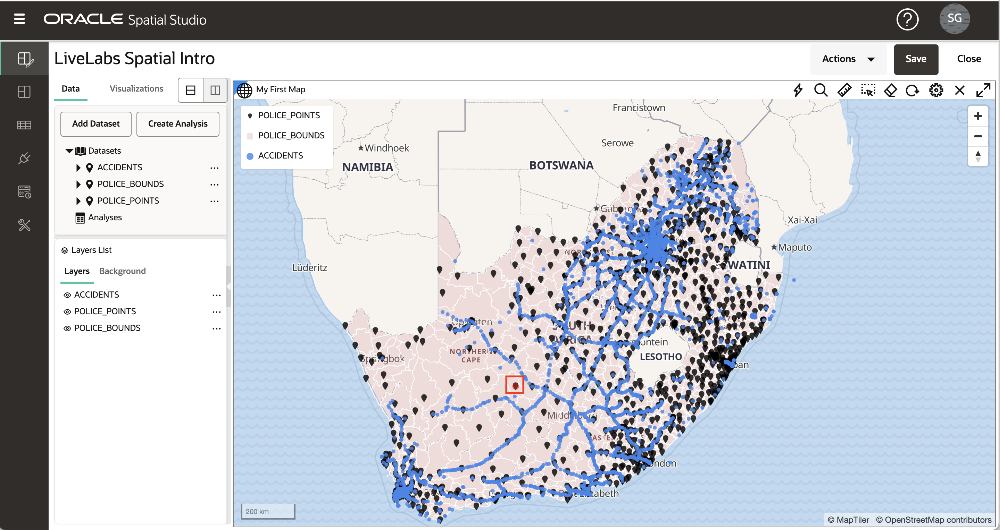
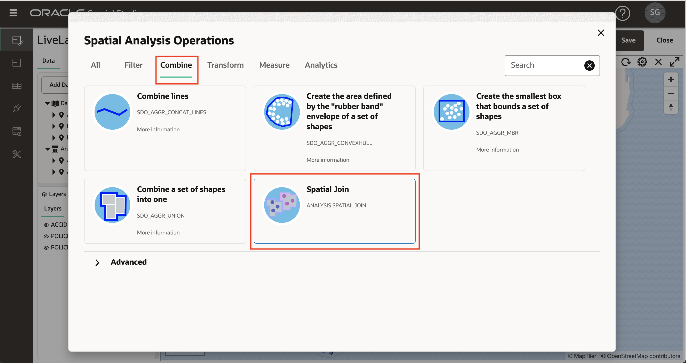
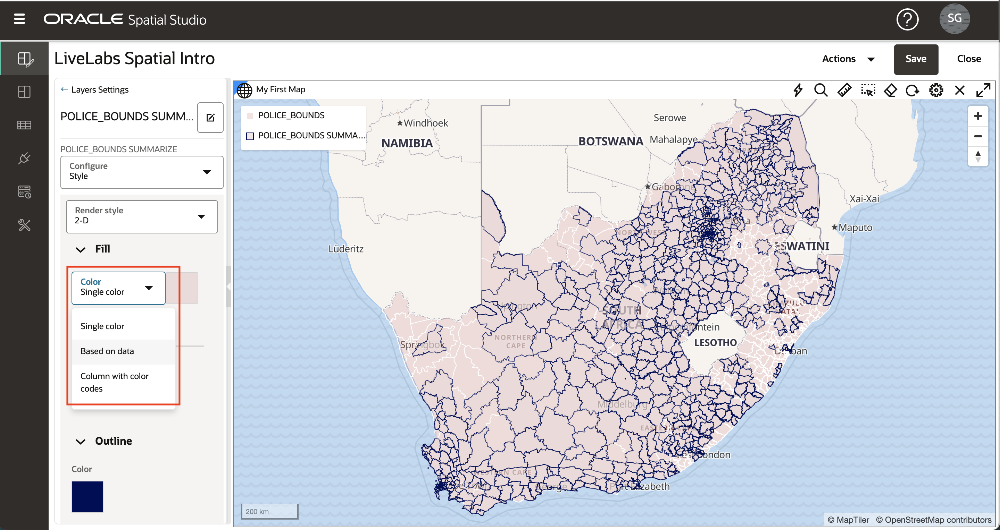

# 执行空间分析

## 简介

Spatial Studio 可访问 Oracle Database 的空间分析功能，而无需编写代码。为空间分析提供了简单的用户界面，所有底层数据库语法都自动在后台处理。Spatial Studio 中的空间分析操作分为以下几类：

**筛选器**

*   封闭：“我的哪些资产位于危险区域内？”
*   邻近：“我们的哪些网站距离预计的风暴路径不到 5 英里？”
*   ... 和其他人

**组合**

*   按地点加入：“根据控制将销售线索与销售地区关联”。
*   合并项目：“将多个县合并成 1 个销售地区”
*   ... 和其他人

**转换**

*   缓冲区：“创建围绕火灾周边 10 英里的形状。
*   Centroid：“在每个火灾边界的中间创建点。
*   ... 和其他人

**评估**

*   地区：“平方公里的风暴潮地区是什么？”
*   距离：“从我们的每个资产到预计风暴路径的最小距离是什么？”
*   ... 和其他人

**分析**

*   按区域汇总：“每个规划区域内的建筑的平均寿命是多少？”
*   每件商品的最近值：“与每个分部地点最近的仓库是什么，有多远？”
*   ... 和其他人

在此实验室中，您将探索其中一些空间分析。

估计的实验室时间：45 分钟

### 目标

*   了解 Spatial Studio 中的空间分析类别
*   了解如何执行空间分析并可视化结果

### 先备条件

*   成功完成实验室 1-3

## 任务 1：按邻近性筛选

在此步骤中，您使用空间过滤器来标识所选警察局指定距离内的意外事件。

1.  首先单击一个警察局。在下面的图片中，我点击了红色框中的警察局。这将选择要用于邻近分析的警察局。如果进行选择有任何问题，请确认已为 POLICE\_POINTS 层打开**允许选择**，如实验 3 任务 6 中所述。

2.  打开 ACCIDENTS 层的操作菜单，然后选择**空间分析**
    
    
    
3.  单击**筛选器**选项卡，选择**在另一个特定距离内返回形状**
    
    
    
4.  在分析对话框中，您可以输入结果名称或保留默认值。我们根据与 POLICE\_POINTS 中所选项目的距离过滤 ACCIDENTS。在下面的示例中，我使用了 150 公里的距离。
    
    **注：**对于所涉及的层，分析包括切换到 **• 仅在上面的层中包含选定的项**。我们只想在此示例中包括 1 个选定的警察局进行邻近分析。因此，对于 POLICE\_POINTS，**• 仅在上面的层中包括选定的项**应为 **On** 。
    
    完成选择后，单击**运行**。
    
    
    
5.  分析结果列在“数据元素”面板的“分析”下。将分析结果拖放到地图上。这将创建一个新的地图层，仅显示所选警察局指定距离内的事故。
    
    
    
    **注：**分析结果只是 Spatial Studio 中的另一种数据类型。如您在后面的实验室中看到的，分析结果可能会添加到其他映射/表，用于其他项目，通过 REST 或 SQL 以编程方式访问，或者作为文件导出。
    
6.  您不再需要映射中的此分析结果。因此，为了避免混乱，您接下来会将其从地图中删除。在“层列表”中右键单击分析结果，然后选择**删除**
    
    
    
    **注：**层只是映射中呈现的数据集。删除层（本例中的分析结果）后，数据集仍会列在“数据元素”面板中，并且可以重新添加到映射中。要从项目中删除数据集，请在“数据元素”面板中右键单击数据集，然后选择**从项目中删除**。
    

## 任务 2：按包含筛选

在此步骤中，您将使用空间筛选器来标识所选警察区域内的意外事件。

1.  首先单击 POLICE\_BOUNDS 层中的区域。所选区域将用于筛选事故。在下图中，选择了红框中的区域。
    
    
    
2.  与步骤 1 中前面的分析一样，打开 ACCIDENTS 层的操作菜单并选择“空间分析”。这一次，我们通过封闭来过滤。因此，选择磁贴**返回位于另一个磁贴内的形状**
    
    
    
3.  您可以为结果输入名称，也可以保留默认值。要过滤的层是 ACCIDENTS，用作过滤器的层是 POLICE\_BOUNDS。应为 POLICE\_BOUNDS 选择**仅包括已选择的项目**选项，因为我们只筛选单个选定警察区域中包含的事故。
    
    
    
4.  将分析结果拖放到地图中。观察包含选定警察区域内事故的新层。
    
    
    
    您可以使用鼠标滚轮放大结果区域。在下图中，ACCIDENTS 层被关闭以聚焦于分析结果。
    
    
    
5.  在移动到下一个分析之前，通过打开 POLICE\_BOUNDS 层的操作菜单并选择**缩放到层**，然后从映射中删除包含分析，可以缩放到数据的完整范围。
    

## 任务 3：按包含项加入

在这里，您可以基于空间关系加入数据集。您将根据包含项将 ACCIDENTS 联接到 POLICE\_BOUNDS。您可能会认为这充实或标记每个事故与包含它的警察区域。

1.  与之前分析一样，在“图层列表”中打开 ACCIDENTS 层的操作菜单，然后选择“空间分析”。选择**组合**选项卡，然后选择磁贴**空间联接**
    
    
    
2.  在“空间联接”对话框中，输入结果的名称 ACCIDENTS\_JOIN\_POLICE\_BOUNDS。对于其他条目，将根据空间关系将 ACCIDENTS 中的项联接到 POLICE\_BOUNDS 中的项。此操作将生成一个新数据集，其中包含使用包含每个项的 POLICE\_BOUNDS 区域的唯一 ID 扩充的 ACCIDENTS。POLICE\_BOUNDS 的唯一 ID（即键列）为 COMPNT\_NM，因此我们期望在结果中看到该列。单击**运行**。
    
    **注：**“高级”选项允许您在结果中包含辅助数据集（在本例中为 POLICE\_BOUNDS）中的所有列，而不仅仅是唯一 ID。
    
    
    
3.  结果列在“数据元素”面板的“分析”下。展开结果以查看其列；ACCIDENTS 中的所有原始列以及预期的 COMPNT\_NM（即警察区域名称）。
    
    
    
4.  将分析 ACCIDENTS\_JOIN\_POLICE\_BOUNDS 拖放到地图中。在“图层列表”中，打开 ACCIDENTS\_JOIN\_POLICE\_BOUNDS 层的操作菜单，然后选择“设置”以根据需要设置样式并启用“交互”。对于交互，启用包括列 COMPNT\_NM 的信息窗口。单击地图中的崩溃项，并在信息窗口中观察 COMPNT\_NM（即警察区域名称）。
    
    
    
    现在，您已使用每个项目的警察区域名称来增强崩溃数据。结果可用于进一步分析 Spatial Studio 或其他工具和应用程序（例如 Oracle Analytics Cloud）访问，以进行更广泛的分析。
    

## 任务 4：按区域汇总物料

在上一步中，您使用警察区域增强了崩溃项。在此步骤中，执行反向操作：使用崩溃信息汇总来扩充警察区域。

1.  在“图层列表”中打开 POLICE\_BOUNDS 层的操作菜单，然后选择“空间分析”。选择**分析**选项卡，然后选择**按区域汇总**磁贴
    
    
    
2.  在“按区域汇总”对话框中，您可以保留默认结果数据集名称 POLICE\_BOUNDS SUMMARIZE。在对话框中输入其他项：对于 POLICE\_BOUNDS 中的每个项，您将基于计数汇总 ACCIDENTS。输入 NUM\_ACCIDENTS 作为要添加的事故计数的列。单击**运行**。
    
    **注：**除了“计数”之外，您还可以使用此分析汇总数字属性，例如使用“平均”。
    
    
    
3.  将结果 POLICE\_BOUNDS SUMMARIZE 拖到地图上。然后在“图层列表”中打开 POLICE\_BOUNDS SUMMARIZE 的操作菜单，然后选择“设置”。在“样式”下，将“颜色”更改为**基于数据**。
    
    
    
4.  对于列，选择 NUM\_ACCIDENTS。使用 1、5、10、15、20 更新值。在任何单元格中输入每个值，因为它们将在值列表中自动排序。输入值后，单击编辑图标以设置调色板并选择调色板。观察地图显示警察区域颜色，根据您的值和选项板条目按事故数量进行编码。
    
    
    
    您可以自行添加信息窗口或工具提示，在单击或悬停在警察区域上方时，添加具有事故计数的信息窗口或工具提示。正如您在实验 2 任务 3 中所做的那样，您还可以添加“表”视图并在 POLICE\_BOUNDS 汇总中拖动以查看表格形式的信息。
    

## 任务 5：标识最近的项

在此步骤中，确定与每个警察局最近的事故。结果包含每个警察局，并增加到最近的事故的 ID 和距离。分析还提供了一个选项，包括最近项的所有列，而不仅仅是 ID 和距离。

1.  在“图层列表”中打开 POLICE\_POINTS 层的操作菜单，然后选择“空间分析”。选择 **Analytics（分析）**选项卡，然后单击磁贴 **Nearest per item（每项最接近）**。
    
    
    
2.  在 "Nearest per item"（每项最接近）对话框中，将结果命名为 POLICE\_POINTS WITH NEAREST ACCIDENT（或您选择的名称）。对于 POLICE\_POINTS 中的每个项，您都在 ACCIDENTS 中查找最近的项。展开“Advanced（高级）”区域。启用在结果中包括距离的选项。对于距离列名，输入 DISTANCE\_TO\_ACCIDENT（或您选择的名称）。将距离单位更改为公里（或您选择的另一个单位）。
    
    然后单击**运行**。
    
    
    
3.  在 "Layers"（层）列表中，关闭 POLICE\_POINTS 层。将 POLICE\_POINTS WITH NEAREST ACCIDENT 分析拖到地图上。
    
    
    
4.  转至 POLICE\_POINTS WITH NEAREST ACCIDENT 层设置，并设置您选择的样式。在“Configure（配置）”下拉列表中选择“Interaction（交互）”，然后启用“Info（信息）”窗口。选择您选择的列，包括此分析添加的列：ACCIDENT\_ID 和 DISTANCE\_TO\_ACCIDENT。单击 POLICE\_POINTS 项并观察信息窗口显示与 ACCIDENTS 中最近的项的 ID 和距离。 
    
    现在，您可以根据距离最近的事故的距离，使用颜色或尺寸来设置警察局的样式。
    
    最后，保存项目以保留您所做的更改。
    

## 任务 6：访问 SQL 代码和 GeoJSON 端点 ［可选］

此可选步骤适用于对以编程方式访问结果感兴趣的开发人员。Spatial Studio 允许您查看空间分析的 SQL 代码，并提供返回结果为 GeoJSON 的 Web 端点。此信息在“数据集属性”中可用，可在“项目”或“数据集”页中访问。您将从项目中访问信息。

1.  在“数据元素”面板中，打开分析之一的操作菜单，例如 **ACCIDENTS INSIDE** ，然后选择**属性**

2.  观察包含 SQL 代码和 GeoJSON 端点的部分。

    On your own, paste the GeoJSON endpoint into a browser and observe your results returned as GeoJSON. Similarly, you may copy and paste the SQL code into SQL Developer Web to run the analysis directly. 
    

本课程将结束 Oracle Spatial Studio 简介研讨会。

## 确认

*   **作者** - 数据库产品管理 David Lapp
*   **上次更新者/日期** - Denise Myrick，数据库产品管理，2023 年 4 月