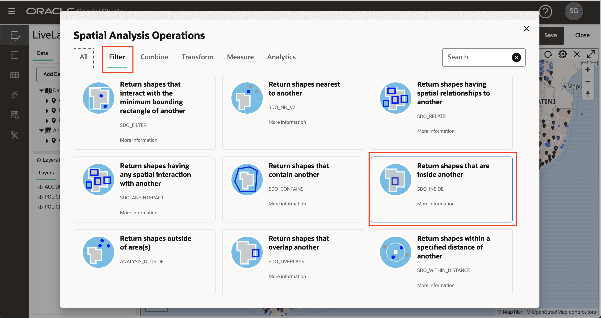
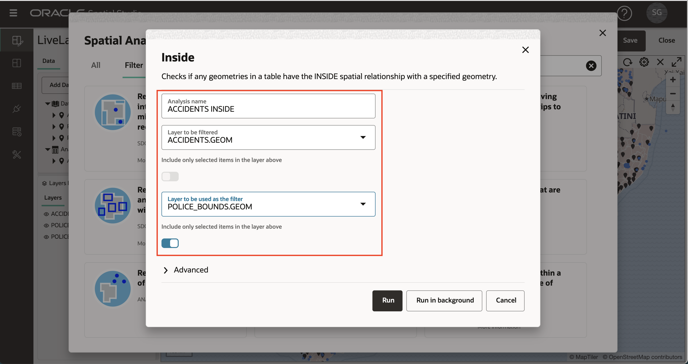
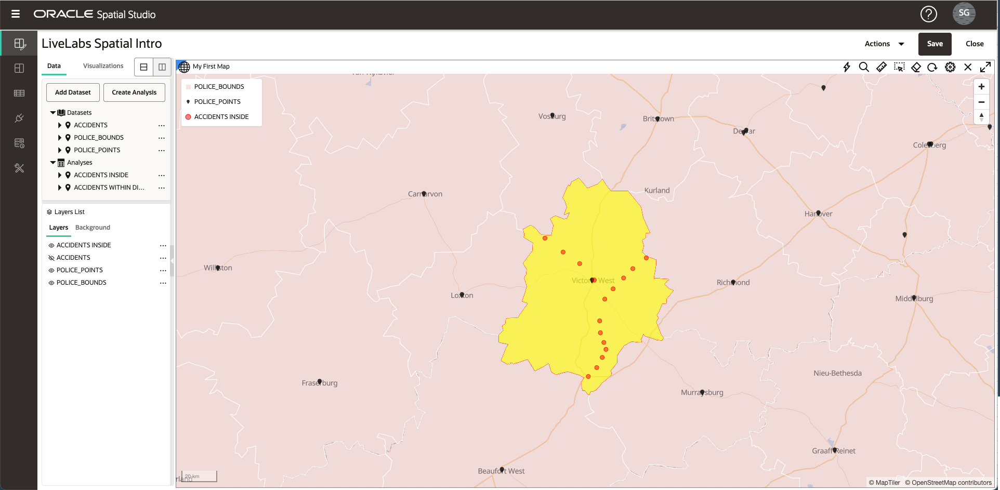
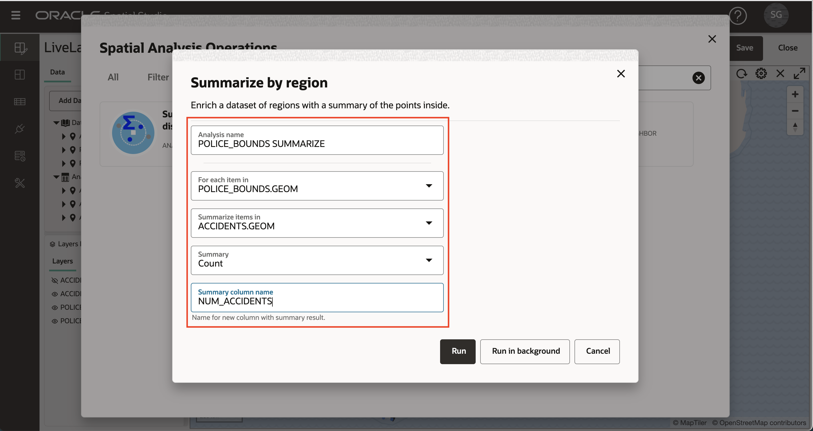
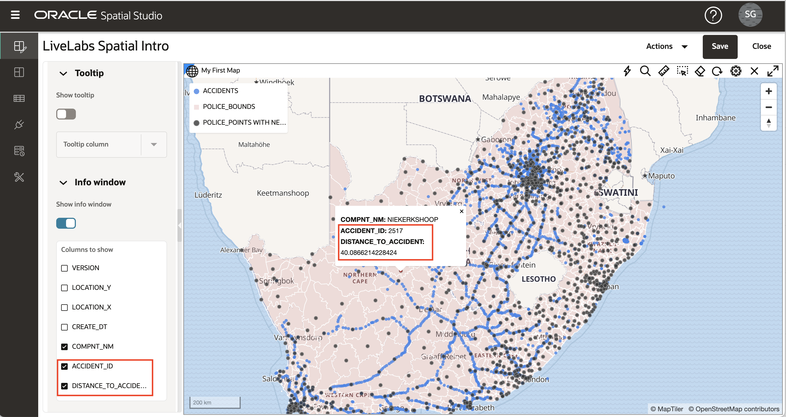

# 執行空間分析

## 簡介

Spatial Studio 不需編寫程式碼，即可存取 Oracle Database 的空間分析功能。空間分析提供簡單的使用者介面，而且系統會在背景自動處理所有底層的資料庫語法。Spatial Studio 中的空間分析作業分為幾個類別：

**篩選**

*   容器：「我的哪些資產位於危險區內？」
*   近似：「我們的網站在預計風暴路徑的 5 英里以內？」
*   ... 以及其他

**結合**

*   依位置加入：「根據容器將銷售潛在客戶與銷售區域建立關聯」。
*   合併項目：「將數個縣別合併為 1 個銷售區域」
*   ... 以及其他

**轉換**

*   緩衝：「建立圍繞消防周邊 10 英里的形狀。」
*   甲狀腺：「每個火警周邊的建立點」。
*   ... 以及其他

**評量**

*   地區：「暴風雨地區在平方公里？
*   距離：「我們每項資產到預計風暴路徑的最短距離是多少？」
*   ... 以及其他

**分析**

*   依區域彙總：「每個計劃區域內的建築物平均年齡為何？」
*   最接近的每個項目：「每個分行地點最接近的倉儲，有多遠？
*   ... 以及其他

在此實驗室中，您將探索一些空間分析。

預估實驗室時間：45 分鐘

### 目標

*   瞭解 Spatial Studio 中的空間分析類別
*   瞭解如何執行空間分析及將結果視覺化

### 先決條件

*   已順利完成實驗室 1-3

## 工作 1：依鄰近度篩選

在此步驟中，您可以使用空間篩選來識別所選警署指定距離內的事故。

1.  點擊警局開始。在下方影像中，我點擊了紅盒中的警察局。這會選取用來進行鄰近分析的警署。如果進行選取有任何問題，請確認已開啟 POLICE\_POINTS 層**允許選取** (如實驗室 3 作業 6 中所述)。

2.  開啟 ACCIDENTS 圖層的動作功能表，然後選取**空間分析**
    
    
    
3.  按一下**篩選**頁籤，選取**傳回距離另一段特定距離內的形狀**
    
    
    
4.  在分析對話方塊中，您可以輸入結果的名稱或保留預設值。我們正在根據 POLICE\_POINTS 中所選項目的距離來篩選 ACCIDENTS。在下面的範例中，我使用了 150 公里的距離。
    
    **備註：**分析包含將相關圖層的切換至 **• 僅包含以上圖層中選取的項目**。在此範例中，我們只想要包含 1 個選取的警察局，以進行鄰近分析。因此，**• 僅包含以上圖層中選取的項目**應為 POLICE\_POINTS 的**開啟**。
    
    選取之後，請按一下**執行**。
    
    
    
5.  分析結果會列在「資料元素」面板的「分析」下。將分析結果拖放至地圖。這會建立一個新的地圖圖層，只顯示所選警署指定距離內的事故。
    
    
    
    **注意：**分析結果只是 Spatial Studio 中另一種類型的資料集。如您稍後將會在實驗室中看到，分析結果可能會新增至其他專案中使用的對應 / 表格、透過 REST 或 SQL 以程式設計方式存取，或是匯出為檔案。
    
6.  對應中不再需要此分析結果。因此為了避免雜亂，您接著要將它從地圖中移除。在「圖層清單」中的分析結果上按一下滑鼠右鍵，然後選取**移除**
    
    
    
    **備註：**圖層只是地圖中轉譯的資料集。移除圖層 (在此情況下，我們的分析結果) 之後，「資料集」仍然會列在「資料元素」面板中，並可重新新增至地圖。若要移除專案中的資料集，請在「資料元素」面板中的「資料集」上按一下滑鼠右鍵，然後選取**從專案中移除**。
    

## 任務 2：依容器篩選

在此步驟中，您可以使用空間篩選來識別所選警區內的意外事件。

1.  首先，按一下 POLICE\_BOUNDS 層中的區域。選取的區域將用於篩選事故。在下方影像中，已選取紅色方塊中的區域。
    
    
    
2.  如同您在步驟 1 中先前分析所做的，開啟 ACCIDENTS 圖層的動作功能表，然後選取「空間分析」。這次我們依容器進行篩選。因此，請選取磚塊**傳回位於另一個形狀**
    
    
    
3.  您可以輸入結果的名稱或保留預設值。要篩選的圖層是 ACCIDENTS，而作為篩選的圖層是 POLICE\_BOUNDS。**僅包含已選取的項目**選項應該為 POLICE\_BOUNDS 選取，因為我們只篩選單一選取警察區所包含的事故。
    
    
    
4.  將分析結果拖放至地圖。觀察包含所選警區內事故的新圖層。
    
    
    
    您可以使用滑鼠滾輪來縮放結果區域。ACCIDENTS 圖層下方的影像會關閉，以專注於分析結果。
    
    
    
5.  移至下一個分析之前，請開啟 POLICE\_BOUNDS 圖層的動作功能表並選取**縮放至圖層**，然後從地圖移除包含分析，以縮放至資料的完整範圍。
    

## 任務 3：依容器結合

您可以在此處根據空間關係加入資料集。您將根據容器將 ACCIDENTS 加入 POLICE\_BOUNDS。你可能會認為這在包含事故的警察區內充實或標記每個事故。

1.  如同先前分析所做的，在「圖層清單」中開啟 ACCIDENTS 圖層的動作功能表，然後選取「空間分析」。選取**結合**頁籤，然後選取磚塊**空間結合**
    
    
    
2.  在「空間結合」對話方塊中，輸入結果的名稱 ACCIDENTS\_JOIN\_POLICE\_BOUNDS。對於其他項目，您正在根據 POLICE\_BOUNDS 中項目的內部空間關係，在 ACCIDENTS 中加入項目。此作業將會產生一個新資料集，其中包含以包含每個項目之 POLICE\_BOUNDS 區域的唯一 ID 強化的 ACCIDENTS。POLICE\_BOUNDS 的唯一 ID (即索引鍵資料欄) 為 COMPNT\_NM，因此預期會在結果中看到該資料欄。按一下**執行 (Run)** 。
    
    **注意：**「進階」選項可讓您在結果中包含次要資料集 (POLICE\_BOUNDS 在此情況下) 的所有資料欄，而不只是唯一的 ID。
    
    
    
3.  結果會列在「資料元素」面板的「分析」下方。展開結果以查看其資料欄；所有來自 ACCIDENTS 的原始資料欄，再加上預期的 COMPNT\_NM (亦即，警察地區名稱)。
    
    
    
4.  將分析 ACCIDENTS\_JOIN\_POLICE\_BOUNDS 拖放至地圖中。在「圖層清單」中，開啟 ACCIDENTS\_JOIN\_POLICE\_BOUNDS 圖層的動作功能表，然後選取「設定」以視需要設定「樣式」，並啟用「互動」。針對「互動」，啟用包含資料欄 COMPNT\_NM 的「資訊視窗」。點擊地圖中的一個錯誤項目，並在資訊視窗中看到 COMPNT\_NM (也就是警察地區名稱)。
    
    
    
    您現在每個項目的警察區名稱擴增了當機資料。這些成果可用來進一步分析 Spatial Studio，或由其他工具和應用程式 (例如 Oracle Analytics Cloud) 存取，以進行更廣泛的分析。
    

## 作業 4：依區域彙總料號

在前一步，您加強了警區的當機項目。在此步驟中，您會反轉：以錯誤資訊摘要來擴增警察地區。

1.  開啟「圖層清單」中 POLICE\_BOUNDS 層的動作功能表，然後選取「空間分析」。選取**分析**頁籤，然後選取磚塊**依區域彙總**
    
    
    
2.  在「依區域彙總」對話方塊中，您可以保留預設結果資料集名稱 POLICE\_BOUNDS SUMMARIZE。在對話方塊中輸入其他項目：針對 POLICE\_BOUNDS 中的每個項目，根據「計數」彙總 ACCIDENTS。輸入 NUM\_ACCIDENTS 作為要以意外事件計數新增的資料欄。按一下**執行 (Run)** 。
    
    **備註：**除了「計數」之外，您也可以使用此分析來彙總數值屬性，例如使用「平均」。
    
    
    
3.  將結果 POLICE\_BOUNDS SUMMARIZE 拖曳到地圖。然後在「圖層清單」中開啟 POLICE\_BOUNDS SUMMARIZE 的動作功能表並選取「設定值」。在「樣式」底下，將「顏色」變更為**根據資料**。
    
    
    
4.  若為資料欄，請選取 NUM\_ACCIDENTS。以 1、5、10、15、20 更新值。輸入任何儲存格中的每個值，因為它們會在值清單中自動排序 。輸入值之後，按一下編輯圖示以設定調色盤並選取調色盤。觀察地圖會根據您的值和調色盤項目，顯示以意外次數編碼的警察區域。
    
    
    
    您可以自行按一下或將游標暫留在某個警區上時，也可以新增資訊視窗或工具提示，避免意外事故發生。您也可以在「實驗室 2 作業 3」中新增「表格」檢視，然後在 POLICE\_BOUNDS SUMMARIZE 中拖曳以表格形式檢視資訊。
    

## 作業 5：識別最接近的項目

在此步驟中，您可決定每個警察局的最近意外事故。結果包括每個警局擴增 ID 和距離最近的事故。分析還提供選項包括最接近項目的所有資料欄，而不只是 ID 和距離。

1.  開啟「圖層清單」中 POLICE\_POINTS 層的動作功能表，然後選取「空間分析」。選取**分析**頁籤，然後按一下**每個項目最接近**磚塊。
    
    
    
2.  在「最接近每一項目」對話方塊中，將結果命名為 POLICE\_POINTS WITH NEAREST ACCIDENT (或您所選擇的名稱)。對於 POLICE\_POINTS 中的每個項目，您要在 ACCIDENTS 中尋找最接近的項目。展開「進階 (Advanced)」區段。啟用在結果中包含距離的選項 。如需距離資料欄名稱，請輸入 DISTANCE\_TO\_ACCIDENT (或選擇的名稱)。將距離單位變更為公里 (或您選擇的另一個單位)。
    
    然後按一下**執行 (Run)** 。
    
    
    
3.  在 \[Layer\] (圖層) 清單中關閉 POLICE\_POINTS 層。將 POLICE\_POINTS WITH NEAREST ACCIDENT 分析拖曳至地圖。
    
    
    
4.  移至 POLICE\_POINTS WITH NEAREST ACCIDENT 圖層的「設定值」，並設定您選擇的「樣式」。在「設定」下拉式清單中，選取「互動」，然後啟用「資訊」視窗。選取您選擇的資料欄，包括此分析新增的資料欄：ACCIDENT\_ID 和 DISTANCE\_TO\_ACCIDENT。按一下 POLICE\_POINTS 項目，觀察資訊視窗會顯示與 ACCIDENTS 中最接近之項目的 ID 與距離。 
    
    你可以自行使用色彩或大小，根據距離最近的意外，自由挑選出各種警察局。
    
    最後，儲存專案以保留變更。
    

## 作業 6：存取 SQL 程式碼和 GeoJSON 端點 \[ 選擇性 \]

此選擇性步驟適用於想要以程式設計方式存取結果的開發人員。Spatial Studio 可讓您查看空間分析的 SQL 程式碼，並提供傳回結果為 GeoJSON 的 Web 端點。此資訊可在「資料集特性」中使用，可從「專案」或「資料集」頁面中存取。您將從專案內存取資訊。

1.  在「資料元素」面板中，開啟其中一個分析的動作功能表，例如 **ACCIDENTS INSIDE** 並選取**特性**

2.  注意含有 SQL 程式碼和 GeoJSON 端點的區段。

    On your own, paste the GeoJSON endpoint into a browser and observe your results returned as GeoJSON. Similarly, you may copy and paste the SQL code into SQL Developer Web to run the analysis directly. 
    

這包括 Oracle Spatial Studio 研討會簡介。

## 確認

*   **作者** - Database Product Management 的 David Lapp
*   **上次更新者 / 日期** - Denise Myrick，Database Product Management，2023 年 4 月