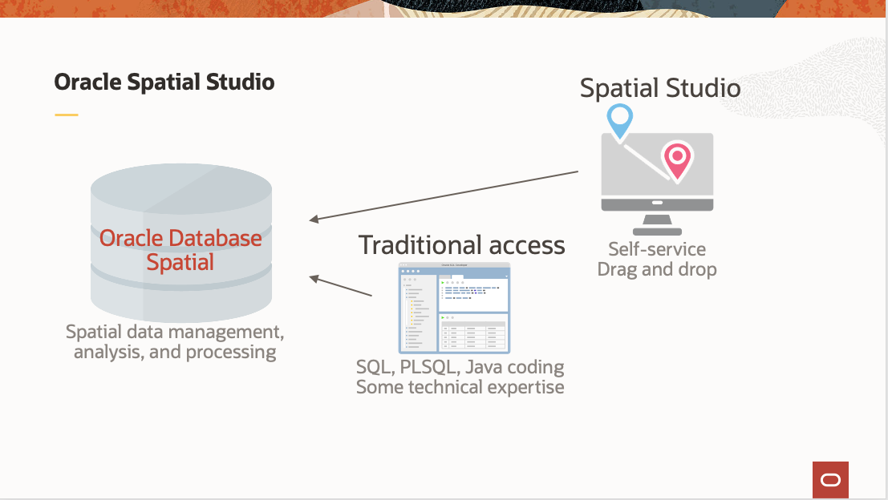

# Introdução

## Sobre este Workshop

Neste workshop, você provisionará o Spatial Studio e o Autonomous Database para o Oracle Cloud no OCI Cloud Marketplace. Em seguida, você carregará, configurará, visualizará e analisará dados espaciais relacionados ao impacto do aumento do nível do mar.

Tempo de Oficina Estimado: 60 minutos

### Sobre o Oracle Spatial Studio

O Oracle Spatial Studio (Spatial Studio) é um aplicativo web que oferece acesso de autoatendimento aos recursos espaciais do Oracle Database. Embora esses recursos tenham exigido historicamente a codificação e/ou o uso de ferramentas da 3a parte, o Spatial Studio permite que os usuários corporativos criem e compartilhem análises espaciais e mapas da Web interativos usando uma interface de usuário da Web de autoatendimento.

O Spatial Studio opera em dados espaciais no Oracle Database, o que significa tabelas e views que incluem o tipo de dados de geometria da Oracle. Estes dados são dados espaciais pré-existentes ou dados não espaciais que são preparados usando o Spatial Studio para adicionar geometrias com base em atributos.

O Spatial Studio é um aplicativo Java EE que pode ser implantado no Oracle Cloud no Oracle Cloud Marketplace. O Spatial Studio também pode ser implantado manualmente no Oracle WebLogic, Tomcat ou como um pacote Jetty pré-implantado ("Início Rápido").

Para obter mais informações, visite [https://www.oracle.com/database/technologies/spatial-studio/get-started.html](https://www.oracle.com/database/technologies/spatial-studio/get-started.html)

### Objetivos

*   Saiba como usar o Cloud Marketplace para instalar o Spatial Studio e o Autonomous Database
*   Aprenda a preparar, visualizar e analisar dados espaciais

### Pré-requisitos

*   Uma Conta no Oracle Cloud

## Agradecimentos

*   **Autor** - David Lapp, Database Product Management, Oracle
*   **Colaboradores** - Jesus Vizcarra, Denise Myrick, Jayant Sharma
*   **Última Atualização em/Data** - David Lapp, agosto de 2023