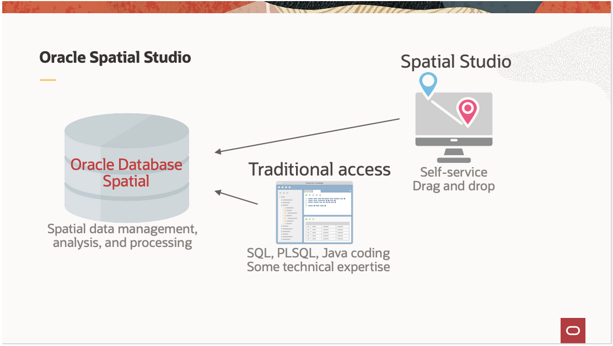

# Einführung

## Über diesen Workshop

In diesem Workshop lernen Sie die Funktionen von Spatial Studio für die Self-Service-Raumanalyse und -visualisierung kennen. Mit Datensätzen von Verkehrsunfällen, Polizeistationen und Polizeistationen laden und visualisieren Sie räumliche Daten und analysieren ihre räumlichen Beziehungen wie unten gezeigt.

Geschätzte Workshopzeit: 2 Stunden

### Oracle Spatial Studio

Oracle Spatial Studio (Spatial Studio) bietet No-Code-Zugriff auf die räumlichen Funktionen von Oracle Database. Während diese Funktionen in der Vergangenheit die Codierung und/oder Verwendung von 3rd-Party-Tools erfordern, ermöglicht Spatial Studio Business-Anwendern, räumliche Analysen und interaktive Webkarten mit Selfservice-GUIs zu erstellen und zu teilen.

Spatial Studio arbeitet mit räumlichen Daten in Oracle Database, d.h. mit Tabellen und Views, die den Geometriedatentyp von Oracle enthalten. Bei diesen Daten handelt es sich um bereits vorhandene räumliche Daten oder nicht räumliche Daten, die mit Spatial Studio erstellt werden, um Geometrien basierend auf Attributen hinzuzufügen. Die Endbenutzerfunktionen von Spatial Studio können wie folgt zusammengefasst werden:

Auf räumliche Daten zugreifen und sie vorbereiten:

*   Auf räumliche/nicht räumliche Daten in Oracle Database zugreifen
*   Daten aus allgemeinen Formaten laden
*   Bereiten Sie nicht räumliche Daten vor, indem Sie Adressen geocodieren oder LAT/LON-Spalten indizieren
*   Große Datasets vor dem Cache

Räumliche Daten analysieren und visualisieren:

*   Kartenvisualisierungen per Drag-and-Drop
*   Datengestütztes Styling
*   Spatial-Analysen ausführen
*   Ergebnisse gemeinsam verwenden

Spatial Studio bietet auch Integrationsfunktionen für Entwickler und Konfigurationsoptionen für Anwendungsadministratoren, die nicht im Rahmen dieses Einführungsworkshops enthalten sind.

Weitere Informationen finden Sie unter \[https://oracle.com/goto/spatialstudio\] (https://oracle.com/goto/spatialstudio)

### Ziele

Erläuterungen zu Spatial Studio-Funktionen

*   Spatial-Daten laden
*   Räumliche Daten visualisieren
*   Spatial-Analysen ausführen

### Voraussetzungen

\- Dieser Workshop erfordert Zugriff auf Spatial Studio und Oracle Database. \- Dieser Workshop erfordert Zugriff auf Spatial Studio und Oracle Database. Diese werden im Rahmen Ihrer LiveLabs-Reservierung für Sie erstellt.

_Hinweis: Wenn Sie über ein **kostenloses Testkonto** verfügen, wird Ihr Account nach Ablauf der kostenlosen Testversion in einen Account vom Typ "**Immer kostenlos**" konvertiert. Sie können keine Free Tier-Workshops durchführen, es sei denn, die Umgebung vom Typ "Immer kostenlos" ist verfügbar. **[Klicken Sie hier, um die häufig gestellte Fragen zu Free Tier aufzurufen.](https://www.oracle.com/cloud/free/faq.html)**_

## Danksagungen

*   **Autor** - David Lapp, Database Product Management, Oracle
*   **Zuletzt aktualisiert am/um** - David Lapp, Database Product Management, April 2021