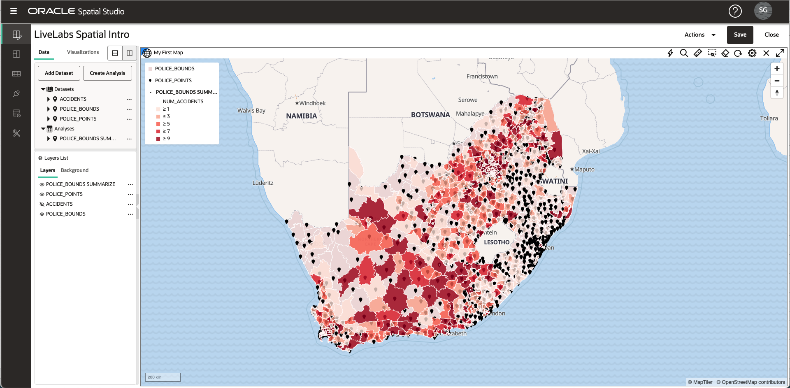
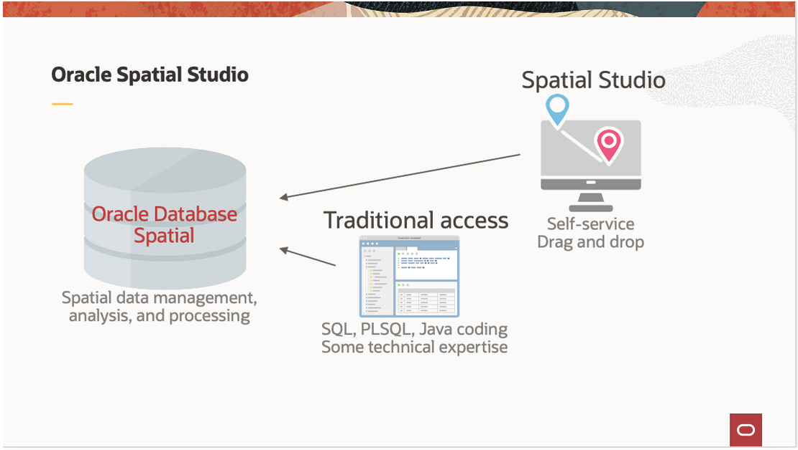

# Présentation

## A propos de cet atelier

Dans cet atelier, vous explorerez les fonctionnalités de Spatial Studio pour l'analyse et la visualisation spatiales en libre-service. En utilisant des ensembles de données sur les accidents de la circulation, les commissariats de police et les zones de service des commissariats de police, vous chargerez et visualiserez des données spatiales et analyserez leurs relations spatiales comme indiqué ci-dessous.

Durée estimée de l'atelier : 2 heures

### A propos d'Oracle Spatial Studio

Oracle Spatial Studio (Spatial Studio) fournit un accès sans code aux fonctionnalités spatiales d'Oracle Database. Bien que ces fonctionnalités aient toujours nécessité le codage et/ou l'utilisation d'outils 3e partie, Spatial Studio permet aux utilisateurs professionnels de créer et de partager des analyses spatiales et des cartes Web interactives à l'aide d'interfaces graphiques en libre-service.

Spatial Studio utilise les données spatiales d'Oracle Database, c'est-à-dire les tables et les vues qui incluent le type de données de géométrie d'Oracle. Ces données sont des données spatiales préexistantes ou des données non spatiales préparées à l'aide de Spatial Studio pour ajouter des géométries basées sur des attributs. Les fonctionnalités utilisateur final de Spatial Studio peuvent être résumées comme suit :

Accéder aux données spatiales et les préparer :

*   Accéder à des données spatiales/non spatiales dans Oracle Database
*   Charger des données à partir de formats communs
*   Préparer des données non spatiales en géocodant des adresses ou en indexant des colonnes de lat/lon
*   Ensembles de données volumineux avant mise en cache

Analyser et visualiser des données spatiales :

*   Visualisations par glisser-déplacer de carte
*   Style orienté données
*   Effectuer des analyses spatiales
*   Partager les résultats

Spatial Studio fournit également des fonctionnalités d'intégration pour les développeurs et des options de configuration pour les administrateurs d'applications, qui ne font pas partie de cet atelier de présentation.

Pour plus d'informations, veuillez visiter \[https://oracle.com/goto/spatialstudio\] (https://oracle.com/goto/spatialstudio)

### Objectifs

Comprendre les fonctionnalités de Spatial Studio pour

*   Charger des données spatiales
*   Visualiser des données spatiales
*   Effectuer des analyses spatiales

### Prérequis

\- Cet atelier nécessite l'accès à Spatial Studio et à Oracle Database. \- Cet atelier nécessite l'accès à Spatial Studio et à Oracle Database. Ceux-ci sont créés pour vous dans le cadre de votre réservation LiveLabs.

_Remarque : si vous disposez d'un compte **Essai gratuit**, à l'expiration de votre période d'évaluation gratuite, votre compte sera converti en compte **Toujours gratuit**. Vous ne pourrez pas organiser d'ateliers Free Tier à moins que l'environnement Always Free ne soit disponible. **[Cliquez ici pour accéder à la page FAQ sur le niveau gratuit.](https://www.oracle.com/cloud/free/faq.html)**_

## Accusés de réception

*   **Auteur** - David Lapp, Database Product Management, Oracle
*   **Dernière mise à jour par/date** - David Lapp, Database Product Management, avril 2021