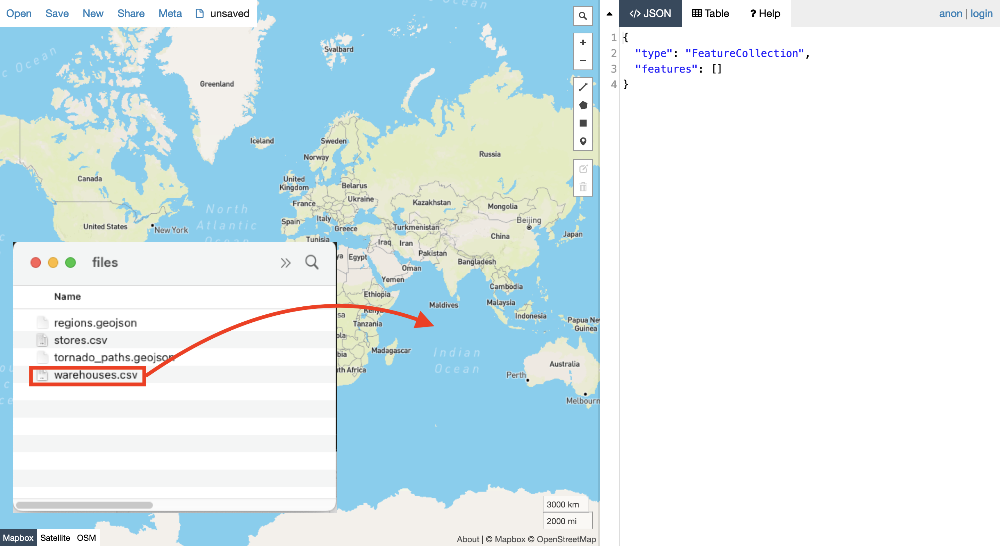
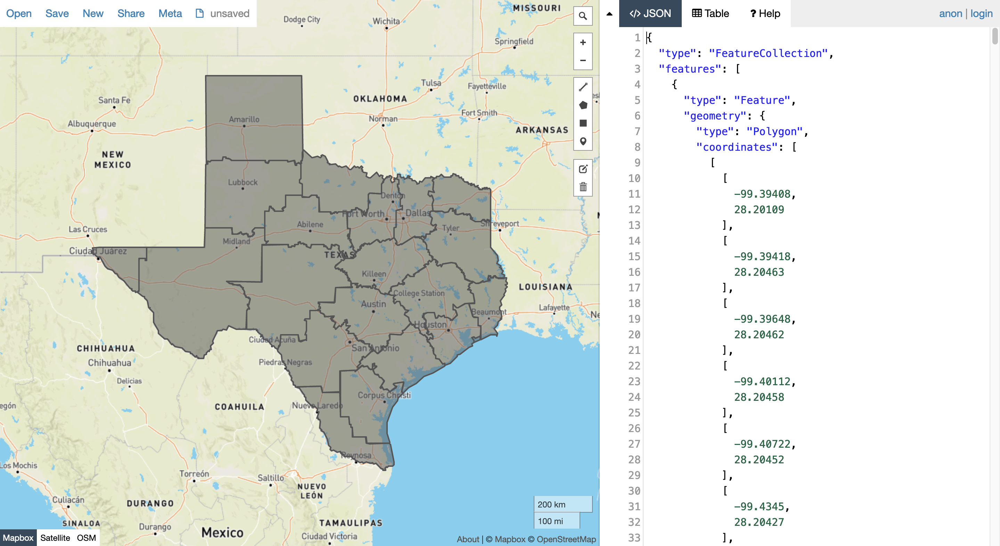
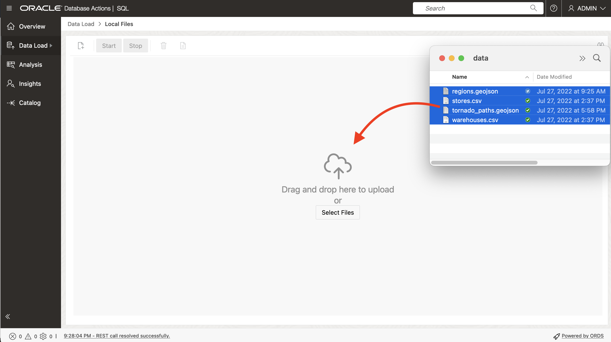
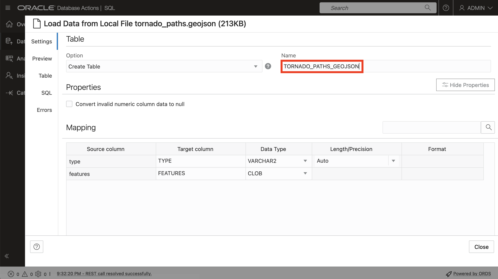
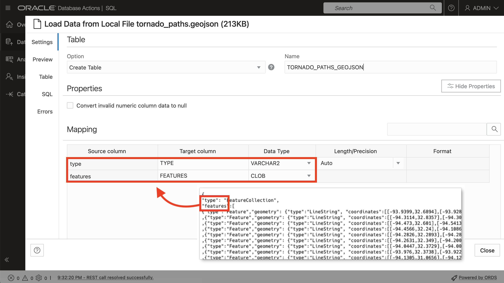
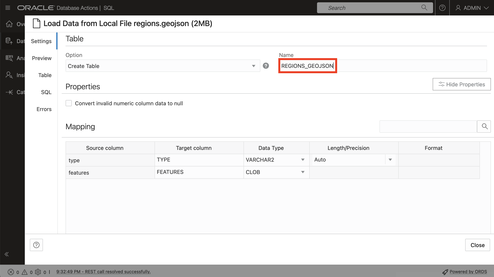
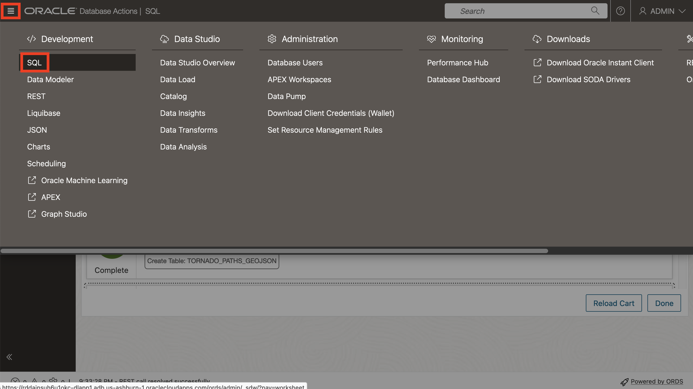
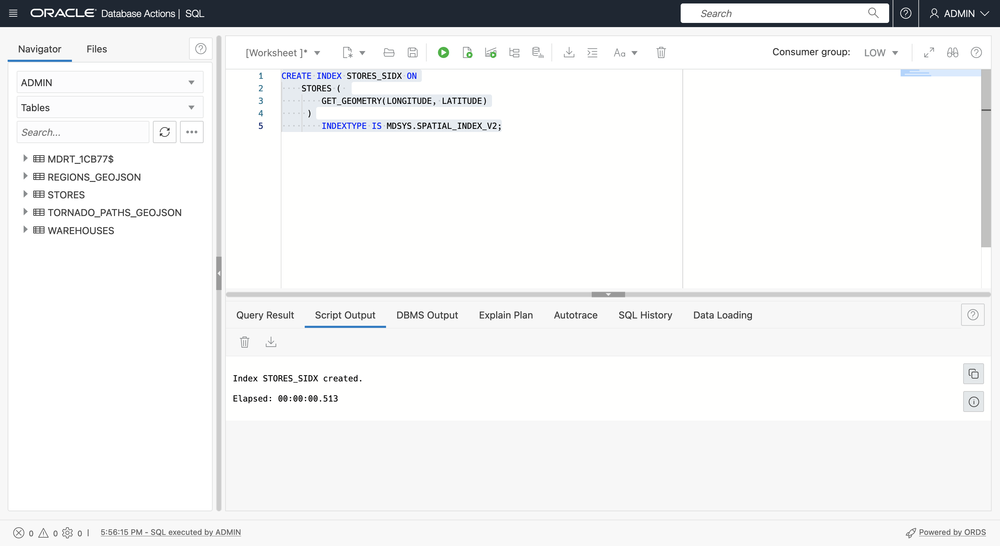
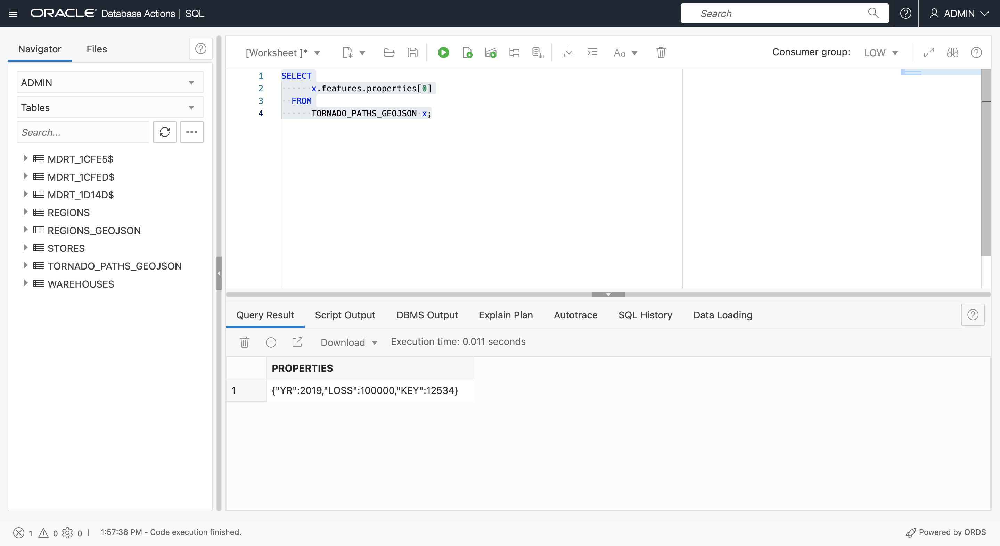

# Beispieldaten erstellen

## Einführung

Räumliche Daten werden in der Regel aus Dateien mit Koordinaten oder Ortsnamen und Dateien abgerufen, die Daten in nativen räumlichen Formaten speichern. In dieser Übung laden und konfigurieren Sie räumliche Daten aus solchen Dateien und zeigen eine Vorschau des Inhalts auf einer Karte an.

Geschätzte Zeit: 20 Minuten

### Ziele

In dieser Übung führen Sie folgende Schritte aus:

*   Informationen zum Spatial Data Management in Oracle Database
*   Spatial-Daten in Oracle Database aus gängigen Dateiformaten vorbereiten

### Voraussetzungen

*   Abschluss von Übung 2: Verbindung zu ADB mit SQL Worksheet herstellen

### Informationen zu räumlichen Daten

Oracle Database speichert räumliche Daten (Punkte, Linien, Polygone) in einem nativen Datentyp namens SDO\_GEOMETRY. Oracle Database bietet außerdem einen nativen Spatial Index für leistungsstarke Spatial-Vorgänge. Dieser Spatial Index basiert auf räumlichen Metadaten, die für jede Tabelle und Geometriespalte mit räumlichen Daten eingegeben werden. Sobald räumliche Daten aufgefüllt und indiziert wurden, stehen robuste APIs zur Verfügung, um räumliche Analysen, Berechnungen und Verarbeitungen durchzuführen.

Der Typ SDO\_GEOMETRY hat das folgende allgemeine Format:

        SDO_GEOMETRY( 
            [geometry type]              -- ID for points/lines/polygons
            , [coordinate system]        -- ID of coordinate system
            , [point coordinate]         -- used for points only
            , [line/polygon info]        -- used for lines/polygons only
            , [line/polygon coordinates] -- used for lines/polygons only
        )
    

Die häufigsten Geometrietypen sind 2-dimensional:

| ID | Typ |
| --- | --- |
| 2001 | Punkt |
| 2002 | Position |
| 2003 | Polygon |

Die gängigsten Koordinatensysteme sind:

| ID | Koordinatensystem |
| --- | --- |
| (4326) | Breite/Länge |
| (3857) | Welt-Mercator |

Beachten Sie bei der Verwendung von Breiten- und Längengrad, dass der Breitengrad die Y-Koordinate und der Längengrad die X-Koordinate ist. Da Koordinaten als X-,Y-Paar aufgeführt werden, müssen die Werte in SDO\_GEOMETRY in der folgenden Reihenfolge angegeben werden: Längengrad, Breitengrad.

Das folgende Beispiel ist eine Punktgeometrie mit Längen- und Breitenkoordinaten:

        SDO_GEOMETRY( 
            2001                       -- 2D point
            , 4326                     -- Coordinate system
            , SDO_POINT_TYPE(
              -100.123, 20.456, NULL)  -- lon/lat values
            , NULL                     -- Not used for points
            , NULL                     -- Not used for points
        )
    

Das folgende Beispiel ist eine Polygongeometrie mit Längen- und Breitenkoordinaten:

        SDO_GEOMETRY( 
            2003                     -- 2D polygon
            , 4326                   -- Coordinate system
            , NULL                   -- Only used for points
            , SDO_ELEM_INFO_ARRAY(
                      1, 1003, 1)    -- Signifies simple exterior polygon
            , SDO_ORDINATE_ARRAY(    -- lon/lat values
                  -98.789065,39.90973
                , -101.2522,39.639537
                , -99.84374,37.160316
                , -96.67987,35.460699
                , -94.21875,39.639537
                , -98.789025,39.90973
            )
        )
    

Der allgemeine Workflow zum Erstellen räumlicher Daten besteht darin, Geometrien zu generieren und dann einen Spatial Index für eine optimale Performance zu erstellen. Vor der Erstellung eines Spatial Index wird eine Zeile mit räumlichen Metadaten eingefügt, die vom Spatial Index zur Sicherstellung der Datenkonsistenz verwendet wird.

Räumliche Metadaten werden wie folgt eingefügt:

        INSERT INTO USER_SDO_GEOM_METADATA VALUES (
        [table name],
        [geometry column name],
        SDO_DIM_ARRAY(
          SDO_DIM_ELEMENT('X',[min x],[max x],[tolerance]),
          SDO_DIM_ELEMENT('Y',[min y],[max y],[tolerance])),
        [coordinate system id]   
        );
    

In diesem Workshop arbeiten Sie mit Längen- und Breitenkoordinaten, sodass die Metadaten-Einfügungen wie folgt aussehen:

        INSERT INTO USER_SDO_GEOM_METADATA VALUES (
        [table name],
        [geometry column name],
        SDO_DIM_ARRAY(
          SDO_DIM_ELEMENT('X', -180, 180, 0.005),
          SDO_DIM_ELEMENT('Y',-90, 90, 0.005)),
        4326 
        );
    

Bei **Punktdaten** besteht das häufigste Szenario darin, mit Daten zu beginnen, einschließlich Koordinaten, die Punktpositionen darstellen. Die Daten können entweder durch Erstellen und Füllen einer neuen Geometriespalte (Spalte mit dem Typ SDO\_GEOMETRY) oder durch Erstellen einer Funktion, die Geometrien aus Koordinaten erstellt, und dann durch Erstellen eines Spatial Index für diese Funktion konfiguriert werden. Beide Optionen haben ihre zugehörigen Anwendungsfälle, und Sie verwenden beide Methoden, um sich vertraut zu machen.

Bei **Zeilen** und **Polygonen** wird am häufigsten aus allgemeinen Formaten wie GeoJSON geladen und in eine Tabelle mit einer Geometriespalte konvertiert. GeoJSON, das häufigste Format für die Entwicklerintegration, und da die Konvertierung von/zu GeoJSON in diesem Workshop enthalten ist, stellen wir die folgende kurze Einführung vor.

Wie unter [https://geojson.org/](https://geojson.org/) angegeben, ist "GeoJSON ein Format zum Codieren einer Vielzahl von geografischen Datenstrukturen". Die Geodatenindustrie hat GeoJSON als Defacto-Standard akzeptiert und ist daher von praktisch allen räumlichen Entwicklerplattformen, Bibliotheken und Toolkits nutzbar. Daher ist der Umgang mit GeoJSON für die Interoperabilität wichtig.

Ein GeoJSON-Dokument ist in der Regel ein JSON-Dokument mit der Struktur der obersten Ebene.

      {
          "type": "FeatureCollection",
          "features": [
             ... array of GeoJSON features ... 
          ]
       }
    

Das Format der GeoJSON-Funktionen wird unten angezeigt.


Oracle Spatial umfasst integrierte Funktionen für die Konvertierung zwischen dem nativen räumlichen Typ (SDO\_GEOMETRY) und dem Geometrieformat GeoJSON. Beachten Sie, dass GeoJSON-Geometrien in einem umfassenderen GeoJSON-Dokumentformat enthalten sind, einschließlich nicht räumlicher Attribute und einer Arraystruktur.

In dieser Übung laden Sie Daten aus GeoJSON-Dokumenten in Tabellen mit SDO\_GEOMETRY-Spalten. In einer späteren Übung generieren Sie GeoJSON aus Tabellen mit SDO\_GEOMETRY-Spalten.

**Hinweis:** In diesem Workshop verwenden Sie Autonomous Database-Tools und SQL, um GeoJSON-Dokumente zu laden und zu konfigurieren. Dies ist nützlich, um die nativen JSON-Funktionen von Autonomous Database zu verstehen. Es stehen jedoch auch einfache Tools und Utilitys zum Laden von GeoJSON in Oracle Spatial zur Verfügung, die keine Codierung erfordern. Beispiel: [Oracle Spatial Studio](https://www.oracle.com/database/technologies/spatial-studio/get-started.html) und [GDAL](https://gdal.org/). Der am besten geeignete Ansatz hängt von Ihrem Szenario ab.

### Ziele

In dieser Übung führen Sie folgende Schritte aus:

*   Dateien für STORES, WAREHOUSES, REGIONS und TORNADO\_PATHS herunterladen
*   Inhalt auf einer Karte anzeigen
*   Dateien in Datenbanktabellen laden
*   Tabellen für räumliche Analysen konfigurieren

### Voraussetzungen

Oracle Autonomous Database und Database Actions

## Aufgabe 1: Daten aus Dateien laden

Zunächst laden Sie Daten für Läger und Läger aus CSV-Dateien, die Koordinaten enthalten, mit denen Punktgeometrien erstellt werden. Anschließend laden Sie Daten für Regionen und Tornado-Pfade aus GeoJSON-Dokumenten. Die GeoJSON-Dateien werden geladen und in Tabellen mit Geometrien konvertiert.

1.  Laden Sie die folgenden Dateien mit **Rechtsklick > Link speichern unter...** herunter.
    
    
    
    *   [stores.csv](files/stores.csv)
    *   [warehouses.csv](files/warehouses.csv)
    *   [regions.geojson](files/regions.geojson)
    *   [tornado\_paths.geojson](files/tornado_paths.geojson)
2.  Navigieren Sie dann im Dateisystem-Explorer zu den heruntergeladenen Dateien.
    
    
    
3.  Zeigen Sie zunächst die Daten auf der Karte an.
    
    Hinweis: Oracle Spatial Studio ist ein Webtool für das Laden, Konfigurieren, Analysieren und Visualisieren räumlicher Daten im Selfservice (kein Code). Es handelt sich um eine separate Webanwendung, die über den Cloud Marketplace bereitgestellt werden kann. Da sich dieser Workshop ausschließlich auf die Arbeit mit Spatial auf SQL-Ebene konzentriert, wird Spatial Studio nicht verwendet. Stattdessen verwenden Sie eine öffentliche Website, um die Daten anzuzeigen.
    
    [http://geojson.io](http://geojson.io) ist eine Website zum Anzeigen (sowie zum manuellen Erstellen und Bearbeiten) kleiner räumlicher Datasets. Sie können diese Site verwenden, um Daten in GeoJSON-Dateien sowie Dateien mit Längen- und Breitengradspalten wiederzugeben. Um die heruntergeladenen Daten auf einer Karte anzuzeigen, klicken Sie [hier](http://geojson.io), um geojson.io in einer neuen Browserregisterkarte zu öffnen. Ziehen Sie dann **warehouses.csv** per Drag-and-Drop auf die Karte.
    
    
    
    Die CSV-Daten werden wie auf der rechten Seite in GeoJSON konvertiert und auf der Karte wiedergegeben.
    
    
    
    Klicken Sie oben auf **Neu**, um eine neue Karte in einer neuen Registerkarte zu öffnen. Ziehen Sie **stores.csv** per Drag-and-Drop auf die Karte.
    
    
    
    
    
    Wiederholen Sie den Vorgang für **regions.geojson**.
    
    
    
    Wiederholen Sie den Vorgang für **tornardo\_paths.geojson**.
    
    
    

Diese Daten laden, konfigurieren und führen Sie räumliche Analysen aus. Nachdem Sie die Karten geprüft haben, können Sie die Registerkarten geojson.io schließen.

1.  Als Nächstes laden Sie die Dateien in Datenbanktabellen. Klicken Sie in Database Actions auf das Hamburger-Hauptsymbol oben links, und klicken Sie dann auf **Dataload**.


2.  Übernehmen Sie die Standardwerte (Laden Sie Daten und lokale Datei), und klicken Sie auf **Weiter**.


3.  Wählen Sie alle 4 heruntergeladenen Dateien aus, und ziehen Sie sie per Drag-and-Drop auf die Seite "Dataload".



4.  Nun werden die 4 Dateien zum Laden aufgelistet. Klicken Sie auf das Aktionsmenüsymbol für tornado\_paths.geojson, und wählen Sie **Einstellungen** aus.


5.  Standardmäßig werden Tabellen mit demselben Namen wie die Eingabedateien erstellt. Dies ist in Ordnung für Lager und Lager. Sie erstellen jedoch REGIONS- und TORNADO\_PATHS-Tabellen nach dem Laden von Daten durch Konvertierung von GeoJSON. Daher müssen Sie die Standardnamen überschreiben. Ändern Sie den Namen der Zieltabelle in **TORNADO\_PATHS\_GEOJSON**.



6.  Beachten Sie, dass 2 Spalten erstellt werden, die den Schlüsseln der obersten Ebene in der Datei GeoJSON entsprechen. Klicken Sie dann auf **Schließen**.



7.  Wiederholen Sie den Vorgang für regions.geojson. Klicken Sie auf das Aktionsmenüsymbol und dann auf **Einstellungen**.


8.  Aktualisieren Sie den Zieltabellennamen in **REGIONS\_GEOJSON**. Beachten Sie, dass dieselbe Struktur wie die andere Datei GeoJSON mit Spalten für die Schlüssel der obersten Ebene erstellt wird. Klicken Sie auf **Schließen**.



9.  Klicken Sie auf **Start**, um den Ladevorgang zu starten.


10.  Wenn Sie dazu aufgefordert werden, klicken Sie auf **Ausführen**.


11.  Warten Sie, bis der Ladevorgang für alle 4 Dateien abgeschlossen ist, und klicken Sie dann auf **Fertig**.


12.  Klicken Sie oben links auf das Hamburger-Hauptsymbol, und wählen Sie **SQL** aus.



13.  Bestätigen Sie, dass jetzt alle 4 Tabellen erstellt werden.


14.  Um sich auf die Arbeit mit dem GeoJSON-Inhalt vorzubereiten, fügen Sie Check Constraints für die FEATURES-Spalten hinzu, die sie als JSON definieren.
    
        <copy> 
         ALTER TABLE REGIONS_GEOJSON 
             ADD CHECK (FEATURES IS JSON);
        
         ALTER TABLE TORNADO_PATHS_GEOJSON 
             ADD CHECK (FEATURES IS JSON);
         </copy>
         ```
        
        


Die Tabellen können jetzt für Spatial konfiguriert werden.

## Aufgabe 2: Warehouse-Tabelle mit Geometriespalte konfigurieren

Als Nächstes konfigurieren Sie die Tabelle WAREHOUSES für Spatial, indem Sie eine Geometriespalte aus den Koordinatenspalten generieren.

1.  Fügen Sie zunächst eine Geometriespalte (Spalte mit dem Typ SDO\_GEOMETRY) hinzu.
    
        <copy> 
        ALTER TABLE WAREHOUSES ADD (
            GEOMETRY SDO_GEOMETRY
            );
        </copy>
        
    
    
    
2.  Als Nächstes füllen Sie die Geometriespalte für Zeilen mit gültigen Koordinaten (in diesem Fall alle Zeilen).
    
        <copy> 
        UPDATE WAREHOUSES
        SET GEOMETRY = SDO_GEOMETRY(
                         2001,
                         4326,
                         SDO_POINT_TYPE(LONGITUDE, LATITUDE, NULL),
                         NULL, NULL)
        WHERE LONGITUDE IS NOT NULL 
        AND LONGITUDE BETWEEN -180 AND 180
        AND LATITUDE IS NOT NULL 
        AND LATITUDE BETWEEN -90 AND 90 ;
        </copy>
        


3.  Bevor Sie einen Spatial Index erstellen, müssen Sie eine Zeile mit räumlichen Metadaten einfügen. Jeder Benutzer verfügt über eine aktualisierbare View namens USER\_SDO\_GEOM\_METADATA für seine räumlichen Metadaten. Dies ist eine Benutzeransicht in einer zentralen Tabelle, in der räumliche Metadaten für die gesamte Datenbankinstanz gespeichert werden. Räumliche Metadaten verfolgen den Koordinatensystembezeichner (Längengrad/Breitengrad ist nur eines von vielen Koordinatensystemen) und die Dimensionalität (2D, 3D usw.) jeder zu indizierenden Geometriespalte. Diese Elemente müssen für alle Daten in einer indizierten Geometriespalte konsistent sein. Daher liest die Indexerstellung die Werte und setzt die Integrität des Index durch, indem Inkonsistenzen abgelehnt werden.
    
    Führen Sie den folgenden Befehl aus, um räumliche Metadaten für die Tabelle WAREHOUSES einzufügen.
    
        <copy> 
         INSERT INTO USER_SDO_GEOM_METADATA VALUES (
          'WAREHOUSES',  -- table name
          'GEOMETRY',    -- geometry column name
          SDO_DIM_ARRAY(
            SDO_DIM_ELEMENT('X', -180, 180, 0.005),
            SDO_DIM_ELEMENT('Y', -90, 90, 0.005)),
           4326           -- indicates longitude/latitude coordinates
         );
        </copy>
        


4.  Erstellen Sie schließlich einen Spatial Index für die Tabelle WAREHOUSES.
    
        <copy> 
          CREATE INDEX WAREHOUSES_SIDX ON
              WAREHOUSES (
                  GEOMETRY
              )
                  INDEXTYPE IS MDSYS.SPATIAL_INDEX_V2;
        </copy>
        
    
    
    
    **Hinweis:** Wenn eine Anweisung zum Erstellen eines Spatial Index nicht erfolgreich ist (z.B. weil ein vorheriger Schritt nicht korrekt ausgeführt wurde), müssen Sie den Index vor dem erneuten Versuch dennoch löschen, da einige Indexartefakte erstellt wurden. Beispiel: Wenn die obige Anweisung zum Erstellen des Spatial Index nicht erfolgreich war, führen Sie vor dem erneuten Versuch "DROP INDEX WAREHOUSES\_SIDX;" aus.
    
5.  Aktualisieren Sie nach dem Erstellen des Spatial Index die Tabellenliste. Beim Erstellen eines Spatial Index wird automatisch eine spezielle systemverwaltete Tabelle mit einem Namen im Format **MDRT\_xxxx$** erstellt. Solche Tabellen werden vollständig von Spatial verwaltet, um Spatial Indexes zu unterstützen. Sie sollten niemals manuell gelöscht werden. Für Datenbankbenutzer sollten sie ignoriert werden.
    


## Aufgabe 3: Speichertabelle mit funktionsbasiertem Spatial Index konfigurieren

Als Nächstes konfigurieren Sie die STORES-Tabelle für Spatial. Sie können die vorherigen Schritte wiederholen, um eine neue Geometriespalte zu erstellen und zu indizieren. Stattdessen erstellen Sie einen funktionsbasierten Spatial Index. Bei einem funktionsbasierten Spatial Index indizieren Sie Geometrien, die von einer Funktion zurückgegeben werden. Dieser Ansatz hat den Vorteil, dass keine neue Geometriespalte hinzugefügt werden muss. Für Szenarien, in denen das Hinzufügen einer Spalte unpraktisch oder nicht wünschenswert ist, ist dies der bevorzugte Ansatz. Details finden Sie [hier](https://docs.oracle.com/en/database/oracle/oracle-database/19/spatl/extending-spatial-indexing.html#GUID-CFB6B6DB-4B97-43D1-86A1-21C1BA853089).

1.  Der erste Schritt besteht darin, eine generische Funktion zu erstellen, die Koordinaten akzeptiert und eine Geometrie zurückgibt (d.h. einen SDO\_GEOMETRY-Wert). Die Funktion enthält Kriterien, sodass ein Ergebnis nur für gültige Eingabekoordinaten zurückgegeben wird.
    
        <copy>
        CREATE OR REPLACE FUNCTION GET_GEOMETRY (
              IN_LONGITUDE NUMBER,
              IN_LATITUDE  NUMBER
          ) RETURN SDO_GEOMETRY
              DETERMINISTIC PARALLEL_ENABLE
          IS
          BEGIN
           IF (IN_LONGITUDE IS NOT NULL 
              AND IN_LONGITUDE BETWEEN -180 AND 180
              AND IN_LATITUDE IS NOT NULL 
              AND IN_LATITUDE BETWEEN -90 AND 90)
           THEN
            RETURN 
              SDO_GEOMETRY(
                2001, 
                4326, 
                SDO_POINT_TYPE(IN_LONGITUDE, IN_LATITUDE, NULL), 
                NULL, NULL);
            ELSE RETURN NULL;
            END IF;
          END;
          /
        </copy>
        
    
    
    
2.  Als Nächstes testen Sie die Funktion mit der Tabelle STORES. In SQL Worksheet werden keine Objekttypen wie SDO\_GEOMETRY in Abfrageergebnissen angezeigt. Daher wird das Ergebnis als **\[Objekt\]** angezeigt.
    
        <copy>
          SELECT
              GET_GEOMETRY(LONGITUDE, LATITUDE)
          FROM
              STORES
          WHERE 
               ROWNUM<10;
        </copy>
        
    
    
    
3.  Da SQL Worksheet keine Objekttypen wie SDO\_GEOMETRY in Abfrageergebnissen anzeigt, rufen Sie die Funktion innerhalb der integrierten Funktion auf, um das Ergebnis in eine GeoJSON-Zeichenfolge zu konvertieren.
    
        <copy>
          SELECT
              SDO_UTIL.TO_GEOJSON(
                  GET_GEOMETRY(LONGITUDE, LATITUDE))
          FROM
              STORES
          WHERE 
               ROWNUM<10;
        </copy>
        
    
    
    

Anstatt eine neue Geometriespalte in der Tabelle STORES zu erstellen und zu indizieren, erstellen Sie einen Index für die Werte, die von der Funktion GET\_GEOMETRY für die Tabelle STORES zurückgegeben werden.

3.  Vor dem Erstellen eines Spatial Index wird eine Zeile mit räumlichen Metadaten eingefügt. Bei einem funktionsbasierten Spatial Index fügen Sie anstelle eines Geometriespaltennamens den Funktionsaufruf ein. Fügen Sie räumliche Metadaten für die STORES-Tabelle mit der Funktion GET\_GEOMETRY ein. Der Funktion muss der Eigentümername vorangestellt werden, in diesem Fall ADMIN.
    
        <copy>
        INSERT INTO USER_SDO_GEOM_METADATA VALUES (
         'STORES',  -- table name
         'ADMIN.GET_GEOMETRY(LONGITUDE,LATITUDE)', -- function returning geometry
         SDO_DIM_ARRAY(
          SDO_DIM_ELEMENT('X', -180, 180, 0.005),
          SDO_DIM_ELEMENT('Y', -90, 90, 0.005)),
         4326  -- indicates longitude/latitude coordinates
        );
        </copy>
        


4.  Erstellen Sie schließlich den Spatial Index. Bei einem funktionsbasierten Spatial Index ist die indizierte "Spalte" eigentlich der Aufruf der Funktion GET\_GEOMETRY.
    
        <copy>
        CREATE INDEX STORES_SIDX ON
          STORES (
              GET_GEOMETRY(LONGITUDE,LATITUDE)
          )
              INDEXTYPE IS MDSYS.SPATIAL_INDEX_V2;
        </copy>
        



## Aufgabe 4: Regionstabelle aus Dokument GeoJSON erstellen

Als Nächstes konvertieren Sie Regionen vom Format GeoJSON in eine Tabelle mit einer Geometriespalte. Zeigen Sie zunächst den Inhalt von REGIONS\_GEOJSON an. Wie bereits beschrieben, wird beim Laden von JSON in SQL Worksheet eine Tabelle mit Spalten für die Schlüssel der obersten Ebene des Dokuments erstellt. Für GeoJSON sind dies **type** und **features**. Zeigen Sie mit der Maus auf den Wert **features**, um ein Popup-Fenster des Features-Arrays anzuzeigen. Da es sich bei den Features um Polygone mit vielen Koordinaten handelt, sehen Sie nur einen Teil des ersten Features im Array.

     <copy>
       SELECT *
       FROM REGIONS_GEOJSON;
     </copy>
    


Oracle Autonomous Database bietet robuste Funktionen für die Arbeit mit JSON-Daten über SQL. Beispiel: Führen Sie die folgende Anweisung aus, um die Anzahl der Elemente im Features-Array anzuzeigen (d.h. die Anzahl der Regionen).

     <copy>
       SELECT 
         JSON_VALUE(features, '$.size()')
       FROM 
          REGIONS_GEOJSON;
     </copy>
    


Um die Eigenschaften (d.h. Attribute) des ersten Features im Array zurückzugeben, führen Sie den folgenden Befehl aus. Das Ergebnis sind Schlüssel/Wert-Paare, in diesem Fall nur eines.

    <copy>
    SELECT 
       x.features.properties[0]
    FROM
       REGIONS_GEOJSON x;
    </copy>
    


Um die Geometrie des ersten Features im Array als SDO\_GEOMETRY zurückzugeben, führen Sie den folgenden Befehl aus. Wie bereits erwähnt, zeigt SQL Worksheet keine Objekttypwerte wie SDO\_GEOMETRY an. Daher wird das Ergebnis als \[Objektobjekt\] angezeigt.

     <copy>
       SELECT 
         json_value(features,'$[0].geometry' RETURNING SDO_GEOMETRY)
       FROM
           REGIONS_GEOJSON;
     </copy>
    


Um die Geometrie in SQL Worksheet anzuzeigen, verwenden Sie Spatial, um SDO\_GEOMETRY in andere gängige Zeichenfolgenformate zu konvertieren. Spatial unterstützt die Formatkonvertierung mit SQL-Konvertierungsfunktionen und SDO\_GEOMETRY-Objekttypmethoden. Führen Sie den folgenden Befehl aus, um die Geometrie des ersten Features im WKT-Format (Well Known Text) mit einer SDO\_GEOMETRY-Methode zurückzugeben.

     <copy>
       SELECT 
         json_value(features,'$[0].geometry' RETURNING SDO_GEOMETRY).Get_WKT()
       FROM
           REGIONS_GEOJSON;
     </copy>
    


Die Tabellenfunktion JSON\_TABLE gibt Elemente in einem JSON-Array als Zeilen zurück. Dies ist genau das, was wir brauchen, um das Feature-Array in eine Tabelle zu konvertieren. Führen Sie den folgenden Befehl aus, um den Inhalt des Features-Arrays als Zeilen zurückzugeben. Beachten Sie, dass die Argumente für COLUMNS die Eigenschaftsschlüssel sind, die hier nur REGION und Geometrie sind.

     <copy>
       SELECT
           JT.*
       FROM
           REGIONS_GEOJSON A,
           JSON_TABLE ( A.FEATURES, '$[*]'
                   COLUMNS (
                       REGION VARCHAR ( 30 ) PATH '$.properties.REGION',
                       GEOMETRY SDO_GEOMETRY PATH '$.geometry'
                   )
               )
           AS JT;
     </copy>
    


Erstellen Sie die Tabelle REGIONS aus den Ergebnissen der vorherigen Abfrage.

    <copy>
    
      CREATE TABLE REGIONS AS (
          SELECT
              JT.*
          FROM
              REGIONS_GEOJSON A,
              JSON_TABLE ( A.FEATURES, '$[*]'
                  COLUMNS (
                     REGION VARCHAR ( 30 ) PATH '$.properties.REGION',
                     GEOMETRY SDO_GEOMETRY PATH '$.geometry'
              ))
                AS JT
            );
    
    </copy>
    


Fügen Sie räumliche Metadaten für REGIONS ein.

    <copy>
      INSERT INTO USER_SDO_GEOM_METADATA VALUES (
       'REGIONS',
       'GEOMETRY',
       SDO_DIM_ARRAY(
        SDO_DIM_ELEMENT('X', -180, 180, 0.005),
        SDO_DIM_ELEMENT('Y', -90, 90, 0.005)),
       4326
        );
    </copy>
    


Erstellen Sie einen Spatial Index für REGIONS.

    <copy>
      CREATE INDEX REGIONS_SIDX ON
            REGIONS (
                GEOMETRY
            )
                INDEXTYPE IS MDSYS.SPATIAL_INDEX_V2;
    </copy>
    


## Aufgabe 5: Tornado-Pfadtabelle aus Dokument GeoJSON erstellen

Wiederholen Sie die vorherigen Aufgabenschritte, um TORNADO\_PATHS\_GEOJSON zu konvertieren. Beginnen Sie mit der Anzahl der Features.

    <copy>
      SELECT
          JSON_VALUE(FEATURES, '$.size()')
      FROM
          TORNADO_PATHS_GEOJSON;
    </copy>
    


Als Nächstes erhalten Sie die Eigenschaften des ersten Features. Diesmal gibt es mehrere.

    <copy>
      SELECT
          x.features.properties[0]
      FROM
          TORNADO_PATHS_GEOJSON x;
    </copy>
    



Führen Sie den folgenden Befehl aus, um die Eigenschaftswerte, Geometrie und Geometrie als WKT für das erste Feature anzuzeigen.

    <copy>
      SELECT 
          json_value(features,'$[0].properties.KEY'),
          json_value(features,'$[0].properties.YR'),
          json_value(features,'$[0].properties.LOSS'),
          json_value(features,'$[0].geometry' RETURNING SDO_GEOMETRY),
          json_value(features,'$[0].geometry' RETURNING SDO_GEOMETRY).Get_WKT()
        FROM
            TORNADO_PATHS_GEOJSON;
    </copy>
    


Verwenden Sie die Funktion JSON\_TABLE, um den Inhalt als Zeilen zurückzugeben.

    <copy>
      SELECT
            JT.*
        FROM
            TORNADO_PATHS_GEOJSON A,
            JSON_TABLE ( A.FEATURES, '$[*]'
                    COLUMNS (
                        KEY      NUMBER PATH '$.properties.KEY',
                        YR       NUMBER PATH '$.properties.YR',
                        LOSS     NUMBER PATH '$.properties.LOSS',
                        GEOMETRY SDO_GEOMETRY PATH '$.geometry'
                    )
                )
            AS JT;
    </copy>
    


Erstellen Sie die Tabelle TORNADO\_PATHS aus den Ergebnissen der vorherigen Abfrage.

    <copy>
      CREATE TABLE TORNADO_PATHS AS
      SELECT
            JT.*
        FROM
            TORNADO_PATHS_GEOJSON A,
            JSON_TABLE ( A.FEATURES, '$[*]'
                    COLUMNS (
                        KEY      NUMBER PATH '$.properties.KEY',
                        YR       NUMBER PATH '$.properties.YR',
                        LOSS     NUMBER PATH '$.properties.LOSS',
                        GEOMETRY SDO_GEOMETRY PATH '$.geometry'
                    )
                )
            AS JT;
    </copy>
    


Fügen Sie räumliche Metadaten für TORNADO\_PATHS ein.

    <copy>
      INSERT INTO USER_SDO_GEOM_METADATA VALUES (
       'TORNADO_PATHS',
       'GEOMETRY',
       SDO_DIM_ARRAY(
        SDO_DIM_ELEMENT('X', -180, 180, 0.005),
        SDO_DIM_ELEMENT('Y', -90, 90, 0.005)),
      4326
        );
    </copy>
    


Erstellen Sie einen räumlichen Index für TORNADO\_PATHS.

    <copy>
      CREATE INDEX TORNADO_PATHS_SIDX ON
            TORNADO_PATHS (
                GEOMETRY
            )
                INDEXTYPE IS MDSYS.SPATIAL_INDEX_V2;
    </copy>
    


Nachdem die Konvertierung von GeoJSON abgeschlossen ist, können Sie die Tabellen löschen, in denen die hochgeladenen GeoJSON-Dokumente gespeichert sind. Aktualisieren Sie anschließend die Tabellenliste.

    <copy>
    DROP TABLE REGIONS_GEOJSON;
    DROP TABLE TORNADO_PATHS_GEOJSON;
    </copy>
    


Alle Daten werden nun geladen und für die räumliche Analyse vorbereitet.

Sie können jetzt **mit der nächsten Übung fortfahren**.

## Weitere Informationen

*   [Räumliches Produktportal](https://oracle.com/goto/spatial)
*   [Räumliche Dokumentation](https://docs.oracle.com/en/database/oracle/oracle-database/19/spatl)
*   [Spatial-Blogposts auf Oracle Database Insider](https://blogs.oracle.com/database/category/db-spatial)

## Danksagungen

*   **Autor** - David Lapp, Database Product Management, Oracle
*   **Beitragende** - Karin Patenge, Datenbankproduktmanagement, Oracle
*   **Zuletzt aktualisiert am/um** - David Lapp, März 2023