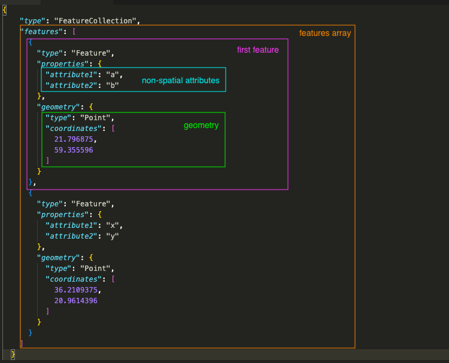
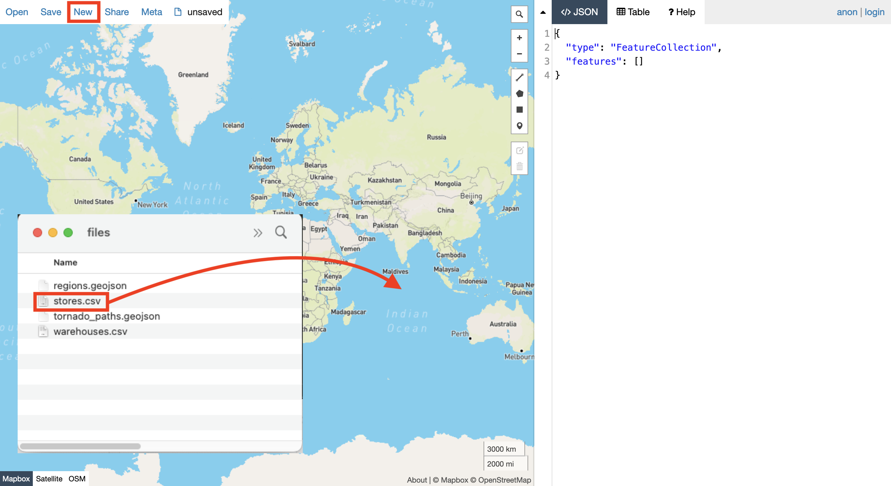
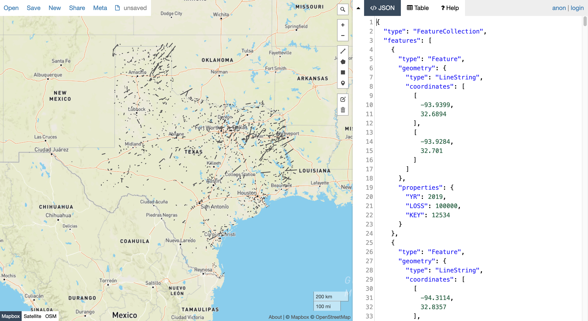
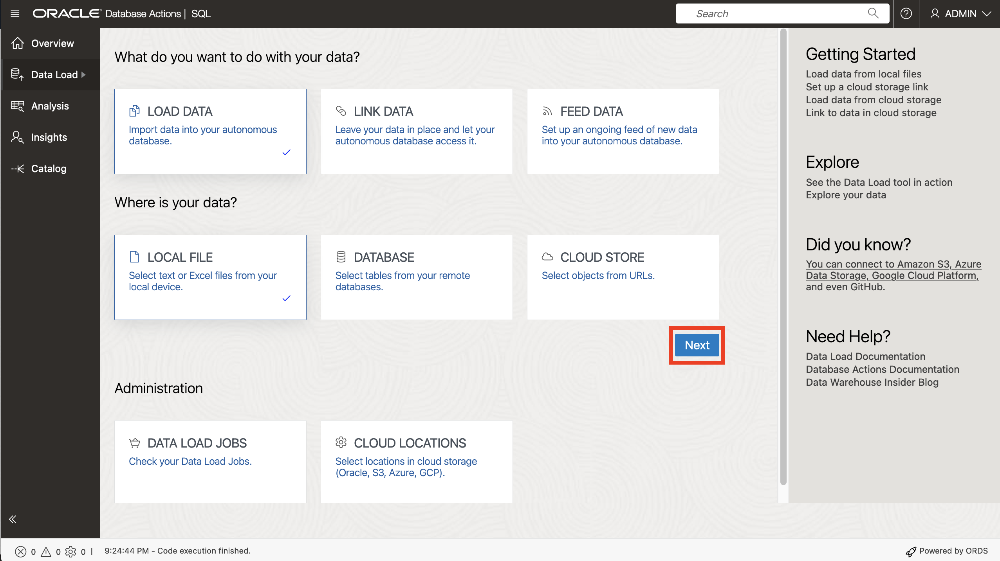
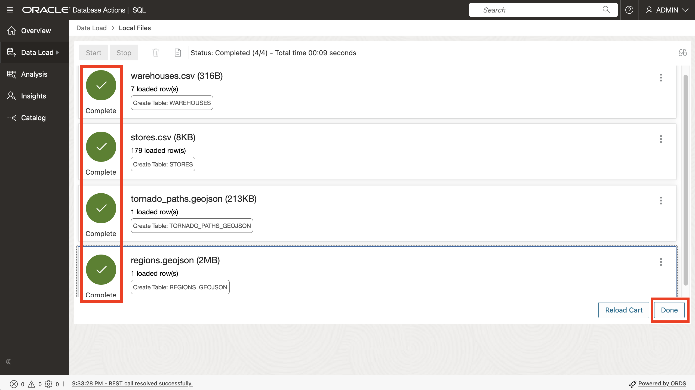
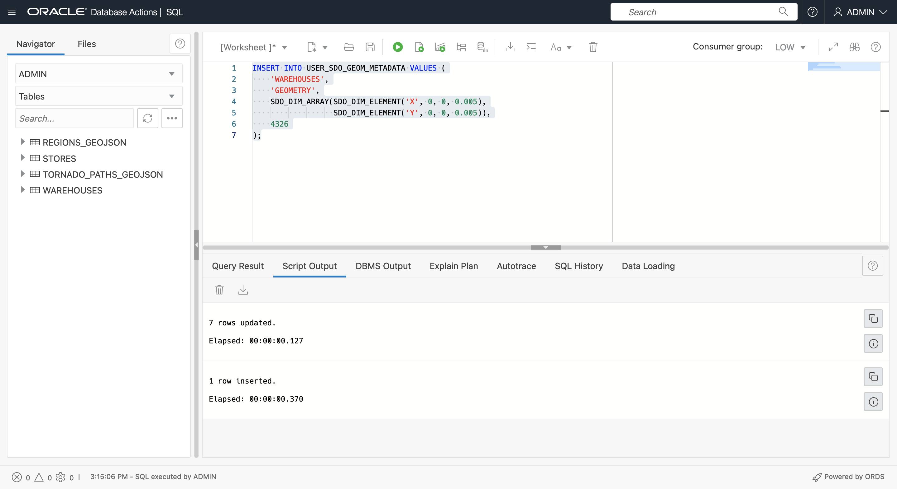
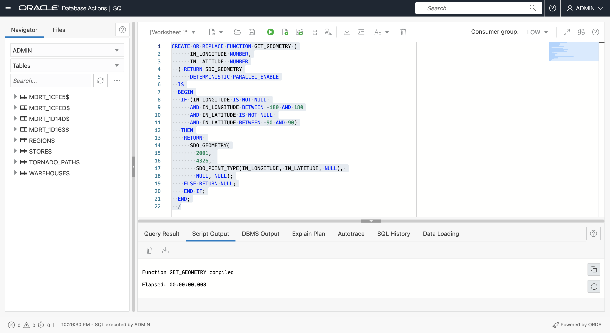
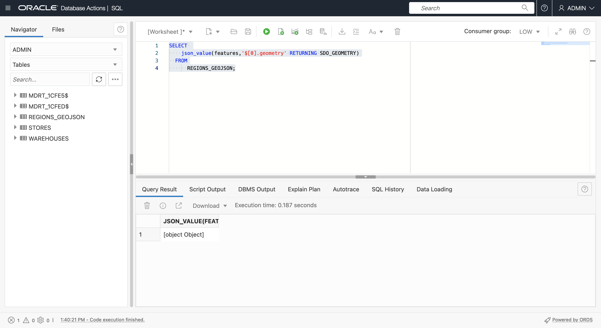

# Crear datos de ejemplo

## Introducción

Los datos espaciales se obtienen normalmente de archivos que tienen coordenadas o nombres de lugares, y archivos que almacenan datos en formatos espaciales nativos. En este laboratorio, cargará y configurará datos espaciales a partir de dichos archivos y obtendrá una vista previa del contenido en un mapa.

Tiempo estimado: 20 minutos

### Objetivos

En esta práctica de prácticas, aprenderá a:

*   Más información sobre la gestión de datos espaciales en Oracle Database
*   Preparar datos espaciales en Oracle Database a partir de formatos de archivo comunes

### Requisitos

*   Laboratorio 2: Conexión a ADB con hoja de trabajo de SQL

### Acerca de los datos espaciales

Oracle Database almacena datos espaciales (puntos, líneas, polígonos) en un tipo de dato nativo denominado SDO\_GEOMETRY. Oracle Database también proporciona un índice espacial nativo para operaciones espaciales de alto rendimiento. Este índice espacial se basa en metadatos espaciales que se introducen para cada tabla y columna de geometría que almacena datos espaciales. Una vez que los datos espaciales se rellenan e indexan, hay API sólidas disponibles para realizar análisis, cálculos y procesamiento espaciales.

El tipo SDO\_GEOMETRY tiene el siguiente formato general:

        SDO_GEOMETRY( 
            [geometry type]              -- ID for points/lines/polygons
            , [coordinate system]        -- ID of coordinate system
            , [point coordinate]         -- used for points only
            , [line/polygon info]        -- used for lines/polygons only
            , [line/polygon coordinates] -- used for lines/polygons only
        )
    

Los tipos de geometría más comunes son 2 dimensiones:

| ID | Tipo |
| --- | --- |
| 2001 | Punto |
| 2002 | Línea |
| 2003 | Polígono |

Los sistemas de coordenadas más comunes son:

| ID | Sistema de Coordenadas |
| --- | --- |
| 4326 | Latitud/longitud |
| 3857 | World Mercator |

Al utilizar la latitud y longitud, tenga en cuenta que la latitud es la coordenada Y y la longitud es la coordenada X. Dado que las coordenadas se muestran como par X, Y, los valores de SDO\_GEOMETRY deben estar en el orden: longitud, latitud.

El siguiente ejemplo es una geometría de punto con coordenadas de longitud y latitud:

        SDO_GEOMETRY( 
            2001                       -- 2D point
            , 4326                     -- Coordinate system
            , SDO_POINT_TYPE(
              -100.123, 20.456, NULL)  -- lon/lat values
            , NULL                     -- Not used for points
            , NULL                     -- Not used for points
        )
    

El siguiente ejemplo es una geometría de polígono con coordenadas de longitud y latitud:

        SDO_GEOMETRY( 
            2003                     -- 2D polygon
            , 4326                   -- Coordinate system
            , NULL                   -- Only used for points
            , SDO_ELEM_INFO_ARRAY(
                      1, 1003, 1)    -- Signifies simple exterior polygon
            , SDO_ORDINATE_ARRAY(    -- lon/lat values
                  -98.789065,39.90973
                , -101.2522,39.639537
                , -99.84374,37.160316
                , -96.67987,35.460699
                , -94.21875,39.639537
                , -98.789025,39.90973
            )
        )
    

El flujo de trabajo general para crear datos espaciales es generar geometrías y, a continuación, crear un índice espacial para un rendimiento óptimo. Antes de crear un índice espacial, se inserta una fila de metadatos espaciales que utiliza el índice espacial para garantizar la consistencia de los datos.

Los metadatos espaciales se insertan de la siguiente manera:

        INSERT INTO USER_SDO_GEOM_METADATA VALUES (
        [table name],
        [geometry column name],
        SDO_DIM_ARRAY(
          SDO_DIM_ELEMENT('X',[min x],[max x],[tolerance]),
          SDO_DIM_ELEMENT('Y',[min y],[max y],[tolerance])),
        [coordinate system id]   
        );
    

En este taller trabajará con coordenadas de longitud y latitud para que las inserciones de metadatos sean las siguientes:

        INSERT INTO USER_SDO_GEOM_METADATA VALUES (
        [table name],
        [geometry column name],
        SDO_DIM_ARRAY(
          SDO_DIM_ELEMENT('X', -180, 180, 0.005),
          SDO_DIM_ELEMENT('Y',-90, 90, 0.005)),
        4326 
        );
    

Para los datos de **punto**, el escenario más común es comenzar con datos que incluyen coordenadas que representan ubicaciones de puntos. Los datos se pueden configurar creando y rellenando una nueva columna de geometría (columna con el tipo SDO\_GEOMETRY), o creando una función que cree geometrías a partir de coordenadas y, a continuación, creando un índice espacial en esa función. Ambas opciones tienen sus casos de uso asociados y utilizará ambos métodos para familiarizarse.

Para **líneas** y **polígonos**, es más común cargar desde formatos comunes, como GeoJSON, y convertir a una tabla con una columna de geometría. GeoJSON, que es el formato más común para la integración de desarrolladores, y dado que la conversión de/a GeoJSON se incluye en este taller, proporcionamos la siguiente breve introducción.

Como se indica en [https://geojson.org/](https://geojson.org/), "GeoJSON es un formato para codificar una variedad de estructuras de datos geográficos". La industria geoespacial ha aceptado GeoJSON como un estándar de facto y, como tal, es consumible por prácticamente todas las plataformas de desarrolladores espaciales, bibliotecas y kits de herramientas. Por lo tanto, el manejo de GeoJSON es importante para la interoperabilidad.

Un documento GeoJSON suele ser un documento JSON con la estructura de nivel superior

      {
          "type": "FeatureCollection",
          "features": [
             ... array of GeoJSON features ... 
          ]
       }
    

El formato de las funciones GeoJSON se muestra a continuación.



Oracle Spatial incluye funciones incorporadas para convertir entre el tipo espacial nativo (SDO\_GEOMETRY) y el formato de geometría GeoJSON. Tenga en cuenta que las geometrías GeoJSON están contenidas en un formato de documento GeoJSON más amplio que incluye atributos no espaciales y una estructura de matriz.

En este laboratorio, cargará datos de documentos GeoJSON en tablas con columnas SDO\_GEOMETRY. En un laboratorio posterior, generará GeoJSON a partir de tablas con columnas SDO\_GEOMETRY.

**Nota:** En este taller, utilizará las herramientas de Autonomous Database y SQL para cargar y configurar documentos de GeoJSON. Esto resulta útil para comprender las capacidades JSON nativas de Autonomous Database. Sin embargo, también hay herramientas y utilidades sencillas disponibles para cargar GeoJSON en Oracle Spatial que no requieren codificación. Por ejemplo, [Oracle Spatial Studio](https://www.oracle.com/database/technologies/spatial-studio/get-started.html) y [GDAL](https://gdal.org/). El enfoque más adecuado depende de su escenario.

### Objetivos

En esta práctica de prácticas, aprenderá a:

*   Descargar archivos para TIENDAS, ALMACENES, REGIONES y TORNADO\_PATHS
*   Ver el contenido en un mapa
*   Cargar los archivos a tablas de base de datos
*   Configurar las tablas para el análisis espacial

### Requisitos

Oracle Autonomous Database y acciones de base de datos

## Tarea 1: Carga de datos de archivos

Comienza cargando datos para almacenes y almacenes a partir de archivos CSV que incluyan coordenadas que se utilizarán para crear geometrías de puntos. A continuación, cargue datos para regiones y rutas de tornado desde documentos GeoJSON. Los archivos GeoJSON se cargarán y convertirán en tablas con geometrías.

1.  Descargue los siguientes archivos mediante **clic con el botón derecho > Guardar enlace como...**.
    
    
    
    *   [stores.csv](files/stores.csv)
    *   [warehouses.csv](files/warehouses.csv)
    *   [regions.geojson](files/regions.geojson)
    *   [tornado\_paths.geojson](files/tornado_paths.geojson)
2.  A continuación, navegue por el explorador del sistema de archivos hasta los archivos descargados.
    
    
    
3.  Comience por ver los datos en el mapa.
    
    Tenga en cuenta que Oracle Spatial Studio es una herramienta web para la carga de datos espaciales, la configuración, el análisis y la visualización de mapas de autoservicio (sin código). Se trata de una aplicación web independiente que se puede desplegar desde Cloud Marketplace. Dado que este taller se centra exclusivamente en trabajar con Spatial a nivel SQL, Spatial Studio no se utiliza. En su lugar, utilice un sitio web público para ver los datos.
    
    [http://geojson.io](http://geojson.io) es un sitio web para ver (así como crear y editar manualmente) conjuntos de datos espaciales pequeños. Puede utilizar este sitio para representar datos en archivos GeoJSON, así como archivos que incluyen columnas de longitud y latitud. Para ver los datos descargados en un mapa, haga clic [aquí](http://geojson.io) para abrir geojson.io en un nuevo separador del explorador. A continuación, arrastre y suelte **warehouses.csv** en el mapa.
    
    
    
    Los datos CSV se convierten a GeoJSON como se muestra a la derecha y se representan en el mapa.
    
    
    
    Haga clic en **Nuevo** en la parte superior para abrir un nuevo mapa en un nuevo separador. Arrastre y suelte **stores.csv** en el mapa.
    
    
    
    
    
    Repita el proceso para **regions.geojson**.
    
    
    
    Repita el proceso para **tornardo\_paths.geojson**.
    
    
    

Estos son los datos sobre los que cargará, configurará y realizará análisis espaciales. Una vez que haya revisado los mapas, puede cerrar los separadores geojson.io.

1.  A continuación, cargue los archivos en las tablas de la base de datos. En Database Actions, haga clic en el icono de hamburguesa principal en la parte superior izquierda y, a continuación, haga clic en **Carga de datos**.


2.  Acepte los valores por defecto (LOAD DATA y LOCAL FILE) y haga clic en **Next** (Siguiente).



3.  Seleccione los 4 archivos que ha descargado y, a continuación, arrástrelos y suéltelos en la página Carga de datos.


4.  Ahora verá los 4 archivos enumerados para cargar. Haga clic en el icono de menú de acción de tornado\_paths.geojson y seleccione **Configuración**.


5.  Por defecto, las tablas se crean con el mismo nombre que los archivos de entrada. Esto está bien para tiendas y almacenes. Sin embargo, creará las tablas REGIONS y TORNADO\_PATHS después de la carga de datos mediante la conversión de GeoJSON. Por lo tanto, debe sustituir los nombres por defecto. Cambie el nombre de la tabla de destino a **TORNADO\_PATHS\_GEOJSON**.


6.  Observe que se crearán 2 columnas, que corresponden a las claves de nivel superior del archivo GeoJSON. A continuación, haga clic en **Cerrar**.


7.  Repita el proceso para regions.geojson. Haga clic en el icono de menú de acción y, a continuación, en **Configuración**.


8.  Actualice el nombre de la tabla de destino a **REGIONS\_GEOJSON**. Observe que se creará la misma estructura que el otro archivo GeoJSON, con columnas para las claves de nivel superior. Haga clic en **Cerrar**.


9.  Haga clic en **Iniciar** para iniciar la carga de datos.


10.  Cuando aparezca la ventana emergente de confirmación, haga clic en **Run** (Ejecutar).


11.  Espere a que termine la carga para los 4 archivos y, a continuación, haga clic en **Listo**.



12.  Haga clic en el icono de hamburguesa principal en la parte superior izquierda y, a continuación, seleccione **SQL**.


13.  Confirme que se han creado las 4 tablas.


14.  Para prepararse para trabajar con el contenido GeoJSON, agregue restricciones de control en las columnas FEATURES que las definen como JSON.
    
        <copy> 
         ALTER TABLE REGIONS_GEOJSON 
             ADD CHECK (FEATURES IS JSON);
        
         ALTER TABLE TORNADO_PATHS_GEOJSON 
             ADD CHECK (FEATURES IS JSON);
         </copy>
         ```
        
        


Las tablas ahora están listas para configurarse para Spatial.

## Tarea 2: Configurar la tabla de almacenes mediante una columna de geometría

A continuación, configure la tabla WAREHOUSES para Spatial generando una columna de geometría a partir de las columnas de coordenadas.

1.  Comience agregando una columna de geometría (columna con el tipo SDO\_GEOMETRY).
    
        <copy> 
        ALTER TABLE WAREHOUSES ADD (
            GEOMETRY SDO_GEOMETRY
            );
        </copy>
        
    
    
    
2.  A continuación, rellene la columna de geometría para las filas con coordenadas válidas (todas las filas en este caso).
    
        <copy> 
        UPDATE WAREHOUSES
        SET GEOMETRY = SDO_GEOMETRY(
                         2001,
                         4326,
                         SDO_POINT_TYPE(LONGITUDE, LATITUDE, NULL),
                         NULL, NULL)
        WHERE LONGITUDE IS NOT NULL 
        AND LONGITUDE BETWEEN -180 AND 180
        AND LATITUDE IS NOT NULL 
        AND LATITUDE BETWEEN -90 AND 90 ;
        </copy>
        


3.  Antes de crear un índice espacial, debe insertar una fila de metadatos espaciales. Cada usuario tiene una vista actualizable denominada USER\_SDO\_GEOM\_METADATA para sus metadatos espaciales. Se trata de una vista de usuario en una tabla centralizada que almacena metadatos espaciales para toda la instancia de base de datos. Los metadatos espaciales rastrean el identificador del sistema de coordenadas (la longitud/latitud es solo uno de los muchos sistemas de coordenadas) y la dimensionalidad (2D, 3D, etc.) de cada columna de geometría que se va a indexar. Estos elementos deben ser coherentes para todos los datos de una columna de geometría indexada, por lo que la creación del índice lee los valores y fuerza la integridad del índice rechazando cualquier inconsistencia.
    
    Ejecute lo siguiente para insertar metadatos espaciales para la tabla WAREHOUSES.
    
        <copy> 
         INSERT INTO USER_SDO_GEOM_METADATA VALUES (
          'WAREHOUSES',  -- table name
          'GEOMETRY',    -- geometry column name
          SDO_DIM_ARRAY(
            SDO_DIM_ELEMENT('X', -180, 180, 0.005),
            SDO_DIM_ELEMENT('Y', -90, 90, 0.005)),
           4326           -- indicates longitude/latitude coordinates
         );
        </copy>
        



4.  Por último, cree un índice espacial para la tabla WAREHOUSES.
    
        <copy> 
          CREATE INDEX WAREHOUSES_SIDX ON
              WAREHOUSES (
                  GEOMETRY
              )
                  INDEXTYPE IS MDSYS.SPATIAL_INDEX_V2;
        </copy>
        
    
    
    
    **Tenga en cuenta lo siguiente:** si falla una sentencia de creación de índice espacial (por ejemplo, porque un paso anterior no se ha realizado correctamente), antes de volver a intentarlo, debe borrar el índice porque puede que se hayan creado algunos artefactos de índice. Por ejemplo, si la sentencia de creación de índice espacial anterior fallara, antes de volver a intentarlo, debe ejecutar "DROP INDEX WAREHOUSES\_SIDX;".
    
5.  Después de crear el índice espacial, refresque la lista de tablas. La creación de un índice espacial crea automáticamente una tabla gestionada por el sistema especial con un nombre con el formato **MDRT\_xxxx$**. Spatial gestiona todas estas tablas para soportar índices espaciales y nunca se deben borrar manualmente. Para los usuarios de la base de datos, se deben ignorar.
    


## Tarea 3: Configurar la tabla de almacenes mediante el índice espacial basado en funciones

A continuación, configure la tabla STORES para Spatial. Puede repetir los pasos anteriores para crear e indexar una nueva columna de geometría. En su lugar, creará un "índice espacial basado en funciones". Con un índice espacial basado en funciones, indexa las geometrías devueltas por una función. La ventaja de este enfoque es que no es necesario agregar una nueva columna de geometría. Para los escenarios en los que agregar una columna no es práctico o no es deseable, este es el enfoque preferido. Puede encontrar los detalles [aquí](https://docs.oracle.com/en/database/oracle/oracle-database/19/spatl/extending-spatial-indexing.html#GUID-CFB6B6DB-4B97-43D1-86A1-21C1BA853089).

1.  El primer paso es crear una función genérica que acepte coordenadas y devuelva una geometría (es decir, un valor SDO\_GEOMETRY). La función incluye criterios para que solo se devuelva un resultado para coordenadas de entrada válidas.
    
        <copy>
        CREATE OR REPLACE FUNCTION GET_GEOMETRY (
              IN_LONGITUDE NUMBER,
              IN_LATITUDE  NUMBER
          ) RETURN SDO_GEOMETRY
              DETERMINISTIC PARALLEL_ENABLE
          IS
          BEGIN
           IF (IN_LONGITUDE IS NOT NULL 
              AND IN_LONGITUDE BETWEEN -180 AND 180
              AND IN_LATITUDE IS NOT NULL 
              AND IN_LATITUDE BETWEEN -90 AND 90)
           THEN
            RETURN 
              SDO_GEOMETRY(
                2001, 
                4326, 
                SDO_POINT_TYPE(IN_LONGITUDE, IN_LATITUDE, NULL), 
                NULL, NULL);
            ELSE RETURN NULL;
            END IF;
          END;
          /
        </copy>
        
    
    
    
2.  A continuación, pruebe la función mediante la tabla STORES. La hoja de trabajo de SQL no muestra tipos de objeto como SDO\_GEOMETRY en los resultados de la consulta, por lo que el resultado se muestra como **\[object Object\]**.
    
        <copy>
          SELECT
              GET_GEOMETRY(LONGITUDE, LATITUDE)
          FROM
              STORES
          WHERE 
               ROWNUM<10;
        </copy>
        
    
    
    
3.  Puesto que SQL Worksheet no muestra tipos de objeto como SDO\_GEOMETRY en los resultados de la consulta, llame a la función dentro de la función incorporada para convertir el resultado en una cadena GeoJSON.
    
        <copy>
          SELECT
              SDO_UTIL.TO_GEOJSON(
                  GET_GEOMETRY(LONGITUDE, LATITUDE))
          FROM
              STORES
          WHERE 
               ROWNUM<10;
        </copy>
        
    
    
    

En lugar de crear e indexar una nueva columna de geometría en la tabla STORES, creará un índice en los valores devueltos por la función GET\_GEOMETRY para la tabla STORES.

3.  Antes de crear un índice espacial, se inserta una fila de metadatos espaciales. En el caso de un índice espacial basado en funciones, en lugar de un nombre de columna de geometría, inserte la llamada de función. Inserte metadatos espaciales para la tabla STORES mediante la función GET\_GEOMETRY. La función se debe anteponer con el nombre del propietario, en este caso ADMIN.
    
        <copy>
        INSERT INTO USER_SDO_GEOM_METADATA VALUES (
         'STORES',  -- table name
         'ADMIN.GET_GEOMETRY(LONGITUDE,LATITUDE)', -- function returning geometry
         SDO_DIM_ARRAY(
          SDO_DIM_ELEMENT('X', -180, 180, 0.005),
          SDO_DIM_ELEMENT('Y', -90, 90, 0.005)),
         4326  -- indicates longitude/latitude coordinates
        );
        </copy>
        


4.  Finalmente crear el índice espacial. En el caso de un índice espacial basado en funciones, la "columna" que se indexa es en realidad la llamada a la función GET\_GEOMETRY.
    
        <copy>
        CREATE INDEX STORES_SIDX ON
          STORES (
              GET_GEOMETRY(LONGITUDE,LATITUDE)
          )
              INDEXTYPE IS MDSYS.SPATIAL_INDEX_V2;
        </copy>
        


## Tarea 4: Crear tabla de regiones a partir del documento GeoJSON

A continuación, convierta las regiones del formato GeoJSON en una tabla con una columna de geometría. Comience por ver el contenido de REGIONS\_GEOJSON. Como se ha descrito anteriormente, la carga de JSON en SQL Worksheet crea una tabla con columnas para las claves de nivel superior del documento. Para GeoJSON que es **type** y **features**. Pase el mouse sobre el valor de **funciones** para ver una ventana emergente de la matriz de funciones. Dado que las características son polígonos con muchas coordenadas, solo verá una parte de la primera característica en la matriz.

     <copy>
       SELECT *
       FROM REGIONS_GEOJSON;
     </copy>
    


Oracle Autonomous Database proporciona funciones sólidas para trabajar con datos JSON a través de SQL. Por ejemplo, ejecute la siguiente sentencia para ver el número de elementos en la matriz de funciones (es decir, el número de regiones).

     <copy>
       SELECT 
         JSON_VALUE(features, '$.size()')
       FROM 
          REGIONS_GEOJSON;
     </copy>
    


Para devolver las propiedades (es decir, atributos) de la primera función de la matriz, ejecute lo siguiente. El resultado son pares clave/valor, en este caso solo uno.

    <copy>
    SELECT 
       x.features.properties[0]
    FROM
       REGIONS_GEOJSON x;
    </copy>
    


Para devolver la geometría de la primera función de la matriz como SDO\_GEOMETRY, ejecute lo siguiente. Como se ha señalado anteriormente, SQL Worksheet no muestra valores de tipo de objeto como SDO\_GEOMETRY, por lo que verá el resultado como \[object Object\].

     <copy>
       SELECT 
         json_value(features,'$[0].geometry' RETURNING SDO_GEOMETRY)
       FROM
           REGIONS_GEOJSON;
     </copy>
    



Para mostrar la geometría en la hoja de trabajo de SQL, utilice la capacidad de Spatial para convertir SDO\_GEOMETRY a otros formatos de cadena comunes. Spatial soporta la conversión de formato con funciones de conversión SQL y métodos de tipo de objeto SDO\_GEOMETRY. Ejecute lo siguiente para utilizar un método SDO\_GEOMETRY para devolver la geometría de la primera función en formato WKT (texto conocido).

     <copy>
       SELECT 
         json_value(features,'$[0].geometry' RETURNING SDO_GEOMETRY).Get_WKT()
       FROM
           REGIONS_GEOJSON;
     </copy>
    


La función de tabla JSON\_TABLE devuelve elementos en una matriz JSON como filas. Esto es exactamente lo que necesitaremos para convertir la matriz de características en una tabla. Ejecute lo siguiente para devolver el contenido de la matriz de funciones como filas. Tenga en cuenta que los argumentos para COLUMNS son las claves de propiedad, que es solo REGION aquí, y la geometría.

     <copy>
       SELECT
           JT.*
       FROM
           REGIONS_GEOJSON A,
           JSON_TABLE ( A.FEATURES, '$[*]'
                   COLUMNS (
                       REGION VARCHAR ( 30 ) PATH '$.properties.REGION',
                       GEOMETRY SDO_GEOMETRY PATH '$.geometry'
                   )
               )
           AS JT;
     </copy>
    


Cree la tabla REGIONS a partir de los resultados de la consulta anterior.

    <copy>
    
      CREATE TABLE REGIONS AS (
          SELECT
              JT.*
          FROM
              REGIONS_GEOJSON A,
              JSON_TABLE ( A.FEATURES, '$[*]'
                  COLUMNS (
                     REGION VARCHAR ( 30 ) PATH '$.properties.REGION',
                     GEOMETRY SDO_GEOMETRY PATH '$.geometry'
              ))
                AS JT
            );
    
    </copy>
    


Inserte metadatos espaciales para REGIONS.

    <copy>
      INSERT INTO USER_SDO_GEOM_METADATA VALUES (
       'REGIONS',
       'GEOMETRY',
       SDO_DIM_ARRAY(
        SDO_DIM_ELEMENT('X', -180, 180, 0.005),
        SDO_DIM_ELEMENT('Y', -90, 90, 0.005)),
       4326
        );
    </copy>
    


Cree un índice espacial para REGIONS.

    <copy>
      CREATE INDEX REGIONS_SIDX ON
            REGIONS (
                GEOMETRY
            )
                INDEXTYPE IS MDSYS.SPATIAL_INDEX_V2;
    </copy>
    


## Tarea 5: Crear tabla de rutas de tornado del documento GeoJSON

Repita los pasos de la tarea anterior para convertir TORNADO\_PATHS\_GEOJSON. Comience por obtener el número de funciones.

    <copy>
      SELECT
          JSON_VALUE(FEATURES, '$.size()')
      FROM
          TORNADO_PATHS_GEOJSON;
    </copy>
    


A continuación, obtenga las propiedades de la primera función. Esta vez hay varios.

    <copy>
      SELECT
          x.features.properties[0]
      FROM
          TORNADO_PATHS_GEOJSON x;
    </copy>
    


Ejecute lo siguiente para ver los valores de propiedad, la geometría y la geometría como WKT para la primera función.

    <copy>
      SELECT 
          json_value(features,'$[0].properties.KEY'),
          json_value(features,'$[0].properties.YR'),
          json_value(features,'$[0].properties.LOSS'),
          json_value(features,'$[0].geometry' RETURNING SDO_GEOMETRY),
          json_value(features,'$[0].geometry' RETURNING SDO_GEOMETRY).Get_WKT()
        FROM
            TORNADO_PATHS_GEOJSON;
    </copy>
    


Utilice la función JSON\_TABLE para devolver el contenido como filas.

    <copy>
      SELECT
            JT.*
        FROM
            TORNADO_PATHS_GEOJSON A,
            JSON_TABLE ( A.FEATURES, '$[*]'
                    COLUMNS (
                        KEY      NUMBER PATH '$.properties.KEY',
                        YR       NUMBER PATH '$.properties.YR',
                        LOSS     NUMBER PATH '$.properties.LOSS',
                        GEOMETRY SDO_GEOMETRY PATH '$.geometry'
                    )
                )
            AS JT;
    </copy>
    


Cree la tabla TORNADO\_PATHS a partir de los resultados de la consulta anterior.

    <copy>
      CREATE TABLE TORNADO_PATHS AS
      SELECT
            JT.*
        FROM
            TORNADO_PATHS_GEOJSON A,
            JSON_TABLE ( A.FEATURES, '$[*]'
                    COLUMNS (
                        KEY      NUMBER PATH '$.properties.KEY',
                        YR       NUMBER PATH '$.properties.YR',
                        LOSS     NUMBER PATH '$.properties.LOSS',
                        GEOMETRY SDO_GEOMETRY PATH '$.geometry'
                    )
                )
            AS JT;
    </copy>
    


Inserte metadatos espaciales para TORNADO\_PATHS.

    <copy>
      INSERT INTO USER_SDO_GEOM_METADATA VALUES (
       'TORNADO_PATHS',
       'GEOMETRY',
       SDO_DIM_ARRAY(
        SDO_DIM_ELEMENT('X', -180, 180, 0.005),
        SDO_DIM_ELEMENT('Y', -90, 90, 0.005)),
      4326
        );
    </copy>
    


Cree un índice espacial para TORNADO\_PATHS.

    <copy>
      CREATE INDEX TORNADO_PATHS_SIDX ON
            TORNADO_PATHS (
                GEOMETRY
            )
                INDEXTYPE IS MDSYS.SPATIAL_INDEX_V2;
    </copy>
    


Una vez finalizada la conversión de GeoJSON, puede borrar las tablas que almacenan los documentos GeoJSON cargados. A continuación, refresque la lista de tablas.

    <copy>
    DROP TABLE REGIONS_GEOJSON;
    DROP TABLE TORNADO_PATHS_GEOJSON;
    </copy>
    


Todos los datos se cargan y se preparan para el análisis espacial.

Ahora puede **proceder al siguiente laboratorio**.

## Más información

*   [Portal de productos espaciales](https://oracle.com/goto/spatial)
*   [Documentación espacial](https://docs.oracle.com/en/database/oracle/oracle-database/19/spatl)
*   [Entradas del blog Spatial en Oracle Database Insider](https://blogs.oracle.com/database/category/db-spatial)

## Reconocimientos

*   **Autor**: David Lapp, Database Product Management, Oracle
*   **Contribuyentes**: Karin Patenge, Database Product Management, Oracle
*   **Última actualización por/fecha**: David Lapp, marzo de 2023