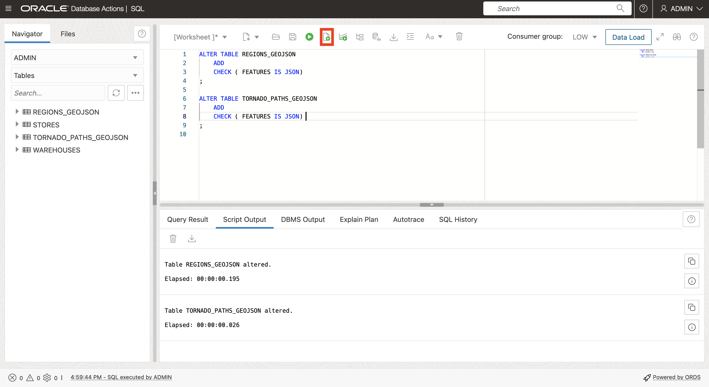
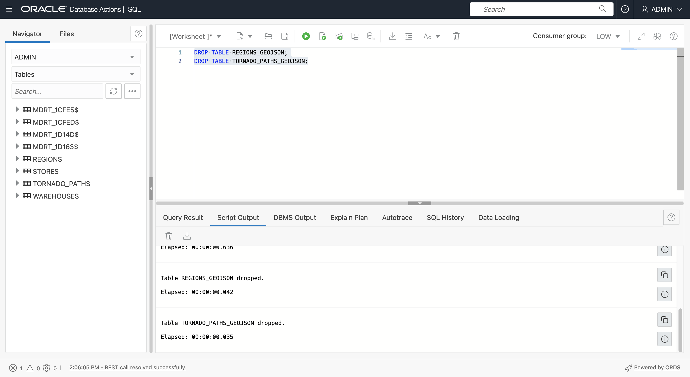

# Créer des exemples de données

## Présentation

Les données spatiales proviennent généralement de fichiers ayant des coordonnées ou des noms de lieu, et de fichiers stockant des données dans des formats spatiaux natifs. Dans cet exercice, vous allez charger et configurer des données spatiales à partir de ces fichiers et prévisualiser le contenu sur une carte.

Temps estimé : 20 minutes

### Objectifs

Dans cet exercice, vous allez :

*   En savoir plus sur la gestion des données spatiales dans Oracle Database
*   Préparer des données spatiales dans Oracle Database à partir de formats de fichier courants

### Prérequis

*   Fin de l'exercice 2 : Se connecter à la base de données autonome avec SQL Worksheet

### A propos des données spatiales

Oracle Database stocke les données spatiales (points, lignes, polygones) dans un type de données natif appelé SDO\_GEOMETRY. Oracle Database fournit également un index spatial natif pour les opérations spatiales hautes performances. Cet index spatial repose sur les métadonnées spatiales saisies pour chaque table et colonne de géométrie stockant des données spatiales. Une fois les données spatiales remplies et indexées, des API robustes sont disponibles pour effectuer des analyses, des calculs et des traitements spatiaux.

Le type SDO\_GEOMETRY a le format général suivant :

        SDO_GEOMETRY( 
            [geometry type]              -- ID for points/lines/polygons
            , [coordinate system]        -- ID of coordinate system
            , [point coordinate]         -- used for points only
            , [line/polygon info]        -- used for lines/polygons only
            , [line/polygon coordinates] -- used for lines/polygons only
        )
    

Les types de géométrie les plus courants sont 2 dimensions :

| ID | Type |
| --- | --- |
| 2001 | Point |
| 2002 | Ligne |
| 2003 | Polygone |

Les systèmes de coordonnées les plus courants sont les suivants :

| ID | Système de coordonnées |
| --- | --- |
| (4326) | Latitude/longitude |
| (3857) | Mercure du Monde |

Lorsque vous utilisez la latitude et la longitude, notez que la latitude est la coordonnée Y et que la longitude est la coordonnée X. Etant donné que les coordonnées sont répertoriées en tant que paire X, Y, les valeurs dans SDO\_GEOMETRY doivent être dans l'ordre suivant : longitude, latitude.

L'exemple suivant est une géométrie de point avec des coordonnées de longitude et de latitude :

        SDO_GEOMETRY( 
            2001                       -- 2D point
            , 4326                     -- Coordinate system
            , SDO_POINT_TYPE(
              -100.123, 20.456, NULL)  -- lon/lat values
            , NULL                     -- Not used for points
            , NULL                     -- Not used for points
        )
    

L'exemple suivant est une géométrie de polygone avec des coordonnées de longitude et de latitude :

        SDO_GEOMETRY( 
            2003                     -- 2D polygon
            , 4326                   -- Coordinate system
            , NULL                   -- Only used for points
            , SDO_ELEM_INFO_ARRAY(
                      1, 1003, 1)    -- Signifies simple exterior polygon
            , SDO_ORDINATE_ARRAY(    -- lon/lat values
                  -98.789065,39.90973
                , -101.2522,39.639537
                , -99.84374,37.160316
                , -96.67987,35.460699
                , -94.21875,39.639537
                , -98.789025,39.90973
            )
        )
    

Le flux de travail général pour la création de données spatiales consiste à générer des géométries, puis à créer un index spatial pour des performances optimales. Avant de créer un index spatial, une ligne de métadonnées spatiales est insérée qui est utilisée par l'index spatial pour assurer la cohérence des données.

Les métadonnées spatiales sont insérées comme suit :

        INSERT INTO USER_SDO_GEOM_METADATA VALUES (
        [table name],
        [geometry column name],
        SDO_DIM_ARRAY(
          SDO_DIM_ELEMENT('X',[min x],[max x],[tolerance]),
          SDO_DIM_ELEMENT('Y',[min y],[max y],[tolerance])),
        [coordinate system id]   
        );
    

Dans cet atelier, vous travaillez avec des coordonnées de longitude et de latitude afin que les insertions de métadonnées soient les suivantes :

        INSERT INTO USER_SDO_GEOM_METADATA VALUES (
        [table name],
        [geometry column name],
        SDO_DIM_ARRAY(
          SDO_DIM_ELEMENT('X', -180, 180, 0.005),
          SDO_DIM_ELEMENT('Y',-90, 90, 0.005)),
        4326 
        );
    

Pour les données de **point**, le scénario le plus courant consiste à commencer par des données comprenant des coordonnées représentant des emplacements de point. Les données peuvent être configurées soit en créant et en alimentant une nouvelle colonne de géométrie (colonne de type SDO\_GEOMETRY), soit en créant une fonction qui crée des géométries à partir de coordonnées, puis en créant un index spatial sur cette fonction. Les deux options sont associées à des cas d'utilisation et vous utiliserez les deux méthodes pour vous familiariser.

Pour les **lignes** et les **polygones**, il est plus courant de les charger à partir de formats courants, tels que GeoJSON, et de les convertir en table avec une colonne de géométrie. GeoJSON, qui est le format le plus courant pour l'intégration des développeurs, et puisque la conversion de/en GeoJSON est incluse dans cet atelier, nous fournissons la brève introduction suivante.

Comme indiqué sur [https://geojson.org/](https://geojson.org/), "GeoJSON est un format pour le codage de diverses structures de données géographiques". L'industrie géospatiale a accepté GeoJSON comme norme defacto et, en tant que tel, il est consommable par pratiquement toutes les plates-formes de développement spatial, les bibliothèques et les boîtes à outils. Par conséquent, la gestion de GeoJSON est importante pour l'interopérabilité.

Un document GeoJSON est généralement un document JSON avec la structure de niveau supérieur

      {
          "type": "FeatureCollection",
          "features": [
             ... array of GeoJSON features ... 
          ]
       }
    

Le format des fonctionnalités GeoJSON est affiché ci-dessous.


Oracle Spatial inclut des fonctions intégrées permettant la conversion entre le format de géométrie de type spatial natif (SDO\_GEOMETRY) et GeoJSON. Les géométries GeoJSON sont contenues dans un format de document GeoJSON plus large, y compris des attributs non spatiaux et une structure de tableau.

Dans cet exercice, vous allez charger des données à partir de documents GeoJSON vers des tables contenant des colonnes SDO\_GEOMETRY. Dans un exercice ultérieur, vous allez générer GeoJSON à partir de tables avec des colonnes SDO\_GEOMETRY.

**Remarque :** dans cet atelier, vous utilisez les outils Autonomous Database et SQL pour charger et configurer des documents GeoJSON. Cela est utile pour comprendre les fonctionnalités JSON natives d'Autonomous Database. Cependant, il existe également des outils et utilitaires simples disponibles pour le chargement de GeoJSON vers Oracle Spatial qui ne nécessitent aucun codage. Par exemple, [Oracle Spatial Studio](https://www.oracle.com/database/technologies/spatial-studio/get-started.html) et [GDAL](https://gdal.org/). L'approche la plus appropriée dépend de votre scénario.

### Objectifs

Dans cet exercice, vous allez :

*   Téléchargez des fichiers pour les magasins, les entrepôts, les régions et TORNADO\_PATHS
*   Voir le contenu sur une carte
*   Charger les fichiers dans les tables de base de données
*   Configurer les tables pour l'analyse spatiale

### Prérequis

Oracle Autonomous Database et Database Actions

## Tâche 1 : chargement de données à partir de fichiers

Vous commencez par charger des données pour les entrepôts et les magasins à partir de fichiers CSV qui incluent des coordonnées qui seront utilisées pour créer des géométries de point. Vous chargez ensuite les données des régions et des chemins de tornade à partir des documents GeoJSON. Les fichiers GeoJSON seront chargés et convertis en tables avec géométries.

1.  Téléchargez les fichiers suivants à l'aide de **clic droit > Enregistrer le lien sous...**.
    
    
    
    *   [stores.csv](files/stores.csv)
    *   [warehouses.csv](files/warehouses.csv)
    *   [regions.geojson](files/regions.geojson)
    *   [tornado\_paths.geojson](files/tornado_paths.geojson)
2.  Accédez ensuite à l'explorateur de système de fichiers pour accéder aux fichiers téléchargés.
    
    
    
3.  Commencez par afficher les données sur la carte.
    
    Remarque : Oracle Spatial Studio est un outil Web pour le chargement, la configuration, l'analyse et la visualisation de cartes spatiales en libre-service (sans code). Il s'agit d'une application Web distincte qui peut être déployée à partir de Cloud Marketplace. Comme cet atelier se concentre exclusivement sur l'utilisation de Spatial au niveau SQL, Spatial Studio n'est pas utilisé. Vous utilisez plutôt un site Web public pour afficher les données.
    
    [http://geojson.io](http://geojson.io) est un site Web permettant d'afficher (ainsi que de créer et de modifier manuellement) de petits ensembles de données spatiales. Vous pouvez utiliser ce site pour afficher des données dans des fichiers GeoJSON, ainsi que des fichiers incluant des colonnes de longitude et de latitude. Pour afficher les données téléchargées sur une carte, cliquez [ici](http://geojson.io) pour ouvrir geojson.io dans un nouvel onglet de navigateur. Glissez-déplacez ensuite **warehouses.csv** sur la carte.
    
    
    
    Les données CSV sont converties en GeoJSON comme indiqué à droite et affichées sur la carte.
    
    
    
    Cliquez sur **Nouveau** en haut pour ouvrir une nouvelle carte dans un nouvel onglet. Glissez-déplacez **stores.csv** sur la carte.
    
    
    
    
    
    Répétez l'opération pour **regions.geojson**.
    
    
    
    Répétez l'opération pour **tornardo\_paths.geojson**.
    
    
    

Il s'agit des données que vous chargez, configurez et effectuez une analyse spatiale. Une fois que vous avez vérifié les cartes, vous pouvez fermer les onglets geojson.io.

1.  Vous allez ensuite charger les fichiers dans des tables de base de données. Dans Database Actions, cliquez sur l'icône du menu principal en haut à gauche, puis sur **Chargement des données**.


2.  Acceptez les valeurs par défaut (LOAD DATA et LOCAL FILE) et cliquez sur **Next**.


3.  Sélectionnez les 4 fichiers que vous avez téléchargés, puis faites-les glisser vers la page Chargement des données.


4.  Vous voyez maintenant les 4 fichiers répertoriés pour le chargement. Cliquez sur l'icône du menu d'actions de tornado\_paths.geojson et sélectionnez **Paramètres**.


5.  Par défaut, les tables sont créées avec le même nom que les fichiers d'entrée. C'est bien pour les magasins et les entrepôts. Toutefois, vous allez créer des tables REGIONS et TORNADO\_PATHS après le chargement des données en effectuant une conversion à partir de GeoJSON. Vous devez donc remplacer les noms par défaut. Remplacez le nom de la table de destination par **TORNADO\_PATHS\_GEOJSON**.


6.  Notez que 2 colonnes seront créées, qui correspondent aux clés de niveau supérieur dans le fichier GeoJSON. Cliquez ensuite sur **Fermer**.


7.  Répétez l'opération pour regions.geojson. Cliquez sur l'icône du menu d'actions, puis sur **Paramètres**.


8.  Mettez à jour le nom de la table cible sur **REGIONS\_GEOJSON**. Observez que la même structure sera créée que l'autre fichier GeoJSON, avec des colonnes pour les clés de niveau supérieur. Cliquez sur **Fermer**.


9.  Cliquez sur **Démarrer** pour lancer le chargement de données.


10.  Lorsque vous y êtes invité, cliquez sur **Exécuter**.


11.  Attendez la fin du chargement pour les 4 fichiers, puis cliquez sur **Terminé**.


12.  Cliquez sur l'icône du menu principal en haut à gauche, puis sélectionnez **SQL**.


13.  Vérifiez que les 4 tables sont créées.


14.  Pour préparer l'utilisation du contenu GeoJSON, ajoutez des contraintes de vérification sur les colonnes FEATURES les définissant en tant que données JSON.
    
        <copy> 
         ALTER TABLE REGIONS_GEOJSON 
             ADD CHECK (FEATURES IS JSON);
        
         ALTER TABLE TORNADO_PATHS_GEOJSON 
             ADD CHECK (FEATURES IS JSON);
         </copy>
         ```
        
        



Les tables sont maintenant prêtes à être configurées pour Spatial.

## Tâche 2 : configurer la table des entrepôts à l'aide de la colonne de géométrie

Vous allez ensuite configurer la table WAREHOUSES pour Spatial en générant une colonne de géométrie à partir des colonnes de coordonnées.

1.  Commencez par ajouter une colonne de géométrie (colonne de type SDO\_GEOMETRY).
    
        <copy> 
        ALTER TABLE WAREHOUSES ADD (
            GEOMETRY SDO_GEOMETRY
            );
        </copy>
        
    
    
    
2.  Renseignez ensuite la colonne de géométrie pour les lignes avec des coordonnées valides (toutes les lignes dans ce cas).
    
        <copy> 
        UPDATE WAREHOUSES
        SET GEOMETRY = SDO_GEOMETRY(
                         2001,
                         4326,
                         SDO_POINT_TYPE(LONGITUDE, LATITUDE, NULL),
                         NULL, NULL)
        WHERE LONGITUDE IS NOT NULL 
        AND LONGITUDE BETWEEN -180 AND 180
        AND LATITUDE IS NOT NULL 
        AND LATITUDE BETWEEN -90 AND 90 ;
        </copy>
        


3.  Avant de créer un index spatial, vous devez insérer une ligne de métadonnées spatiales. Chaque utilisateur dispose d'une vue modifiable appelée USER\_SDO\_GEOM\_METADATA pour ses métadonnées spatiales. Il s'agit d'une vue utilisateur sur une table centralisée stockant les métadonnées spatiales pour l'ensemble de l'instance de base de données. Les métadonnées spatiales suivent l'identificateur du système de coordonnées (longitude/latitude n'est qu'un des nombreux systèmes de coordonnées) et la dimensionnalité (2D, 3D, etc.) de chaque colonne de géométrie à indexer. Ces éléments doivent être cohérents pour toutes les données d'une colonne de géométrie indexée, de sorte que la création de l'index lit les valeurs et applique l'intégrité de l'index en rejetant toute incohérence.
    
    Exécutez la commande suivante pour insérer des métadonnées spatiales pour la table WAREHOUSES.
    
        <copy> 
         INSERT INTO USER_SDO_GEOM_METADATA VALUES (
          'WAREHOUSES',  -- table name
          'GEOMETRY',    -- geometry column name
          SDO_DIM_ARRAY(
            SDO_DIM_ELEMENT('X', -180, 180, 0.005),
            SDO_DIM_ELEMENT('Y', -90, 90, 0.005)),
           4326           -- indicates longitude/latitude coordinates
         );
        </copy>
        


4.  Enfin, créez un index spatial pour la table WAREHOUSES.
    
        <copy> 
          CREATE INDEX WAREHOUSES_SIDX ON
              WAREHOUSES (
                  GEOMETRY
              )
                  INDEXTYPE IS MDSYS.SPATIAL_INDEX_V2;
        </copy>
        
    
    
    
    **Remarque :** si une instruction de création d'index spatial échoue (par exemple, parce qu'une étape précédente n'a pas été effectuée correctement), avant de réessayer, vous devez toujours supprimer l'index car certains artefacts d'index ont peut-être été créés. Par exemple, si l'instruction de création d'index spatial ci-dessus échoue, vous devez exécuter "DROP INDEX WAREHOUSES\_SIDX ;" avant de réessayer.
    
5.  Une fois l'index spatial créé, actualisez la liste des tables. La création d'un index spatial crée automatiquement une table spéciale gérée par le système avec un nom au format **MDRT\_xxxx$**. Ces tables sont entièrement gérées par Spatial pour prendre en charge les index spatiaux et ne doivent jamais être supprimées manuellement. Pour les utilisateurs de base de données, ils doivent être ignorés.
    


## Tâche 3 : configurer une table de stockage à l'aide d'un index spatial basé sur une fonction

Configurez ensuite la table STORES pour Spatial. Vous pouvez répéter les étapes précédentes pour créer et indexer une nouvelle colonne de géométrie. Au lieu de cela, vous allez créer un "index spatial basé sur la fonction". Avec un index spatial basé sur une fonction, vous indexez les géométries renvoyées par une fonction. L'avantage de cette approche est qu'il n'est pas nécessaire d'ajouter une nouvelle colonne de géométrie. Pour les scénarios où l'ajout d'une colonne n'est pas pratique ou n'est pas souhaitable, il s'agit de l'approche privilégiée. Les détails sont disponibles [ici](https://docs.oracle.com/en/database/oracle/oracle-database/19/spatl/extending-spatial-indexing.html#GUID-CFB6B6DB-4B97-43D1-86A1-21C1BA853089).

1.  La première étape consiste à créer une fonction générique qui accepte les coordonnées et renvoie une géométrie (c'est-à-dire une valeur SDO\_GEOMETRY). La fonction inclut des critères de sorte qu'un résultat ne soit renvoyé que pour des coordonnées d'entrée valides.
    
        <copy>
        CREATE OR REPLACE FUNCTION GET_GEOMETRY (
              IN_LONGITUDE NUMBER,
              IN_LATITUDE  NUMBER
          ) RETURN SDO_GEOMETRY
              DETERMINISTIC PARALLEL_ENABLE
          IS
          BEGIN
           IF (IN_LONGITUDE IS NOT NULL 
              AND IN_LONGITUDE BETWEEN -180 AND 180
              AND IN_LATITUDE IS NOT NULL 
              AND IN_LATITUDE BETWEEN -90 AND 90)
           THEN
            RETURN 
              SDO_GEOMETRY(
                2001, 
                4326, 
                SDO_POINT_TYPE(IN_LONGITUDE, IN_LATITUDE, NULL), 
                NULL, NULL);
            ELSE RETURN NULL;
            END IF;
          END;
          /
        </copy>
        
    
    
    
2.  Testez ensuite la fonction à l'aide de la table STORES. SQL Worksheet n'affiche pas les types d'objet tels que SDO\_GEOMETRY dans les résultats de requête. Le résultat est donc affiché sous la forme **\[objet\]**.
    
        <copy>
          SELECT
              GET_GEOMETRY(LONGITUDE, LATITUDE)
          FROM
              STORES
          WHERE 
               ROWNUM<10;
        </copy>
        
    
    
    
3.  Etant donné que SQL Worksheet n'affiche pas les types d'objet tels que SDO\_GEOMETRY dans les résultats de requête, appelez la fonction dans la fonction intégrée pour convertir le résultat en chaîne GeoJSON.
    
        <copy>
          SELECT
              SDO_UTIL.TO_GEOJSON(
                  GET_GEOMETRY(LONGITUDE, LATITUDE))
          FROM
              STORES
          WHERE 
               ROWNUM<10;
        </copy>
        
    
    
    

Au lieu de créer et d'indexer une nouvelle colonne de géométrie dans la table STORES, vous allez créer un index sur les valeurs renvoyées par la fonction GET\_GEOMETRY pour la table STORES.

3.  Avant de créer un index spatial, une ligne de métadonnées spatiales est insérée. Dans le cas d'un index spatial basé sur une fonction, au lieu d'un nom de colonne de géométrie, vous insérez l'appel de fonction. Insérez des métadonnées spatiales pour la table STORES à l'aide de la fonction GET\_GEOMETRY. La fonction doit être précédée du nom du propriétaire, en l'occurrence ADMIN.
    
        <copy>
        INSERT INTO USER_SDO_GEOM_METADATA VALUES (
         'STORES',  -- table name
         'ADMIN.GET_GEOMETRY(LONGITUDE,LATITUDE)', -- function returning geometry
         SDO_DIM_ARRAY(
          SDO_DIM_ELEMENT('X', -180, 180, 0.005),
          SDO_DIM_ELEMENT('Y', -90, 90, 0.005)),
         4326  -- indicates longitude/latitude coordinates
        );
        </copy>
        


4.  Créez enfin l'index spatial. Dans le cas d'un index spatial basé sur une fonction, la "colonne" indexée est en fait l'appel à la fonction GET\_GEOMETRY.
    
        <copy>
        CREATE INDEX STORES_SIDX ON
          STORES (
              GET_GEOMETRY(LONGITUDE,LATITUDE)
          )
              INDEXTYPE IS MDSYS.SPATIAL_INDEX_V2;
        </copy>
        


## Tâche 4 : créer une table de régions à partir du document GeoJSON

Vous allez ensuite convertir les régions du format GeoJSON en une table avec une colonne de géométrie. Commencez par afficher le contenu de REGIONS\_GEOJSON. Comme décrit précédemment, le chargement de JSON dans SQL Worksheet crée une table avec des colonnes pour les clés de niveau supérieur du document. Pour GeoJSON, il s'agit du **type** et des **fonctionnalités**. Passez le pointeur de la souris sur la valeur **features** pour afficher une fenêtre contextuelle du tableau des fonctionnalités. Comme les fonctionnalités sont des polygones avec de nombreuses coordonnées, vous ne voyez qu'une partie de la première fonctionnalité du tableau.

     <copy>
       SELECT *
       FROM REGIONS_GEOJSON;
     </copy>
    


Oracle Autonomous Database fournit des fonctionnalités robustes pour utiliser les données JSON via SQL. Par exemple, exécutez l'instruction suivante pour voir le nombre d'éléments dans le tableau des fonctionnalités (c'est-à-dire le nombre de régions).

     <copy>
       SELECT 
         JSON_VALUE(features, '$.size()')
       FROM 
          REGIONS_GEOJSON;
     </copy>
    


Pour renvoyer les propriétés (c'est-à-dire les attributs) de la première fonctionnalité du tableau, exécutez la commande suivante. Le résultat est une paire clé/valeur, dans ce cas une seule.

    <copy>
    SELECT 
       x.features.properties[0]
    FROM
       REGIONS_GEOJSON x;
    </copy>
    


Pour renvoyer la géométrie de la première fonctionnalité du tableau en tant que SDO\_GEOMETRY, exécutez la commande suivante. Comme indiqué précédemment, SQL Worksheet n'affiche pas les valeurs de type d'objet telles que SDO\_GEOMETRY. Le résultat affiché est donc \[objet\].

     <copy>
       SELECT 
         json_value(features,'$[0].geometry' RETURNING SDO_GEOMETRY)
       FROM
           REGIONS_GEOJSON;
     </copy>
    


Pour afficher la géométrie dans SQL Worksheet, utilisez la capacité de Spatial à convertir SDO\_GEOMETRY dans d'autres formats de chaîne courants. Spatial prend en charge la conversion de format avec des fonctions de conversion SQL et des méthodes de type d'objet SDO\_GEOMETRY. Exécutez la commande suivante pour utiliser une méthode SDO\_GEOMETRY afin de renvoyer la géométrie de la première fonctionnalité au format WKT (Well Known Text).

     <copy>
       SELECT 
         json_value(features,'$[0].geometry' RETURNING SDO_GEOMETRY).Get_WKT()
       FROM
           REGIONS_GEOJSON;
     </copy>
    


La fonction de table JSON\_TABLE renvoie les éléments d'un tableau JSON sous forme de lignes. C'est exactement ce dont nous aurons besoin pour convertir le tableau de fonctionnalités en tableau. Exécutez la commande suivante pour renvoyer le contenu du tableau de fonctionnalités sous forme de lignes. Notez que les arguments de COLUMNS sont la ou les clés de propriété, qui est uniquement REGION ici, et la géométrie.

     <copy>
       SELECT
           JT.*
       FROM
           REGIONS_GEOJSON A,
           JSON_TABLE ( A.FEATURES, '$[*]'
                   COLUMNS (
                       REGION VARCHAR ( 30 ) PATH '$.properties.REGION',
                       GEOMETRY SDO_GEOMETRY PATH '$.geometry'
                   )
               )
           AS JT;
     </copy>
    


Créez la table REGIONS à partir des résultats de la requête précédente.

    <copy>
    
      CREATE TABLE REGIONS AS (
          SELECT
              JT.*
          FROM
              REGIONS_GEOJSON A,
              JSON_TABLE ( A.FEATURES, '$[*]'
                  COLUMNS (
                     REGION VARCHAR ( 30 ) PATH '$.properties.REGION',
                     GEOMETRY SDO_GEOMETRY PATH '$.geometry'
              ))
                AS JT
            );
    
    </copy>
    


Insérez des métadonnées spatiales pour REGIONS.

    <copy>
      INSERT INTO USER_SDO_GEOM_METADATA VALUES (
       'REGIONS',
       'GEOMETRY',
       SDO_DIM_ARRAY(
        SDO_DIM_ELEMENT('X', -180, 180, 0.005),
        SDO_DIM_ELEMENT('Y', -90, 90, 0.005)),
       4326
        );
    </copy>
    


Créez un index spatial pour REGIONS.

    <copy>
      CREATE INDEX REGIONS_SIDX ON
            REGIONS (
                GEOMETRY
            )
                INDEXTYPE IS MDSYS.SPATIAL_INDEX_V2;
    </copy>
    


## Tâche 5 : créer une table de chemins de tornade à partir du document GeoJSON

Répétez les étapes de la tâche précédente pour convertir TORNADO\_PATHS\_GEOJSON. Commencez par obtenir le nombre de fonctionnalités.

    <copy>
      SELECT
          JSON_VALUE(FEATURES, '$.size()')
      FROM
          TORNADO_PATHS_GEOJSON;
    </copy>
    


Ensuite, obtenez les propriétés de la première fonctionnalité. Cette fois, il y en a plusieurs.

    <copy>
      SELECT
          x.features.properties[0]
      FROM
          TORNADO_PATHS_GEOJSON x;
    </copy>
    


Exécutez la commande suivante pour afficher les valeurs de propriété, la géométrie et la géométrie en tant que WKT pour la première fonction.

    <copy>
      SELECT 
          json_value(features,'$[0].properties.KEY'),
          json_value(features,'$[0].properties.YR'),
          json_value(features,'$[0].properties.LOSS'),
          json_value(features,'$[0].geometry' RETURNING SDO_GEOMETRY),
          json_value(features,'$[0].geometry' RETURNING SDO_GEOMETRY).Get_WKT()
        FROM
            TORNADO_PATHS_GEOJSON;
    </copy>
    


Utilisez la fonction JSON\_TABLE pour renvoyer le contenu sous forme de lignes.

    <copy>
      SELECT
            JT.*
        FROM
            TORNADO_PATHS_GEOJSON A,
            JSON_TABLE ( A.FEATURES, '$[*]'
                    COLUMNS (
                        KEY      NUMBER PATH '$.properties.KEY',
                        YR       NUMBER PATH '$.properties.YR',
                        LOSS     NUMBER PATH '$.properties.LOSS',
                        GEOMETRY SDO_GEOMETRY PATH '$.geometry'
                    )
                )
            AS JT;
    </copy>
    


Créez la table TORNADO\_PATHS à partir des résultats de la requête précédente.

    <copy>
      CREATE TABLE TORNADO_PATHS AS
      SELECT
            JT.*
        FROM
            TORNADO_PATHS_GEOJSON A,
            JSON_TABLE ( A.FEATURES, '$[*]'
                    COLUMNS (
                        KEY      NUMBER PATH '$.properties.KEY',
                        YR       NUMBER PATH '$.properties.YR',
                        LOSS     NUMBER PATH '$.properties.LOSS',
                        GEOMETRY SDO_GEOMETRY PATH '$.geometry'
                    )
                )
            AS JT;
    </copy>
    


Insérez des métadonnées spatiales pour TORNADO\_PATHS.

    <copy>
      INSERT INTO USER_SDO_GEOM_METADATA VALUES (
       'TORNADO_PATHS',
       'GEOMETRY',
       SDO_DIM_ARRAY(
        SDO_DIM_ELEMENT('X', -180, 180, 0.005),
        SDO_DIM_ELEMENT('Y', -90, 90, 0.005)),
      4326
        );
    </copy>
    


Créez un index spatial pour TORNADO\_PATHS.

    <copy>
      CREATE INDEX TORNADO_PATHS_SIDX ON
            TORNADO_PATHS (
                GEOMETRY
            )
                INDEXTYPE IS MDSYS.SPATIAL_INDEX_V2;
    </copy>
    


Maintenant que la conversion de GeoJSON est terminée, vous pouvez supprimer les tables stockant les documents GeoJSON téléchargés. Actualisez ensuite la liste des tables.

    <copy>
    DROP TABLE REGIONS_GEOJSON;
    DROP TABLE TORNADO_PATHS_GEOJSON;
    </copy>
    



Toutes les données sont maintenant chargées et préparées pour l'analyse spatiale.

Vous pouvez maintenant **passer à l'exercice suivant**.

## En savoir plus

*   [Portail produit spatial](https://oracle.com/goto/spatial)
*   [Documentation spatiale](https://docs.oracle.com/en/database/oracle/oracle-database/19/spatl)
*   [Articles de blog sur Oracle Database Insider](https://blogs.oracle.com/database/category/db-spatial)

## Accusés de réception

*   **Auteur** - David Lapp, Database Product Management, Oracle
*   **Contributeurs** - Karin Patenge, Gestion des produits de base de données, Oracle
*   **Dernière mise à jour par/date** - David Lapp, mars 2023