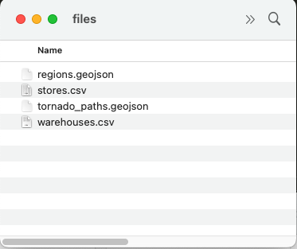
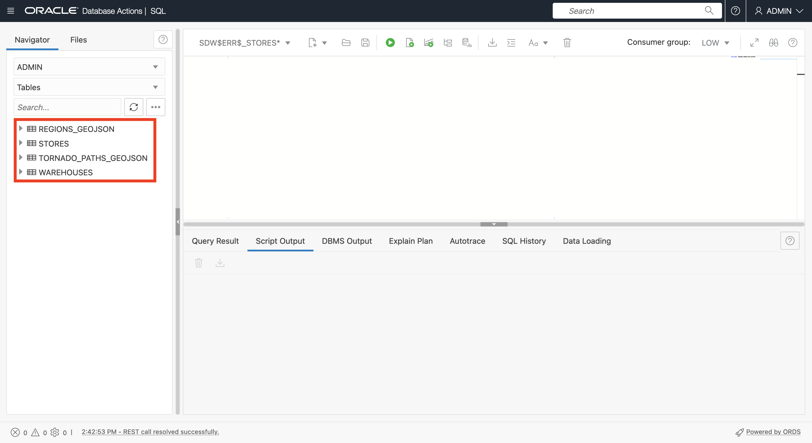
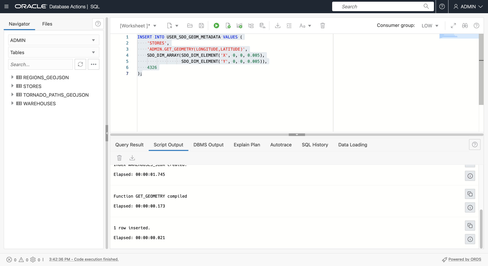
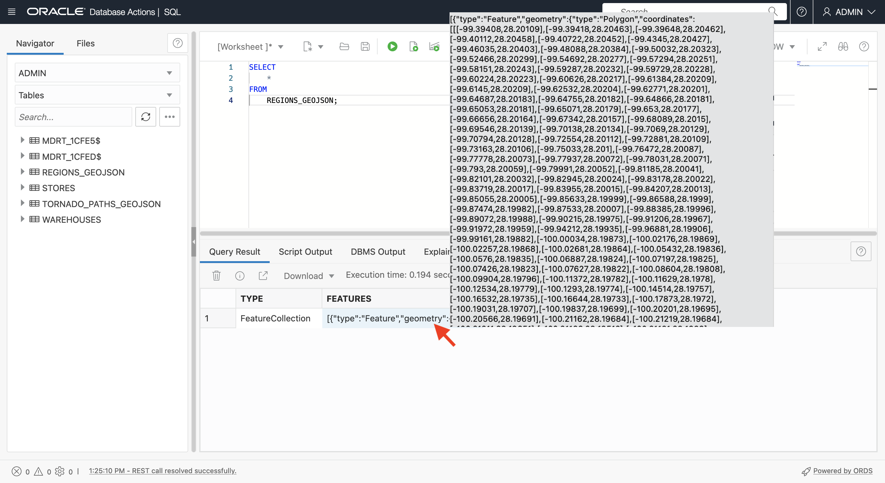
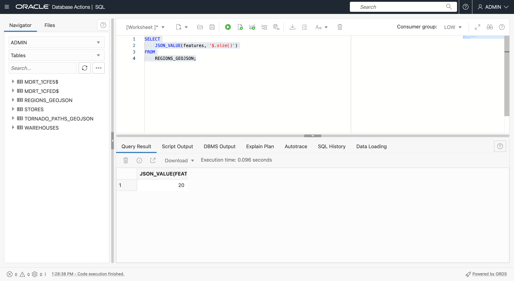
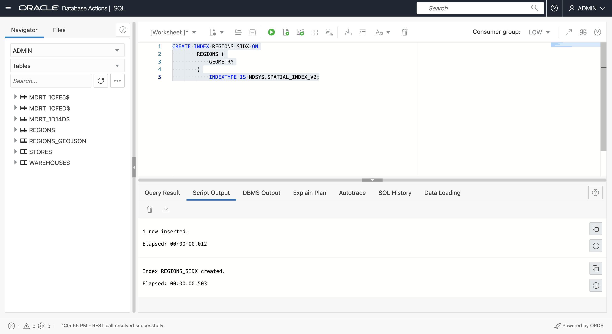

# サンプル・データの作成

## 概要

空間データは、通常、座標または場所名を持つファイルと、ネイティブ空間形式でデータを格納するファイルから取得されます。この演習では、このようなファイルから空間データをロードおよび構成し、マップ上のコンテンツをプレビューします。

見積時間: 20分

### 目標

この演習では、次のことを行います。

*   Oracle Databaseでの空間データ管理について学習
*   一般的なファイル形式からのOracle Databaseの空間データの準備

### 前提条件

*   演習2の完了: SQLワークシートを使用したADBへの接続

### 空間データについて

Oracle Databaseは、空間データ(ポイント、線、ポリゴン)をSDO\_GEOMETRYというネイティブ・データ型に格納します。Oracle Databaseは、高パフォーマンスの空間操作用のネイティブ空間索引も提供します。この空間索引は、各表に入力される空間メタデータと、空間データを格納するジオメトリ列に依存します。空間データが移入および索引付けされると、堅牢なAPIを使用して空間分析、計算および処理を実行できます。

SDO\_GEOMETRY型の一般的な形式は次のとおりです。

        SDO_GEOMETRY( 
            [geometry type]              -- ID for points/lines/polygons
            , [coordinate system]        -- ID of coordinate system
            , [point coordinate]         -- used for points only
            , [line/polygon info]        -- used for lines/polygons only
            , [line/polygon coordinates] -- used for lines/polygons only
        )
    

最も一般的なジオメトリ・タイプは2次元です。

| ID | 入力 |
| --- | --- |
| 2001 | 点 |
| 2002 | 明細 |
| 2003 | 多角形 |

最も一般的な座標系は次のとおりです。

| ID | 座標系 |
| --- | --- |
| 4326 | 緯度/経度 |
| 3857 | ワールドメルカトル |

緯度と経度を使用する場合、緯度はY座標、経度はX座標であることに注意してください。座標はX、Yペアとしてリストされるため、SDO\_GEOMETRY内の値は経度、緯度の順序である必要があります。

次の例は、経度、緯度座標を持つ点ジオメトリです。

        SDO_GEOMETRY( 
            2001                       -- 2D point
            , 4326                     -- Coordinate system
            , SDO_POINT_TYPE(
              -100.123, 20.456, NULL)  -- lon/lat values
            , NULL                     -- Not used for points
            , NULL                     -- Not used for points
        )
    

次の例は、経度、緯度座標を持つ多角形ジオメトリです。

        SDO_GEOMETRY( 
            2003                     -- 2D polygon
            , 4326                   -- Coordinate system
            , NULL                   -- Only used for points
            , SDO_ELEM_INFO_ARRAY(
                      1, 1003, 1)    -- Signifies simple exterior polygon
            , SDO_ORDINATE_ARRAY(    -- lon/lat values
                  -98.789065,39.90973
                , -101.2522,39.639537
                , -99.84374,37.160316
                , -96.67987,35.460699
                , -94.21875,39.639537
                , -98.789025,39.90973
            )
        )
    

空間データを作成するための一般的なワークフローは、ジオメトリを生成し、最適なパフォーマンスを得るための空間索引を作成することです。空間索引を作成する前に、空間索引によってデータの一貫性を確保するために使用される空間メタデータの行が挿入されます。

空間メタデータは次のように挿入されます。

        INSERT INTO USER_SDO_GEOM_METADATA VALUES (
        [table name],
        [geometry column name],
        SDO_DIM_ARRAY(
          SDO_DIM_ELEMENT('X',[min x],[max x],[tolerance]),
          SDO_DIM_ELEMENT('Y',[min y],[max y],[tolerance])),
        [coordinate system id]   
        );
    

このワークショップでは、経度、緯度の座標を使用して、メタデータの挿入は次のようになります。

        INSERT INTO USER_SDO_GEOM_METADATA VALUES (
        [table name],
        [geometry column name],
        SDO_DIM_ARRAY(
          SDO_DIM_ELEMENT('X', -180, 180, 0.005),
          SDO_DIM_ELEMENT('Y',-90, 90, 0.005)),
        4326 
        );
    

**点**データの場合、最も一般的なシナリオは、点の位置を表す座標を含むデータから開始することです。データは、新しいジオメトリ列(SDO\_GEOMETRY型の列)を作成および移入するか、座標からジオメトリを作成するファンクションを作成してから、そのファンクションに空間索引を作成することによって構成できます。どちらのオプションにもユースケースが関連付けられており、両方の方法を使用して使い慣れます。

**lines**および**polygons**の場合、GeoJSONなどの一般的な形式からロードし、ジオメトリ列を含む表に変換することが最も一般的です。GeoJSONは開発者統合の最も一般的な形式であり、このワークショップにはGeoJSONとの間の変換が含まれているため、次の簡単な紹介を提供します。

[https://geojson.org/](https://geojson.org/)で説明したように、「GeoJSONは、様々な地理データ構造をエンコードするための形式です。地理空間業界は、GeoJSONを事実上の標準として受け入れており、事実上すべての空間開発者プラットフォーム、ライブラリおよびツールキットによって消費されています。したがって、GeoJSONの処理は相互運用性のために重要です。

GeoJSONドキュメントは、通常、トップ・レベル構造を持つJSONドキュメントです。

      {
          "type": "FeatureCollection",
          "features": [
             ... array of GeoJSON features ... 
          ]
       }
    

GeoJSON機能の形式を次に示します。


Oracle Spatialには、ネイティブ空間型(SDO\_GEOMETRY)とGeoJSONジオメトリ形式間で変換する組込み関数が含まれています。GeoJSONジオメトリは、非空間属性や配列構造など、より広範なGeoJSONドキュメント形式に含まれています。

この演習では、GeoJSONドキュメントからSDO\_GEOMETRY列を含む表にデータをロードします。後の演習では、SDO\_GEOMETRY列を含む表からGeoJSONを生成します。

**ノート:**このワークショップでは、Autonomous DatabaseツールおよびSQLを使用して、GeoJSONドキュメントをロードおよび構成します。これは、Autonomous DatabaseのネイティブJSON機能を理解するのに役立ちます。ただし、コーディングを必要としないOracle SpatialへのGeoJSONのロードに使用できる単純なツールおよびユーティリティもあります。たとえば、[Oracle Spatial Studio](https://www.oracle.com/database/technologies/spatial-studio/get-started.html)および[GDAL](https://gdal.org/)です。最も適切な方法は、シナリオによって異なります。

### 目標

この演習では、次のことを行います。

*   STORES、WAREHOUSES、REGIONSおよびTORNADO\_PATHSのファイルをダウンロードします
*   マップでのコンテンツの表示
*   データベース表へのファイルのロード
*   空間分析用の表の構成

### 前提条件

Oracle Autonomous Databaseおよびデータベース・アクション

## タスク1: ファイルからのデータのロード

まず、ポイント・ジオメトリの作成に使用する座標を含むCSVファイルからウェアハウスおよびストアのデータをロードします。次に、GeoJSONドキュメントからリージョンおよび竜巻パスのデータをロードします。GeoJSONファイルがロードされ、ジオメトリを含む表に変換されます。

1.  **右クリックして「リンクに名前を付けて保存...」**を使用して、次のファイルをダウンロードします。
    
    
    
    *   [stores.csv](files/stores.csv)
    *   [warehouses.csv](files/warehouses.csv)
    *   [regions.geojson](files/regions.geojson)
    *   [tornado\_paths.geojson](files/tornado_paths.geojson)
2.  次に、ファイル・システム・エクスプローラでダウンロードしたファイルに移動します。
    
    
    
3.  まず、地図上のデータを表示します。
    
    注意: Oracle Spatial Studioは、セルフサービス(コードなし)の空間データのロード、構成、分析およびマップ視覚化のためのWebツールです。Cloud Marketplaceからデプロイできる個別のWebアプリケーションです。このワークショップでは、SQLレベルでのSpatialの操作のみに重点を置いているため、Spatial Studioは使用されません。かわりに、公開Webサイトを使用してデータを表示します。
    
    [http://geojson.io](http://geojson.io)は、小さい空間データセットを表示(および手動で作成および編集)するためのWebサイトです。このサイトを使用して、GeoJSONファイルのデータおよび経度、緯度列を含むファイルをレンダリングできます。ダウンロードしたデータをマップに表示するには、[ここ](http://geojson.io)をクリックして、新しいブラウザ・タブでgeojson.ioを開きます。次に、**warehouses.csv**をマップにドラッグ・アンド・ドロップします。
    
    
    
    CSVデータは、右側に示すようにGeoJSONに変換され、マップにレンダリングされます。
    
    
    
    上部の**「新規」**をクリックして、新しいタブで新規マップを開きます。**stores.csv**をマップにドラッグ・アンド・ドロップします。
    
    
    
    
    
    **regions.geojson**に対して繰り返します。
    
    
    
    **tornardo\_paths.geojson**に対して繰り返します。
    
    
    

これらは、空間分析をロード、構成および実行するデータです。マップを確認したら、geojson.ioタブを閉じます。

1.  次に、ファイルをデータベース表にロードします。データベース・アクションで、左上のメイン・ハンバーガー・アイコンをクリックし、**「データ・ロード」**をクリックします。


2.  デフォルト(LOAD DATAおよびLOCAL FILE)を受け入れ、**「次へ」**をクリックします。


3.  ダウンロードしたすべての4つのファイルを選択し、「データ・ロード」ページにドラッグ・アンド・ドロップします。


4.  これで、ロードする4つのファイルがリストされます。tornado\_paths.geojsonのアクション・メニュー・アイコンをクリックし、**「設定」**を選択します。


5.  デフォルトでは、表は入力ファイルと同じ名前で作成されます。倉庫や倉庫にとっては大丈夫です。ただし、GeoJSONから変換することで、データ・ロード後にREGIONS表およびTORNADO\_PATHS表を作成します。そのため、デフォルト名を上書きする必要があります。宛先表名を**TORNADO\_PATHS\_GEOJSON**に変更します。


6.  GeoJSONファイルのトップ・レベル・キーに対応する2つの列が作成されることを確認します。次に、**「閉じる」**をクリックします。


7.  regions.geojsonに対して繰り返します。アクション・メニュー・アイコンをクリックし、**「設定」**をクリックします。


8.  ターゲット表名を**REGIONS\_GEOJSON**に更新します。他のGeoJSONファイルと同じ構造が作成され、トップ・レベル・キーの列があることを確認します。**「閉じる」**をクリックします。


9.  **「開始」**をクリックしてデータ・ロードを開始します。


10.  確認ポップアップのプロンプトが表示されたら、**「実行」**をクリックします。


11.  すべての4つのファイルのロードが完了するまで待機してから、**「完了」**をクリックします。


12.  左上のメイン・ハンバーガー・アイコンをクリックし、**「SQL」**を選択します。


13.  4つの表がすべて作成されていることを確認します。



14.  GeoJSONコンテンツの操作を準備するには、JSONとして定義するFEATURES列にチェック制約を追加します。
    
        <copy> 
         ALTER TABLE REGIONS_GEOJSON 
             ADD CHECK (FEATURES IS JSON);
        
         ALTER TABLE TORNADO_PATHS_GEOJSON 
             ADD CHECK (FEATURES IS JSON);
         </copy>
         ```
        
        


これで、Spatial用に表を構成する準備ができました。

## タスク2: ジオメトリ列を使用した倉庫表の構成

次に、座標列からジオメトリ列を生成して、SpatialのWAREHOUSES表を構成します。

1.  まず、ジオメトリ列(SDO\_GEOMETRY型の列)を追加します。
    
        <copy> 
        ALTER TABLE WAREHOUSES ADD (
            GEOMETRY SDO_GEOMETRY
            );
        </copy>
        
    
    
    
2.  次に、行のジオメトリ列に有効な座標(この場合はすべての行)を移入します。
    
        <copy> 
        UPDATE WAREHOUSES
        SET GEOMETRY = SDO_GEOMETRY(
                         2001,
                         4326,
                         SDO_POINT_TYPE(LONGITUDE, LATITUDE, NULL),
                         NULL, NULL)
        WHERE LONGITUDE IS NOT NULL 
        AND LONGITUDE BETWEEN -180 AND 180
        AND LATITUDE IS NOT NULL 
        AND LATITUDE BETWEEN -90 AND 90 ;
        </copy>
        


3.  空間索引を作成する前に、空間メタデータの行を挿入する必要があります。すべてのユーザーには、空間メタデータ用にUSER\_SDO\_GEOM\_METADATAという更新可能なビューがあります。これは、データベース・インスタンス全体の空間メタデータを格納する一元化された表のユーザー・ビューです。空間メタデータは、索引付けされるすべてのジオメトリ列の座標系識別子(経度/緯度は多数の座標系のうちの1つのみ)および次元(2D、3Dなど)を追跡します。これらの項目は、索引付きのジオメトリ列内のすべてのデータに対して一貫性がある必要があるため、索引の作成によって値が読み取られ、不整合が拒否されて索引の整合性が強制されます。
    
    次を実行して、WAREHOUSES表の空間メタデータを挿入します。
    
        <copy> 
         INSERT INTO USER_SDO_GEOM_METADATA VALUES (
          'WAREHOUSES',  -- table name
          'GEOMETRY',    -- geometry column name
          SDO_DIM_ARRAY(
            SDO_DIM_ELEMENT('X', -180, 180, 0.005),
            SDO_DIM_ELEMENT('Y', -90, 90, 0.005)),
           4326           -- indicates longitude/latitude coordinates
         );
        </copy>
        


4.  最後に、WAREHOUSES表の空間索引を作成します。
    
        <copy> 
          CREATE INDEX WAREHOUSES_SIDX ON
              WAREHOUSES (
                  GEOMETRY
              )
                  INDEXTYPE IS MDSYS.SPATIAL_INDEX_V2;
        </copy>
        
    
    
    
    **注意:**空間索引作成文が失敗した場合(たとえば、前のステップが正しく実行されなかったため)、再試行する前に、索引アーティファクトの一部が作成された可能性があるため、索引を削除する必要があります。たとえば、前述の空間索引作成文が失敗した場合、再試行する前に「DROP INDEX WAREHOUSES\_SIDX; 」を実行する必要があります。
    
5.  空間索引を作成した後、表リストをリフレッシュします。空間索引を作成すると、**MDRT\_xxxx$**という形式の名前を持つ特殊なシステム管理表が自動的に作成されます。このような表は空間索引をサポートするためにSpatialによって完全に管理されるため、手動で削除しないでください。データベース・ユーザーの場合、それらは無視されます。
    


## タスク3: 関数ベースの空間索引を使用したstores表の構成

次に、SpatialのSTORES表を構成します。前述のステップを繰り返して、新しいジオメトリ列を作成および索引付けできます。かわりに、関数ベースの空間索引を作成します。ファンクションベースの空間索引では、ファンクションによって返されるジオメトリに索引付けします。この方法の利点は、新しいジオメトリ列を追加する必要がないことです。列の追加が実用的でない、または望ましくないシナリオでは、これが推奨されるアプローチです。詳細は[こちら](https://docs.oracle.com/en/database/oracle/oracle-database/19/spatl/extending-spatial-indexing.html#GUID-CFB6B6DB-4B97-43D1-86A1-21C1BA853089)をご覧ください。

1.  最初のステップは、座標を受け入れ、ジオメトリ(SDO\_GEOMETRY値)を返す汎用関数を作成することです。この関数には条件が含まれているため、結果は有効な入力座標に対してのみ返されます。
    
        <copy>
        CREATE OR REPLACE FUNCTION GET_GEOMETRY (
              IN_LONGITUDE NUMBER,
              IN_LATITUDE  NUMBER
          ) RETURN SDO_GEOMETRY
              DETERMINISTIC PARALLEL_ENABLE
          IS
          BEGIN
           IF (IN_LONGITUDE IS NOT NULL 
              AND IN_LONGITUDE BETWEEN -180 AND 180
              AND IN_LATITUDE IS NOT NULL 
              AND IN_LATITUDE BETWEEN -90 AND 90)
           THEN
            RETURN 
              SDO_GEOMETRY(
                2001, 
                4326, 
                SDO_POINT_TYPE(IN_LONGITUDE, IN_LATITUDE, NULL), 
                NULL, NULL);
            ELSE RETURN NULL;
            END IF;
          END;
          /
        </copy>
        
    
    
    
2.  次に、STORES表を使用してファンクションをテストします。SQLワークシートでは、問合せ結果にSDO\_GEOMETRYなどのオブジェクト型が表示されないため、結果は**\[object Object\]**として表示されます。
    
        <copy>
          SELECT
              GET_GEOMETRY(LONGITUDE, LATITUDE)
          FROM
              STORES
          WHERE 
               ROWNUM<10;
        </copy>
        
    
    
    
3.  SQLワークシートでは、問合せ結果にSDO\_GEOMETRYなどのオブジェクト型が表示されないため、組込みファンクション内のファンクションをコールして、結果をGeoJSON文字列に変換します。
    
        <copy>
          SELECT
              SDO_UTIL.TO_GEOJSON(
                  GET_GEOMETRY(LONGITUDE, LATITUDE))
          FROM
              STORES
          WHERE 
               ROWNUM<10;
        </copy>
        
    
    
    

STORES表に新しいジオメトリ列を作成して索引付けするかわりに、STORES表のGET\_GEOMETRYファンクションによって返される値に索引を作成します。

3.  空間索引を作成する前に、空間メタデータの行が挿入されます。関数ベースの空間索引の場合は、ジオメトリ列名のかわりに関数コールを挿入します。GET\_GEOMETRYファンクションを使用して、STORES表の空間メタデータを挿入します。関数の前に所有者名(この場合はADMIN)を付ける必要があります。
    
        <copy>
        INSERT INTO USER_SDO_GEOM_METADATA VALUES (
         'STORES',  -- table name
         'ADMIN.GET_GEOMETRY(LONGITUDE,LATITUDE)', -- function returning geometry
         SDO_DIM_ARRAY(
          SDO_DIM_ELEMENT('X', -180, 180, 0.005),
          SDO_DIM_ELEMENT('Y', -90, 90, 0.005)),
         4326  -- indicates longitude/latitude coordinates
        );
        </copy>
        



4.  最後に、空間索引を作成します。関数ベースの空間索引の場合、索引付けされる列は実際にはGET\_GEOMETRY関数のコールです。
    
        <copy>
        CREATE INDEX STORES_SIDX ON
          STORES (
              GET_GEOMETRY(LONGITUDE,LATITUDE)
          )
              INDEXTYPE IS MDSYS.SPATIAL_INDEX_V2;
        </copy>
        


## タスク4: GeoJSONドキュメントからのリージョン表の作成

次に、リージョンをGeoJSON形式からジオメトリ列を含む表に変換します。まず、REGIONS\_GEOJSONのコンテンツを表示します。前述のように、SQLワークシートでJSONをロードすると、ドキュメントの最上位キーの列を含む表が作成されます。**type**および**features**であるGeoJSONの場合。**features**値の上にマウスを置くと、features配列のポップアップが表示されます。フィーチャは多数の座標を持つポリゴンであるため、配列内の最初のフィーチャの一部のみが表示されます。

     <copy>
       SELECT *
       FROM REGIONS_GEOJSON;
     </copy>
    



Oracle Autonomous Databaseは、SQLを介してJSONデータを操作するための堅牢な機能を提供します。たとえば、次の文を実行して、features配列内のアイテム数(リージョン数)を確認します。

     <copy>
       SELECT 
         JSON_VALUE(features, '$.size()')
       FROM 
          REGIONS_GEOJSON;
     </copy>
    



配列の最初の機能のプロパティ(属性)を返すには、次を実行します。結果はキー/値のペアです。この場合、1つのみです。

    <copy>
    SELECT 
       x.features.properties[0]
    FROM
       REGIONS_GEOJSON x;
    </copy>
    


配列内の最初のフィーチャのジオメトリをSDO\_GEOMETRYとして返すには、次を実行します。前述のように、SQLワークシートにはSDO\_GEOMETRYなどのオブジェクト・タイプ値は表示されないため、\[object Object\]として表示される結果が表示されます。

     <copy>
       SELECT 
         json_value(features,'$[0].geometry' RETURNING SDO_GEOMETRY)
       FROM
           REGIONS_GEOJSON;
     </copy>
    


SQLワークシートでジオメトリを表示するには、Spatialの機能を使用してSDO\_GEOMETRYを他の一般的な文字列形式に変換します。Spatialでは、SQL変換関数とSDO\_GEOMETRYオブジェクト型メソッドの両方を使用した書式変換がサポートされています。SDO\_GEOMETRYメソッドを使用して、WKT (Well Known Text)形式の最初の機能のジオメトリを返すには、次を実行します。

     <copy>
       SELECT 
         json_value(features,'$[0].geometry' RETURNING SDO_GEOMETRY).Get_WKT()
       FROM
           REGIONS_GEOJSON;
     </copy>
    


JSON\_TABLE表関数は、JSON配列内のアイテムを行として返します。これはまさに、features配列を表に変換するために必要なものです。機能配列の内容を行として返すには、次を実行します。COLUMNSの引数はプロパティ・キーであり、ここではREGIONのみであり、ジオメトリであることに注意してください。

     <copy>
       SELECT
           JT.*
       FROM
           REGIONS_GEOJSON A,
           JSON_TABLE ( A.FEATURES, '$[*]'
                   COLUMNS (
                       REGION VARCHAR ( 30 ) PATH '$.properties.REGION',
                       GEOMETRY SDO_GEOMETRY PATH '$.geometry'
                   )
               )
           AS JT;
     </copy>
    


前の問合せの結果からREGIONS表を作成します。

    <copy>
    
      CREATE TABLE REGIONS AS (
          SELECT
              JT.*
          FROM
              REGIONS_GEOJSON A,
              JSON_TABLE ( A.FEATURES, '$[*]'
                  COLUMNS (
                     REGION VARCHAR ( 30 ) PATH '$.properties.REGION',
                     GEOMETRY SDO_GEOMETRY PATH '$.geometry'
              ))
                AS JT
            );
    
    </copy>
    


REGIONSの空間メタデータを挿入します。

    <copy>
      INSERT INTO USER_SDO_GEOM_METADATA VALUES (
       'REGIONS',
       'GEOMETRY',
       SDO_DIM_ARRAY(
        SDO_DIM_ELEMENT('X', -180, 180, 0.005),
        SDO_DIM_ELEMENT('Y', -90, 90, 0.005)),
       4326
        );
    </copy>
    


REGIONSの空間索引を作成します。

    <copy>
      CREATE INDEX REGIONS_SIDX ON
            REGIONS (
                GEOMETRY
            )
                INDEXTYPE IS MDSYS.SPATIAL_INDEX_V2;
    </copy>
    



## タスク5: GeoJSONドキュメントからの竜巻パス表の作成

前のタスク・ステップを繰り返して、TORNADO\_PATHS\_GEOJSONを変換します。まず、機能の数を取得します。

    <copy>
      SELECT
          JSON_VALUE(FEATURES, '$.size()')
      FROM
          TORNADO_PATHS_GEOJSON;
    </copy>
    


次に、最初のフィーチャのプロパティを取得します。今回はいくつかあります。

    <copy>
      SELECT
          x.features.properties[0]
      FROM
          TORNADO_PATHS_GEOJSON x;
    </copy>
    


次のコマンドを実行して、最初のフィーチャのプロパティ値、ジオメトリ、およびジオメトリをWKTとして確認します。

    <copy>
      SELECT 
          json_value(features,'$[0].properties.KEY'),
          json_value(features,'$[0].properties.YR'),
          json_value(features,'$[0].properties.LOSS'),
          json_value(features,'$[0].geometry' RETURNING SDO_GEOMETRY),
          json_value(features,'$[0].geometry' RETURNING SDO_GEOMETRY).Get_WKT()
        FROM
            TORNADO_PATHS_GEOJSON;
    </copy>
    


JSON\_TABLEファンクションでは、コンテンツを行として戻します。

    <copy>
      SELECT
            JT.*
        FROM
            TORNADO_PATHS_GEOJSON A,
            JSON_TABLE ( A.FEATURES, '$[*]'
                    COLUMNS (
                        KEY      NUMBER PATH '$.properties.KEY',
                        YR       NUMBER PATH '$.properties.YR',
                        LOSS     NUMBER PATH '$.properties.LOSS',
                        GEOMETRY SDO_GEOMETRY PATH '$.geometry'
                    )
                )
            AS JT;
    </copy>
    


前の問合せの結果からTORNADO\_PATHS表を作成します。

    <copy>
      CREATE TABLE TORNADO_PATHS AS
      SELECT
            JT.*
        FROM
            TORNADO_PATHS_GEOJSON A,
            JSON_TABLE ( A.FEATURES, '$[*]'
                    COLUMNS (
                        KEY      NUMBER PATH '$.properties.KEY',
                        YR       NUMBER PATH '$.properties.YR',
                        LOSS     NUMBER PATH '$.properties.LOSS',
                        GEOMETRY SDO_GEOMETRY PATH '$.geometry'
                    )
                )
            AS JT;
    </copy>
    


TORNADO\_PATHSの空間メタデータを挿入します。

    <copy>
      INSERT INTO USER_SDO_GEOM_METADATA VALUES (
       'TORNADO_PATHS',
       'GEOMETRY',
       SDO_DIM_ARRAY(
        SDO_DIM_ELEMENT('X', -180, 180, 0.005),
        SDO_DIM_ELEMENT('Y', -90, 90, 0.005)),
      4326
        );
    </copy>
    


TORNADO\_PATHSの空間索引を作成します。

    <copy>
      CREATE INDEX TORNADO_PATHS_SIDX ON
            TORNADO_PATHS (
                GEOMETRY
            )
                INDEXTYPE IS MDSYS.SPATIAL_INDEX_V2;
    </copy>
    


GeoJSONからの変換が完了したので、アップロードしたGeoJSONドキュメントを格納する表を削除できます。次に、表のリストをリフレッシュします。

    <copy>
    DROP TABLE REGIONS_GEOJSON;
    DROP TABLE TORNADO_PATHS_GEOJSON;
    </copy>
    


これで、すべてのデータがロードされ、空間分析用に準備されます。

**次の演習に進む**ことができます。

## さらに学ぶ

*   [空間製品ポータル](https://oracle.com/goto/spatial)
*   [Spatialのマニュアル](https://docs.oracle.com/en/database/oracle/oracle-database/19/spatl)
*   [Spatialのブログ記事: Oracle Database Insider](https://blogs.oracle.com/database/category/db-spatial)

## 確認

*   **著者** - Oracle、データベース製品管理、David Lapp氏
*   **コントリビュータ** - Karin Patenge氏、データベース製品管理、Oracle
*   **最終更新者/日付** - David Lapp、2023年3月