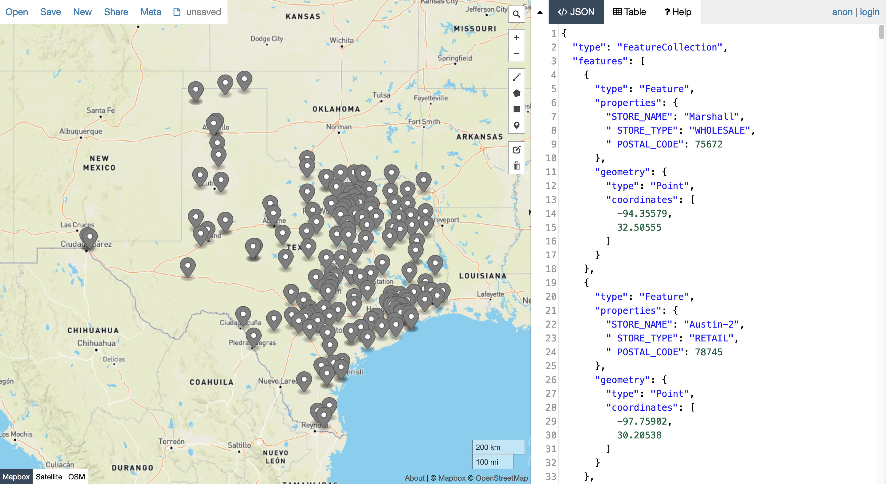
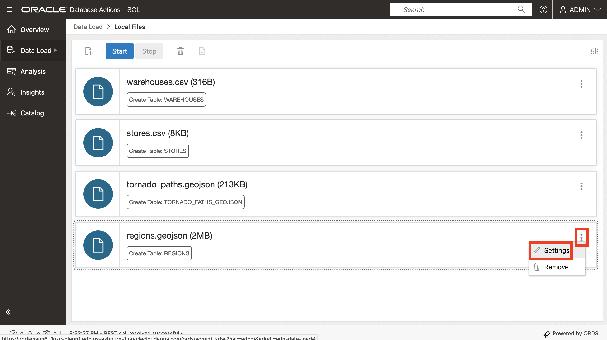
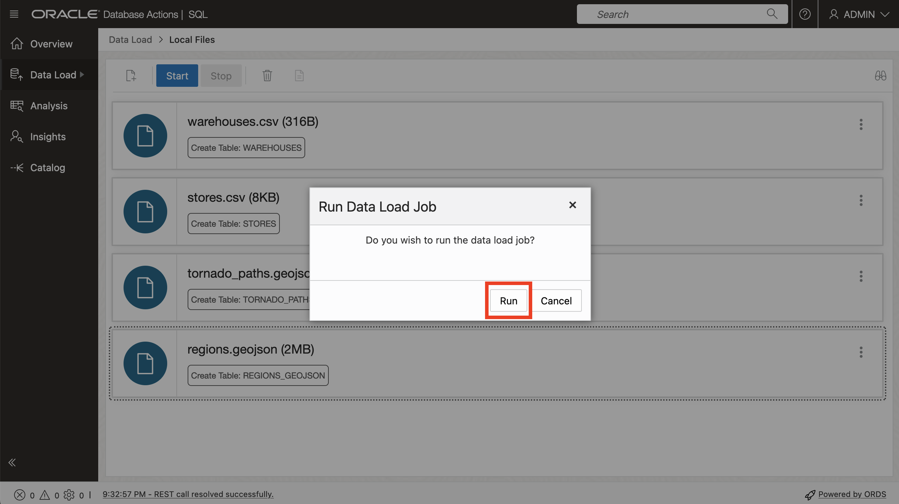
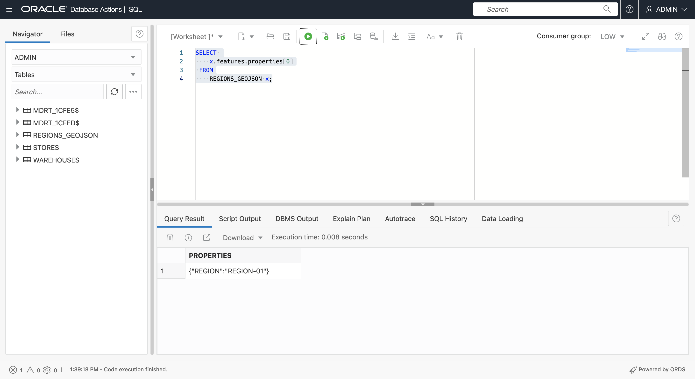
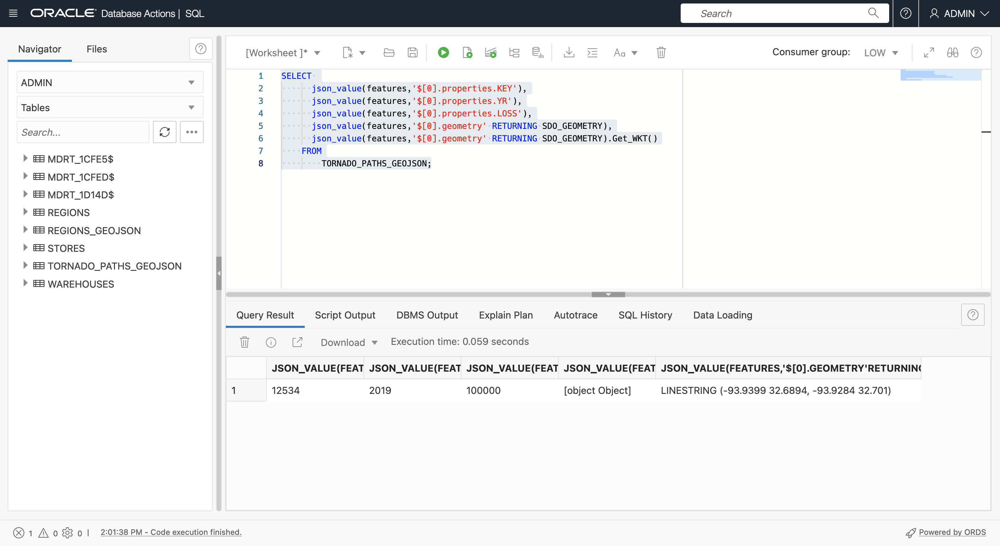
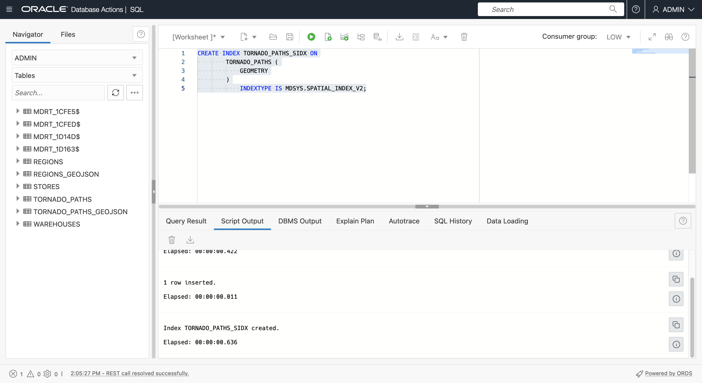

# Criar dados de amostra

## Introdução

Os dados espaciais geralmente são provenientes de arquivos que têm coordenadas ou nomes de locais e arquivos que armazenam dados em formatos espaciais nativos. Neste laboratório, você carrega e configura dados espaciais desses arquivos e visualiza o conteúdo em um mapa.

Tempo Estimado: 20 minutos

### Objetivos

Neste laboratório, você vai:

*   Saiba mais sobre o gerenciamento de dados espaciais no Oracle Database
*   Preparar dados espaciais no Oracle Database a partir de formatos de arquivo comuns

### Pré-requisitos

*   Conclusão do Laboratório 2: Conecte-se ao ADB com a Planilha SQL

### Sobre dados espaciais

O Oracle Database armazena dados espaciais (pontos, linhas, polígonos) em um tipo de dados nativo chamado SDO\_GEOMETRY. O Oracle Database também fornece um índice espacial nativo para operações espaciais de alto desempenho. Esse índice espacial depende de metadados espaciais que são inseridos para cada tabela e coluna de geometria que armazena dados espaciais. Uma vez que os dados espaciais são preenchidos e indexados, APIs robustas estão disponíveis para realizar análise espacial, cálculos e processamento.

O tipo SDO\_GEOMETRY tem o seguinte formato geral:

        SDO_GEOMETRY( 
            [geometry type]              -- ID for points/lines/polygons
            , [coordinate system]        -- ID of coordinate system
            , [point coordinate]         -- used for points only
            , [line/polygon info]        -- used for lines/polygons only
            , [line/polygon coordinates] -- used for lines/polygons only
        )
    

Os tipos de geometria mais comuns são 2-dimensional:

| ID | Tipo |
| --- | --- |
| 2001 | Ponto |
| 2002 | Linha |
| 2003 | Polygon |

Os sistemas de coordenadas mais comuns são:

| ID | Sistema Coordenado |
| --- | --- |
| 4326 | Latitude/Longitude |
| 3857 | Mercator Mundial |

Ao usar latitude e longitude, observe que a latitude é a coordenada Y e a longitude é a coordenada X. Como as coordenadas são listadas como par X, Y, os valores em SDO\_GEOMETRY precisam estar na ordem: longitude, latitude.

O exemplo a seguir é uma geometria de ponto com coordenadas de longitude e latitude:

        SDO_GEOMETRY( 
            2001                       -- 2D point
            , 4326                     -- Coordinate system
            , SDO_POINT_TYPE(
              -100.123, 20.456, NULL)  -- lon/lat values
            , NULL                     -- Not used for points
            , NULL                     -- Not used for points
        )
    

O exemplo a seguir é uma geometria de polígono com coordenadas de longitude e latitude:

        SDO_GEOMETRY( 
            2003                     -- 2D polygon
            , 4326                   -- Coordinate system
            , NULL                   -- Only used for points
            , SDO_ELEM_INFO_ARRAY(
                      1, 1003, 1)    -- Signifies simple exterior polygon
            , SDO_ORDINATE_ARRAY(    -- lon/lat values
                  -98.789065,39.90973
                , -101.2522,39.639537
                , -99.84374,37.160316
                , -96.67987,35.460699
                , -94.21875,39.639537
                , -98.789025,39.90973
            )
        )
    

O fluxo de trabalho geral para a criação de dados espaciais é gerar geometrias e, em seguida, criar um índice espacial para o desempenho ideal. Antes de criar um índice espacial, é inserida uma linha de metadados espaciais que é usada pelo índice espacial para garantir a consistência dos dados.

Metadados espaciais são inseridos da seguinte forma:

        INSERT INTO USER_SDO_GEOM_METADATA VALUES (
        [table name],
        [geometry column name],
        SDO_DIM_ARRAY(
          SDO_DIM_ELEMENT('X',[min x],[max x],[tolerance]),
          SDO_DIM_ELEMENT('Y',[min y],[max y],[tolerance])),
        [coordinate system id]   
        );
    

Neste workshop você trabalha com longitude, coordenadas de latitude para que as inserções de metadados sejam as seguintes:

        INSERT INTO USER_SDO_GEOM_METADATA VALUES (
        [table name],
        [geometry column name],
        SDO_DIM_ARRAY(
          SDO_DIM_ELEMENT('X', -180, 180, 0.005),
          SDO_DIM_ELEMENT('Y',-90, 90, 0.005)),
        4326 
        );
    

Para dados de **ponto**, o cenário mais comum é começar com dados, incluindo coordenadas que representam locais de ponto. Os dados podem ser configurados criando e preenchendo uma nova coluna de geometria (coluna com o tipo SDO\_GEOMETRY) ou criando uma função que cria geometrias a partir de coordenadas e, em seguida, criando um índice espacial nessa função. Ambas as opções têm seus casos de uso associados e você usará os dois métodos para obter familiaridade.

Para **linhas** e **polígonos**, é mais comum carregar de formatos comuns, como GeoJSON, e converter em uma tabela com uma coluna de geometria. GeoJSON, que é o formato mais comum para integração de desenvolvedores, e como a conversão de/para GeoJSON está incluída neste workshop, fornecemos a breve introdução a seguir.

Conforme mencionado em [https://geojson.org/](https://geojson.org/), "GeoJSON é um formato para codificar uma variedade de estruturas de dados geográficos". A indústria geoespacial aceitou o GeoJSON como um padrão de fato e, como tal, é consumível por praticamente todas as plataformas de desenvolvedores espaciais, bibliotecas e kits de ferramentas. Por conseguinte, o tratamento de GeoJSON é importante para a interoperabilidade.

Um documento GeoJSON geralmente é um documento JSON com a estrutura de nível superior

      {
          "type": "FeatureCollection",
          "features": [
             ... array of GeoJSON features ... 
          ]
       }
    

O formato dos recursos GeoJSON é mostrado abaixo.


O Oracle Spatial inclui funções incorporadas para conversão entre o tipo espacial nativo (SDO\_GEOMETRY) e o formato de geometria GeoJSON. Observe que as geometrias GeoJSON estão contidas em um formato de documento GeoJSON mais amplo, incluindo atributos não espaciais e uma estrutura de array.

Neste laboratório, você carregará dados de documentos GeoJSON para tabelas com colunas SDO\_GEOMETRY. Em um laboratório posterior, você gerará GeoJSON com base em tabelas com colunas SDO\_GEOMETRY.

**Observação:** Neste workshop, você usa ferramentas do Autonomous Database e SQL para carregar e configurar documentos GeoJSON. Isso é útil para entender os recursos JSON nativos do Autonomous Database. No entanto, também há ferramentas e utilitários simples disponíveis para carregar o GeoJSON para o Oracle Spatial que não exigem codificação. Por exemplo, [Oracle Spatial Studio](https://www.oracle.com/database/technologies/spatial-studio/get-started.html) e [GDAL](https://gdal.org/). A abordagem mais apropriada depende do cenário.

### Objetivos

Neste laboratório, você vai:

*   Baixe arquivos para STORES, WAREHOUSES, REGIONS e TORNADO\_PATHS
*   Exibir o conteúdo em um mapa
*   Carregar os arquivos para tabelas de banco de dados
*   Configurar as tabelas para análise espacial

### Pré-requisitos

Oracle Autonomous Database e Database Actions

## Tarefa 1: Carregar dados de arquivos

Você começa carregando dados para depósitos e armazenamentos de arquivos CSV que incluem coordenadas que serão usadas para criar geometrias de ponto. Em seguida, carregue dados de regiões e caminhos de tornado de documentos GeoJSON. Os arquivos GeoJSON serão carregados e convertidos em tabelas com geometrias.

1.  Faça download dos seguintes arquivos usando **clique com o botão direito > Salvar link como...**.
    
    
    
    *   [stores.csv](files/stores.csv)
    *   [warehouses.csv](files/warehouses.csv)
    *   [regions.geojson](files/regions.geojson)
    *   [tornado\_paths.geojson](files/tornado_paths.geojson)
2.  Em seguida, navegue pelo explorador do sistema de arquivos até os arquivos baixados.
    
    
    
3.  Comece visualizando os dados no mapa.
    
    Observação: o Oracle Spatial Studio é uma ferramenta da Web para carregamento de dados espaciais de autoatendimento (sem código), configuração, análise e visualização de mapas. É um aplicativo web separado que pode ser implantado no Cloud Marketplace. Como este workshop se concentra exclusivamente em trabalhar com o Spatial no nível SQL, o Spatial Studio não é usado. Em vez disso, você usa um site público para exibir os dados.
    
    [http://geojson.io](http://geojson.io) é um site para exibir (bem como criar e editar manualmente) pequenos conjuntos de dados espaciais. Você pode usar este site para renderizar dados em arquivos GeoJSON, bem como arquivos que incluem colunas de longitude e latitude. Para exibir os dados baixados em um mapa, clique [aqui](http://geojson.io) para abrir geojson.io em uma nova guia do navegador. Em seguida, arraste e solte **warehouses.csv** no mapa.
    
    
    
    Os dados CSV são convertidos em GeoJSON, conforme mostrado à direita, e renderizados no mapa.
    
    
    
    Clique em **Novo** na parte superior para abrir um novo mapa em uma nova guia. Arraste e solte **stores.csv** no mapa.
    
    
    
    
    
    Repita para **regions.geojson**.
    
    
    
    Repita para **tornardo\_paths.geojson**.
    
    
    

Esses são os dados nos quais você carregará, configurará e executará a análise espacial. Após revisar os mapas, você pode fechar as guias geojson.io.

1.  Em seguida, carregue os arquivos nas tabelas do banco de dados. No Database Actions, clique no ícone de hambúrguer principal na parte superior esquerda e, em seguida, clique em **Carga de Dados**.


2.  Aceite os padrões (LOAD DATA e LOCAL FILE) e clique em **Next**.


3.  Selecione todos os 4 arquivos que você baixou e arraste-os e solte-os na página Carga de Dados.


4.  Agora você vê os 4 arquivos listados para carregamento. Clique no ícone do menu de ação de tornado\_paths.geojson e selecione **Definições**.


5.  Por padrão, as tabelas são criadas com o mesmo nome que os arquivos de entrada. Isso é bom para armazéns e armazéns. No entanto, você criará tabelas REGIONS e TORNADO\_PATHS após o carregamento de dados convertendo de GeoJSON. Portanto, é necessário substituir os nomes padrão. Altere o nome da tabela de destino para **TORNADO\_PATHS\_GEOJSON**.


6.  Observe que 2 colunas serão criadas, que correspondem às chaves de nível superior no arquivo GeoJSON. Em seguida, clique em **Fechar**.


7.  Repita para regions.geojson. Clique no ícone do menu de ação e, em seguida, em **Definições**.



8.  Atualize o nome da tabela de destino para **REGIONS\_GEOJSON**. Observe que a mesma estrutura será criada como o outro arquivo GeoJSON, com colunas para as chaves de nível superior. Clique em **Fechar**.


9.  Clique em **Iniciar** para iniciar o carregamento de dados.


10.  Quando for solicitado um pop-up de confirmação, clique em **Executar**.



11.  Aguarde a conclusão do carregamento para todos os 4 arquivos e clique em **Concluído**.


12.  Clique no ícone de hambúrguer principal no canto superior esquerdo e selecione **SQL**.


13.  Confirme se todas as 4 tabelas foram criadas agora.


14.  Para se preparar para trabalhar com o conteúdo GeoJSON, adicione restrições de verificação às colunas FEATURES que as definem como JSON.
    
        <copy> 
         ALTER TABLE REGIONS_GEOJSON 
             ADD CHECK (FEATURES IS JSON);
        
         ALTER TABLE TORNADO_PATHS_GEOJSON 
             ADD CHECK (FEATURES IS JSON);
         </copy>
         ```
        
        


As tabelas agora estão prontas para serem configuradas para o Spatial.

## Tarefa 2: Configurar a tabela de depósitos usando a coluna de geometria

Em seguida, você configura a tabela WAREHOUSES para Spatial gerando uma coluna de geometria a partir das colunas de coordenadas.

1.  Comece adicionando uma coluna de geometria (coluna com o tipo SDO\_GEOMETRY).
    
        <copy> 
        ALTER TABLE WAREHOUSES ADD (
            GEOMETRY SDO_GEOMETRY
            );
        </copy>
        
    
    
    
2.  Em seguida, preencha a coluna de geometria para linhas com coordenadas válidas (todas as linhas nesse caso).
    
        <copy> 
        UPDATE WAREHOUSES
        SET GEOMETRY = SDO_GEOMETRY(
                         2001,
                         4326,
                         SDO_POINT_TYPE(LONGITUDE, LATITUDE, NULL),
                         NULL, NULL)
        WHERE LONGITUDE IS NOT NULL 
        AND LONGITUDE BETWEEN -180 AND 180
        AND LATITUDE IS NOT NULL 
        AND LATITUDE BETWEEN -90 AND 90 ;
        </copy>
        


3.  Antes de criar um índice espacial, você deve inserir uma linha de metadados espaciais. Cada usuário tem uma view atualizável chamada USER\_SDO\_GEOM\_METADATA para seus metadados espaciais. Esta é uma view do usuário em uma tabela centralizada que armazena metadados espaciais para toda a instância do banco de dados. Os metadados espaciais rastreiam o identificador do sistema de coordenadas (a longitude/latitude é apenas um dos muitos sistemas de coordenadas) e a dimensionalidade (2D, 3D, etc) de cada coluna de geometria a ser indexada. Esses itens precisam ser consistentes para todos os dados em uma coluna de geometria indexada, portanto, a criação do índice lê os valores e impõe a integridade do índice rejeitando qualquer inconsistência.
    
    Execute o seguinte para inserir metadados espaciais para a tabela WAREHOUSES.
    
        <copy> 
         INSERT INTO USER_SDO_GEOM_METADATA VALUES (
          'WAREHOUSES',  -- table name
          'GEOMETRY',    -- geometry column name
          SDO_DIM_ARRAY(
            SDO_DIM_ELEMENT('X', -180, 180, 0.005),
            SDO_DIM_ELEMENT('Y', -90, 90, 0.005)),
           4326           -- indicates longitude/latitude coordinates
         );
        </copy>
        


4.  Por fim, crie um índice espacial para a tabela WAREHOUSES.
    
        <copy> 
          CREATE INDEX WAREHOUSES_SIDX ON
              WAREHOUSES (
                  GEOMETRY
              )
                  INDEXTYPE IS MDSYS.SPATIAL_INDEX_V2;
        </copy>
        
    
    
    
    **Observação:** Se uma instrução de criação de índice espacial falhar (por exemplo, porque uma etapa anterior não foi feita corretamente), antes de tentar novamente, você ainda deverá eliminar o índice, pois alguns artefatos de índice podem ter sido criados. Portanto, por exemplo, se a instrução de criação de índice espacial acima falhar, antes de tentar novamente, execute "DROP INDEX WAREHOUSES\_SIDX;".
    
5.  Depois de criar o índice espacial, atualize a listagem de tabelas. A criação de um índice espacial cria automaticamente uma tabela especial gerenciada pelo sistema com um nome com o formato **MDRT\_xxxx$**. Essas tabelas são gerenciadas inteiramente pelo Spatial para suportar índices espaciais e nunca devem ser eliminadas manualmente. Para usuários de banco de dados, eles devem ser ignorados.
    


## Tarefa 3: Configurar a tabela de armazenamentos usando o índice espacial baseado em função

Em seguida, você configura a tabela STORES para Spatial. Você pode repetir as etapas anteriores para criar e indexar uma nova coluna de geometria. Em vez disso, você criará um "índice espacial baseado em função". Com um índice espacial baseado em função, você indexa geometrias retornadas por uma função. O benefício dessa abordagem é que uma nova coluna de geometria não precisa ser adicionada. Para cenários em que a adição de uma coluna é impraticável ou não desejável, essa é a abordagem preferida. Detalhes podem ser encontrados [aqui](https://docs.oracle.com/en/database/oracle/oracle-database/19/spatl/extending-spatial-indexing.html#GUID-CFB6B6DB-4B97-43D1-86A1-21C1BA853089).

1.  A primeira etapa é criar uma função genérica que aceite coordenadas e retorne uma geometria (ou seja, um valor SDO\_GEOMETRY). A função inclui critérios para que um resultado seja retornado apenas para coordenadas de entrada válidas.
    
        <copy>
        CREATE OR REPLACE FUNCTION GET_GEOMETRY (
              IN_LONGITUDE NUMBER,
              IN_LATITUDE  NUMBER
          ) RETURN SDO_GEOMETRY
              DETERMINISTIC PARALLEL_ENABLE
          IS
          BEGIN
           IF (IN_LONGITUDE IS NOT NULL 
              AND IN_LONGITUDE BETWEEN -180 AND 180
              AND IN_LATITUDE IS NOT NULL 
              AND IN_LATITUDE BETWEEN -90 AND 90)
           THEN
            RETURN 
              SDO_GEOMETRY(
                2001, 
                4326, 
                SDO_POINT_TYPE(IN_LONGITUDE, IN_LATITUDE, NULL), 
                NULL, NULL);
            ELSE RETURN NULL;
            END IF;
          END;
          /
        </copy>
        
    
    
    
2.  Em seguida, teste a função usando a tabela STORES. A Planilha SQL não exibe tipos de objeto como SDO\_GEOMETRY nos resultados da consulta; portanto, o resultado é exibido como **\[objeto\]**.
    
        <copy>
          SELECT
              GET_GEOMETRY(LONGITUDE, LATITUDE)
          FROM
              STORES
          WHERE 
               ROWNUM<10;
        </copy>
        
    
    
    
3.  Como a Planilha SQL não exibe tipos de objeto como SDO\_GEOMETRY nos resultados da consulta, chame a função dentro da função incorporada para converter o resultado em uma string GeoJSON.
    
        <copy>
          SELECT
              SDO_UTIL.TO_GEOJSON(
                  GET_GEOMETRY(LONGITUDE, LATITUDE))
          FROM
              STORES
          WHERE 
               ROWNUM<10;
        </copy>
        
    
    
    

Em vez de criar e indexar uma nova coluna de geometria na tabela STORES, você criará um índice nos valores retornados pela função GET\_GEOMETRY para a tabela STORES.

3.  Antes de criar um índice espacial, uma linha de metadados espaciais é inserida. No caso de um índice espacial baseado em função, em vez de um nome de coluna de geometria, você insere a chamada de função. Insira metadados espaciais para a tabela STORES usando a função GET\_GEOMETRY. A função deve ser anexada ao nome do proprietário, neste caso, ADMIN.
    
        <copy>
        INSERT INTO USER_SDO_GEOM_METADATA VALUES (
         'STORES',  -- table name
         'ADMIN.GET_GEOMETRY(LONGITUDE,LATITUDE)', -- function returning geometry
         SDO_DIM_ARRAY(
          SDO_DIM_ELEMENT('X', -180, 180, 0.005),
          SDO_DIM_ELEMENT('Y', -90, 90, 0.005)),
         4326  -- indicates longitude/latitude coordinates
        );
        </copy>
        


4.  Por fim, crie o índice espacial. No caso de um índice espacial baseado em função, a "coluna" que está sendo indexada é, na verdade, a chamada para a função GET\_GEOMETRY.
    
        <copy>
        CREATE INDEX STORES_SIDX ON
          STORES (
              GET_GEOMETRY(LONGITUDE,LATITUDE)
          )
              INDEXTYPE IS MDSYS.SPATIAL_INDEX_V2;
        </copy>
        


## Tarefa 4: Criar tabela de regiões do documento GeoJSON

Em seguida, você converte regiões do formato GeoJSON em uma tabela com uma coluna de geometria. Comece visualizando o conteúdo de REGIONS\_GEOJSON. Conforme descrito anteriormente, o carregamento de JSON na Planilha SQL cria uma tabela com colunas para as chaves de nível superior do documento. Para GeoJSON, que é **type** e **features**. Passe o mouse sobre o valor de **recursos** para ver um pop-up da matriz de recursos. Como os recursos são polígonos com muitas coordenadas, você só vê uma parte do primeiro recurso na matriz.

     <copy>
       SELECT *
       FROM REGIONS_GEOJSON;
     </copy>
    


O Oracle Autonomous Database fornece recursos robustos para trabalhar com dados JSON por meio de SQL. Por exemplo, execute a instrução a seguir para ver o número de itens na matriz de recursos (ou seja, o número de regiões).

     <copy>
       SELECT 
         JSON_VALUE(features, '$.size()')
       FROM 
          REGIONS_GEOJSON;
     </copy>
    


Para retornar as propriedades (ou seja, atributos) do primeiro recurso no array, execute o seguinte. O resultado é um par de chave/valor, neste caso apenas um.

    <copy>
    SELECT 
       x.features.properties[0]
    FROM
       REGIONS_GEOJSON x;
    </copy>
    



Para retornar a geometria do primeiro recurso no array como SDO\_GEOMETRY, execute o seguinte. Como observado anteriormente, a Planilha SQL não exibe valores de tipo de objeto, como SDO\_GEOMETRY; portanto, você verá o resultado mostrado como \[Objeto de objeto\].

     <copy>
       SELECT 
         json_value(features,'$[0].geometry' RETURNING SDO_GEOMETRY)
       FROM
           REGIONS_GEOJSON;
     </copy>
    


Para exibir a geometria na Planilha SQL, use a capacidade do Spatial de converter SDO\_GEOMETRY em outros formatos de string comuns. O Spatial suporta conversão de formato com funções de conversão SQL e métodos de tipo de objeto SDO\_GEOMETRY. Execute o seguinte para usar um método SDO\_GEOMETRY para retornar a geometria do primeiro recurso no formato WKT (Well Known Text).

     <copy>
       SELECT 
         json_value(features,'$[0].geometry' RETURNING SDO_GEOMETRY).Get_WKT()
       FROM
           REGIONS_GEOJSON;
     </copy>
    


A função de tabela JSON\_TABLE retorna itens em um array JSON como linhas. Isso é exatamente o que precisaremos para converter a matriz de recursos em uma tabela. Execute o seguinte para retornar o conteúdo da matriz de recursos como linhas. Observe que os argumentos para COLUMNS são a(s) chave(s) de propriedade, que é apenas REGION aqui, e geometria.

     <copy>
       SELECT
           JT.*
       FROM
           REGIONS_GEOJSON A,
           JSON_TABLE ( A.FEATURES, '$[*]'
                   COLUMNS (
                       REGION VARCHAR ( 30 ) PATH '$.properties.REGION',
                       GEOMETRY SDO_GEOMETRY PATH '$.geometry'
                   )
               )
           AS JT;
     </copy>
    


Crie a tabela REGIONS com base nos resultados da consulta anterior.

    <copy>
    
      CREATE TABLE REGIONS AS (
          SELECT
              JT.*
          FROM
              REGIONS_GEOJSON A,
              JSON_TABLE ( A.FEATURES, '$[*]'
                  COLUMNS (
                     REGION VARCHAR ( 30 ) PATH '$.properties.REGION',
                     GEOMETRY SDO_GEOMETRY PATH '$.geometry'
              ))
                AS JT
            );
    
    </copy>
    


Inserir metadados espaciais para REGIONS.

    <copy>
      INSERT INTO USER_SDO_GEOM_METADATA VALUES (
       'REGIONS',
       'GEOMETRY',
       SDO_DIM_ARRAY(
        SDO_DIM_ELEMENT('X', -180, 180, 0.005),
        SDO_DIM_ELEMENT('Y', -90, 90, 0.005)),
       4326
        );
    </copy>
    


Crie um índice espacial para REGIONS.

    <copy>
      CREATE INDEX REGIONS_SIDX ON
            REGIONS (
                GEOMETRY
            )
                INDEXTYPE IS MDSYS.SPATIAL_INDEX_V2;
    </copy>
    


## Tarefa 5: Criar tabela de caminhos de tornado do documento GeoJSON

Repita as etapas da tarefa anterior para converter TORNADO\_PATHS\_GEOJSON. Comece obtendo o número de recursos.

    <copy>
      SELECT
          JSON_VALUE(FEATURES, '$.size()')
      FROM
          TORNADO_PATHS_GEOJSON;
    </copy>
    


Em seguida, obtenha as propriedades do primeiro recurso. Desta vez, há vários.

    <copy>
      SELECT
          x.features.properties[0]
      FROM
          TORNADO_PATHS_GEOJSON x;
    </copy>
    


Execute o seguinte para ver os valores de propriedade, geometria e geometria como WKT para o primeiro recurso.

    <copy>
      SELECT 
          json_value(features,'$[0].properties.KEY'),
          json_value(features,'$[0].properties.YR'),
          json_value(features,'$[0].properties.LOSS'),
          json_value(features,'$[0].geometry' RETURNING SDO_GEOMETRY),
          json_value(features,'$[0].geometry' RETURNING SDO_GEOMETRY).Get_WKT()
        FROM
            TORNADO_PATHS_GEOJSON;
    </copy>
    



Use a função JSON\_TABLE para retornar o conteúdo como linhas.

    <copy>
      SELECT
            JT.*
        FROM
            TORNADO_PATHS_GEOJSON A,
            JSON_TABLE ( A.FEATURES, '$[*]'
                    COLUMNS (
                        KEY      NUMBER PATH '$.properties.KEY',
                        YR       NUMBER PATH '$.properties.YR',
                        LOSS     NUMBER PATH '$.properties.LOSS',
                        GEOMETRY SDO_GEOMETRY PATH '$.geometry'
                    )
                )
            AS JT;
    </copy>
    


Crie a tabela TORNADO\_PATHS com base nos resultados da consulta anterior.

    <copy>
      CREATE TABLE TORNADO_PATHS AS
      SELECT
            JT.*
        FROM
            TORNADO_PATHS_GEOJSON A,
            JSON_TABLE ( A.FEATURES, '$[*]'
                    COLUMNS (
                        KEY      NUMBER PATH '$.properties.KEY',
                        YR       NUMBER PATH '$.properties.YR',
                        LOSS     NUMBER PATH '$.properties.LOSS',
                        GEOMETRY SDO_GEOMETRY PATH '$.geometry'
                    )
                )
            AS JT;
    </copy>
    


Insira metadados espaciais para TORNADO\_PATHS.

    <copy>
      INSERT INTO USER_SDO_GEOM_METADATA VALUES (
       'TORNADO_PATHS',
       'GEOMETRY',
       SDO_DIM_ARRAY(
        SDO_DIM_ELEMENT('X', -180, 180, 0.005),
        SDO_DIM_ELEMENT('Y', -90, 90, 0.005)),
      4326
        );
    </copy>
    


Crie o índice espacial para TORNADO\_PATHS.

    <copy>
      CREATE INDEX TORNADO_PATHS_SIDX ON
            TORNADO_PATHS (
                GEOMETRY
            )
                INDEXTYPE IS MDSYS.SPATIAL_INDEX_V2;
    </copy>
    



Agora que a conversão de GeoJSON está concluída, você pode eliminar as tabelas que armazenam os documentos GeoJSON carregados. Em seguida, atualize a listagem de tabelas.

    <copy>
    DROP TABLE REGIONS_GEOJSON;
    DROP TABLE TORNADO_PATHS_GEOJSON;
    </copy>
    


Todos os dados agora são carregados e preparados para análise espacial.

Agora você pode **prosseguir para o próximo laboratório**.

## Saiba mais

*   [Portal espacial de produtos](https://oracle.com/goto/spatial)
*   [Documentação espacial](https://docs.oracle.com/en/database/oracle/oracle-database/19/spatl)
*   [Publicações no blog Spatial sobre o Oracle Database Insider](https://blogs.oracle.com/database/category/db-spatial)

## Agradecimentos

*   **Autor** - David Lapp, Database Product Management, Oracle
*   **Colaboradores** - Karin Patenge, Database Product Management, Oracle
*   **Última Atualização em/Data** - David Lapp, março de 2023