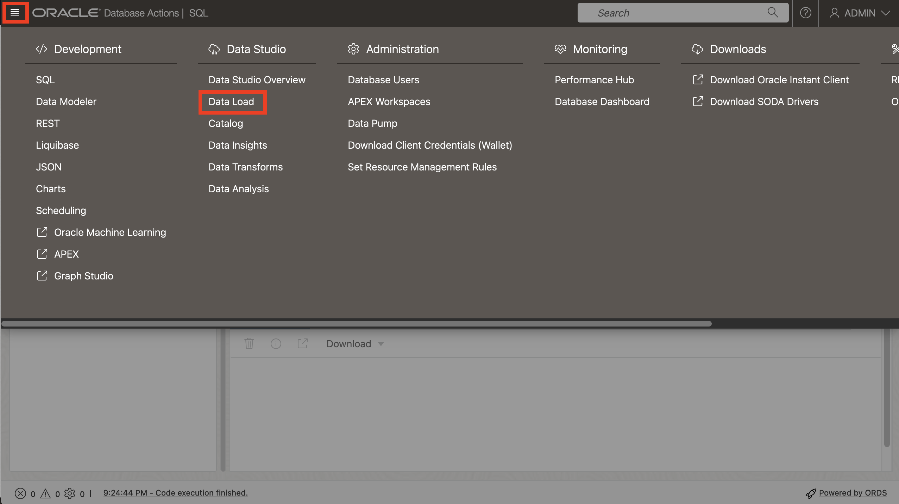
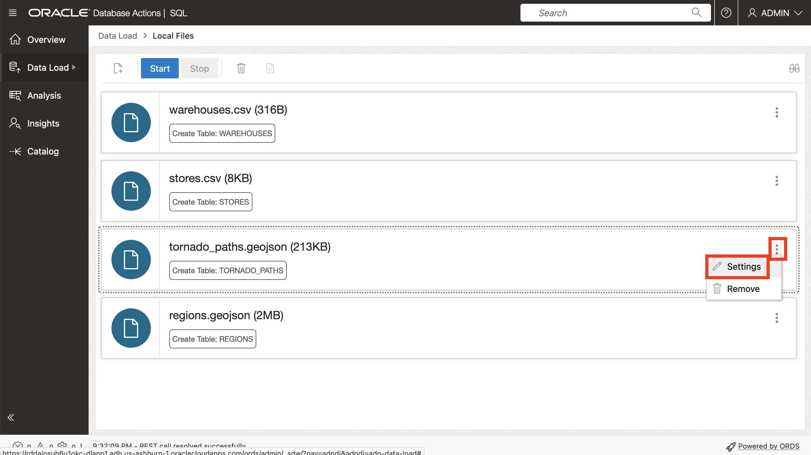
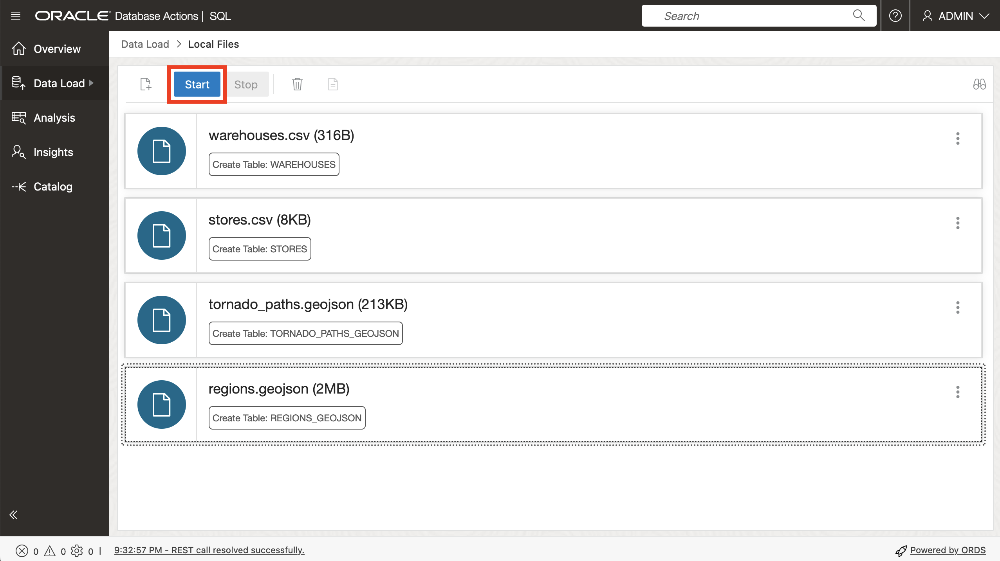
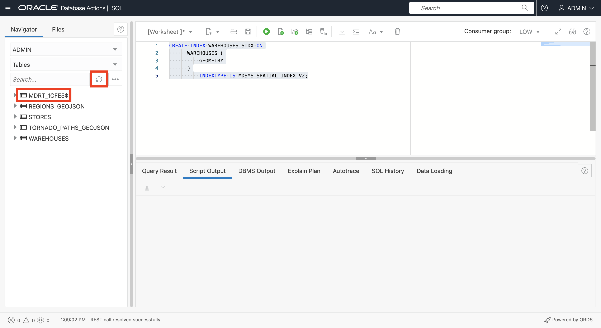
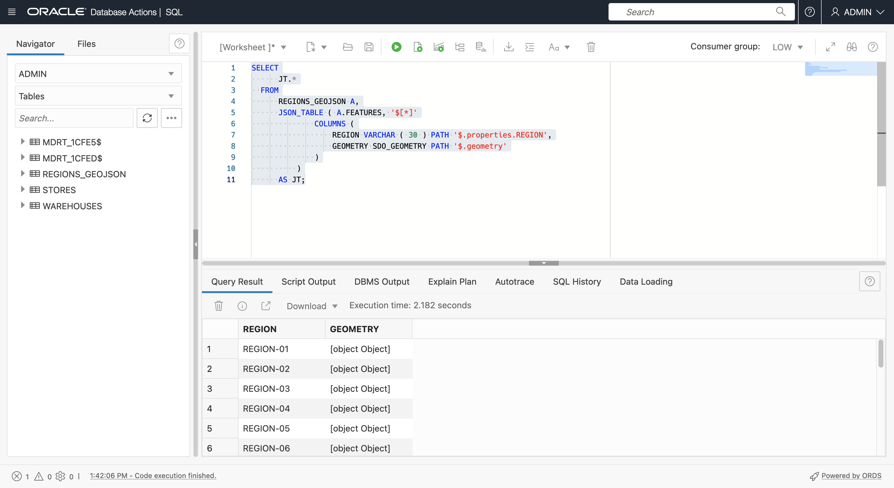
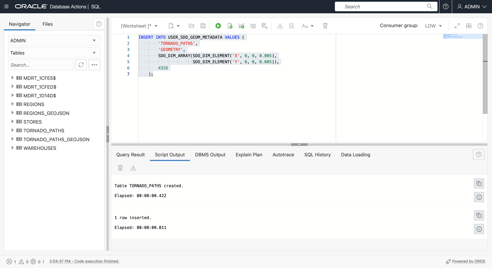

# 创建样本数据

## 简介

空间数据通常来自具有坐标或位置名称的文件，以及以本机空间格式存储数据的文件。在此实验室中，您将从此类文件加载和配置空间数据，并在地图上预览内容。

估计时间：20 分钟

### 目标

在此实验室中，您将：

*   了解 Oracle Database 中的空间数据管理
*   使用常用文件格式准备 Oracle Database 中的空间数据

### 先备条件

*   完成练习 2：使用 SQL 连接到 ADB 工作表

### 关于空间数据

Oracle Database 将空间数据（点、线、多边形）存储在名为 SDO\_GEOMETRY 的本机数据类型中。Oracle Database 还提供了用于高性能空间操作的原生空间索引。此空间索引依赖于为每个表输入的空间元数据以及存储空间数据的几何列。填充空间数据并为其编制索引后，可以使用强大的 API 执行空间分析、计算和处理。

SDO\_GEOMETRY 类型具有以下常规格式：

        SDO_GEOMETRY( 
            [geometry type]              -- ID for points/lines/polygons
            , [coordinate system]        -- ID of coordinate system
            , [point coordinate]         -- used for points only
            , [line/polygon info]        -- used for lines/polygons only
            , [line/polygon coordinates] -- used for lines/polygons only
        )
    

最常见的几何类型是 2 维：

| ID | 类型 |
| --- | --- |
| 2001 年 | 点数 |
| 2002 年 | 行 |
| 2003 | 多边形 |

最常见的坐标系有：

| ID | 坐标系 |
| --- | --- |
| 4326 | 纬度/长度 |
| 3857 | World Mercator |

使用纬度和经度时，请注意，纬度是 Y 坐标，经度是 X 坐标。由于坐标列为 X、Y 对，因此 SDO\_GEOMETRY 中的值需要按以下顺序排列：经度和纬度。

以下示例是具有经度、纬度坐标的点几何体：

        SDO_GEOMETRY( 
            2001                       -- 2D point
            , 4326                     -- Coordinate system
            , SDO_POINT_TYPE(
              -100.123, 20.456, NULL)  -- lon/lat values
            , NULL                     -- Not used for points
            , NULL                     -- Not used for points
        )
    

以下示例是具有经度、纬度坐标的多边形几何体：

        SDO_GEOMETRY( 
            2003                     -- 2D polygon
            , 4326                   -- Coordinate system
            , NULL                   -- Only used for points
            , SDO_ELEM_INFO_ARRAY(
                      1, 1003, 1)    -- Signifies simple exterior polygon
            , SDO_ORDINATE_ARRAY(    -- lon/lat values
                  -98.789065,39.90973
                , -101.2522,39.639537
                , -99.84374,37.160316
                , -96.67987,35.460699
                , -94.21875,39.639537
                , -98.789025,39.90973
            )
        )
    

创建空间数据的一般工作流是生成几何图形，然后创建空间索引以实现最佳性能。在创建空间索引之前，会插入一行空间元数据，空间索引使用该行来确保数据一致性。

空间元数据插入如下：

        INSERT INTO USER_SDO_GEOM_METADATA VALUES (
        [table name],
        [geometry column name],
        SDO_DIM_ARRAY(
          SDO_DIM_ELEMENT('X',[min x],[max x],[tolerance]),
          SDO_DIM_ELEMENT('Y',[min y],[max y],[tolerance])),
        [coordinate system id]   
        );
    

在本研讨会中，您将使用经度和纬度坐标，以便元数据插入如下所示：

        INSERT INTO USER_SDO_GEOM_METADATA VALUES (
        [table name],
        [geometry column name],
        SDO_DIM_ARRAY(
          SDO_DIM_ELEMENT('X', -180, 180, 0.005),
          SDO_DIM_ELEMENT('Y',-90, 90, 0.005)),
        4326 
        );
    

对于**点**数据，最常见的情况是以数据（包括表示点位置的坐标）开头。可以通过以下方式配置数据：创建和填充新的几何列（类型为 SDO\_GEOMETRY 的列），或者创建从坐标创建几何体的函数，然后在该函数上创建空间索引。这两个选项都有其相关的用例，您将使用这两种方法来获得熟悉度。

对于 **lines** 和 **polygons** ，从常见格式（例如 GeoJSON）加载并转换为具有几何列的表是最常见的。GeoJSON 是开发人员集成的最常见格式，由于本研讨会中包含从/到 GeoJSON 的转换，因此我们提供了以下简要介绍。

如 [https://geojson.org/](https://geojson.org/) 中所述，“GeoJSON 是对各种地理数据结构进行编码的一种格式”。地理空间行业已经接受 GeoJSON 作为定义标准，因此几乎所有空间开发人员平台、库和工具包都可以使用它。因此，处理 GeoJSON 对互操作性非常重要。

GeoJSON 文档通常是具有顶层结构的 JSON 文档

      {
          "type": "FeatureCollection",
          "features": [
             ... array of GeoJSON features ... 
          ]
       }
    

下面显示了 GeoJSON 功能的格式。


Oracle Spatial 包括用于在本机空间类型 (SDO\_GEOMETRY) 和 GeoJSON 几何格式之间转换的内置函数。请注意，GeoJSON 几何体包含在更广泛的 GeoJSON 文档格式中，包括非空间属性和数组结构。

在本练习中，您将将数据从 GeoJSON 文档加载到包含 SDO\_GEOMETRY 列的表。在后面的练习中，您将从包含 SDO\_GEOMETRY 列的表生成 GeoJSON。

**注：**在本研讨会中，您将使用 Autonomous Database 工具和 SQL 加载和配置 GeoJSON 文档。这对于了解 Autonomous Database 的原生 JSON 功能非常有用。但是，还有一些简单的工具和实用程序可用于将 GeoJSON 加载到不需要编码的 Oracle Spatial。例如 [Oracle Spatial Studio](https://www.oracle.com/database/technologies/spatial-studio/get-started.html) 和 [GDAL](https://gdal.org/) 。最合适的方法取决于您的方案。

### 目标

在此实验室中，您将：

*   下载 STORES、WAREHOUSES、REGIONS 和 TORNADO\_PATHS 的文件
*   查看地图上的内容
*   将文件加载到数据库表中
*   配置用于空间分析的表

### 先备条件

Oracle Autonomous Database 和 Database Actions

## 任务 1：从文件中加载数据

首先为仓库加载数据，并从 CSV 文件中存储数据，这些文件包含将用于创建点几何图形的坐标。然后从 GeoJSON 文档加载区域和龙卷风路径的数据。GeoJSON 文件将加载并转换为具有几何图形的表。

1.  使用 **right-click > Save link As...** 下载以下文件。
    
    
    
    *   [stores.csv](files/stores.csv)
    *   [warehouses.csv](files/warehouses.csv)
    *   [regions.geojson](files/regions.geojson)
    *   [tornado\_paths.geojson](files/tornado_paths.geojson)
2.  然后，将文件系统浏览器导航到下载的文件。
    
    
    
3.  首先在地图上查看数据。
    
    请注意：Oracle Spatial Studio 是一个用于自助服务（无代码）空间数据加载、配置、分析和地图可视化的 Web 工具。它是可以从云市场部署的单独 Web 应用程序。由于本研习会专门讨论在 SQL 级别使用 Spatial，因此不使用 Spatial Studio。而是使用公共 Web 站点查看数据。
    
    [http://geojson.io](http://geojson.io) 是一个用于查看（以及手动创建和编辑）小型空间数据集的网站。您可以使用此站点呈现 GeoJSON 文件中的数据以及包含经度、纬度列的文件。要查看地图上下载的数据，请单击[此处](http://geojson.io)在新的浏览器选项卡中打开 geojson.io。然后将 **warehouses.csv** 拖放到地图上。
    
    
    
    CSV 数据将转换为 GeoJSON，如右侧所示，并在地图上呈现。
    
    
    
    单击顶部的**新建**可在新选项卡中打开新映射。将 **stores.csv** 拖放到地图上。
    
    
    
    
    
    重复执行 **regions.geojson** 。
    
    
    
    重复执行 **tornardo\_paths.geojson** 。
    
    
    

这些是您将加载、配置和执行空间分析的数据。查看地图后，您可以关闭 geojson.io 选项卡。

1.  下一步，将文件加载到数据库表。在 Database Actions 中，单击左上角的主汉堡包图标，然后单击**数据加载**。



2.  接受默认值（LOAD DATA 和 LOCAL FILE），然后单击**下一步**。


3.  选择下载的所有 4 个文件，然后将其拖放到“数据加载”页面上。


4.  现在，您会看到列出的 4 个要加载的文件。单击 tornado\_paths.geojson 的操作菜单图标，然后选择**设置**。



5.  默认情况下，使用与输入文件相同的名称创建表。这对商店和仓库来说很好。但是，通过从 GeoJSON 转换数据加载后将创建 REGIONS 和 TORNADO\_PATHS 表。因此，您需要覆盖默认名称。将目标表名称更改为 **TORNADO\_PATHS\_GEOJSON** 。


6.  请注意，将创建 2 列，它们对应于 GeoJSON 文件中的顶层键。然后单击**关闭**。


7.  重复执行 regions.geojson。单击操作菜单图标，然后单击**设置**。


8.  将目标表名称更新为 **REGIONS\_GEOJSON** 。观察将创建与其他 GeoJSON 文件相同的结构，其中包含顶层关键字的列。单击**关闭**。


9.  单击**启动**以启动数据加载。



10.  出现确认弹出提示时，单击**运行**。


11.  等待对所有 4 个文件完成加载，然后单击**完成**。


12.  单击左上角的主汉堡包图标，然后选择 **SQL** 。


13.  确认所有 4 个表现在都已创建。


14.  要准备使用 GeoJSON 内容，请在 FEATURES 列上添加将它们定义为 JSON 的检查约束条件。
    
        <copy> 
         ALTER TABLE REGIONS_GEOJSON 
             ADD CHECK (FEATURES IS JSON);
        
         ALTER TABLE TORNADO_PATHS_GEOJSON 
             ADD CHECK (FEATURES IS JSON);
         </copy>
         ```
        
        


这些表现在已准备好进行空间配置。

## 任务 2：使用几何列配置仓库表

接下来，通过从坐标列生成几何列，为空间配置 WAREHOUSES 表。

1.  首先添加几何体列（类型为 SDO\_GEOMETRY 的列）。
    
        <copy> 
        ALTER TABLE WAREHOUSES ADD (
            GEOMETRY SDO_GEOMETRY
            );
        </copy>
        
    
    
    
2.  接下来，使用有效坐标（在本例中为所有行）填充行的几何列。
    
        <copy> 
        UPDATE WAREHOUSES
        SET GEOMETRY = SDO_GEOMETRY(
                         2001,
                         4326,
                         SDO_POINT_TYPE(LONGITUDE, LATITUDE, NULL),
                         NULL, NULL)
        WHERE LONGITUDE IS NOT NULL 
        AND LONGITUDE BETWEEN -180 AND 180
        AND LATITUDE IS NOT NULL 
        AND LATITUDE BETWEEN -90 AND 90 ;
        </copy>
        


3.  创建空间索引之前，必须插入一行空间元数据。每个用户的空间元数据都有一个名为 USER\_SDO\_GEOM\_METADATA 的可更新视图。这是集中式表上的用户视图，用于存储整个数据库实例的空间元数据。空间元数据跟踪要索引的每个几何列的坐标系统标识符（经度/纬度只是许多坐标系统之一）和维度（2D、3D 等）。这些项对于索引几何列中的所有数据都需要保持一致，因此索引创建会读取值并通过拒绝任何不一致来强制实现索引的完整性。
    
    运行以下命令插入 WAREHOUSES 表的空间元数据。
    
        <copy> 
         INSERT INTO USER_SDO_GEOM_METADATA VALUES (
          'WAREHOUSES',  -- table name
          'GEOMETRY',    -- geometry column name
          SDO_DIM_ARRAY(
            SDO_DIM_ELEMENT('X', -180, 180, 0.005),
            SDO_DIM_ELEMENT('Y', -90, 90, 0.005)),
           4326           -- indicates longitude/latitude coordinates
         );
        </copy>
        


4.  最后，为“仓库”表创建一个空间索引。
    
        <copy> 
          CREATE INDEX WAREHOUSES_SIDX ON
              WAREHOUSES (
                  GEOMETRY
              )
                  INDEXTYPE IS MDSYS.SPATIAL_INDEX_V2;
        </copy>
        
    
    
    
    **请注意：**如果空间索引创建语句失败（例如，前面的步骤未正确完成），则在重试之前，必须仍删除索引，因为可能已创建某些索引对象。例如，如果上述空间索引创建语句失败，则在重试之前，应运行 "DROP INDEX WAREHOUSES\_SIDX;"。
    
5.  创建空间索引后，刷新表列表。创建空间索引会自动创建名称格式为 **MDRT\_xxxx$** 的特殊系统管理表。此类表完全由 Spatial 管理以支持空间索引，不应手动删除。对于数据库用户，应将其忽略。
    



## 任务 3：使用基于函数的空间索引配置存储表

接下来，配置空间的 STORES 表。您可以重复上述步骤来创建新几何列并为其编制索引。而是创建一个“基于函数的空间索引”。使用基于函数的空间索引，可以索引函数返回的几何图形。此方法的优点是无需添加新的几何列。对于添加列不切实际或不可取的情况，这是首选方法。有关详细信息，请参阅[此处](https://docs.oracle.com/en/database/oracle/oracle-database/19/spatl/extending-spatial-indexing.html#GUID-CFB6B6DB-4B97-43D1-86A1-21C1BA853089)。

1.  第一步是创建一个接受坐标并返回几何图形（即 SDO\_GEOMETRY 值）的通用函数。该函数包括条件，以便仅为有效的输入坐标返回结果。
    
        <copy>
        CREATE OR REPLACE FUNCTION GET_GEOMETRY (
              IN_LONGITUDE NUMBER,
              IN_LATITUDE  NUMBER
          ) RETURN SDO_GEOMETRY
              DETERMINISTIC PARALLEL_ENABLE
          IS
          BEGIN
           IF (IN_LONGITUDE IS NOT NULL 
              AND IN_LONGITUDE BETWEEN -180 AND 180
              AND IN_LATITUDE IS NOT NULL 
              AND IN_LATITUDE BETWEEN -90 AND 90)
           THEN
            RETURN 
              SDO_GEOMETRY(
                2001, 
                4326, 
                SDO_POINT_TYPE(IN_LONGITUDE, IN_LATITUDE, NULL), 
                NULL, NULL);
            ELSE RETURN NULL;
            END IF;
          END;
          /
        </copy>
        
    
    
    
2.  接下来，使用 STORES 表测试函数。SQL 工作表在查询结果中不显示对象类型（如 SDO\_GEOMETRY），因此结果显示为 **\[object Object\]** 。
    
        <copy>
          SELECT
              GET_GEOMETRY(LONGITUDE, LATITUDE)
          FROM
              STORES
          WHERE 
               ROWNUM<10;
        </copy>
        
    
    
    
3.  由于 SQL 工作表在查询结果中未显示对象类型（如 SDO\_GEOMETRY），因此在内置函数中调用函数以将结果转换为 GeoJSON 字符串。
    
        <copy>
          SELECT
              SDO_UTIL.TO_GEOJSON(
                  GET_GEOMETRY(LONGITUDE, LATITUDE))
          FROM
              STORES
          WHERE 
               ROWNUM<10;
        </copy>
        
    
    
    

您将为 STORES 表创建 GET\_GEOMETRY 函数返回的值的索引，而不是在 STORES 表中创建新的几何列并为其编制索引。

3.  创建空间索引之前，会插入一行空间元数据。对于基于函数的空间索引，应插入函数调用，而不是几何列名。使用 GET\_GEOMETRY 函数插入 STORES 表的空间元数据。函数前面必须加上所有者名称（在本例中为 ADMIN）。
    
        <copy>
        INSERT INTO USER_SDO_GEOM_METADATA VALUES (
         'STORES',  -- table name
         'ADMIN.GET_GEOMETRY(LONGITUDE,LATITUDE)', -- function returning geometry
         SDO_DIM_ARRAY(
          SDO_DIM_ELEMENT('X', -180, 180, 0.005),
          SDO_DIM_ELEMENT('Y', -90, 90, 0.005)),
         4326  -- indicates longitude/latitude coordinates
        );
        </copy>
        


4.  最后创建空间索引。对于基于函数的空间索引，索引的“列”实际上是对 GET\_GEOMETRY 函数的调用。
    
        <copy>
        CREATE INDEX STORES_SIDX ON
          STORES (
              GET_GEOMETRY(LONGITUDE,LATITUDE)
          )
              INDEXTYPE IS MDSYS.SPATIAL_INDEX_V2;
        </copy>
        


## 任务 4：根据 GeoJSON 文档创建区域表

接下来，将区域从 GeoJSON 格式转换为具有几何列的表。首先查看 REGIONS\_GEOJSON 的内容。如前所述，在 SQL 工作表中加载 JSON 会为文档的顶层键创建一个包含列的表。对于 **type** 和 **features** 的 GeoJSON。将鼠标悬停在**功能**值上可查看功能数组的弹出窗口。由于特征是具有许多坐标的多边形，因此您只能看到数组中第一个特征的一部分。

     <copy>
       SELECT *
       FROM REGIONS_GEOJSON;
     </copy>
    


Oracle Autonomous Database 提供了通过 SQL 处理 JSON 数据的强大功能。例如，运行以下语句查看特征数组中的项数（即区域数）。

     <copy>
       SELECT 
         JSON_VALUE(features, '$.size()')
       FROM 
          REGIONS_GEOJSON;
     </copy>
    


要返回数组中第一个特征的属性（即属性），请运行以下命令。结果是键/值对，在本例中仅一个。

    <copy>
    SELECT 
       x.features.properties[0]
    FROM
       REGIONS_GEOJSON x;
    </copy>
    


要将数组中第一个功能的几何图形返回为 SDO\_GEOMETRY，请运行以下命令。如前所述，SQL Worksheet 不显示对象类型值（如 SDO\_GEOMETRY），因此您将看到结果显示为 \[object Object\]。

     <copy>
       SELECT 
         json_value(features,'$[0].geometry' RETURNING SDO_GEOMETRY)
       FROM
           REGIONS_GEOJSON;
     </copy>
    


要在 SQL 工作表中显示几何图形，请使用 Spatial 将 SDO\_GEOMETRY 转换为其他常用字符串格式的功能。Spatial 支持使用 SQL 转换函数和 SDO\_GEOMETRY 对象类型方法进行格式转换。运行以下命令以使用 SDO\_GEOMETRY 方法返回 WKT（已知文本）格式的第一个功能的几何图形。

     <copy>
       SELECT 
         json_value(features,'$[0].geometry' RETURNING SDO_GEOMETRY).Get_WKT()
       FROM
           REGIONS_GEOJSON;
     </copy>
    


JSON\_TABLE 表函数将 JSON 数组中的项作为行返回。这正是我们将 features 数组转换为表所需要的。运行以下命令可将 features 数组的内容作为行返回。请注意，COLUMNS 的参数是属性键（此处仅为 REGION）和几何图形。

     <copy>
       SELECT
           JT.*
       FROM
           REGIONS_GEOJSON A,
           JSON_TABLE ( A.FEATURES, '$[*]'
                   COLUMNS (
                       REGION VARCHAR ( 30 ) PATH '$.properties.REGION',
                       GEOMETRY SDO_GEOMETRY PATH '$.geometry'
                   )
               )
           AS JT;
     </copy>
    



根据上一查询的结果创建 REGIONS 表。

    <copy>
    
      CREATE TABLE REGIONS AS (
          SELECT
              JT.*
          FROM
              REGIONS_GEOJSON A,
              JSON_TABLE ( A.FEATURES, '$[*]'
                  COLUMNS (
                     REGION VARCHAR ( 30 ) PATH '$.properties.REGION',
                     GEOMETRY SDO_GEOMETRY PATH '$.geometry'
              ))
                AS JT
            );
    
    </copy>
    


为区域插入空间元数据。

    <copy>
      INSERT INTO USER_SDO_GEOM_METADATA VALUES (
       'REGIONS',
       'GEOMETRY',
       SDO_DIM_ARRAY(
        SDO_DIM_ELEMENT('X', -180, 180, 0.005),
        SDO_DIM_ELEMENT('Y', -90, 90, 0.005)),
       4326
        );
    </copy>
    


为“REGIONS（区域）”创建空间索引。

    <copy>
      CREATE INDEX REGIONS_SIDX ON
            REGIONS (
                GEOMETRY
            )
                INDEXTYPE IS MDSYS.SPATIAL_INDEX_V2;
    </copy>
    


## 任务 5：从 GeoJSON 文档创建 tornado 路径表

重复上述任务步骤以转换 TORNADO\_PATHS\_GEOJSON。从获取功能数量开始。

    <copy>
      SELECT
          JSON_VALUE(FEATURES, '$.size()')
      FROM
          TORNADO_PATHS_GEOJSON;
    </copy>
    


接下来，获取第一个特征的属性。这一次有几个。

    <copy>
      SELECT
          x.features.properties[0]
      FROM
          TORNADO_PATHS_GEOJSON x;
    </copy>
    


运行以下命令以查看第一个特征的属性值、几何形状和几何形状为 WKT。

    <copy>
      SELECT 
          json_value(features,'$[0].properties.KEY'),
          json_value(features,'$[0].properties.YR'),
          json_value(features,'$[0].properties.LOSS'),
          json_value(features,'$[0].geometry' RETURNING SDO_GEOMETRY),
          json_value(features,'$[0].geometry' RETURNING SDO_GEOMETRY).Get_WKT()
        FROM
            TORNADO_PATHS_GEOJSON;
    </copy>
    


使用 JSON\_TABLE 函数可将内容作为行返回。

    <copy>
      SELECT
            JT.*
        FROM
            TORNADO_PATHS_GEOJSON A,
            JSON_TABLE ( A.FEATURES, '$[*]'
                    COLUMNS (
                        KEY      NUMBER PATH '$.properties.KEY',
                        YR       NUMBER PATH '$.properties.YR',
                        LOSS     NUMBER PATH '$.properties.LOSS',
                        GEOMETRY SDO_GEOMETRY PATH '$.geometry'
                    )
                )
            AS JT;
    </copy>
    


根据上一个查询的结果创建 TORNADO\_PATHS 表。

    <copy>
      CREATE TABLE TORNADO_PATHS AS
      SELECT
            JT.*
        FROM
            TORNADO_PATHS_GEOJSON A,
            JSON_TABLE ( A.FEATURES, '$[*]'
                    COLUMNS (
                        KEY      NUMBER PATH '$.properties.KEY',
                        YR       NUMBER PATH '$.properties.YR',
                        LOSS     NUMBER PATH '$.properties.LOSS',
                        GEOMETRY SDO_GEOMETRY PATH '$.geometry'
                    )
                )
            AS JT;
    </copy>
    


插入 TORNADO\_PATHS 的空间元数据。

    <copy>
      INSERT INTO USER_SDO_GEOM_METADATA VALUES (
       'TORNADO_PATHS',
       'GEOMETRY',
       SDO_DIM_ARRAY(
        SDO_DIM_ELEMENT('X', -180, 180, 0.005),
        SDO_DIM_ELEMENT('Y', -90, 90, 0.005)),
      4326
        );
    </copy>
    



为 TORNADO\_PATHS 创建空间索引。

    <copy>
      CREATE INDEX TORNADO_PATHS_SIDX ON
            TORNADO_PATHS (
                GEOMETRY
            )
                INDEXTYPE IS MDSYS.SPATIAL_INDEX_V2;
    </copy>
    


从 GeoJSON 转换完成后，可以删除存储上载的 GeoJSON 文档的表。然后刷新表列表。

    <copy>
    DROP TABLE REGIONS_GEOJSON;
    DROP TABLE TORNADO_PATHS_GEOJSON;
    </copy>
    


现在加载所有数据并准备进行空间分析。

现在，您可以**进入下一个练习**。

## 了解详细信息

*   [空间产品门户](https://oracle.com/goto/spatial)
*   [空间文档](https://docs.oracle.com/en/database/oracle/oracle-database/19/spatl)
*   [Oracle Database Insider 上的 Spatial 博客文章](https://blogs.oracle.com/database/category/db-spatial)

## 确认

*   **作者** - David Lapp，Oracle 数据库产品管理
*   **贡献者** - Oracle 数据库产品管理云平台 Karin Patenge
*   **上次更新者/日期** - David Lapp，2023 年 3 月