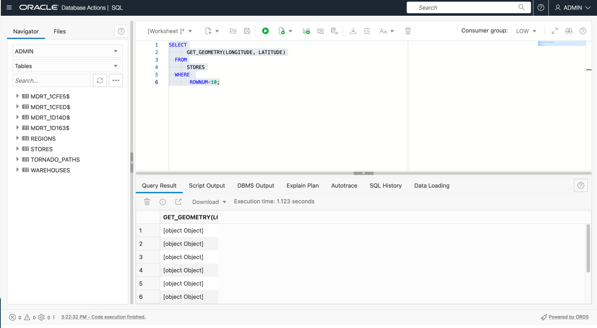
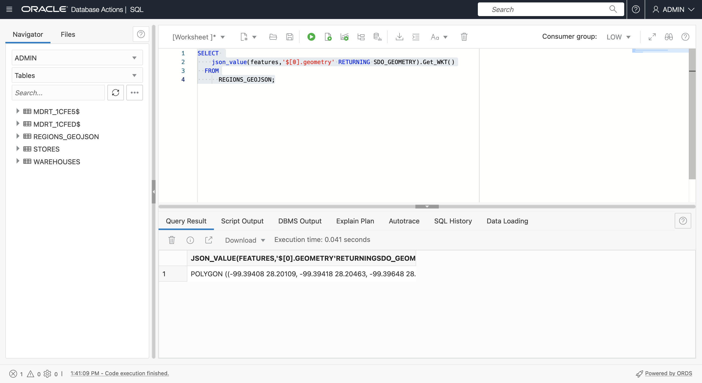
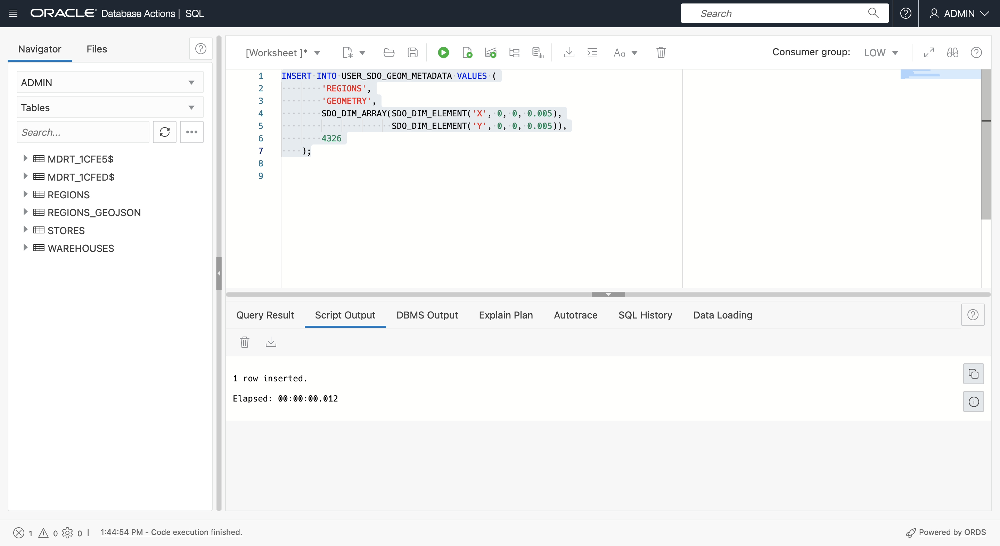

# 建立樣本資料

## 簡介

空間資料通常是源自具有座標或位置名稱的檔案，以及以原生空間格式儲存資料的檔案。在此實驗室中，您可以從這類檔案載入並設定空間資料，然後預覽地圖上的內容。

預估時間：20 分鐘

### 目標

在此實驗室中，您將：

*   瞭解 Oracle Database 中的空間資料管理
*   從一般檔案格式準備 Oracle Database 中的空間資料

### 先決條件

*   完成實驗室 2：使用 SQL 工作表連線至 ADB

### 關於空間資料

Oracle Database 將空間資料 (點、線條、多邊形) 儲存在名為 SDO\_GEOMETRY 的原生資料類型中。Oracle Database 也提供原生空間索引，以進行高效能空間作業。此空間索引依賴為每個表格輸入的空間描述資料，以及儲存空間資料的幾何資料欄。在填入空間資料並建立索引之後，就會提供健全的 API 來執行空間分析、計算以及處理。

SDO\_GEOMETRY 類型的一般格式如下：

        SDO_GEOMETRY( 
            [geometry type]              -- ID for points/lines/polygons
            , [coordinate system]        -- ID of coordinate system
            , [point coordinate]         -- used for points only
            , [line/polygon info]        -- used for lines/polygons only
            , [line/polygon coordinates] -- used for lines/polygons only
        )
    

最常見的幾何類型為二維：

| 識別碼 | 類型 |
| --- | --- |
| 2001 年 | 點 |
| 2002 年 | 明細行 |
| 2003 年 | 多邊形 |

最常見的座標系統為：

| 識別碼 | 座標系統 |
| --- | --- |
| 4326 人 | 緯度 / 經度 |
| 3857 年 | World Mercator |

使用緯度與經度時，請注意緯度為 Y 座標，經度為 X 座標。由於座標列為 X，Y 組，因此 SDO\_GEOMETRY 中的值必須依序為：經度、緯度。

下列範例為具有經度、緯度座標的點幾何：

        SDO_GEOMETRY( 
            2001                       -- 2D point
            , 4326                     -- Coordinate system
            , SDO_POINT_TYPE(
              -100.123, 20.456, NULL)  -- lon/lat values
            , NULL                     -- Not used for points
            , NULL                     -- Not used for points
        )
    

下列範例為具有經度、緯度座標的多邊形幾何：

        SDO_GEOMETRY( 
            2003                     -- 2D polygon
            , 4326                   -- Coordinate system
            , NULL                   -- Only used for points
            , SDO_ELEM_INFO_ARRAY(
                      1, 1003, 1)    -- Signifies simple exterior polygon
            , SDO_ORDINATE_ARRAY(    -- lon/lat values
                  -98.789065,39.90973
                , -101.2522,39.639537
                , -99.84374,37.160316
                , -96.67987,35.460699
                , -94.21875,39.639537
                , -98.789025,39.90973
            )
        )
    

建立空間資料的一般工作流程是產生幾何資料，然後建立空間索引以取得最佳效能。建立空間索引之前，會插入一列空間描述資料，這是由空間索引用來確保資料一致性。

空間描述資料插入方式如下：

        INSERT INTO USER_SDO_GEOM_METADATA VALUES (
        [table name],
        [geometry column name],
        SDO_DIM_ARRAY(
          SDO_DIM_ELEMENT('X',[min x],[max x],[tolerance]),
          SDO_DIM_ELEMENT('Y',[min y],[max y],[tolerance])),
        [coordinate system id]   
        );
    

在這個研討會中，您會使用經緯度座標，因此中繼資料插入如下：

        INSERT INTO USER_SDO_GEOM_METADATA VALUES (
        [table name],
        [geometry column name],
        SDO_DIM_ARRAY(
          SDO_DIM_ELEMENT('X', -180, 180, 0.005),
          SDO_DIM_ELEMENT('Y',-90, 90, 0.005)),
        4326 
        );
    

對於**點**資料，最常見的案例是從資料開始，包括代表點位置的座標。建立並填入新幾何資料欄 (SDO\_GEOMETRY 類型的資料欄) 或建立從座標建立幾何的函數，然後在該函數上建立空間索引，即可設定資料。兩個選項都有關聯的使用案例，您將使用這兩種方法來熟悉。

對於**線**和**多邊形**，最常從一般格式 (例如 GeoJSON) 載入，然後轉換為具有幾何資料欄的表格。GeoJSON 是開發人員整合的最常見格式，由於本研討會包含從 GeoJSON 轉換成 GeoJSON，因此提供下列簡介。

如 [https://geojson.org/](https://geojson.org/) 所述，「GeoJSON 為編碼各種地理資料結構的格式。地理空間產業已接受 GeoJSON 作為瑕疵標準，因此幾乎所有空間開發人員平台、程式庫及工具套件都可使用它。因此，GeoJSON 的處理對於互通性非常重要。

GeoJSON 文件通常是具有最上層結構的 JSON 文件

      {
          "type": "FeatureCollection",
          "features": [
             ... array of GeoJSON features ... 
          ]
       }
    

下面是 GeoJSON 功能的格式。


Oracle Spatial 包含可在原生空間類型 (SDO\_GEOMETRY) 和 GeoJSON 幾何格式之間轉換的內建函數。請注意，GeoJSON 幾何圖形包含在較廣泛的 GeoJSON 文件格式中，包括非空間屬性和陣列結構。

在此實驗室中，您將從 GeoJSON 文件將資料載入含有 SDO\_GEOMETRY 資料欄的表格。在稍後的實驗室中，您將從含有 SDO\_GEOMETRY 資料欄的表格產生 GeoJSON。

**注意：**在此研討會中，您會使用 Autonomous Database 工具和 SQL 來載入和設定 GeoJSON 文件。這對於瞭解 Autonomous Database 的原生 JSON 功能而言非常有用。然而，還有簡單工具和公用程式可用來將 GeoJSON 載入 Oracle Spatial，無需編寫程式碼。例如 [Oracle Spatial Studio](https://www.oracle.com/database/technologies/spatial-studio/get-started.html) 和 [GDAL](https://gdal.org/) 。最合適的方法取決於您的方案。

### 目標

在此實驗室中，您將：

*   下載 STORES、WAREHOUSES、REGIONS 及 TORNADO\_PATHS 檔案
*   檢視地圖上的內容
*   載入檔案至資料庫表格
*   設定表格以進行空間分析

### 先決條件

Oracle Autonomous Database 和資料庫動作

## 作業 1：從檔案載入資料

首先，從包含用於建立點幾何圖形之座標的 CSV 檔案載入倉庫與商店的資料。然後從 GeoJSON 文件載入區域和龍捲風路徑的資料。GeoJSON 檔案會載入並轉換成含有幾何資料的表格。

1.  使用**滑鼠右鍵 > 將連結另存為 ...** 下載下列檔案。
    
    
    
    *   [stores.csv](files/stores.csv)
    *   [warehouses.csv](files/warehouses.csv)
    *   [regions.geojson](files/regions.geojson)
    *   [tornado\_paths.geojson](files/tornado_paths.geojson)
2.  然後瀏覽檔案系統總管至下載的檔案。
    
    
    
3.  從地圖上的資料檢視開始。
    
    請注意：Oracle Spatial Studio 是自助服務 (無程式碼) 空間資料載入、組態、分析以及地圖視覺化的 Web 工具。它是可以從 Cloud Marketplace 部署的個別 Web 應用程式。由於本研討會的重點在於處理 SQL 層次的空間，因此不使用 Spatial Studio。請改用公用網站來檢視資料。
    
    [http://geojson.io](http://geojson.io) 是一個可供檢視 (以及手動建立和編輯) 小型空間資料集的網站。您可以使用此網站轉譯 GeoJSON 檔案中的資料，以及包含經度和緯度資料欄的檔案。若要在地圖上檢視下載的資料，請按一下[此處](http://geojson.io)以在新的瀏覽器頁標中開啟 geojson.io。然後將 **warehouses.csv** 拖放至地圖。
    
    
    
    CSV 資料會如右側所示轉換為 GeoJSON，並在地圖上轉譯。
    
    
    
    按一下頂端的**新建**，以在新頁籤中開啟新地圖。將 **stores.csv** 拖放至地圖。
    
    
    
    
    
    重複 **regions.geojson** 。
    
    
    
    重複 **tornardo\_paths.geojson** 。
    
    
    

這些是您將載入、設定及執行空間分析的資料。複查地圖之後，您可以關閉 geojson.io 頁標。

1.  接下來，您將檔案載入資料庫表格。在「資料庫動作」中，按一下左上方的主要漢堡圖示，然後按一下**資料載入**。


2.  接受預設值 (LOAD DATA 和 LOCAL FILE)，然後按一下**下一步**。


3.  選取下載的所有 4 個檔案，然後將它們拖放至「資料載入」頁面。


4.  您現在會看到列出 4 個要載入的檔案。按一下 tornado\_paths.geojson 的動作功能表圖示，然後選取**設定值**。


5.  依照預設，表格會以與輸入檔相同的名稱建立。這適用於 STORES 和 WAREHOUSES。不過，您會在從 GeoJSON 轉換資料載入後建立 REGIONS 和 TORNADO\_PATHS 表格。因此，您必須置換預設名稱。將目的地表格名稱變更為 **TORNADO\_PATHS\_GEOJSON** 。


6.  請注意，將會建立兩個相對應於 GeoJSON 檔案中頂層索引鍵的資料欄。然後按一下**關閉 (Close)** 。


7.  重複 regions.geojson。按一下動作功能表圖示，然後按一下**設定值**。


8.  將目標表格名稱更新為 **REGIONS\_GEOJSON** 。請注意，將建立與其他 GeoJSON 檔案相同的結構，其中包含頂層索引鍵的資料欄。按一下**關閉 (Close)** 。


9.  按一下**開始**以起始資料載入。


10.  提示確認即現式視窗時，按一下**執行**。


11.  等待所有 4 個檔案載入完成，然後按一下**完成**。


12.  按一下左上角的主要漢堡圖示，然後選取 **SQL** 。


13.  確認所有 4 個表格現在都已建立。


14.  若要準備使用 GeoJSON 內容，請在定義為 JSON 的 FEATURES 資料欄上新增檢查限制。
    
        <copy> 
         ALTER TABLE REGIONS_GEOJSON 
             ADD CHECK (FEATURES IS JSON);
        
         ALTER TABLE TORNADO_PATHS_GEOJSON 
             ADD CHECK (FEATURES IS JSON);
         </copy>
         ```
        
        


表格現在已準備好進行「空間」設定。

## 作業 2：使用幾何資料欄設定倉儲表格

接下來，您可以從座標欄產生幾何欄，為空間配置 WAREHOUSES 表。

1.  首先，請新增一個幾何資料欄 (SDO\_GEOMETRY 類型的資料欄)。
    
        <copy> 
        ALTER TABLE WAREHOUSES ADD (
            GEOMETRY SDO_GEOMETRY
            );
        </copy>
        
    
    
    
2.  接著，為具有有效座標的資料列植入幾何資料欄 (此例中所有資料列)。
    
        <copy> 
        UPDATE WAREHOUSES
        SET GEOMETRY = SDO_GEOMETRY(
                         2001,
                         4326,
                         SDO_POINT_TYPE(LONGITUDE, LATITUDE, NULL),
                         NULL, NULL)
        WHERE LONGITUDE IS NOT NULL 
        AND LONGITUDE BETWEEN -180 AND 180
        AND LATITUDE IS NOT NULL 
        AND LATITUDE BETWEEN -90 AND 90 ;
        </copy>
        


3.  您必須先插入空間描述資料資料列，才能建立空間索引。每個使用者都有一個名為 USER\_SDO\_GEOM\_METADATA 的可更新檢視，用於其空間中繼資料。這是集中化表格的使用者視觀表，其中儲存整個資料庫執行處理的空間描述資料。空間描述資料會追蹤要編製索引之每個幾何資料欄的座標系統 ID (經度 / 緯度只有許多座標系統的其中之一)，以及維度 (2D、3D 等等)。這些項目對索引幾何資料欄中的所有資料必須一致，因此建立索引會讀取值，並拒絕任何不一致來強制執行索引的完整性。
    
    執行下列動作以插入 WAREHOUSES 表格的空間描述資料。
    
        <copy> 
         INSERT INTO USER_SDO_GEOM_METADATA VALUES (
          'WAREHOUSES',  -- table name
          'GEOMETRY',    -- geometry column name
          SDO_DIM_ARRAY(
            SDO_DIM_ELEMENT('X', -180, 180, 0.005),
            SDO_DIM_ELEMENT('Y', -90, 90, 0.005)),
           4326           -- indicates longitude/latitude coordinates
         );
        </copy>
        


4.  最後，請為 WAREHOUSES 表格建立空間索引。
    
        <copy> 
          CREATE INDEX WAREHOUSES_SIDX ON
              WAREHOUSES (
                  GEOMETRY
              )
                  INDEXTYPE IS MDSYS.SPATIAL_INDEX_V2;
        </copy>
        
    
    
    
    **請注意：**如果空間索引建立敘述句失敗 (例如，上一個步驟未正確執行)，則在重試之前，您仍必須刪除索引，因為某些索引構件可能已建立。因此，例如，如果上述空間索引建立敘述句失敗，則在重試之前，您應該執行 "DROP INDEX WAREHOUSES\_SIDX;"。
    
5.  建立空間索引之後，請重新整理表格清單。建立空間索引會自動建立一個名為 **MDRT\_xxxx$** 的特殊系統管理表格。這類表格完全由空間管理，以支援空間索引，不應該手動刪除。對於資料庫使用者，應予以忽略。
    


## 作業 3：使用以函數為基礎的空間索引設定存放區表格

接下來設定空間的 STORES 表格。您可以重複上一個步驟來建立和編製新幾何資料欄的索引。您會改為建立 「函數式空間索引」。透過函數式空間索引，您可以編製函數所傳回之幾何圖形的索引。此方法的優點在於不需要新增幾何資料欄。在新增資料欄不切實際或不適合的情況下，這是偏好的方式。如需詳細資訊，請參閱[這個網頁](https://docs.oracle.com/en/database/oracle/oracle-database/19/spatl/extending-spatial-indexing.html#GUID-CFB6B6DB-4B97-43D1-86A1-21C1BA853089)。

1.  第一個步驟是建立接受座標並傳回幾何 (即 SDO\_GEOMETRY 值) 的一般函數。函數包含準則，以便只傳回有效輸入座標的結果。
    
        <copy>
        CREATE OR REPLACE FUNCTION GET_GEOMETRY (
              IN_LONGITUDE NUMBER,
              IN_LATITUDE  NUMBER
          ) RETURN SDO_GEOMETRY
              DETERMINISTIC PARALLEL_ENABLE
          IS
          BEGIN
           IF (IN_LONGITUDE IS NOT NULL 
              AND IN_LONGITUDE BETWEEN -180 AND 180
              AND IN_LATITUDE IS NOT NULL 
              AND IN_LATITUDE BETWEEN -90 AND 90)
           THEN
            RETURN 
              SDO_GEOMETRY(
                2001, 
                4326, 
                SDO_POINT_TYPE(IN_LONGITUDE, IN_LATITUDE, NULL), 
                NULL, NULL);
            ELSE RETURN NULL;
            END IF;
          END;
          /
        </copy>
        
    
    
    
2.  接下來，請使用 STORES 表格測試函數。「SQL 工作表」不會在查詢結果中顯示如 SDO\_GEOMETRY 的物件類型，因此結果會顯示為 **\[ 物件物件 \]** 。
    
        <copy>
          SELECT
              GET_GEOMETRY(LONGITUDE, LATITUDE)
          FROM
              STORES
          WHERE 
               ROWNUM<10;
        </copy>
        
    
    
    
3.  因為「SQL 工作表」未在查詢結果中顯示如 SDO\_GEOMETRY 的物件類型，所以呼叫內建函數內的函數，將結果轉換為 GeoJSON 字串。
    
        <copy>
          SELECT
              SDO_UTIL.TO_GEOJSON(
                  GET_GEOMETRY(LONGITUDE, LATITUDE))
          FROM
              STORES
          WHERE 
               ROWNUM<10;
        </copy>
        
    
    
    

您將會在 STORES 表格的 GET\_GEOMETRY 函數傳回的值上建立索引，而非在 STORES 表格中建立新幾何資料欄。

3.  建立空間索引之前，會先插入資料列的空間描述資料。如果是基於函數的空間索引，而非插入函數呼叫的幾何欄名稱。使用 GET\_GEOMETRY 函數插入 STORES 表格的空間描述資料。在這種情況下，函數必須前置有擁有者名稱。
    
        <copy>
        INSERT INTO USER_SDO_GEOM_METADATA VALUES (
         'STORES',  -- table name
         'ADMIN.GET_GEOMETRY(LONGITUDE,LATITUDE)', -- function returning geometry
         SDO_DIM_ARRAY(
          SDO_DIM_ELEMENT('X', -180, 180, 0.005),
          SDO_DIM_ELEMENT('Y', -90, 90, 0.005)),
         4326  -- indicates longitude/latitude coordinates
        );
        </copy>
        


4.  最後，建立空間索引。在以函數為基礎的空間索引中，正在編製索引的「資料欄」實際上是呼叫 GET\_GEOMETRY 函數。
    
        <copy>
        CREATE INDEX STORES_SIDX ON
          STORES (
              GET_GEOMETRY(LONGITUDE,LATITUDE)
          )
              INDEXTYPE IS MDSYS.SPATIAL_INDEX_V2;
        </copy>
        


## 作業 4：從 GeoJSON 文件建立區域表格

接下來，您會將區域從 GeoJSON 格式轉換為具有幾何資料欄的表格。從檢視 REGIONS\_GEOJSON 的內容開始。如前所述，「SQL 工作表」中載入 JSON 會建立包含文件最上層索引鍵之資料欄的表格。對於 **type** 和 **features** 的 GeoJSON。將滑鼠游標停留在 **features** 值上方，即可看到功能陣列的蹦現視窗。由於這些特徵是具有許多座標的多邊形，因此您只會看到陣列中第一個特徵的一部分。

     <copy>
       SELECT *
       FROM REGIONS_GEOJSON;
     </copy>
    


Oracle Autonomous Database 提供強大的功能，可透過 SQL 使用 JSON 資料。例如，執行下列敘述句以查看功能陣列中的項目數目 (即區域數目)。

     <copy>
       SELECT 
         JSON_VALUE(features, '$.size()')
       FROM 
          REGIONS_GEOJSON;
     </copy>
    


若要傳回陣列中第一個特徵的屬性 (即屬性)，請執行下列步驟。結果是索引鍵 / 值組，在此情況中只有一個。

    <copy>
    SELECT 
       x.features.properties[0]
    FROM
       REGIONS_GEOJSON x;
    </copy>
    


若要將陣列中第一個特徵的幾何傳回為 SDO\_GEOMETRY，請執行下列步驟。如前所述，「SQL 工作表」不會顯示物件類型值 (如 SDO\_GEOMETRY)，因此您將看到顯示為 \[ 物件 \] 的結果。

     <copy>
       SELECT 
         json_value(features,'$[0].geometry' RETURNING SDO_GEOMETRY)
       FROM
           REGIONS_GEOJSON;
     </copy>
    


若要在「SQL 工作表」中顯示幾何圖形，請使用 Spatial 將 SDO\_GEOMETRY 轉換為其他一般字串格式的能力。空間支援使用 SQL 轉換函數和 SDO\_GEOMETRY 物件類型方法進行格式轉換。執行以下步驟以使用 SDO\_GEOMETRY 方法，傳回 WKT (Well Known Text) 格式第一個功能的幾何圖形。

     <copy>
       SELECT 
         json_value(features,'$[0].geometry' RETURNING SDO_GEOMETRY).Get_WKT()
       FROM
           REGIONS_GEOJSON;
     </copy>
    



JSON\_TABLE 表格函數會傳回 JSON 陣列中的項目作為資料列。這正是我們將圖徵陣列轉換為表格所需要的。執行以下動作，將特徵陣列的內容傳回為列。請注意，COLUMNS 的引數是特性索引鍵，此處只有 REGION 和幾何圖形。

     <copy>
       SELECT
           JT.*
       FROM
           REGIONS_GEOJSON A,
           JSON_TABLE ( A.FEATURES, '$[*]'
                   COLUMNS (
                       REGION VARCHAR ( 30 ) PATH '$.properties.REGION',
                       GEOMETRY SDO_GEOMETRY PATH '$.geometry'
                   )
               )
           AS JT;
     </copy>
    


從上一個查詢的結果建立 REGIONS 表格。

    <copy>
    
      CREATE TABLE REGIONS AS (
          SELECT
              JT.*
          FROM
              REGIONS_GEOJSON A,
              JSON_TABLE ( A.FEATURES, '$[*]'
                  COLUMNS (
                     REGION VARCHAR ( 30 ) PATH '$.properties.REGION',
                     GEOMETRY SDO_GEOMETRY PATH '$.geometry'
              ))
                AS JT
            );
    
    </copy>
    


插入 REGIONS 的空間描述資料。

    <copy>
      INSERT INTO USER_SDO_GEOM_METADATA VALUES (
       'REGIONS',
       'GEOMETRY',
       SDO_DIM_ARRAY(
        SDO_DIM_ELEMENT('X', -180, 180, 0.005),
        SDO_DIM_ELEMENT('Y', -90, 90, 0.005)),
       4326
        );
    </copy>
    



建立 REGIONS 的空間索引。

    <copy>
      CREATE INDEX REGIONS_SIDX ON
            REGIONS (
                GEOMETRY
            )
                INDEXTYPE IS MDSYS.SPATIAL_INDEX_V2;
    </copy>
    


## 作業 5：從 GeoJSON 文件建立龍捲風路徑表格

重複上一個作業步驟，以轉換 TORNADO\_PATHS\_GEOJSON。請從取得功能數目開始。

    <copy>
      SELECT
          JSON_VALUE(FEATURES, '$.size()')
      FROM
          TORNADO_PATHS_GEOJSON;
    </copy>
    


接下來，取得第一個功能的屬性。這次有數個。

    <copy>
      SELECT
          x.features.properties[0]
      FROM
          TORNADO_PATHS_GEOJSON x;
    </copy>
    


執行以下步驟，將第一個特徵的性質值、幾何圖形和幾何圖形視為 WKT。

    <copy>
      SELECT 
          json_value(features,'$[0].properties.KEY'),
          json_value(features,'$[0].properties.YR'),
          json_value(features,'$[0].properties.LOSS'),
          json_value(features,'$[0].geometry' RETURNING SDO_GEOMETRY),
          json_value(features,'$[0].geometry' RETURNING SDO_GEOMETRY).Get_WKT()
        FROM
            TORNADO_PATHS_GEOJSON;
    </copy>
    


使用 JSON\_TABLE 函數以資料列形式傳回內容。

    <copy>
      SELECT
            JT.*
        FROM
            TORNADO_PATHS_GEOJSON A,
            JSON_TABLE ( A.FEATURES, '$[*]'
                    COLUMNS (
                        KEY      NUMBER PATH '$.properties.KEY',
                        YR       NUMBER PATH '$.properties.YR',
                        LOSS     NUMBER PATH '$.properties.LOSS',
                        GEOMETRY SDO_GEOMETRY PATH '$.geometry'
                    )
                )
            AS JT;
    </copy>
    


從上一個查詢的結果建立 TORNADO\_PATHS 表格。

    <copy>
      CREATE TABLE TORNADO_PATHS AS
      SELECT
            JT.*
        FROM
            TORNADO_PATHS_GEOJSON A,
            JSON_TABLE ( A.FEATURES, '$[*]'
                    COLUMNS (
                        KEY      NUMBER PATH '$.properties.KEY',
                        YR       NUMBER PATH '$.properties.YR',
                        LOSS     NUMBER PATH '$.properties.LOSS',
                        GEOMETRY SDO_GEOMETRY PATH '$.geometry'
                    )
                )
            AS JT;
    </copy>
    


插入 TORNADO\_PATHS 的空間描述資料。

    <copy>
      INSERT INTO USER_SDO_GEOM_METADATA VALUES (
       'TORNADO_PATHS',
       'GEOMETRY',
       SDO_DIM_ARRAY(
        SDO_DIM_ELEMENT('X', -180, 180, 0.005),
        SDO_DIM_ELEMENT('Y', -90, 90, 0.005)),
      4326
        );
    </copy>
    


建立 TORNADO\_PATHS 的空間索引。

    <copy>
      CREATE INDEX TORNADO_PATHS_SIDX ON
            TORNADO_PATHS (
                GEOMETRY
            )
                INDEXTYPE IS MDSYS.SPATIAL_INDEX_V2;
    </copy>
    


從 GeoJSON 轉換完成後，您可以刪除儲存上傳之 GeoJSON 文件的表格。然後重新整理表格清單。

    <copy>
    DROP TABLE REGIONS_GEOJSON;
    DROP TABLE TORNADO_PATHS_GEOJSON;
    </copy>
    


現在會載入所有資料並準備進行空間分析。

您現在可以**進入下一個實驗室**。

## 進一步瞭解

*   [空間產品入口網站](https://oracle.com/goto/spatial)
*   [空間文件](https://docs.oracle.com/en/database/oracle/oracle-database/19/spatl)
*   [Oracle Database Insider 的空間部落格文章](https://blogs.oracle.com/database/category/db-spatial)

## 確認

*   **作者** - Oracle 資料庫產品管理 David Lapp
*   **貢獻者** - Karin Patenge，Database Product Management，Oracle
*   **上次更新者 / 日期** - David Lapp，2023 年 3 月