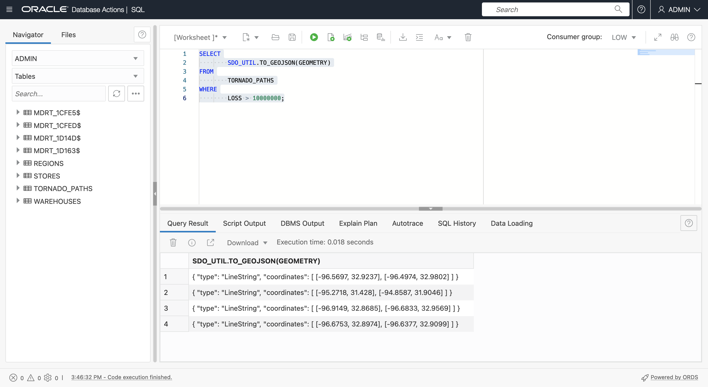
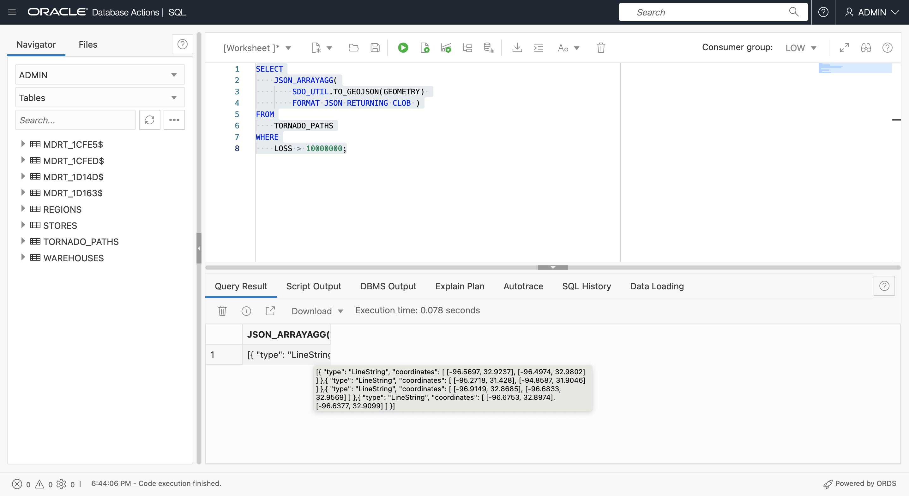
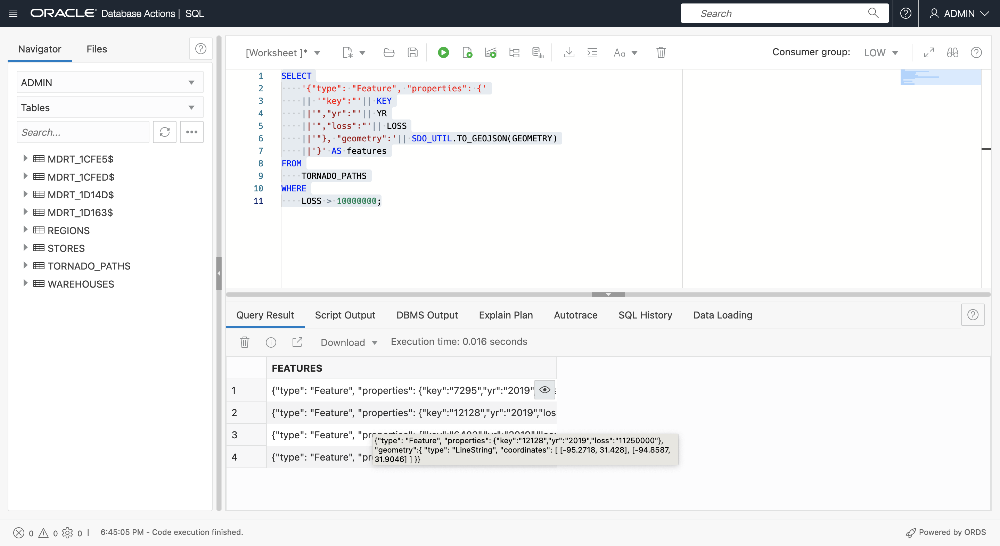
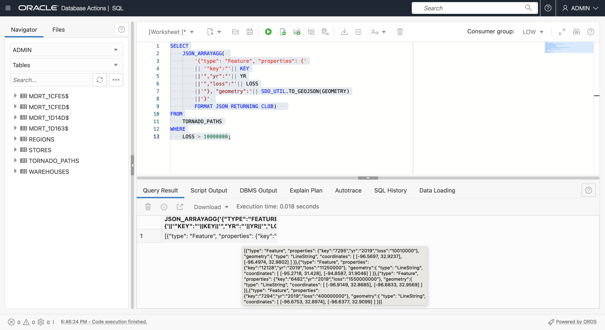
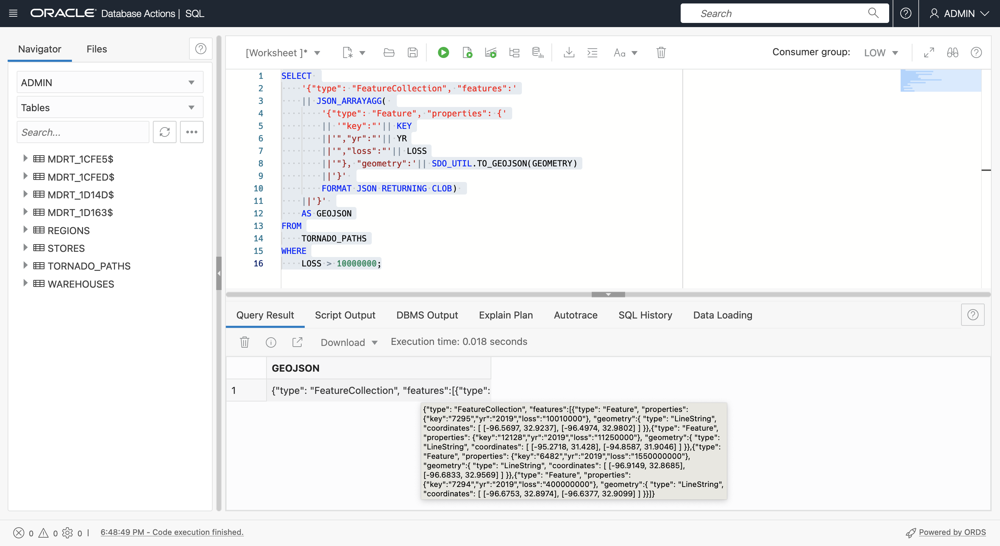
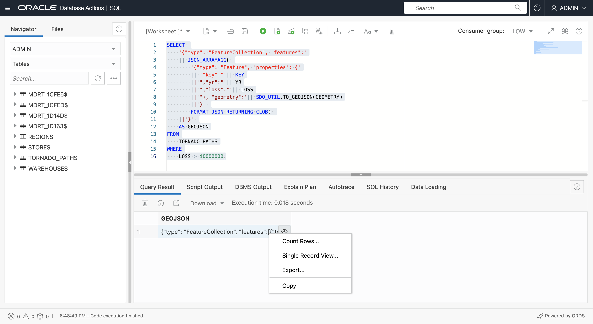
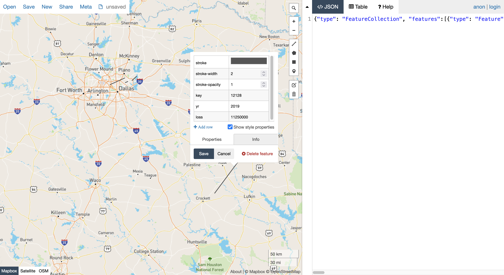
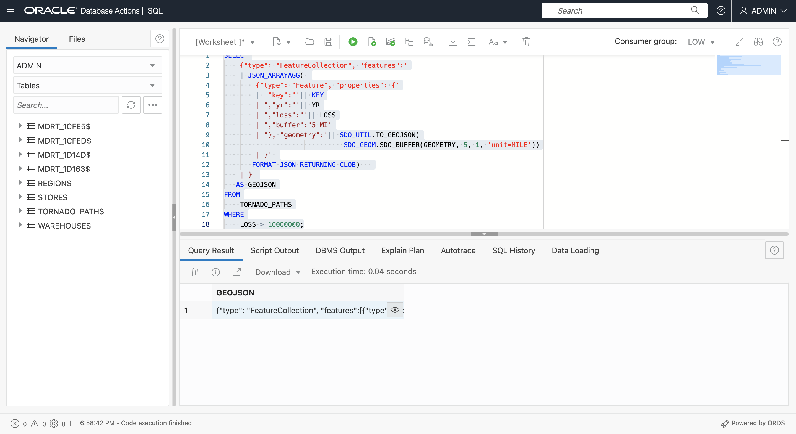
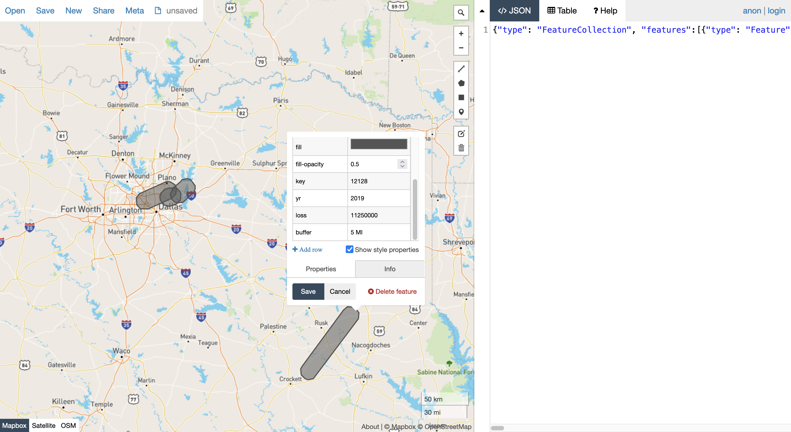

# Devolver GeoJSON

## Introducción

GeoJSON es el formato preferido para la integración de desarrolladores de datos espaciales. Prácticamente todas las bibliotecas de cliente espaciales y de asignación consumen GeoJSON. Por lo tanto, es importante devolver el contenido y los resultados de Spatial como GeoJSON. Consulte el **Laboratorio 3 - Introducción** para obtener una explicación de GeoJSON. En este laboratorio, generará documentos GeoJSON a partir de tablas con geometrías. En la práctica, el valor de generar GeoJSON en ADB consiste en devolver GeoJSON a diversos clientes y, a continuación, entregar el contenido desde su marco. Por ejemplo, SQL y PL/SQL que devuelven GeoJSON pueden utilizarlo Oracle REST Data Services (ORDS) para publicar API de REST basadas en ubicación que devuelven documentos GeoJSON, y Oracle Data Science para combinarlas con bibliotecas de aprendizaje automático espaciales de código abierto populares que soportan de forma nativa GeoJSON.

Tiempo estimado: 15 minutos

Vea el siguiente vídeo para una breve introducción al laboratorio. [Preparación de datos espaciales](videohub:1_bj22bt29)

### Objetivos

En esta práctica de prácticas, aprenderá a:

*   Explora la entrega nativa de JSON en Oracle Autonomous Database
*   Convertir tablas con geometrías en documentos GeoJSON para soportar la integración de desarrolladores

### Requisitos

*   Finalización del laboratorio 3: Preparación de datos espaciales

## Tarea 1: Crear el documento GeoJSON a partir de los resultados de la consulta

1.  Comience por devolver una geometría de ruta de tornado como en formato GeoJSON.
    
        <copy> 
        SELECT
            SDO_UTIL.TO_GEOJSON(GEOMETRY)
        FROM
            TORNADO_PATHS
        WHERE
            LOSS > 10000000;
        </copy>
        
    
    
    
2.  A continuación, utilice la función JSON\_ARRAYAGG( ) para convertir filas de geometrías GeoJSON en una matriz, según sea necesario para crear el documento GeoJSON. Observe el argumento **RETURNING CLOB** que se necesita, ya que las geometrías con muchas coordenadas (como polígonos complejos) pueden dar como resultado cadenas muy largas. Pase el mouse sobre el resultado para ver la matriz JSON.
    
        <copy> 
        SELECT
            JSON_ARRAYAGG(
                SDO_UTIL.TO_GEOJSON(GEOMETRY) 
                FORMAT JSON RETURNING CLOB )
        FROM
            TORNADO_PATHS
        WHERE
            LOSS > 10000000;
        </copy>
        
    
    
    
3.  La matriz de características debe incluir geometrías y propiedades. Ejecute la siguiente consulta para crear elementos de la matriz de funciones. Pase el mouse sobre el resultado para ver la matriz JSON ahora con propiedades.
    
        <copy> 
        SELECT
            '{"type": "Feature", "properties": {'
            || '"key":"'|| KEY
            ||'","yr":"'|| YR
            ||'","loss":"'|| LOSS
            ||'"}, "geometry":'|| SDO_UTIL.TO_GEOJSON(GEOMETRY)
            ||'}' AS features
        FROM
            TORNADO_PATHS
        WHERE
            LOSS > 10000000;
        </copy>
        
    
    
    
4.  Utilice JSON\_ARRAYAGG( ) para compilar los resultados anteriores en una matriz. Esta es ahora la matriz de características reales. Pase el mouse sobre el resultado para ver una ventana emergente con el resultado.
    
        <copy> 
        SELECT
            JSON_ARRAYAGG( 
                '{"type": "Feature", "properties": {'
                || '"key":"'|| KEY
                ||'","yr":"'|| YR
                ||'","loss":"'|| LOSS
                ||'"}, "geometry":'|| SDO_UTIL.TO_GEOJSON(GEOMETRY)
                ||'}' 
                FORMAT JSON RETURNING CLOB)   
        FROM
            TORNADO_PATHS
        WHERE
            LOSS > 10000000;
        </copy>
        
    
    
    
5.  Para completar la construcción de un documento GeoJSON, incluya las claves de nivel superior **type** y **features**, y una llave de cierre. Esto devuelve un documento GeoJSON completo. Pase el mouse sobre el resultado para ver una ventana emergente con el resultado.
    
        <copy> 
        SELECT
            '{"type": "FeatureCollection", "features":'
            || JSON_ARRAYAGG( 
                '{"type": "Feature", "properties": {'
                || '"key":"'|| KEY
                ||'","yr":"'|| YR
                ||'","loss":"'|| LOSS
                ||'"}, "geometry":'|| SDO_UTIL.TO_GEOJSON(GEOMETRY)
                ||'}' 
                FORMAT JSON RETURNING CLOB) 
            ||'}'
            AS GEOJSON
        FROM
            TORNADO_PATHS
        WHERE
            LOSS > 10000000;
        </copy>
        

6.  Haga clic con el botón secundario en la celda de resultados y seleccione **Copiar**.
    
    
    
7.  Verifique el resultado presentando. Haga clic [aquí](http://geojson.io) para abrir geojson.io en un nuevo separador del explorador. Borre el contenido del panel derecho en JSON (seleccione all > delete) y, a continuación, pegue el GeoJSON copiado desde la hoja de trabajo de SQL. Haga clic en cualquiera de las líneas del tornado para ver una ventana emergente que incluye sus propiedades.
    
    
    
8.  Para hacer el resultado un poco más interesante, ejecute lo siguiente para crear un documento GeoJSON con geometrías que son buffers de 5 millas que rodean las rutas de tornados. Observe que se agrega una nueva clave de propiedad para indicar la distancia del buffer. Ejecute la consulta y, a continuación, como se ha hecho anteriormente, copie el resultado.
    
        <copy> 
        SELECT
           '{"type": "FeatureCollection", "features":'
           || JSON_ARRAYAGG( 
               '{"type": "Feature", "properties": {'
               || '"key":"'|| KEY
               ||'","yr":"'|| YR
               ||'","loss":"'|| LOSS
               ||'","buffer":"5 MI'
               ||'"}, "geometry":'|| SDO_UTIL.TO_GEOJSON(
                                      SDO_GEOM.SDO_BUFFER(GEOMETRY, 5, 1, 'unit=MILE'))
               ||'}' 
               FORMAT JSON RETURNING CLOB)   
           ||'}'
           AS GEOJSON
        FROM
            TORNADO_PATHS
        WHERE
            LOSS > 10000000;
        </copy>
        
    
    
    
9.  Abra un nuevo separador geojson.io, borre el panel JSON de la derecha y pegue el resultado copiado de la hoja de trabajo de SQL. Observe las geometrías de buffer y haga clic en una para ver una ventana emergente con propiedades, incluida la clave de buffer que se ha agregado.
    
    
    

En un escenario real, el archivo GeoJSON que ha generado se serviría a los clientes, como la asignación de bibliotecas JavaScript y blocs de notas de Python, por ejemplo, mediante JDBC o API publicadas con Oracle REST Data Services.

Ahora puede **proceder al siguiente laboratorio**.

## Más información

*   [Portal de productos espaciales](https://oracle.com/goto/spatial)
*   [Documentación espacial](https://docs.oracle.com/en/database/oracle/oracle-database/19/spatl)
*   [Entradas del blog Spatial en Oracle Database Insider](https://blogs.oracle.com/database/category/db-spatial)

## Reconocimientos

*   **Autor**: David Lapp, Database Product Management, Oracle
*   **Última actualización por/fecha**: David Lapp, septiembre de 2022